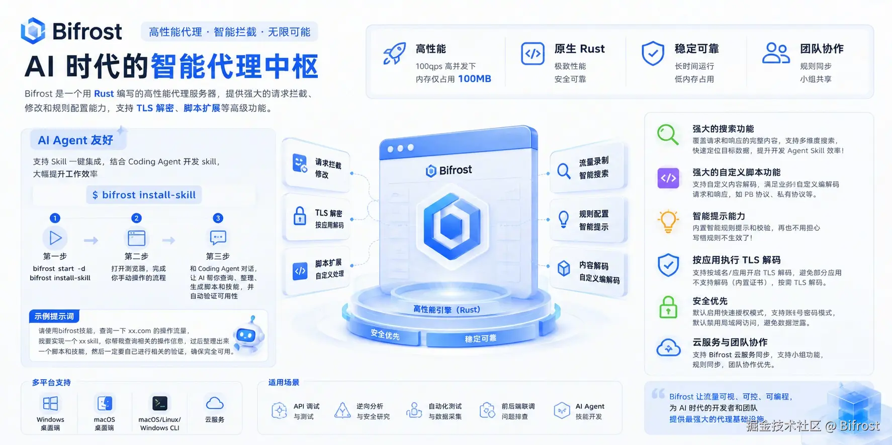

Codex 已经很会写代码了，但真正限制它的，往往是：**它无法操作你的软件。**



很多公司内部平台、桌面应用甚至 SaaS，没有 OpenAPI，也没有 MCP。虽然可以让 Codex 操作 Chrome，但 Computer Use 要识别页面、点击按钮、等待跳转，不仅慢，也很脆弱。

有没有另一条路？

**让 Codex 不操作页面，而是直接理解页面背后的 API。**

这就是我最近在用 Bifrost 做的事情。

Bifrost 是一个开源的、AI Friendly 的全流量代理，支持 HTTP/1.1、HTTP/2、HTTP/3、HTTPS、WebSocket、SSE、gRPC、SOCKS5，同时提供 TLS 解包、流量存储与搜索、请求重放、规则修改和脚本扩展。

## 第一步：把 Bifrost 装进 Codex

安装：

```bash
curl -fsSL https://raw.githubusercontent.com/bifrost-proxy/bifrost/main/install-binary.sh | bash
```

检查状态：

```bash
bifrost status
```

Bifrost 还提供了标准 Agent Skill：

```bash
bifrost install-skill -y
```

它会安装到：

```bash
~/.agents/skills/bifrost/
```

所以真正使用时，**你其实不需要记住下面所有 CLI 命令。**

重新打开一个 Codex 会话后，你直接告诉它：

> 使用 Bifrost 分析我刚刚在 XXX 系统里“创建任务”的操作，找到对应接口，理解参数和返回值，然后帮我实现一个可以直接调用这个能力的 Skill。

Codex 会根据 Bifrost Skill 自己完成后面的工作。

## 第二步：让 Codex 看见 HTTPS 里面的东西

这是最重要的一步。

Bifrost 会持续记录经过代理的流量，并不是“点一下开始录制某个接口”。

但今天绝大多数 API 都是 HTTPS。如果不进行 TLS 解包，Codex 看不到真正的 Request / Response Body。

最简单的方法是全局开启：

```bash
bifrost start -d --intercept
```

但**不建议长期这么干**。

全局 TLS 解包可能影响使用 Certificate Pinning 的应用，也没有必要让所有系统流量都被解包。

更推荐只对开发浏览器开启，例如 Chrome：

```bash
bifrost start -d --app-intercept-include "*Chrome"
```

或者只解包指定域名：

```bash
bifrost start -d --intercept-include "*.internal.example.com"
```

这样，你正常使用 Chrome、内部系统或者支持自定义 CA 的应用即可。

## 第三步：正常操作一次软件

假设公司有一个发布平台，没有 MCP，也没有公开 API。

你只需要像平时一样打开页面：

**填写参数 → 点击“创建发布单” → 完成。**

Bifrost 已经把背后的网络交互保存下来了。

接下来 Codex 可以自己执行：

```bash
bifrost traffic list
```

查看最近流量；

```bash
bifrost traffic search "release"
```

搜索 URL、Header、Request Body 或 Response Body；

找到目标请求以后：

```bash
bifrost traffic get <id> --request-body --response-body
```

拿到完整请求。

甚至可以：

```bash
bifrost traffic export <id> --as curl
```

把它直接变成 curl，或者：

```bash
bifrost traffic replay <id>
```

重新执行真实请求。

这时候 Codex 面对的已经不是一个复杂网页，而是一个非常熟悉的问题：

**一个 HTTP API。**

## 最有价值的地方：让一次操作变成永久能力

接下来可以直接告诉 Codex：

> 把刚才创建发布单的调用方式整理成一个 Skill。以后我要创建发布单时，不再操作网页，直接调用这个接口。处理好参数、认证、错误信息，并实际验证一次。

于是：

```text
人工操作一次
    ↓
Bifrost 观察真实流量
    ↓
Codex 搜索 / 分析 / 重放
    ↓
理解这个系统的隐式 API
    ↓
生成新的 Skill
    ↓
以后直接调用
```

今天教会它创建发布单，明天教会它查询数据、操作测试平台、调用内部运营系统。

**Bifrost 的价值并不只是“抓包”。**

它更像是 Codex 的一个观察层：

> 让 Agent 能够观察你每天使用的软件，并逐渐把这些操作转化成自己可以直接调用的能力。

这可能是一条比给所有内部系统重新建设 MCP，更低成本的 Agent 能力扩展路径。

GitHub：

[https://github.com/bifrost-proxy/bifrost](https://github.com/bifrost-proxy/bifrost)
