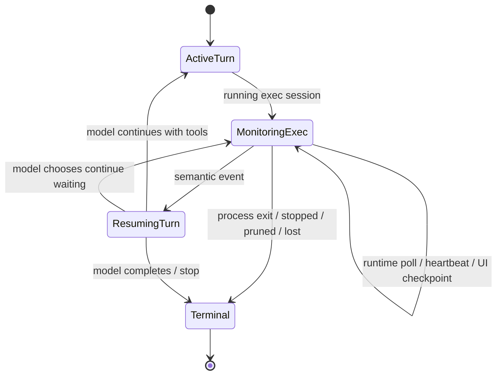

# Cooperative Long Task Loop（协作式长任务循环）

> 原文件名保留为 `agent-long-task-suspension.md`，方案名称升级为 Cooperative Long Task Loop。旧称 Agent Long Task Suspension 描述的是挂起能力本身，新名称描述完整运行机制：runtime 自动监控，模型显式知情，模型可信任 runtime，也可主动接管、查询、写 stdin、取消或调整监控策略。

## 功能模块说明

本方案解决 Bifrost Agent 在长任务等待场景中的 Token 成本问题。当前 `exec_command` / `write_stdin` 已具备基础防护：长命令会返回 `session_id`，空轮询最小等待 5 秒，后台等待上限默认 300 秒，后台 exit watcher 会观察进程退出，输出也会通过 `max_output_tokens` 和 head-tail buffer 截断。

这些能力可以降低工具本身的等待和输出成本，但不能解决模型层重复轮询的成本：模型每次为了确认“任务还在不在运行”都要进入一次完整 Agent turn，重新携带历史、工具定义、上下文和工具结果。长 CI、安装、dev server、delegated agent、watch 类任务会把等待成本放大成多次完整模型请求。

Cooperative Long Task Loop 的核心不是“要不要 watcher”，而是把当前混在一起的三件事拆干净：

- 执行事实源：`ExecSession` / append-only transcript / exit status。
- 自动监控器：`RuntimeExecMonitor` / backoff / resume policy。
- 模型控制权：model-visible monitor contract / manual poll / stdin / stop / policy change。

本方案引入“长任务挂起”语义：当 Agent 通过 `exec_command` 启动可观察的长任务后，turn runtime 可以把当前 turn 暂停为 `waiting_on_session`，由低成本 runtime monitor 接管等待；只有新输出、退出、超时、用户新消息或显式交互需要模型判断时，才恢复模型 loop。

## 用户目标验证清单

### 必须实现

- 长任务从模型轮询中拆出去：`exec_command` 返回仍在运行的 `session_id` 后，Agent turn 可进入挂起态，而不是继续让模型反复调用 `write_stdin`。
- runtime 级 watcher 负责等待 stdout/stderr 新增输出、进程退出、heartbeat、超时和用户新消息。
- 恢复模型时只注入压缩后的事件摘要，不把每次“仍在运行且无新输出”的工具结果写入 history。
- 保留短任务即时返回：命令在初始 `yield_time_ms` 内完成时不进入挂起。
- 保留交互任务控制：需要 stdin、TTY、Ctrl-C、resize 或用户追加输入时仍可通过 `write_stdin` 主动交互。
- 输出增量必须基于游标，避免重复读取旧日志。
- 长任务等待策略必须支持动态退避和 jitter，避免固定频率轮询造成请求尖峰。
- IM/WebUI 进度卡由 runtime 进度事件刷新“仍在运行 / 最后输出 / 下次检查时间”，不依赖模型生成状态更新。

### 必须不破坏

- 不改变 `exec_command` 和 `write_stdin` 的基础工具契约：已有模型仍可按旧方式主动轮询、写 stdin、发送 Ctrl-C。
- 不把 `write_stdin` 并发化；它仍是 ordered 工具，因为它会影响已有 session 状态和 history。
- 不把所有命令都强行挂起；只有基于运行事实和策略确认仍需观察的任务进入挂起。
- 不吞掉最终 exit code、stderr、失败输出或取消结果。
- 不让挂起态持有不可恢复的内存引用；服务重启后至少要能从持久化状态给出“进程已丢失 / 需要用户重试”的明确结果。
- 不让后台 watcher 无限保留已完成 session；完成、取消、超时后必须有清理策略。

### 必须真实验证

- 单元测试验证自适应长任务识别、等待策略、退避、jitter、游标和摘要去重。
- Agent turn 单元测试验证 `exec_command` 返回 running session 后会生成 `TurnSuspended`，且不会继续发起下一次模型请求。
- Agent turn 单元测试验证 watcher 事件恢复时只追加一条压缩摘要，并继续正常 model request。
- E2E 验证真实 Bifrost `/agent/chat` 启动长命令后返回挂起状态，期间无新输出不会产生新的模型请求。
- E2E 验证新输出和进程退出会恢复模型，并最终返回 exit code 与新增输出摘要。
- human_tests 覆盖 CLI/WebUI/API/IM 用户感知：长任务有可见运行状态，用户可打断，最终输出不丢，状态更新不刷屏。

### 必须交付

- 设计文档：本文件。
- human_tests 用例文档与 `human_tests/readme.md` 索引。
- 后续实现阶段同步更新相关 Rust 单元测试、E2E 脚本、IM/WebUI 验证和至少两轮 Review/Fix/Test。

## 现状与问题

### 已有能力

- `crates/agent/src/tools/exec_command.rs`
  - `ExecSessionManager` 保存 `sessions: DashMap<String, Arc<ExecSession>>`。
  - `exec_command` 在 `yield_time_ms` 后仍未完成时返回 `session_id`。
  - `write_stdin` 可以写入 stdin、空轮询输出、Ctrl-C 取消。
  - `spawn_exit_watcher()` 每 100ms 刷新退出状态。
  - `ExecSession::poll()` 会 drain stdout/stderr buffer。
  - 输出有 `HeadTailBuffer` 和 `max_output_tokens` 截断。
- `crates/agent/src/session/turn_loop.rs`
  - turn loop 已有 Codex-style event：`TurnStarted`、`ModelRequestStarted`、`ToolBatchStarted`、`ToolCallStarted`、`ToolCallCompleted`、`TurnCompleted` 等。
  - `AgentSession.progress_sender` 会把 status、tool、plan、assistant delta/final 发给 IM progress card。
  - `ActiveTurnStatus` 已能展示运行中 loop、context 和 tool 状态。
- `crates/bifrost-admin/src/im_gateway/progress_card.rs`
  - IM progress card 已支持 status/tool/plan/thinking/final/compaction 等事件归并和节流刷新。

### 核心缺口

现状仍然是“模型驱动等待”：

```text
model asks exec_command
  -> tool returns session_id
model asks write_stdin after thinking
  -> tool waits 5s/30s/300s, returns no output
model asks write_stdin again
  -> another full model request
```

即使每次空轮询在工具内部等待更久，外层仍然会重复产生完整模型请求。真正需要优化的是等待控制权：长任务等待应由 runtime 低成本 watcher 完成，而不是由模型每几秒决定一次是否继续 poll。

## 设计原则

1. **挂起不是结束**：`waiting_on_session` 是 turn 的中间态。用户看到的是 Agent 仍在工作，系统保存可恢复状态。
2. **事件驱动优先**：有新输出、退出、取消、超时、用户新消息才唤醒模型；普通 heartbeat 不唤醒模型。
3. **历史只记录语义变化**：无新增输出的“仍在运行”不写入 Chat history，只更新 runtime metadata 和 UI progress。
4. **交互任务仍可主动介入**：用户输入、模型明确要写 stdin、Ctrl-C 或 TTY 场景必须保留 `write_stdin` 路径。
5. **恢复摘要可审计**：恢复模型时使用稳定结构化摘要，包含 session、strategy/evidence、exit、new_output、duration、truncation、missed heartbeats。
6. **失败可解释**：watcher 丢失、进程不可达、服务重启、buffer 溢出、超时都要变成明确事件，而不是静默挂起。
7. **最终空 poll 不丢上下文**：交互式命令输入后，最后一次 `write_stdin` 空 poll 可能只返回 `exit_code` 和空 `output`。测试 mock 与运行时判断必须基于累计 tool transcript 判定“已输入并退出”，不能因为 latest tool output 为空就重新发起同一个交互命令。

## Cooperative Long Task Loop 目标行为

目标设计不再以“先做 Phase 1、再做 Phase 2”的分阶段形态作为最终方案。终极形态只有一个：所有可观察的 command 都先进入统一的 ExecSession + transcript 事实源；runtime 根据运行时长、输出活跃度、用户交互、历史统计、外部状态源和调用方等待预算，决定是在当前 turn 内收敛、短暂异步等待、返回 `waiting_on_session`，还是持久化为数小时级后台 monitor。实现可以按切片推进，但协议、状态机、测试和验收都以这个终极形态为准。

### 模型启动长任务时显式知情

模型可以在 `exec_command` 中表达 watch 意图：

```json
{
  "cmd": "cargo test --workspace",
  "yield_time_ms": 1000,
  "watch": {
    "mode": "auto_if_long"
  }
}
```

工具初始返回必须让模型知道 runtime 正在监控，并暴露模型可用的控制权：

```json
{
  "session_id": "7",
  "running": true,
  "exit_code": null,
  "output": "Compiling ...",
  "monitor": {
    "enabled": true,
    "monitor_id": "mon_abc",
    "mode": "auto",
    "owner": "runtime",
    "strategy": "adaptive",
    "duration_class": "medium",
    "state": "watching",
    "response_strategy": "adaptive_monitor",
    "model_can_manual_poll": true,
    "model_can_write_stdin": true,
    "model_can_change_policy": true,
    "runtime_will_resume_on": [
      "process_exited",
      "significant_output",
      "timeout",
      "user_message",
      "stop"
    ],
    "next_check_after_ms": 1200,
    "model_request_count_while_waiting": 0
  },
  "output_cursor": {
    "chunk_id": 42,
    "stdout_bytes": 8192,
    "stderr_bytes": 0
  }
}
```

这个 contract 的关键是：模型知道自己不需要为了“确认还在跑”反复调用 `write_stdin`；但如果它确实要看最新输出、写 stdin、发送 Ctrl-C、停止任务或调整策略，仍然有明确入口。

## 真实时长 Case Rundown

Cooperative Long Task Loop 必须覆盖从数秒到数小时的真实 command，而不是只优化“很长的 CI”。核心策略是：runtime 对时间负责，模型对语义决策负责；没有语义变化时不唤醒模型。

### 时长分层与默认行为

| 时长类型 | 典型命令 | runtime 行为 | HTTP/IM 行为 | 模型请求策略 |
| --- | --- | --- | --- | --- |
| 即时完成，0-1s | `pwd`、`git status --short`、小型 `rg` | 在 `yield_time_ms` 内直接完成，不创建长期 monitor | 直接返回普通 tool result | 同一 model turn 继续，无额外请求 |
| 短任务，1-15s | 小测试、轻量脚本、少量文件生成 | 创建 ExecSession 和 transcript；在 short completion grace 内等待 exit | SSE/CLI 可更积极等待；HTTP 仅 high-confidence 小 grace；若已返回 waiting，则 UI 显示短等待状态 | 不因空等待发新请求；exit 后最多恢复一次 |
| 分钟级，15s-10m | `npm install`、局部 `cargo test`、真实 API watch | 返回 `waiting_on_session`；monitor 用 fast-to-slow backoff 和 notify 优先等待 | UI 卡片刷新 heartbeat、最后输出、下次检查时间 | heartbeat 不进模型；exit/错误/用户消息才恢复 |
| 半小时级，10m-60m | 编译 Bifrost、`cargo test --workspace --all-features`、local-ci | adaptive monitor；普通编译进度只进 UI；错误 signal 或 exit 恢复 | HTTP 请求不长期占用；IM/WebUI 显示持续监控和模型请求数 0 | 等待期间模型请求数必须保持 0，除非用户主动介入 |
| 数小时级，60m+ | 大型 CI 队列、远端 delegated agent、发布流水线 | 持久化 waiting state；可切外部状态源；长间隔 backoff；重启后可解释恢复 | UI 展示持久后台任务、最后 checkpoint、可取消/查看 | 只在终态、失败、用户消息、policy timeout 时恢复 |

### Case A：数秒内直接完成

流程：

```text
model -> exec_command(yield_time_ms=1000)
runtime starts process
process exits before initial yield deadline
runtime drains trailing output grace
tool result includes exit_code + output
turn_loop continues normally
```

要求：

- 不创建长期 `RuntimeExecMonitor`。
- 不返回 `waiting_on_session`。
- 不写 runtime monitor event。
- 模型看到的就是普通 tool result；这类命令不应因为长任务框架引入额外延迟或额外 token。

### Case B：数秒级短异步任务

例子：命令 3-8 秒完成，初始 `yield_time_ms=1000`，运行事实显示它很可能在短窗口内收敛。

流程：

```text
initial yield 到期仍 running
runtime creates ExecSession + transcript + monitor
runtime enters short_completion_grace, e.g. 5-10s
  if exit during grace:
      build final tool result / compact monitor event
      continue same turn if response not committed
  else:
      return waiting_on_session
      monitor keeps watching
```

要求：

- short grace 不能发新模型请求。
- short grace 不能成为所有 running command 的固定 8-10 秒阻塞；它只在高置信“可能很快完成”的 profile、调用面可等待、且 response 尚未提交时启用。
- HTTP JSON 普通 `/agent/chat` 默认仍以 `return_on_suspend` 为主；只有 high-confidence short task 才给 2.5-5s 小窗口。
- SSE/WebUI streaming 和 CLI/local exec 可以更积极等待，因为用户能看到 streaming/progress，且等待不会卡住普通同步 HTTP 响应。
- 如果 HTTP/IM 响应已经返回 `waiting_on_session`，exit event 只能触发一次 resume。
- 如果响应还未提交，runtime 可以在同一 turn 内收敛，避免把一个 3 秒命令变成两次对话。
- 模型 contract 里应包含 `duration_class="short"` 和 `response_strategy="short_grace_then_suspend"`，让模型知道无需主动 poll。

### Codex-style short grace aggressive waiting

对照 `~/work/github/codex` 的真实实现后，短任务“积极”的要点不是无条件多等，而是 runtime 在一个有上限的窗口内等待 exit/output notify：

- `codex-rs/core/src/unified_exec/mod.rs` 中 initial `exec_command` 的 `yield_time_ms` 被 clamp 到 `250ms..30000ms`；空 `write_stdin` poll 至少 `5000ms`，后台上限默认 `300000ms`。
- `codex-rs/core/src/unified_exec/process_manager.rs` 在启动进程后先把 live process 存入 registry，再做 initial yield wait，避免等待期间 turn 被打断导致进程丢失。
- `collect_output_until_deadline()` 使用 `tokio::select!` 同时等待 output notify、exit cancellation、deadline 和 pause state；这不是 blind sleep。
- 进程退出后只给很短的 post-exit close wait（50ms）收集尾部输出；streaming watcher 也有 100ms trailing output grace。
- `codex-rs/code-mode/src/runtime/mod.rs` 的 code-mode 默认 exec/wait yield 为 10000ms；`service.rs` 通过 runtime event channel + yield timer 返回 pending/result，而不是让模型反复决定是否 poll。
- feature config 测试里 multi-agent wait timeout 支持 `min_wait_timeout_ms=2500`、`default_wait_timeout_ms=30000`、`max_wait_timeout_ms=120000`，说明短等待窗口可按能力面配置，而不是写死在模型循环中。

Bifrost 的 short grace 应按调用面和置信度分层：

| 调用面 | 默认策略 | short grace 上限 | 说明 |
| --- | --- | --- | --- |
| HTTP JSON `/agent/chat` | `return_on_suspend` | 2.5-5s，仅 high-confidence short task | 防止普通请求被 8-10s grace 拖慢 |
| SSE/WebUI streaming | `short_grace_then_suspend` | 10-30s，可配置到 120s | streaming/progress 可见，适合等待短测试自然结束 |
| CLI/local exec | `short_grace_then_suspend` | 默认 30s，最大 120s | 接近 Codex 的积极等待体验 |
| IM | 快速 progress card + 小 grace | 2.5-5s | 避免 IM 自然语言响应卡顿，状态交给卡片刷新 |
| detached/background API | `detached_monitor` | 0s | 不阻塞调用方，只返回 monitor handle |

short grace 运行规则：

- `short_grace_ms = min(channel_wait_budget, profile_short_grace_cap, request_timeout_remaining - safety_margin)`。
- 只有 `duration_class=instant|short` 且 `classification_confidence >= high` 时启用；`generic` unknown command 不默认启用长 grace。
- grace 期间只等待 runtime event，不发模型请求，不写 heartbeat history。
- exit 在 grace 内到达时，等待短 post-exit trailing output grace 后内联完成或入队一次 `process_exited` resume。
- stdout/stderr 有输出但未命中 significant marker 时，只推进 transcript/UI；不得无限延长 grace。最多允许一次 quiet-window reset，且总时间不得超过 channel cap。
- grace 到期仍 running：返回或保持 `waiting_on_session`，monitor ownership 接管。
- 用户消息、stop、fatal stderr、process exit 永远抢占 grace deadline。

### Case C：分钟级任务

例子：安装依赖、局部测试、GitHub Actions run poll 在几分钟内完成。

流程：

```text
exec_command returns running session + monitor metadata
agent/chat returns waiting_on_session
monitor listens on output notify / exit notify / user message
heartbeat updates UI only
significant output or exit enqueues resume
turn_loop injects RuntimeMonitorEvent
model summarizes / fixes / continues
```

要求：

- heartbeat 不写 conversation history。
- unchanged output 不写 tool result。
- progress bar、重复编译行、下载百分比只更新 UI。
- 只有 exit、失败 marker、用户消息或超时恢复模型。
- 模型可通过 `exec_monitor get_status` 或 `write_stdin` 主动查看，但默认不需要。

### Case D：半小时级构建或全量验证

例子：编译 Bifrost、`cargo test --workspace --all-features`、`scripts/ci/local-ci.sh`。

流程：

```text
adaptive monitor owns the still-running session
return waiting_on_session quickly
UI shows elapsed, last checkpoint, next check, model_request_count_while_waiting=0
stdout ordinary progress -> UI only
stderr/error-like semantic output -> resume model
exit -> wait trailing output grace -> resume model once
```

要求：

- 不受 300 秒 background terminal 默认上限误伤；adaptive wall time 应覆盖真实构建耗时。
- 编译进度很多但语义价值低，不能“每有输出就恢复模型”。
- 恢复摘要必须包含 head-tail、错误 marker、exit code、elapsed、omitted heartbeat/UI update 数。
- 如果用户中途问“现在到哪了”，用户消息优先恢复模型，模型可以选择 manual poll 或解释当前 UI summary。

### Case E：数小时级任务

例子：大型 CI 排队、远端 delegated agent、发布任务、长时间 watch。

流程：

```text
monitor persists WaitingOnExecSession
WatcherRegistry owns handle and stop signal
progress card shows persistent background task
monitor backoff grows to 60s / 120s / external retry-after
service restart:
  recover from external source if possible
  otherwise emit WatcherLost / ProcessDetached
terminal or failure event:
  enqueue resume once with resume_seq
```

要求：

- 必须有持久化 waiting state，不能依赖单个 HTTP request 生命周期。
- CI 类任务优先使用 GitHub API 或外部状态源恢复，不能只盯 shell 日志。
- 长时间无输出是正常状态；这类 heartbeat 只更新 runtime metadata。
- policy timeout 不是简单 kill：应恢复模型并说明已超过策略预算、任务仍运行/已 detached/已取消，交给模型或用户决定。
- 模型 contract 必须明确 `duration_class="very_long"`、`max_wait_ms`、`external_status_source`、`runtime_will_resume_on`，避免模型误以为自己需要轮询。

### 时长识别与响应策略

runtime 不应靠命令字符串判断。终极形态使用组合信号：

- 模型显式 `watch.max_wait_ms` / `watch.mode` / `wake_on`。
- 历史耗时统计：同 cwd、同稳定 command fingerprint 的 P50/P90/P99。
- 初始输出信号：输出是否持续变化、是否包含错误/ready/final 类语义、stderr 比例、是否 prompt-like。
- 外部状态源：GitHub Actions run/job status、delegated agent artifact、dev server port probe。
- 调用方等待预算：HTTP default `return_on_suspend`，SSE 可短 grace，CLI 可 `wait_mode=until_complete`。

响应策略字段建议：

```json
{
  "duration_class": "instant|short|medium|long|very_long",
  "response_strategy": "inline_until_yield|short_grace_then_suspend|return_on_suspend|detached_monitor",
  "short_grace_ms": 8000,
  "max_wait_ms": 14400000,
  "external_status_source": "github_actions|null",
  "model_request_count_while_waiting": 0
}
```

模型指导语必须明确：

- `monitor.enabled=true` 时，不要为了确认存活而 poll。
- `response_strategy=short_grace_then_suspend` 时，runtime 正在尝试短等待收敛；模型无需动作。
- `duration_class=long|very_long` 时，模型应信任 runtime 持续监控，除非用户要求状态、需要输入、要取消或要改策略。
- runtime 注入 `RuntimeMonitorEvent` 时，模型再基于 `resume_reason`、exit code 和 output delta 决策。

### runtime 无关键事件时只更新 UI

无新输出、无退出、无用户消息、无超时时，`RuntimeExecMonitor` 只产生 `LongTaskHeartbeat`：

```text
RuntimeExecMonitor
  -> LongTaskHeartbeat
  -> progress channel / UI card
  -> 不写 conversation history
  -> 不发 model request
```

等待期间的状态感知由 IM/WebUI progress card 承担，模型请求数不得因为 heartbeat 增长。

### runtime 有关键事件时恢复模型

进程退出、新错误输出、output signal marker、超时或用户消息到达时，monitor 只入队 resume event，不直接调用模型：

```text
process exited
  -> RuntimeMonitorEvent
  -> AgentResumeQueue enqueue
  -> turn_loop resumes
  -> model receives compact event summary
  -> model decides summarize / next tool / retry / report failure
```

恢复给模型的上下文示例：

```text
[Runtime exec monitor event]
Monitor mon_abc resumed exec session 7.
Reason: process_exited
Profile: build
Elapsed: 143.2s
Exit code: 0
New output since model-visible cursor 42:
<head-tail summary>
Omitted:
- 18 unchanged heartbeats
- 44 UI-only output updates
- 0 model requests while waiting
You may now continue the task. Runtime monitoring has completed.
```

## Cooperative Long Task Loop 合并状态机



状态机不变量：

- 一个 exec session 同时最多一个 `RuntimeExecMonitor`。
- manual poll 不会抢走 monitor 的输出。
- monitor 不能直接调用模型，只能向 `AgentResumeQueue` enqueue resume event。
- `resume_seq` 单调递增，同一个 seq 只能恢复一次模型。
- heartbeat 不写 history，不消耗模型请求。
- `MonitoringExec` 内部用 substate 表达 `DiscoveryPolling`、`Monitored`、`SilentRunning`、`StallSuspected`、`MonitorDegraded`，这些不是顶层 turn state。
- 仲裁优先级固定为 `stop > user_message > process_exited > monitor_degraded > significant_output > timeout > stall_suspected > heartbeat`。

合并后的状态机只保留三类非终态顶层状态：

- `ActiveTurn`：模型正在运行或工具批正在执行。
- `MonitoringExec`：runtime 拥有等待控制权，内部可做 discovery poll、scheduled poll、watchdog probe 和 UI heartbeat。
- `ResumingTurn`：runtime event 或用户消息触发一次模型恢复。

`Completed`、`Stopped`、`Timeout`、`WatcherLost`、`ProcessPruned` 统一归入 `Terminal`，用 `terminal_state` 字段区分，不再作为顶层状态膨胀。

## 三层架构

### 第一层：ExecSession 是唯一事实源

当前 `ExecSession::poll()` 会 drain stdout/stderr buffer，`chunk_id` 和 cursor 还没有完整语义。Cooperative Long Task Loop 必须把输出改成 append-only transcript，所有消费者都从 transcript 派生结果：

```rust
pub struct ExecOutputChunk {
    pub chunk_id: u64,
    pub stream: ExecStream,
    pub start_byte: u64,
    pub end_byte: u64,
    pub timestamp_ms: u64,
    pub bytes: Vec<u8>,
}

pub struct ExecOutputCursor {
    pub chunk_id: u64,
    pub stdout_bytes: u64,
    pub stderr_bytes: u64,
}

pub struct ExecTranscript {
    pub chunks: VecDeque<ExecOutputChunk>,
    pub head_tail: HeadTailTranscript,
    pub truncated_bytes: u64,
    pub lost_chunk_count: u64,
}
```

`UI delta`、manual `write_stdin` poll、runtime resume summary、terminal result 都调用类似接口：

```rust
session.read_since(cursor, max_output_tokens);
session.snapshot_status();
session.wait_for_event_or_deadline(cursor, deadline);
```

读取语义必须是非破坏性的。drain 只能用于内部 GC，不能作为消费者读取方式，否则 manual poll 和 runtime monitor 会互相抢输出。

### 第二层：RuntimeExecMonitor 只负责等待

`RuntimeExecMonitor` 不做模型决策，只维护 watch state、cursor、退避和 resume event：

```rust
pub struct RuntimeExecMonitor {
    monitor_id: String,
    session_key: String,
    exec_session_id: String,
    original_tool_call_id: String,
    command_preview: String,
    profile: LongTaskProfile,
    state: MonitorState,
    watcher_cursor: ExecOutputCursor,
    model_visible_cursor: ExecOutputCursor,
    resume_seq: u64,
    omitted_heartbeats: u32,
    omitted_ui_updates: u32,
    started_at_ms: u64,
    last_event_at_ms: u64,
    next_check_at_ms: u64,
    poll_state: ScheduledPollState,
}
```

```rust
pub struct ScheduledPollState {
    pub phase: PollPhase,
    pub poll_count: u32,
    pub max_discovery_polls: u32,
    pub next_poll_at_ms: u64,
    pub current_interval_ms: u64,
    pub max_interval_ms: u64,
    pub promoted_to_monitor_at_ms: Option<u64>,
}

pub enum PollPhase {
    Discovery,
    Monitored,
    Detached,
    Terminal,
}
```

两个 cursor 的职责必须分离：

- `watcher_cursor`：monitor 自己判断是否有新输出、关键 marker、错误输出或 exit trailing output。
- `model_visible_cursor`：模型已经看过的输出位置。manual poll 会推进它，runtime resume summary 也会推进它。

这样模型主动 poll 不会和 monitor 打架，runtime resume 时也不会重复给模型发送已看过的输出。

### 第三层：TurnLoop 只负责 suspend / resume / model request

`turn_loop` 不应再长时间 `loop { poll_exec_session(...) }`。目标形态：

```rust
match maybe_start_exec_monitor(tool_result) {
    Some(waiting) => {
        persist_waiting_state(waiting);
        return TurnResult::WaitingOnExecSession(waiting.summary());
    }
    None => {
        apply_tool_call_completion(...);
    }
}
```

真正恢复时由 session manager 创建 internal resume turn：

```text
resume_turn_from_monitor_event(session_key, monitor_id, resume_seq)
  -> load session + WaitingOnExecSession
  -> merge monitor event + pending user messages
  -> inject runtime context message
  -> continue normal model loop
```

## 模型可控工具协议

### `exec_command.watch`

`watch` 是模型启动时的控制权：

```json
{
  "cmd": "cargo test --workspace",
  "yield_time_ms": 1000,
  "watch": {
    "mode": "auto_if_long",
    "wake_on": ["exit", "error", "significant_output", "timeout", "user_message"],
    "max_wait_ms": 1800000,
    "output_threshold_bytes": 4096
  }
}
```

`mode` 语义：

- `manual`：不启动 runtime monitor，完全由模型 `write_stdin` 轮询。
- `auto_if_long`：initial yield 后仍在运行、历史统计或显式策略表明需要继续观察时启动 monitor。
- `auto`：只要返回 running session 就启动 monitor。
- `detached`：runtime 监控 UI 和状态，但不自动恢复模型，除非用户消息、stop 或 exit。

默认策略：

- 未设置 `watch.mode` 且非 TTY 命令在 initial yield 后仍在运行：按 adaptive monitor 处理。
- 命令在 initial yield 内完成：inline 返回，不启动 monitor。
- TTY/readline/交互等待：runtime 默认可以观察但不能自动写 stdin；出现 prompt-like 输出后短时间无进展时恢复模型 loop，并要求模型根据最新输出决定 `write_stdin`、继续 poll、Ctrl-C 或改用非交互命令。

### `write_stdin` 保持手动监控和交互权

manual poll 必须是非破坏性读取，并推进 `model_visible_cursor`：

```json
{
  "session_id": "7",
  "chars": "",
  "since_cursor": {
    "chunk_id": 42
  },
  "yield_time_ms": 5000,
  "max_output_tokens": 2000
}
```

响应示例：

```json
{
  "session_id": "7",
  "running": true,
  "exit_code": null,
  "output": "new output only",
  "unchanged": false,
  "output_cursor": {
    "chunk_id": 51,
    "stdout_bytes": 12000,
    "stderr_bytes": 0
  },
  "monitor": {
    "enabled": true,
    "monitor_id": "mon_abc",
    "state": "watching",
    "manual_poll_accepted": true
  }
}
```

manual poll 不关闭 runtime monitor；manual stdin 写入会 notify monitor；Ctrl-C / terminate 会让 monitor 进入 terminal path。

### `exec_monitor` 策略控制工具

建议新增 `exec_monitor` 工具，避免把监控策略控制塞进 `write_stdin`：

```json
{ "action": "get_status", "monitor_id": "mon_abc" }
```

```json
{
  "action": "set_policy",
  "monitor_id": "mon_abc",
  "wake_on": ["exit", "error"],
  "max_interval_ms": 60000
}
```

```json
{ "action": "manual_only", "monitor_id": "mon_abc" }
```

```json
{ "action": "resume_auto", "monitor_id": "mon_abc" }
```

```json
{
  "action": "stop",
  "monitor_id": "mon_abc",
  "signal": "terminate"
}
```

### 控制面安全边界

`exec_monitor` 是模型请求控制权的入口，但 runtime 仍是唯一执行者和仲裁者。模型不能直接拥有 monitor，也不能直接改写事实状态。

所有 `exec_monitor` action 都必须经过 runtime 校验：

- `monitor_id` 必须存在，且必须绑定当前 session / conversation / owner。
- `exec_session_id` 必须与 monitor 绑定关系一致，禁止模型跨 session 操作其他进程。
- action 必须在 monitor 当前 state 中合法，例如 terminal monitor 不接受 `set_policy` 或 `write_stdin`。
- `set_policy` 只能修改 runtime 明确允许的字段：`wake_on`、`max_interval_ms`、`output_threshold_bytes`、`max_wait_ms`、`response_strategy`。
- `set_policy` 的数值必须 clamp 到 runtime 安全范围，例如 `max_interval_ms` 不得小于防抖下限，也不得大于系统允许的最大静默窗口。
- `manual_only` 不能关闭 UI heartbeat、exit watcher、stop handling 和 terminal cleanup；它只关闭“自动恢复模型”。
- `resume_auto` 只能恢复到当前 runtime policy 允许的 wake conditions，不能绕过资源治理或用户 stop。
- `stop` 必须执行幂等；如果进程已退出，返回 `stopped_after_exit` 或原 exit status，不得误杀其他进程。
- 危险 stdin 写入、Ctrl-C、terminate、kill 必须记录 audit event，并进入 terminal arbitration。

工具返回必须区分 accepted / rejected / degraded：

```json
{
  "monitor_id": "mon_abc",
  "action": "set_policy",
  "accepted": false,
  "rejected_reason": "max_interval_ms_exceeds_profile_limit",
  "effective_policy": {
    "wake_on": ["exit", "error"],
    "max_interval_ms": 120000
  }
}
```

这样模型即使提出错误策略，runtime 也只会返回可解释拒绝或降级结果，不会让错误指令直接破坏监控。

## 历史写入策略

history 只写四类内容：

1. 初始 `exec_command` tool result：`session_id`、`monitor_id`、profile、初始输出摘要、cursor。
2. runtime monitor resume event：`resume_reason`、exit code、output delta、omitted heartbeats、cursor delta。
3. 模型主动 manual poll：模型自己要求看的内容，写 delta，不写全量重复输出。
4. terminal summary：exit、stopped、timeout、watcher_lost、process_pruned。

history 不写：

- heartbeat-only。
- unchanged poll。
- UI-only output delta。
- 重复 progress bar。
- 已经被 manual poll 看过的输出。

runtime resume event 不应伪装成旧 tool result，建议作为专门的 runtime context item：

```rust
pub enum ConversationItem {
    User(ChatMessage),
    Assistant(ChatMessage),
    ToolResult { call_id: String, ... },
    RuntimeMonitorEvent(RuntimeMonitorContext),
}
```

渲染给模型时可转为 developer/contextual user message。这样不会违反“一次 tool call 对应一次 tool result”的语义，也不会反复写同一个 `exec_command` call id。

### RuntimeMonitorEvent 必填字段

为降低模型幻觉，resume event 不能只是一段自然语言摘要。必须包含结构化事实字段，让模型能判断“是否终态、是否可靠、是否可继续执行”：

```rust
pub struct RuntimeMonitorContext {
    pub monitor_id: String,
    pub exec_session_id: String,
    pub command_preview: String,
    pub profile: LongTaskKind,
    pub duration_class: DurationClass,
    pub response_strategy: ResponseStrategy,
    pub resume_seq: u64,
    pub resume_reason: ExecResumeReason,
    pub state: MonitorState,
    pub running: bool,
    pub exit_code: Option<i32>,
    pub terminal_state: Option<TerminalState>,
    pub cursor_before: ExecOutputCursor,
    pub cursor_after: ExecOutputCursor,
    pub output_summary: ExecOutputSummary,
    pub output_lossy: bool,
    pub lost_chunk_count: u64,
    pub truncated_bytes: u64,
    pub omitted_heartbeats: u32,
    pub omitted_ui_updates: u32,
    pub model_request_count_while_waiting: u32,
    pub stall_state: Option<StallState>,
    pub last_output_age_ms: Option<u64>,
    pub consecutive_silent_probes: u32,
    pub no_progress_escalation_level: u8,
    pub external_status: Option<ExternalTaskStatus>,
    pub allowed_next_actions: Vec<MonitorAction>,
}
```

模型提示必须绑定这些字段：

- `running=true` 且 `terminal_state=null` 时，不得宣称任务已完成。
- `resume_reason=output_available` 只能说明“有值得查看的新输出”，不能说明成功或失败。
- `resume_reason=stall_suspected` 只能说明“长时间无进展证据”，不能说明失败或完成。
- `output_lossy=true` 或 `lost_chunk_count>0` 时，模型必须说明输出不完整，不能编造缺失日志。
- `external_status` 存在时，CI/delegated agent 结论优先来自外部事实源，而不是 shell 最后一行。
- `allowed_next_actions` 是模型能请求的动作集合；不在集合里的 action 必须被 runtime 拒绝。

## Monitor 唤醒策略

不要“有任何输出就恢复模型”。runtime 必须基于进程事实、输出形态、游标差异、外部状态源和用户/模型显式策略，决定普通输出是 UI delta、manual-inspect material，还是模型恢复事件；不能依赖命令关键字、正则或工程专属规则表。

### 长任务识别策略

长任务不能靠命令名、关键字、正则或工程专属脚本路径猜测；Bifrost 是通用 coding agent，必须把“是否值得 runtime 接管等待”建立在运行事实和控制策略上。识别采用四层证据，生成 `LongTaskClassification`：

```rust
pub struct LongTaskClassification {
    pub profile: LongTaskProfile,
    pub duration_class: DurationClass,
    pub confidence: ClassificationConfidence,
    pub response_strategy: ResponseStrategy,
    pub wake_policy: WakePolicy,
    pub evidence: Vec<ClassificationEvidence>,
}
```

证据来源：

- 模型/用户策略：`watch.mode`、`max_wait_ms`、`wake_on`、`yield_time_ms`、是否要求保持交互或取消能力。模型可以声明期望的等待策略，但 runtime 只能用运行事实、显式策略和外部状态验证，不得通过命令文本自行匹配类型。
- 历史统计：同 repo、cwd、稳定 command fingerprint 的 P50/P90/P99 耗时、输出节奏和退出模式。fingerprint 只用于统计归因，不能内置特定命令名规则。
- 运行时信号：initial yield 是否超时、是否持续输出、stderr 比例、TTY/prompt-like output、外部状态源是否可用、artifact/resource 是否变化。
- 调用面预算：HTTP JSON、SSE/WebUI、CLI、IM、detached API 的等待能力不同，直接影响 response strategy。

分类规则：

- `confidence=explicit`：模型或用户明确指定 watch 策略，runtime 仍做安全校验和 policy clamp。
- `confidence=high`：历史统计和当前运行信号都显示任务会超过调用面预算，或外部状态源提供稳定 running 状态。
- `confidence=medium`：历史 P90 超过 discovery budget，但当前运行信号不足。
- `confidence=low`：只知道 initial yield expired；先进入 discovery polling 或 adaptive monitor，不给长 short grace。
- `confidence=interactive`：TTY/readline/prompt-like 输出，默认 manual，除非用户或 profile 明确允许 monitor。

输出策略由分类结果决定：

- `instant`：预期 0-1s；不创建长期 monitor。
- `short`：预期 1-15s；可按调用面启用 short grace。
- `medium`：预期 15s-10m；尽快 `waiting_on_session`，monitor 接管。
- `long`：预期 10m-60m；持久 waiting state，普通输出只进 UI。
- `very_long`：预期 60m+；优先外部状态源、checkpoint 和可恢复 monitor。

当分类不确定时，runtime 必须保守：先用 discovery polling 收集证据，达到 N 次 unchanged/alive 后提升 monitor ownership，但不要让模型继续为了分类而空 poll。

通用规则：

- exit code 出现：必须恢复模型。
- 用户新消息：必须恢复模型，并合并用户消息。
- `/stop`：terminate 并返回 stopped，不恢复模型继续工作。
- stderr 增量：超过阈值或命中 error marker 时恢复模型。
- stdout 增量：普通进度只更新 UI；命中 output signal marker 或超过阈值才恢复模型。
- heartbeat：只更新 UI，不恢复模型。
- 长时间无输出但 process alive：按 watchdog 进入 `SilentRunning`；超过 no-progress threshold 后生成限频 `StallSuspected`。
- monitor/probe 异常：生成 `MonitorDegraded`，立即恢复模型。

### 输出唤醒判定

每次 stdout/stderr 推进 transcript 后，monitor 先计算 `OutputSignal`，再决定是否恢复模型：

```rust
pub struct OutputSignal {
    pub stream: ExecStream,
    pub new_bytes: u64,
    pub normalized_hash_changed: bool,
    pub marker: Option<ProfileMarker>,
    pub severity: OutputSeverity,
    pub progress_only: bool,
    pub lossy: bool,
}
```

唤醒模型的条件：

- terminal：进程退出、timeout policy 到达、stop 完成、ProcessPruned、WatcherLost。
- error/failure：stderr 或结构化输出命中 `error:`, `failed`, `panic`, `Traceback`, `FAIL`, `cancelled` 等 output signal marker。
- ready/final：dev server 出现 `Listening on` / ready URL；delegated agent 出现 final marker；CI 出现 run completed/job failed。
- 大输出阈值：新增输出超过 profile 阈值且不是 progress-only，例如 build stderr > 4KiB、generic stdout > 8KiB。
- 语义状态变化：外部任务从 queued 到 in_progress 只更新 UI；到 failure/cancelled/completed 才恢复模型。ready/final 类语义输出可恢复模型；普通重复进度不恢复。
- 用户主动介入：用户消息、manual poll、set_policy、stop 按控制面处理。

不唤醒模型的输出：

- progress bar 同一行刷新、下载百分比、编译普通 crate 列表、test runner 正常 `running N tests`。
- 未达到阈值的 stdout 普通增量。
- heartbeat-only、unchanged cursor、外部状态 queued/in_progress 但无 failure/terminal。
- 已被 manual poll 推进到 `model_visible_cursor` 的输出。

输出 signal 必须提供结构化 evidence 和阈值。没有语义 evidence 的未知 command 使用更保守策略：首次 significant stdout 可以恢复一次模型，后续重复输出只进 UI，直到 exit/error/用户消息/no-progress escalation。

signal 示例：

| Signal | 恢复模型条件 |
| --- | --- |
| `external_terminal` | 外部状态源 completed/failed/cancelled |
| `process_exit` | OS exit status 已知，trailing output grace 已结束 |
| `semantic_ready_or_final` | 输出/外部状态明确表达 ready/final，而非命令名推断 |
| `semantic_error` | stderr/error-like 输出超过阈值或结构化状态为 failed |
| `interactive_prompt` | prompt-like output 或 user message；默认 manual |
| `progress_only` | 不恢复模型，只更新 UI/cursor |

退避必须是 notify-first：stdout/stderr reader 写 transcript 后 `notify_waiters()`，exit watcher 也 notify。deadline 只是兜底。默认退避建议：

```text
0-10s: 250ms -> 500ms -> 1s
10-60s: 2s -> 5s
1-5m: 10s -> 20s
5m+: 30s -> 60s -> 120s
有新输出: reset 到 fast interval
接近外部预计完成时间: 临时降低到 10s
每次 sleep: 0.9-1.1 jitter
```

## Scheduled Polling 与 Event Monitor 协同

Cooperative Long Task Loop 不是“只靠 monitor、不轮询”，也不是“让模型继续轮询”。正确形态是 runtime 内部的 scheduled polling 和 event monitor 共同作用：

- scheduled polling：按退避时间表做低成本 checkpoint，用来处理未知时长、liveness、无输出、外部状态和 missed notify。
- event monitor：监听 stdout/stderr notify、exit notify、外部状态变化、user message、stop，任何关键事件都可以抢占下一次 scheduled poll。
- model resume：只在 poll/monitor 产生语义事件或升级事件时发生，不能把每次 poll 都变成模型请求。

### 未知时长 discovery polling

一开始 runtime 往往不知道 command 会跑 2 秒、2 分钟还是 2 小时。因此 running command 先进入 discovery window：

```text
exec_command initial yield expired
  -> create ExecSession + transcript
  -> start RuntimeExecMonitor
  -> scheduled discovery polls with backoff
       poll #1: 1s
       poll #2: 2s
       poll #3: 4s
       poll #4: 8s
       poll #5: 15s
  -> if process exits/significant output before N polls:
       complete/resume from monitor event
  -> if still running after N polls or elapsed budget:
       promote to long monitor ownership
       return/persist waiting_on_session
```

默认建议 `N=5`，总 discovery budget 约 30 秒。这个值不是硬编码常量，应由调用方 wait budget、用户/模型显式策略、历史统计和运行时 signal 调整：

| Evidence | Discovery polls | Discovery budget | 说明 |
| --- | --- | --- | --- |
| `unknown_non_tty` | 5 | 30s | 未知命令默认值 |
| `history_long` | 3-5 | 15-30s | 历史统计显示常超过调用面预算 |
| `external_status_available` | 3 | 15s | 尽快交给外部状态源 |
| `ready_signal_expected` | 5 | 30s | 等 ready/final/error 语义 signal；未出现则后台监控 |
| `interactive_prompt_like` | 2 | 5s | 避免误挂起需要用户输入的命令 |

discovery poll 的结果：

- exit：生成 terminal result 或 `process_exited` resume event。
- significant output：按 output signal 决定是否恢复模型；普通进度只更新 UI。
- unchanged but alive：递增 discovery counter，不写 history，不发模型请求。
- probe error：生成 `MonitorDegraded`，恢复模型。
- 达到 N 次或 budget：进入 long ownership，runtime monitor 优先接管，不再让模型为了“是否还活着”轮询。

### 长任务中的 poll deadline

即使已明确是长任务，也要保留 scheduled poll deadline。它的职责是兜底和 checkpoint，不是替代 monitor：

```text
select {
  stop/user_message              -> immediate resume/stop
  monitor semantic event          -> preempt poll deadline, resume if needed
  stdout/stderr/exit notify       -> update transcript/status, maybe resume
  poll deadline                   -> liveness + external status checkpoint
  watchdog no-progress threshold  -> StallSuspected / MonitorDegraded
}
```

长任务 poll cadence 可以退避到 30 秒、60 秒或 120 秒：

- poll deadline 未到之前，如果 monitor 已看到进展、错误、ready marker 或 exit，monitor 立即抢占并唤醒模型或更新 UI。
- poll deadline 到达但没有语义变化，只更新 liveness checkpoint 和 UI，不唤醒模型。
- poll deadline 连续多次无进展，交给 watchdog 的 no-progress escalation 决定是否发 `StallSuspected`。
- 用户消息和 stop 永远抢占 poll deadline。

### 优先级与所有权切换

在 discovery window 内，scheduled poll 更活跃，用来判断“这到底是不是长任务”。达到 N 次退避或时间预算后，monitor ownership 优先级提高：

```text
DiscoveryPolling
  -> exited/significant event: ResumingTurn
  -> N polls exhausted: WaitingOnExecSession(monitored)
WaitingOnExecSession(monitored)
  -> monitor semantic event before next poll: ResumingTurn
  -> poll deadline only: checkpoint UI/runtime metadata
  -> no-progress threshold: StallSuspected
```

所有权切换不改变事实源：ExecSession transcript 仍是唯一输出事实源；poller、monitor、manual poll 都用 cursor 读取。

### 防止 scheduled polling 变成模型轮询

硬门禁：

- discovery poll 和 long poll 都是 runtime action，默认不写 conversation history。
- `poll_count<N` 的 unchanged/alive 结果不得唤醒模型。
- 达到 `poll_count=N` 后可以返回 `waiting_on_session` 或生成一次 runtime context，但不能让模型继续空 poll。
- long poll deadline 只产生 checkpoint；只有 terminal、significant event、StallSuspected、MonitorDegraded、user message、stop 才能恢复模型。
- monitor event 抢占 poll deadline 后，必须 cancel/reset 当前 poll timer，避免同一进展导致两次 resume。
- poll result 和 monitor event 同时到达时，用 `resume_seq` / event priority 去重。

## Watchdog 与卡死兜底

除了 output/exit notify，runtime 还必须有 watchdog。它解决的不是“有新输出要不要恢复模型”，而是“完全没有数据时，系统是否还知道任务活着、是否卡死、是否需要通知模型或用户”。

核心原则：

- watchdog probe 是 runtime 低成本动作，不等于模型请求。
- heartbeat 可以只更新 UI，但不能无限期只更新 UI；超过 runtime no-progress budget 后必须升级为 `StallSuspected` 或 `MonitorDegraded` 事件。
- 不同 evidence 的“无输出”含义不同：本地进程长时间无输出、外部任务排队、等待 ready signal 等场景需要不同 checkpoint 策略，但这些差异必须来自运行事实、外部状态或显式策略。
- 模型通知必须限频，避免把 watchdog 变成新的轮询 token 消耗。

### 三类无数据状态

| 状态 | 判定 | runtime 行为 | 是否恢复模型 |
| --- | --- | --- | --- |
| `SilentRunning` | process 仍 alive，monitor 正常，但 stdout/stderr 无新增 | UI heartbeat + liveness metadata | 不恢复模型 |
| `StallSuspected` | 超过 no-progress threshold，且无输出、无外部状态变化、无资源活动证据 | enqueue bounded stall event，附 liveness probes | 低频恢复模型 |
| `MonitorDegraded` | monitor 无法确认进程状态、probe error、notify channel 异常、child handle 异常 | 立即 enqueue degraded event | 恢复模型 |

### Watchdog probe 内容

每个 monitor 维护独立 watchdog cursor 和 probe state：

```rust
pub struct MonitorWatchdogState {
    pub last_output_at_ms: u64,
    pub last_external_status_at_ms: Option<u64>,
    pub last_process_probe_at_ms: u64,
    pub last_model_stall_notice_at_ms: Option<u64>,
    pub consecutive_silent_probes: u32,
    pub consecutive_probe_errors: u32,
    pub no_progress_escalation_level: u8,
}
```

probe 尽量使用低成本事实源：

- `try_wait` / OS process alive check。
- stdout/stderr transcript cursor 是否推进。
- exit watcher 是否仍 alive。
- CPU time / child process resource delta，如果平台可得。
- workdir artifact mtime delta，例如 build target、log file、test report。
- 外部状态源 poll，例如 GitHub Actions run/job queued/in_progress/completed。
- monitor task health：last tick、notify receiver、watcher join status。

probe 结果写入 runtime metadata 和 UI card：

```json
{
  "state": "silent_running",
  "last_output_age_ms": 42000,
  "last_probe_age_ms": 30000,
  "process_alive": true,
  "external_status": "in_progress",
  "consecutive_silent_probes": 2,
  "next_probe_after_ms": 30000,
  "model_notice": "not_sent"
}
```

### no-progress 升级策略

watchdog 使用“低成本高频 probe + 低频模型升级”：

```text
0-30s no output:
  probe every 10-15s, UI only
30-60s no output:
  probe every 30s, UI shows SilentRunning
profile threshold exceeded:
  emit StallSuspected resume event once
after model notice:
  suppress repeated notices for cooldown window
continued silence:
  escalate at 2x intervals up to a hard 5m model-notice cap
probe failure:
  emit MonitorDegraded immediately
```

默认 evidence threshold：

| Evidence | Silent probe interval | First model stall notice | Re-notice cooldown |
| --- | --- | --- | --- |
| `unknown_non_tty` | 30s | 60s 无输出且进程仍 alive | 5m |
| `history_long` | 30s | 2m 无输出且无 artifact/resource 变化 | 5m |
| `external_status_available` | 30-60s | 5m 无外部状态变化；queued 也必须在 5m 内给模型一次 checkpoint | 5m |
| `ready_signal_expected` | 30s | 60s 无 ready/error 且进程 alive | 5m |
| `interactive_prompt_like` | 30s | 5s 内仍无新输出则恢复模型判断；用户消息优先 | 5m |

模型通知退避硬上限为 5 分钟。runtime probe 可以继续 30 秒级低成本运行，但任何会恢复模型的 stall re-notice 都不得退避超过 5 分钟；外部状态源如果给出更长 retry-after，只能影响 runtime probe，不得让模型通知窗口超过 5 分钟。

这满足“30 秒、40 秒、50 秒这种机制去检查一下”的诉求：runtime 会在 30 秒级持续 probe 和更新 UI；但模型只在超过 no-progress threshold 后收到一个结构化 `StallSuspected`，之后按不超过 5 分钟的 cooldown 升级，避免每 30 秒一次模型请求，也避免 10-20 分钟完全无模型感知。

### StallSuspected resume event

`StallSuspected` 不是 terminal state。它给模型的含义是“runtime 仍在监控，但长时间没有进展证据，需要模型判断是否继续等待、查状态、改策略或停止”。

示例：

```text
[Runtime exec monitor event]
Reason: stall_suspected
State: silent_running
Elapsed: 7m 40s
Last output: 5m 12s ago
Process alive: true
Exit code: null
External status: in_progress
Silent probes: 8
Model requests while waiting: 0
Allowed next actions: get_status, manual_poll, set_policy, stop
This is not a terminal event. Do not claim completion.
```

模型收到后应优先选择低风险动作：

- 对 CI：调用外部状态源或 `exec_monitor get_status`，不要直接 stop。
- 对 build/install：查看最新输出或继续等待一个更长 checkpoint。
- 对 delegated agent：检查 artifact/status。
- 对 generic：如果用户目标依赖结果，可说明“任务仍运行但长时间无进展”，并请求用户是否继续等待或停止。

### 防止 watchdog 变成新 token 漏洞

硬门禁：

- `SilentRunning` heartbeat 不写 history，不触发模型请求。
- 每个 `monitor_id` 同一 escalation level 只能恢复模型一次。
- `StallSuspected` 必须带 cooldown；cooldown 未到只更新 UI。
- 用户消息可打破 cooldown，因为用户主动要求介入。
- `MonitorDegraded` 不受 cooldown 限制，因为它代表 runtime 可靠性下降。
- `StallSuspected` resume 后，模型如果选择继续等待，runtime 必须记录 `model_acknowledged_stall_seq`，避免下一次 probe 立即重复通知。

## API / IM / WebUI 语义

`/agent/chat` 默认不应因长任务一直占住 HTTP 请求。进入等待态时返回结构化状态：

```json
{
  "status": "waiting_on_session",
  "session_key": "...",
  "monitor_id": "mon_abc",
  "exec_session_id": "7",
    "strategy": "adaptive",
  "summary": "cargo test is still running. Runtime monitor is watching.",
  "last_output_preview": "Compiling ...",
  "next_check_at_ms": 1710000000000
}
```

如果调用方确实希望同步阻塞，可以显式设置 `wait_mode=until_complete`。默认必须是 `return_on_suspend`，否则长 CI 和当前 600 秒 request timeout 天然冲突。

IM progress card 应由 runtime 刷新，显示：

- 正在监控长任务。
- 命令、strategy/evidence、运行时长、最后输出、下次检查时间。
- 等待期间模型请求数，例如 `0`。
- 可操作入口：停止、查看最新输出、转人工、继续提示。

UI 不应反复发送“仍在运行”的自然语言消息。

## 并发与仲裁规则

固定优先级：

1. stop / terminate
2. user message
3. process exited
4. significant output
5. timeout
6. stall_suspected
7. heartbeat

具体规则：

- stop 与 exit 同时发生：如果进程已 exit，记录 exit code；turn outcome 标记 `user_stopped` 或 `stopped_after_exit`，避免继续执行下一步。
- user message 与 exit 同时发生：合并成一次 resume，模型同时看到进程已退出和用户追加消息。
- manual poll 与 monitor output 同时发生：manual poll 推进 `model_visible_cursor`；monitor resume summary 只包含 manual poll 之后的新输出。
- resume model request 失败：不丢 `WaitingOnExecSession`，记录 pending resume event，不重复写 history，下次用户消息或 watcher 事件触发重试。
- 重复 monitor event：用 `resume_seq` 去重。
- stall_suspected 与 exit 同时发生：按 exit 处理，stall 信息作为附加诊断，不单独恢复模型。
- stall_suspected 与用户消息同时发生：合并为一次 resume，让模型同时看到用户意图和无进展诊断。

## 抗幻觉与防误操作策略

Cooperative Long Task Loop 的目标是减少模型参与等待，而不是扩大模型对进程的直接控制权。为避免更严重的幻觉或错误指令，必须增加以下门禁。

### 模型结论门禁

- 非 terminal event 不允许被模型总结为任务完成。只有 `terminal_state=exited` 且 `exit_code` 已知，或 `external_status.terminal=true`，模型才可宣称任务完成。
- `exit_code=0` 只能说明命令成功退出；如果 output summary 标记 `output_lossy=true`，模型仍必须说明日志不完整。
- `exit_code!=0` 时，模型必须基于 stderr/error marker/head-tail 摘要给出失败原因；如果摘要不足，必须请求更多输出或说明证据不足。
- `timeout` 不是失败事实；它只是 policy 事件。模型必须区分“任务仍运行但超过策略预算”“任务已被 runtime cancel”“任务 detached 不可恢复”。
- `WatcherLost` / `ProcessDetached` / `ProcessPruned` 不允许被模型改写为成功或失败，只能报告可恢复性和下一步建议。

### 模型动作门禁

- 模型可以请求 `manual poll`、`write_stdin`、`stop`、`set_policy`、`manual_only`、`resume_auto`，但 runtime 必须按 `allowed_next_actions` 校验。
- `stop`、Ctrl-C、terminate、kill、stdin 写入等有副作用动作必须作用于绑定 monitor；没有绑定关系时返回拒绝。
- 对绑定外部任务事实源的 shell process，默认禁止模型发送 destructive stop，除非 runtime 确认该 stop 不会取消远端任务或用户明确要求取消。
- 对 interactive/prompt-like session，模型写 stdin 必须保留 ordered tool semantics，不能与其他 tool 并发。
- ready/final 类 signal 出现后不自动终止仍需保持运行的进程；模型只能报告 ready 或等待用户 stop。
- `manual_only` 不得关闭 exit watcher 和 UI heartbeat，避免模型误把“接管”变成“无人监控”。

### 事实源优先级

当多个事实源同时存在时按以下优先级归并：

1. runtime terminal state 和 OS exit status。
2. 外部任务事实源，例如 GitHub Actions API、delegated agent session artifact、dev server port probe。
3. append-only transcript 中带 cursor 的 stdout/stderr chunk。
4. UI progress metadata。
5. 模型推断。

模型推断只能用于解释和计划，不能覆盖前四类事实源。任何矛盾都必须在 `RuntimeMonitorEvent` 中显式标记，例如 `external_status=success` 但 shell exit code 丢失时，模型只能说明外部状态源显示成功，不能声称本地进程成功退出。

### Prompt 与工具契约约束

base/developer prompt 必须写入以下规则：

```text
When monitor.enabled=true, runtime is watching the process.
Do not call write_stdin merely to check liveness.
Do not claim a command is complete unless terminal_state or external_status is terminal.
If output_lossy=true, say the output is incomplete.
Only request actions listed in allowed_next_actions.
exec_monitor actions are requests; runtime may reject or degrade them.
manual_only disables automatic model resume, not runtime safety monitoring.
```

工具 schema 也必须避免模糊自然语言字段：

- 用枚举表达 `resume_reason`、`terminal_state`、`duration_class`、`response_strategy`、`allowed_next_actions`。
- 用数值字段表达 cursor、bytes、elapsed、omitted count。
- 用 `accepted/rejected/degraded` 表达控制动作结果。
- 不让模型从 `summary` 文本反推 terminal state。

### 验证门禁

实现阶段必须新增以下测试，否则抗幻觉方案不可验收：

- 非 terminal `output_available` 事件后，mock 模型尝试宣称成功时，system/developer guard 或 test expectation 必须判定为错误。
- `exec_monitor set_policy` 超出 runtime 安全范围时返回 rejected/degraded，不改变实际安全 policy。
- `manual_only` 后 exit watcher 仍然运行，进程退出仍能写 terminal summary。
- `stop` 操作不能跨 monitor/session 杀错进程。
- `output_lossy=true` 的 resume event 中，最终回答必须包含日志不完整说明。
- `WatcherLost` / `ProcessDetached` 事件中，模型不得声称任务成功完成。

## 资源治理

需要一层 `WatcherRegistry`：

```rust
pub struct WatcherRegistry {
    monitors: DashMap<MonitorId, Arc<RuntimeExecMonitorHandle>>,
    by_exec_session: DashMap<ExecSessionId, MonitorId>,
    max_monitors: usize,
    max_exec_sessions: usize,
}
```

清理策略：

- 优先清理已完成 monitor。
- 再清理已退出 exec session。
- 再清理最久未使用的 detached session。
- 不得静默 kill 运行中长任务；如果必须 prune，生成 `ProcessPruned` event。
- 最近活跃 N 个 monitor 受保护。

资源治理不能把运行中任务推进 Token 黑洞或资源黑洞。到达 `max_monitors` / `max_exec_sessions` 时按以下顺序处理：

1. 清理 terminal monitor 和已退出 session，不产生模型请求。
2. 压缩 retained transcript，只保留 head-tail、cursor、摘要和 `output_lossy=true` 标记，不影响 OS process。
3. 将低优先级 detached/background monitor 降级为 `detached_monitor`，只保留 exit/status watcher 和低频 checkpoint，不自动恢复模型。
4. 对仍在 running 且用户可见的 monitor，禁止 silent prune；只能进入 `ResourcePressure` / `ProcessPruned` / `MonitorDegraded` 中的一种可解释状态。
5. 当必须释放内存中的 monitor handle 时，先写入持久化 terminal/degraded 摘要，再通知模型或用户：runtime 已不再可靠监控该任务，进程可能仍在 OS 层运行，需要用户选择 reconnect、manual poll、stop 或放弃。

运行中任务的治理结果必须对模型可见：

```json
{
  "resume_reason": "resource_pressure",
  "monitor_state": "detached_degraded",
  "process_state": "still_running_unconfirmed",
  "resource_pressure": {
    "max_monitors": 64,
    "active_monitors": 64,
    "action": "detached_monitor",
    "silent_prune": false
  },
  "allowed_next_actions": ["get_status", "manual_poll", "stop", "resume_auto"]
}
```

防黑洞门禁：

- 资源压力 heartbeat 只更新 UI；不能每次 quota tick 都恢复模型。
- 同一 `monitor_id` 的 `resource_pressure` 模型通知必须按 `resume_seq` 去重，并有不超过 5 分钟的 cooldown。
- 如果 monitor 被降级为 detached，UI 必须显示“runtime 低频监控/不可自动恢复”的状态，避免用户误以为模型仍在实时处理。
- 如果 transcript 被压缩，后续 resume event 必须带 `output_lossy=true`、`truncated_bytes`、`lost_chunk_count`，模型不得编造缺失日志。
- 如果 OS child 仍在运行但 monitor handle 被释放，状态必须是 `ProcessDetached` 或 `ProcessPruned`，不能标成 completed/failed。
- 新任务在资源压力下可以被 backpressure 拒绝或要求用户确认；不得为了接收新任务静默杀掉旧 running task。

服务关闭时：

- graceful shutdown 给 monitor 发 shutdown。
- 可终止任务 terminate。
- 不可恢复任务写 `WatcherLost` / `ProcessDetached` 摘要。
- restart 后如果 OS child handle 丢失，session 进入 `watcher_lost`；如果存在外部状态源，可尝试从外部 API 恢复状态。

## 最小可靠闭环

后续实现要优先完成这七项，而不是继续扩展 in-turn 阻塞 watcher：

1. append-only transcript + real cursor。
2. `RuntimeExecMonitor` registry。
3. `run_turn` 返回 `WaitingOnExecSession`，不在 turn 内阻塞等完整长任务。
4. monitor 对 exit / output / user / timeout enqueue resume。
5. `resume_seq` 去重。
6. model-visible monitor event。
7. `write_stdin` manual poll 非破坏性读取。

这套最小闭环达成后，模型知道 runtime 正在监控，runtime 能自动恢复 loop，模型仍能主动 poll / stdin / stop / 改策略，heartbeat 不污染 history，manual poll 不和 monitor 抢输出，HTTP/IM 不被长任务永久占住。

## Codex 实现对照

本方案参考 `~/work/github/codex` 的真实实现，不只参考概念描述。当前阅读到的高价值机制如下。

### code-mode 的 pending frontier

`codex-rs/code-mode/src/service.rs` 和 `codex-rs/code-mode/src/runtime/mod.rs` 已实现一套可复用的暂停恢复模型：

- `CodeModeService::execute_to_pending()` 调用 `start_session(..., PendingRuntimeMode::PauseUntilResumed)`，初始执行不会按普通 `yield_time_ms` 返回，而是等 runtime 进入 quiescent pending frontier 或直接完成。
- `RuntimeEvent::Pending` 到达时，如果当前 response sender 是 `ExecuteToPending`，service 返回 `ExecuteToPendingOutcome::Pending { cell_id, content_items, pending_tool_call_ids }`。
- runtime 在 `PendingRuntimeMode::PauseUntilResumed` 下不会继续消费命令队列，而是在 `next_runtime_command()` 中等待 `RuntimeControlCommand::Resume` 或 `Terminate`。
- `wait_to_pending()` 发送 `SessionControlCommand::PollToPending`，先恢复 runtime，再等它再次到 pending frontier 或 completed。
- service 保留 `sessions: HashMap<cell_id, SessionHandle>`，runtime 线程和 stored values 不因为第一次 pending 返回而丢失。
- tests 覆盖了同步完成、进入 pending、pending frontier 中的 tool call ids、delayed timeout tool calls 直到 wait 才出现、wait 后再次 pending、wait 后 completed。

对 Bifrost 的启发：

- `waiting_on_session` 应该像 code-mode `ExecuteToPendingOutcome::Pending` 一样，是一等 outcome，而不是错误或普通文本。
- 挂起边界必须携带可恢复身份：Bifrost 用 `session_key + tool_call_id + exec session_id`，对应 code-mode 的 `cell_id`。
- 恢复应是 runtime 控制命令，不是模型自己猜测下一步；Bifrost watcher 触发后再恢复 turn loop。
- pending frontier 要包含 pending tool call / output 摘要，避免 UI 或上层不知道为什么停住。

### unified_exec 的输出事件与退出 watcher

`codex-rs/core/src/unified_exec/` 已把终端执行拆成进程管理、输出流和退出事件：

- `UnifiedExecProcessManager::exec_command()` 在启动进程后立即 `store_process()`，注释明确指出要在 initial yield wait 前保存 live session，避免 turn 被打断时最后一个 `Arc` 被释放导致后台进程终止。
- `start_streaming_output()` 通过 process output receiver 持续读取 chunk，写入 `HeadTailBuffer`，并发送 `EventMsg::ExecCommandOutputDelta`。
- `spawn_exit_watcher()` 等 process cancellation token 和 output drained notify，再发送单个 `ExecCommandEnd`，最终输出来自 transcript 聚合。
- `collect_output_until_deadline()` 使用 `tokio::select!` 同时等待 output notify、exit signal、deadline 和 pause state，退出后还有很短的 post-exit close wait，用来收尾 trailing output。
- `write_stdin()` 对空输入使用 `MIN_EMPTY_YIELD_TIME_MS` 和 `max_write_stdin_yield_time_ms`，非空输入仍保持较短上限，保证交互响应性。
- `ProcessStore` 维护 live process，达到 `MAX_UNIFIED_EXEC_PROCESSES` 时按 centralized pruning policy 清理。

对 Bifrost 的启发：

- Bifrost 第一版应先把当前 `ExecSessionManager` 的 drain-poll 模式升级成“输出事件 + transcript + 退出 watcher”并存。模型看到的是摘要，UI 可以消费 delta。
- 挂起前必须保存 session 引用和 watcher 状态，避免 turn 返回后进程生命周期依赖临时栈变量。
- 输出恢复要等 exit 后 trailing output grace 完成，否则 final summary 容易漏掉最后几行。
- 进程上限和 pruning 是必须项，不能让挂起任务无限积累。

### app-server command/exec 的连接级 streaming

`codex-rs/app-server/src/command_exec.rs` 和 app-server protocol 提供了另一个有用对照：

- `command/exec` 的最终 response 会延迟到进程退出后返回。
- 如果启用 `streamStdoutStderr`，输出通过 `command/exec/outputDelta` notification 推给客户端，streamed bytes 不再重复进入最终 response。
- `processId` 是连接级标识，`command/exec/write`、`resize`、`terminate` 都依赖它。
- stdout/stderr drain 有 timeout，最终响应在 output delta 发送后再返回。

对 Bifrost 的启发：

- IM/WebUI 进度卡应消费 runtime notification，而不是靠模型生成“仍在运行”的自然语言。
- 最终 tool summary 不应重复携带已经通过 UI streaming 展示的大量输出，只需要 head-tail 摘要、exit code、truncation 证据和 cursor。
- 取消、resize、stdin 是进程控制 API，不应混入模型等待策略。

### Codex retry/backoff

`codex-rs/core/src/util.rs::backoff()` 使用 exponential backoff 加 0.9 到 1.1 的 jitter；`session/turn.rs` 的 stream retry 会优先使用服务端 requested delay，否则使用该 backoff，并通过 UI event 暴露重试信息。

对 Bifrost 的启发：

- 长任务 watcher 不应固定间隔全局轮询；自适应退避也要带 jitter。
- 如果外部状态源给出 retry-after 或预计完成时间，优先使用外部建议，否则走本地 adaptive backoff。
- 首次 transient 等待可以降低 UI 噪音，但第二次或用户可感知卡住时要发 progress event。

## Codex 可媲美性标准

当前方案的方向已经对齐 Codex，但要真正“可媲美”，实现阶段必须满足下面这些质量门禁。它们不是额外优化，而是避免长任务挂起变成另一套不透明后台任务系统的基础不变量。

### 状态机门禁

- `WaitingOnExecSession` 必须是一等 turn state，不能只靠文本、临时 flag 或 IM 卡片状态表达。
- 同一时刻一个等待态只有一个 owner：`AgentSession` 持有等待状态，`RuntimeExecMonitor` 只持有可取消 handle 和事件投递能力。历史实现和部分 Phase 1 文档中出现的 `RuntimeExecWatcher` 作为旧命名保留，目标架构统一收敛到 `RuntimeExecMonitor`。
- 恢复必须通过 runtime resume command 或 monitor event 进入 turn loop，禁止 monitor 直接调用模型。
- 每次恢复必须消耗一个单调递增的 `resume_seq`，同一个 `resume_seq` 只能产生一次模型请求。
- 终态必须 at-most-once：`completed`、`stopped`、`timeout`、`watcher_lost`、`process_pruned` 中只能有一个成为最终状态。
- 用户消息和 `/stop` 优先于 heartbeat；如果它们与进程退出同时发生，按 `stop > user_message > process_exited > output_available > heartbeat` 归并。

### 响应通道门禁

Codex `run_session_control()` 的价值在于响应通道清晰：runtime event、control command、yield timer 在一个 `tokio::select!` 中竞争，`response_tx` 只被消费一次，pending result 会先 buffer 再交给下一次 poll。

Bifrost 对齐要求：

- `run_turn` 返回 `WaitingOnExecSession` 后，本轮 HTTP/IM 响应已经完成，不再持有可重复发送的 response sender。
- monitor 唤醒时创建新的 internal resume request，而不是复用旧 HTTP request。
- 如果模型恢复请求失败，等待态不能丢失；必须保留 `WaitingOnExecSession` 并记录 `resume_failed`，允许下次用户消息或 watcher 事件重试。
- 如果恢复时已有更新的用户消息进入队列，必须把 monitor summary 和用户消息合并成一次模型请求，避免先总结旧输出再处理用户新指令。

### 输出事实源门禁

Codex unified_exec 的关键不是简单“能流式输出”，而是输出有单一事实源：streaming delta、最终 end event 和工具摘要都来自同一份 transcript，并等待 trailing output grace。

Bifrost 对齐要求：

- `ExecSession` 输出改为 append-only transcript，`stdout` / `stderr` chunk 带 `chunk_id`、byte offset、stream kind、timestamp。
- UI delta、`write_stdin` 增量结果、monitor resume summary、最终 tool result 都从 transcript 派生。
- 退出后必须等待 `output_drained` 或短 grace window，再生成 final summary。
- 如果底层 channel lagged 或 buffer 被截断，resume summary 必须显式标记 `output_lossy=true`、`lost_chunk_count` 或 `truncated_bytes`。
- UTF-8 边界必须在输出事件层处理，不能让 UI 或模型看到破碎字节。

### 资源治理门禁

- 全局 watcher 数、每 session watcher 数、live exec session 数必须有上限。
- 达到上限时优先清理已退出或最久未使用的 session；运行中用户可见任务默认不可静默 prune，更不能 silent kill。
- 仍需处理运行中任务时，只能降级为 `detached_monitor`、写 `ResourcePressure`、`ProcessPruned`、`ProcessDetached` 或 `MonitorDegraded` 结构化事件，并通知 UI/模型可恢复性。
- resource pressure heartbeat 不能变成模型 token 黑洞；同一 `monitor_id` 的资源压力通知必须按 `resume_seq` 去重并限频。
- 最近活跃的 N 个 session 应受保护，避免刚启动的长任务被 LRU 误清理。
- watcher panic 或 task join error 必须转成 `WatcherLost`，不能静默丢任务。
- 服务 shutdown 时必须明确策略：可取消任务发 terminate，不可取消任务写入 `WatcherLost` / `ProcessDetached` 摘要。

### 可观测性门禁

为了证明 Token 成本真的下降，必须增加运行指标：

- `model_request_count_while_waiting`
- `long_task_heartbeat_count`
- `long_task_heartbeat_omitted_from_history_count`
- `long_task_resume_count{reason=...}`
- `long_task_output_bytes_streamed`
- `long_task_output_bytes_sent_to_model`
- `long_task_watch_duration_ms`
- `long_task_watchers_active`
- `long_task_silent_probe_count`
- `long_task_stall_suspected_count{strategy=...}`
- `long_task_monitor_degraded_count`
- `long_task_stall_notice_suppressed_count`
- `long_task_discovery_poll_count`
- `long_task_discovery_promoted_count`
- `long_task_poll_deadline_checkpoint_count`
- `long_task_monitor_preempted_poll_count`
- `long_task_short_grace_inline_complete_count`
- `long_task_short_grace_suspended_count`
- `long_task_classification_count{strategy=...,confidence=...,duration_class=...}`
- `long_task_output_signal_count{strategy=...,severity=...,progress_only=...}`
- `long_task_resource_pressure_count{action=...}`
- `long_task_resource_pressure_notice_suppressed_count`

E2E 必须断言等待期间模型请求数不增长；human_tests 必须验证 UI/IM 仍有状态感知但不刷自然语言。

## 目标架构

命名约定：Phase 1 已落地代码里仍可能使用 watcher 命名；Cooperative Long Task Loop 的目标实现统一使用 `RuntimeExecMonitor` 表达自动监控器，`WatcherRegistry` 表达 monitor handle registry。旧名 `RuntimeExecWatcher` 只作为兼容说明出现。

```text
Agent turn loop
  -> model response: exec_command(...)
  -> ExecSessionManager starts process
  -> tool result: session_id + running + long_task_candidate
  -> TurnSuspensionPolicy decides suspend
  -> AgentSession saved as WaitingOnExecSession
  -> RuntimeExecMonitor waits with adaptive backoff
       -> new output / exit / timeout / user message
  -> Agent resume event is built from compressed monitor summary
  -> turn loop continues with one model request
```

### 新增核心类型

建议新增 `crates/agent/src/long_task.rs`：

```rust
pub struct LongTaskProfile {
    pub kind: LongTaskKind,
    pub initial_fast_window_ms: u64,
    pub fast_interval_ms: u64,
    pub max_interval_ms: u64,
    pub idle_heartbeat_ms: u64,
    pub max_wall_time_ms: Option<u64>,
    pub wake_on_output: bool,
    pub wake_on_exit: bool,
}

pub enum LongTaskKind {
    CiWatch,
    Install,
    Build,
    DevServer,
    Watch,
    DelegatedAgent,
    Interactive,
    Generic,
}

pub struct WaitingOnExecSession {
    pub session_key: String,
    pub tool_call_id: String,
    pub session_id: String,
    pub command_preview: String,
    pub work_dir: String,
    pub profile: LongTaskProfile,
    pub output_cursor: ExecOutputCursor,
    pub resume_seq: u64,
    pub started_at_ms: u64,
    pub last_event_at_ms: u64,
    pub next_check_at_ms: u64,
    pub resume_reason: Option<ExecResumeReason>,
}

pub struct ExecOutputCursor {
    pub chunk_id: u64,
    pub stdout_bytes: u64,
    pub stderr_bytes: u64,
}

pub enum ExecResumeReason {
    OutputAvailable,
    ProcessExited,
    UserMessage,
    Timeout,
    WatcherLost,
    ProcessPruned,
    ResumeFailed,
    ManualPoll,
}
```

### 状态机草图

```text
RunningTurn
  -> tool result running
  -> WaitingOnExecSession(resume_seq = 0)
      -> heartbeat only: update metadata/progress, stay waiting
      -> output marker: LongTaskOutputAvailable(seq + 1)
      -> process exit: LongTaskExited(seq + 1)
      -> user message: UserMessage(seq + 1)
      -> stop: Stopped terminal
      -> watcher lost/pruned: recoverable terminal summary
  -> ResumingTurn(seq)
      -> model request succeeds: RunningTurn or Completed
      -> model request fails transiently: WaitingOnExecSession with ResumeFailed metadata
      -> model request canceled: Stopped terminal
```

关键不变量：

- `resume_seq` 只递增，不回退。
- `ResumingTurn(seq)` 成功进入模型请求后，同一个 seq 的 monitor event 不得再次触发模型。
- heartbeat 不递增 seq，除非跨过 wall timeout 或 runtime policy 明确要求模型介入。
- terminal state 写入 history 后必须清理 watcher handle。

### `exec_command` 结果扩展

保持现有 JSON 字段兼容，新增可选字段：

```json
{
  "chunk_id": 12,
  "wall_time_seconds": 10.0,
  "exit_code": null,
  "session_id": 7,
  "original_token_count": 42,
  "output": "build started\n",
  "running": true,
  "long_task_candidate": true,
  "suggested_wait_profile": "adaptive",
  "next_output_cursor": {
    "chunk_id": 12,
    "stdout_bytes": 128,
    "stderr_bytes": 0
  }
}
```

兼容要求：

- 老模型不理解新增字段也不受影响。
- `session_id == null` 时不允许挂起。
- `long_task_candidate` 只表达工具层观察，不直接决定挂起。
- `chunk_id` 从 `null` 演进为单调递增值；如果第一版只实现 bytes cursor，也应保留字段语义。

### `write_stdin` 增量游标

建议扩展 `write_stdin` 可选参数：

```json
{
  "session_id": 7,
  "chars": "",
  "since_chunk_id": 12,
  "yield_time_ms": 30000,
  "max_output_tokens": 2000
}
```

响应新增：

```json
{
  "chunk_id": 13,
  "previous_chunk_id": 12,
  "unchanged": false,
  "new_output_bytes": 2048,
  "exit_code": null,
  "session_id": 7,
  "output": "new lines only\n"
}
```

`unchanged=true` 且 `exit_code=null` 时：

- 不写完整 tool result 到 model history。
- 只更新 runtime heartbeat metadata。
- IM/WebUI 可以显示“仍在运行，最近无新输出，下次检查约 60s 后”。

## 挂起判定策略

### 自动挂起条件

同时满足以下条件时，turn loop 可自动挂起：

1. 当前 tool 是 `exec_command`。
2. tool result `success=true` 且 `session_id != null` 且 `exit_code == null`。
3. tool result 表明非 TTY session 在初始 yield 后仍在运行，或模型/用户请求中包含可观察长任务策略。
4. 当前 tool call 后没有必须立即执行的 ordered side effect。
5. session 不是必须继续交互的 TTY/readline 等待输入状态，或用户/模型明确要求 runtime 观察 interactive waiting。

### 长任务识别

当前实现采用自适应运行时识别：

- 不读取命令文本做关键字、正则、规则表或工程路径匹配。
- 初始 `exec_command` 按调用方给定的 `yield_time_ms` 等待；如果进程在窗口内退出，则 inline 返回 `instant` / `short` 结果，不启动长任务 watcher。
- 如果非 TTY 进程在初始 yield 后仍在运行，则返回 `long_task_candidate=true`、`suggested_wait_profile="adaptive"`、`duration_class="unknown_running"` 和 `response_strategy="adaptive_monitor"`。
- turn loop 只接受 tool result 中的运行事实作为挂起依据：`session_id != null`、`exit_code == null`、`running=true`、`long_task_candidate=true`。
- adaptive watcher 的最大等待窗口默认至少 65 分钟；runtime poll/probe 最大退避间隔为 300 秒，stdout/stderr/exit notify、用户消息和 stop 仍会抢占 deadline。
- 后续终极形态中的历史统计、外部状态源、output signal 和 watchdog 都只能作为运行时证据或策略输入，不能退化成命令名分类器。

## Runtime monitor

### monitor 职责

`RuntimeExecMonitor` 不调用模型，只做低成本等待：

- 读取 `ExecSessionManager` 中的 session 状态。
- 按 `ExecOutputCursor` 读取新增 stdout/stderr。
- 观察 exit status。
- 维护退避、jitter、heartbeat 和 wall timeout。
- 向 `AgentResumeQueue` 投递 `ExecSessionEvent`。
- 向 `progress_sender` 投递 `AgentTurnProgressEvent::LongTaskStatus`。

monitor 只允许投递事件，不允许拥有 session 语义决策。turn loop 收到事件后根据 `resume_seq`、当前等待状态和用户消息队列做一次归并，决定是否恢复模型。

### monitor 事件结构

```rust
pub struct ExecSessionEvent {
    pub session_key: String,
    pub session_id: String,
    pub resume_seq: u64,
    pub reason: ExecResumeReason,
    pub cursor_before: ExecOutputCursor,
    pub cursor_after: ExecOutputCursor,
    pub output_summary: ExecOutputSummary,
    pub exit_code: Option<i32>,
    pub elapsed_ms: u64,
    pub omitted_heartbeats: u32,
    pub output_lossy: bool,
}

pub struct ExecOutputSummary {
    pub stdout_preview: String,
    pub stderr_preview: String,
    pub new_stdout_bytes: u64,
    pub new_stderr_bytes: u64,
    pub truncated_bytes: u64,
    pub lost_chunk_count: u64,
}
```

事件入队规则：

- `LongTaskHeartbeat` 只进 progress channel，不进 `AgentResumeQueue`。
- `OutputAvailable` 默认先做 output signal marker 判断；未命中 marker 时只更新 UI 和 cursor。
- `ProcessExited` 必须等待 output drained 后再入队。
- `UserMessage` 可以与最近一次 output/exit event 合并，形成一次 resume。
- `ResumeFailed` 不直接重试模型；它更新 waiting metadata，由下一次外部事件或退避窗口触发重试。

### 退避策略

默认策略：

```text
0-30s: 每 2s 检查一次
30s-2m: 5s -> 10s -> 20s
2m 后: 30s -> 60s -> 120s -> 300s 上限
有新输出: 立即恢复到 fast interval
接近已知 CI 预计结束窗口: 临时降回 10s
每次 sleep 加 10%-20% jitter
```

自适应策略建议：

| Evidence State | 初始窗口 | 最大间隔 | 唤醒模型条件 |
| --- | --- | --- | --- |
| `adaptive_running` | 10-30s | 300s | 进程退出、用户消息、stop、timeout、monitor degraded、stall suspected |
| `interactive_manual` | 10s | 30s | prompt-like output、用户消息、退出；默认不自动写 stdin |
| `external_status_available` | 30-60s | 300s | 外部状态源 terminal/failure/cancelled、状态源异常、用户消息 |
| `progress_only_output` | 10-60s | 300s | 不恢复模型，只更新 UI/cursor；达到阈值或转为 error/stall 时升级 |
| `semantic_output` | notify-first | 300s | error/fatal/ready/final 等语义输出；语义来自结构化 signal 或模型/用户策略，不来自命令名 |

模型恢复/通知退避与 runtime poll/probe 退避分离：

- runtime poll/probe 最大间隔可以到 300s，但仍受 notify 抢占。
- 任何会恢复模型的 stall notice、resume retry、policy timeout notice 的退避最大值也是 300s。
- terminal、user message、stop、MonitorDegraded 不受 300s 限制，必须立即处理。

### 状态摘要去重

monitor 维护上一条可见摘要 hash：

- 无新输出、无 exit、无状态变化：只更新 `last_heartbeat_at`，不写 history，不唤醒模型。
- 有新输出但低价值重复，例如 progress bar 同一行刷新：按 normalized hash 去重，只更新 UI。
- 有重要变化：生成 `ExecSessionEvent` 并决定是否唤醒模型。

重要变化包括：

- exit code 出现。
- stderr 新增超过阈值。
- stdout 新增超过阈值。
- 出现 output signal marker，例如 `PASS`、`FAIL`、`error:`、`ready in`、`Listening on`。
- 用户追加消息或 `/stop`。
- monitor 达到 wall timeout。

## Agent turn 挂起与恢复

### 新增 turn event

扩展 `CodexTurnEventKind`：

- `TurnSuspended`
- `LongTaskWatchStarted`
- `LongTaskHeartbeat`
- `LongTaskOutputAvailable`
- `LongTaskExited`
- `LongTaskProcessPruned`
- `LongTaskResumeFailed`
- `TurnResumed`

### 挂起时 history 处理

当 `exec_command` 返回 running session 且决定挂起：

1. 仍记录 assistant tool_calls。
2. 记录一次 tool result，内容是“命令已启动并挂起等待”，包含 `session_id`、strategy/evidence、初始输出摘要和 cursor。
3. `AgentSession` 保存 `WaitingOnExecSession`。
4. `run_turn` 返回新的状态，例如：

```rust
pub enum AgentTurnState {
    Completed,
    Stopped,
    PendingInput,
    WaitingOnExecSession(WaitingOnExecSession),
}
```

HTTP/IM 调用层收到该状态后：

- 不把它当成失败。
- 对 API 调用返回 `status: "waiting_on_session"` 和可见摘要。
- 对 IM progress card 保持 streaming/open 状态。
- 对 WebUI 显示 active run。

### 恢复时 history 处理

monitor 触发恢复后，turn loop 构造一条 `RuntimeMonitorEvent` runtime context item。Phase 1 如需兼容现有 tool-result 链路，可临时使用 synthetic tool result，但目标形态不应反复写同一个 `exec_command` call id：

```text
Runtime resumed exec session 7.
Reason: process_exited.
Profile: build.
Elapsed: 143.2s.
Exit code: 0.
New output since chunk 12:
<head-tail truncated output>
Omitted: 18 unchanged heartbeats, 42 repeated progress updates.
```

恢复规则：

- 如果进程退出：恢复模型，让模型总结结果或执行下一步。
- 如果有新输出但进程未退出：根据 output signal 和 runtime policy 决定是否恢复模型；例如 prompt-like 输出需要模型/用户判断，普通重复 progress 只更新 UI。
- 如果用户新消息到达：立即恢复，把用户消息作为 pending/guide 输入注入，允许模型改变等待策略或取消任务。
- 如果超时：恢复模型并提供超时原因、最后输出和可选取消建议。
- 如果恢复模型失败：保留等待态、记录 `ResumeFailed`、不重复写 history，等待下一次事件重试。
- 如果进程被资源治理清理：写入 `ProcessPruned` 摘要并关闭等待态，提示用户任务不再可恢复。

### history 写入策略

history 只记录四类内容：

1. 挂起开始：一次 tool result，记录 session、strategy/evidence、cursor 和初始输出摘要。
2. 恢复模型：一次 `RuntimeMonitorEvent`，记录 resume reason、cursor delta、输出摘要和 omitted heartbeat 计数。
3. 模型主动 manual poll：写模型请求看到的 delta，不写重复全量输出。
4. 终态：一次 terminal result，记录 exit/stopped/timeout/watcher_lost/process_pruned。

不写入：

- heartbeat-only 状态。
- unchanged poll 结果。
- UI-only progress delta。
- 被归并到同一次 resume 的重复 output marker。
- 已经被 manual poll 看过的输出。

## IM/WebUI 进度更新

新增 progress event：

```rust
pub enum AgentTurnProgressEvent {
    LongTaskStatus {
        session_key: String,
        session_id: String,
        profile: String,
        state: LongTaskState,
        elapsed_ms: u64,
        last_output_preview: Option<String>,
        next_check_at_ms: Option<u64>,
        unchanged_heartbeats: u32,
    }
}
```

IM progress card 显示策略：

- 工具执行状态面板显示最新长任务：命令、strategy/evidence、运行时长、最后输出摘要、下次检查时间。
- 底部状态区显示 `waiting_on_session`，但不重复发送“仍在运行”自然语言。
- 状态-only 更新继续由 progress coalescer 节流；无 fingerprint 变化不调用 CardKit update。
- 最终退出时先 flush 最后输出和 exit code，再关闭 streaming。

WebUI/Sessions 显示策略：

- Session 列表把 active run 标记为 `Waiting on exec session`。
- 详情页展示 watcher timeline：started、heartbeat、output、exit、resume。
- `/status` 斜杠命令展示当前等待 session、strategy/evidence、elapsed、last output、next check。

## 取消与用户打断

用户打断优先级高于 watcher：

- `/stop`：通过 `AgentSessionManager::request_stop()` 标记 stop，并对关联 `ExecSession` 发送 terminate；恢复模型不再继续执行，返回 stopped。
- 用户普通消息：
  - 默认作为 guide/pending input 唤醒模型。
  - 如果消息是“停止/取消/ctrl-c”类，先进入取消确认或直接发送 Ctrl-C，具体由现有 guide/queue 策略决定。
- API cancel：必须返回是否找到等待中的 session，以及是否已向进程发送 termination。

取消必须清理：

- `WaitingOnExecSession`
- watcher task
- ExecSessionManager 中已完成或已终止 session
- IM progress session 的 streaming 状态

## 持久化与重启恢复

第一版最小可行方案：

- `WaitingOnExecSession` 写入 session store metadata 和 conversation JSONL。
- 持久化字段至少包含 `resume_seq`、`output_cursor`、`profile`、`started_at_ms`、`last_event_at_ms`、`last_output_preview`、`omitted_heartbeats`、`terminal_state`。
- watcher 本身不跨进程持久化。
- 服务重启后，如果内存中的 OS child handle 已丢失，则 session 恢复为 `WatcherLost`，下一次用户查看或继续时明确提示“原进程不可恢复”，并给出最后持久化摘要。

增强方案：

- 对 dev server/watch 这类可重新探测任务，通过 PID 文件或端口探测恢复状态。
- 对 CI watch 优先恢复到 GitHub API 状态，不依赖本地 shell 进程。
- 对 delegated agent 使用其自身 session id 或 output artifact 恢复。

## 终极形态交付边界

Cooperative Long Task Loop 的最终交付标准不是“先有一个 in-turn watcher，再逐步补齐后台恢复”，而是以下能力整体成立：

- 统一事实源：所有 command stdout/stderr/exit 都进入 append-only transcript，manual poll、UI delta、monitor summary、terminal result 都从同一 transcript 派生。
- 统一 monitor：`RuntimeExecMonitor` 托管时长判断、退避、resume policy、heartbeat、stop signal、external status source 和资源治理。
- 统一 scheduled polling：未知时长命令先用 runtime discovery polls 退避判断，N 次 unchanged/alive 后提升 monitor ownership；长任务继续保留 poll deadline 作为 checkpoint。
- 统一 watchdog：runtime 以 30 秒级低成本 probe 感知无输出、卡死、monitor 退化和外部状态停滞；只在 no-progress threshold 或 monitor degraded 时低频恢复模型。
- 统一退避上限：runtime poll/probe 和模型通知退避都不得超过 300s；terminal、user message、stop、MonitorDegraded 仍立即处理。
- 统一模型 contract：模型在初始 tool result 中看到 `monitor.enabled`、`monitor_id`、strategy/evidence、duration class、response strategy、cursor、可控动作和 runtime 唤醒条件。
- 统一等待语义：即时任务 inline 完成；短任务 short grace 收敛；分钟级任务返回 `waiting_on_session`；半小时/数小时任务持久化后台 monitor，不占用 HTTP request。
- 统一恢复入口：monitor event 只进入 `AgentResumeQueue`，由 turn loop 以 `resume_seq` at-most-once 恢复模型。
- 统一 history 策略：heartbeat、unchanged poll、UI-only output delta 不写 conversation history；只有初始结果、manual poll delta、runtime resume event、terminal summary 写入。
- 统一用户控制：用户和模型都能查看状态、manual poll、写 stdin、stop、`set_policy`、`manual_only`、`resume_auto`。
- 统一资源治理：monitor/session 有上限，运行中任务不会被静默 kill；必须 prune 时写 `ProcessPruned`，重启不可恢复时写 `WatcherLost` / `ProcessDetached`。
- 统一安全边界：模型只发出控制请求，runtime 基于 owner、state、strategy/evidence、allowed actions 和 policy clamp 决定 accepted / rejected / degraded。
- 统一抗幻觉门禁：模型只能基于 terminal state 或外部 terminal status 宣称完成；非 terminal output、lossy output、timeout、WatcherLost、ProcessDetached 都必须按事实状态解释。

### 当前实现差距记录

本节只记录当前分支与终极形态的差距，不能作为弱化目标方案的理由。

- 已实现 `exec_command` running metadata、自适应 long task 候选建议和 `write_stdin` / runtime poll 的 `unchanged` metadata。
- 已实现 `ExecSession` append-only transcript 基础能力，stdout/stderr reader 写入统一 transcript；initial tool result、runtime poll、manual `write_stdin` 都通过 cursor 派生增量输出，不再通过 drain 抢走彼此输出。
- 已实现 `chunk_id` / `next_output_cursor.chunk_id` / `new_output_bytes` / `output_lossy` / `lost_chunk_count` / `truncated_bytes` 元数据，为后续完整 stdout/stderr byte cursor 留出协议空间。
- 已实现 turn loop 内部 runtime watcher：`exec_command` 返回仍在运行的 session 后，由 runtime poll 等待输出/退出，不再让模型反复调用 `write_stdin`。
- 已实现交互式 TTY running session 的 `interactive` profile：runtime 观察 PTY 输出但不自动写 stdin；连续短暂无输出后以 `resume_reason=stalled` 恢复模型，让模型根据 prompt/回显决定是否 `write_stdin` 输入确认、继续 poll、Ctrl-C 或改用非交互命令。
- Windows CI/Parallels x86_64 场景不把 ConPTY child launch 或 PTY prompt/stall timing 作为单元测试门禁：这些路径会在宿主/模拟层返回 `0xC0000142` 或拖住 child process。Windows 单测保留非 TTY exec_command 长任务/用户插话覆盖，PTY/stall timing 用例必须显式 ignored 并说明平台原因；非 Windows 继续覆盖 TTY prompt/stall 行为。
- 已移除命令内容分类器：当前实现不再通过关键字、正则、GitHub Actions 脚本路径、构建命令名或工程专属路径推断 profile。短命令在 initial yield 内完成时仍 inline 返回；未完成的非 TTY session 统一使用 `adaptive`，未完成的 TTY session 使用 `interactive`。
- 已完成命令执行入口复核：Bifrost Agent 本地可见 terminal 能力只有 `exec_command` / `write_stdin`，旧 `shell`、`shell_pty`、`shell_command`、`local_shell` 均不注册并有拒绝测试；MCP tool 有 `tool_timeout_sec` per-request timeout，不具备 Bifrost runtime 可写 stdin 的 terminal session 语义；IM external CLI runner 属于外部 agent 进程边界，Bifrost 只能传入初始 prompt 并按 runner timeout 收敛，无法代替外部 runner 处理其内部工具确认。
- 已实现 `LongTaskStatus` progress event、`TurnSuspended`、`LongTaskWatchStarted`、`LongTaskHeartbeat`、`LongTaskOutputAvailable`、`LongTaskExited` 和 `TurnResumed` 事件。
- 已实现退出后一次性压缩 tool result，包含 `resume_reason`、profile、elapsed、omitted heartbeats、最终输出和 `model_request_count_while_waiting=0`。
- 已实现长任务等待期的用户消息抢占：runtime watcher 同时监听 `guide_channel` 与 exec poll；用户追加消息到达时立刻返回 `resume_reason=user_message` 的压缩 tool result，让模型先处理追加问题，并在回答后注入 runtime context 要求继续 `write_stdin` 跟进原 `session_id`，避免等长任务结束才响应用户。
- 已将 `ExecSession::poll` 从固定 25ms sleep 检查改为 stdout/stderr reader、reader EOF/错误与 exit watcher 的 `Notify` 唤醒；无新输出时仍按 deadline 返回 `unchanged=true`，有输出或退出时由 runtime 事件尽快唤醒。
- 已实现自适应 runtime poll interval cap：所有 adaptive session 最大 300s；terminal/user/stop 仍由 notify/stop signal 抢占。
- 已实现 exec session 资源压力基础门禁：达到 session 上限时先清理 completed session，仍超限则返回 `resource_pressure` 错误，不 silent prune / silent kill running task。
- 已新增真实服务 E2E `e2e-tests/tests/test_agent_long_task_cooperative_loop.sh`，启动真实 Bifrost 服务并通过 `/api/im-gateway/agent/chat` 验证长任务等待期间模型请求数为 0。
- 尚未实现跨 HTTP 请求的真正后台挂起恢复；当前 Phase 1 先保证单个 turn 内等待不产生模型轮询 Token 成本。
- 尚未实现跨请求 `RuntimeExecMonitor` registry、`AgentResumeQueue`、`resume_seq` 去重和 pending frontier；这些仍保留为 Codex 可媲美性门禁和终极形态能力缺口。

### 当前 notify 等待修复记录

当前分支已经修复真实验证暴露的直接问题：不能只靠模型提示“不要轮询”，也不能让 runtime watcher 通过固定 tick 空转等待。

- `ExecSession` 持有 session-local `Notify`。
- stdout/stderr reader 每次写入 buffer 后通知等待者。
- reader 收到 EOF/错误时通知等待者，让等待中的 poll 立即刷新进程退出状态，避免静默退出只依赖 deadline。
- exit watcher 作为兜底观察到进程完成并写入 exit code 后通知等待者。
- `poll_existing_session` 和 `write_stdin` 的空 poll 等待 `Notify` 或 deadline；deadline 到期且无新增输出时返回 `unchanged=true`。
- 该修复不改变 `exec_command` / `write_stdin` 对外协议；manual poll 仍可用于模型主动查看、写 stdin 或取消。
- 任意非 TTY 命令只要在初始 yield 后仍在运行，都会被标记为 adaptive long task candidate；runtime 不再因为命令文本不在工程规则表中而落回模型层 `write_stdin` 空轮询。
- adaptive runtime watcher 等待窗口至少 65 分钟，避免 background terminal 默认 300 秒上限触发 `resume_reason=timeout` 后把仍在运行的 `session_id` 交还给模型轮询；最大 poll/probe 退避间隔为 300 秒。
- 运行中旧服务不会自动获得此修复；必须重启到最新二进制后，才能看到 `long_task_candidate=true`、`suggested_wait_profile="adaptive"` 和 notify-driven runtime watcher 生效。

### 仍必须补齐的终极形态能力

- 完整 stdout/stderr byte cursor 和跨请求 cursor 持久化。
- `RuntimeExecMonitor` registry 和 `AgentResumeQueue`。
- `run_turn` 返回真正跨请求的 `WaitingOnExecSession`，而不是在 turn 内阻塞等待完整长任务。
- monitor 对 exit / output / user / timeout enqueue resume。
- `resume_seq` 去重。
- model-visible monitor event。
- `write_stdin` manual poll 非破坏性读取。
- duration class 与 response strategy：`instant`、`short`、`medium`、`long`、`very_long`。
- short completion grace：数秒级任务可在不增加模型请求的情况下收敛。
- long/very_long duration class 的持久化 waiting state、外部状态源恢复和策略 timeout。
- `RuntimeMonitorEvent` 必填结构化事实字段和 `allowed_next_actions`。
- scheduled polling 与 event monitor 协同：discovery polling 负责未知时长分类，monitor notify 可抢占 poll deadline，poll checkpoint 不直接唤醒模型。
- watchdog / stall detection：`SilentRunning` 只更新 UI，`StallSuspected` 按 escalation/cooldown 低频恢复模型，`MonitorDegraded` 立即恢复模型。
- 合并状态机：顶层只保留 `ActiveTurn`、`MonitoringExec`、`ResumingTurn` 和 `Terminal`，内部细分用 substate / reason / terminal_state 表达。
- 300s 退避硬上限：模型通知、stall re-notice、resume retry、policy timeout notice 不得退避超过 5 分钟。
- `exec_monitor` action 的 runtime 校验、policy clamp、accepted/rejected/degraded 返回。
- 非 terminal 事件禁止模型宣称完成、lossy output 必须披露不完整、timeout/WatcherLost/ProcessDetached 必须可解释。
- 外部任务可走 API 状态优先。
- delegated agent 类任务支持通过 session/artifact 恢复。
- server/watch 类任务支持端口 ready 探测。
- 用户新消息进入 active/pending turn mailbox，而不是启动第二个互相抢 session 的 turn。
- 重启后可恢复可验证状态，无法恢复时给出明确 `WatcherLost` / `ProcessDetached` 事件。

## 依赖项

- `crates/agent/src/tools/exec_command.rs`
- `crates/agent/src/session/turn_loop.rs`
- `crates/agent/src/session.rs`
- `crates/agent/src/turn_runtime.rs`
- `crates/agent/src/session_status.rs`
- `crates/agent/src/persistence.rs`
- `crates/bifrost-admin/src/handlers/im_gateway.rs`
- `crates/bifrost-admin/src/im_gateway/progress_card.rs`
- `~/work/github/codex/codex-rs/code-mode/src/service.rs`（对照：`execute_to_pending` / `wait_to_pending`）
- `~/work/github/codex/codex-rs/code-mode/src/runtime/mod.rs`（对照：`PendingRuntimeMode::PauseUntilResumed`）
- `~/work/github/codex/codex-rs/core/src/unified_exec/async_watcher.rs`（对照：output delta 与 exit watcher）
- `~/work/github/codex/codex-rs/core/src/unified_exec/process_manager.rs`（对照：process store、write_stdin、deadline select）
- `~/work/github/codex/codex-rs/app-server/src/command_exec.rs`（对照：连接级 streaming command exec）
- `human_tests/agent-long-task-suspension.md`
- `human_tests/readme.md`

## 测试方案

### 单元测试

- `exec_command::tests::exec_command_yields_session_and_write_stdin_polls_to_exit`
  - 启动普通后台命令，断言返回 `running=true`、`session_id != null`、cursor 字段存在，并基于运行事实标记为 `adaptive` watcher 候选。
- `exec_command::tests::adaptive_long_task_metadata_is_runtime_state_based`
  - 断言 duration class 和 response strategy 只由运行状态派生，不依赖命令关键字、正则或工程路径。
- `exec_command::tests::write_stdin_cursor_returns_unchanged_without_repeating_output`
  - 当前 Phase 1 已预留 `since_chunk_id` 参数并通过 runtime poll 断言 `unchanged=true`、`new_output_bytes=0`；后续 append-only transcript 落地后补齐基于 cursor 的非 drain 读取。
- `tools::exec_command::tests::runtime_poll_exec_session_reports_unchanged_without_model_tool_call`
  - 覆盖 runtime 内部 poll 在无新增输出时返回 `unchanged=true`，且不需要模型调用 `write_stdin`。
- `session::tests::long_task_watch_interval_includes_bounded_jitter`
  - 覆盖 watcher jitter 在 0.9 到 1.1 范围内，并随 heartbeat 变化。
- `session::tests::exec_command_long_task_waits_in_runtime_without_model_polling`
  - mock 模型第一轮调用无特殊关键字的普通 running 命令后，断言 adaptive runtime watcher 等待期间没有额外模型请求。
- `session::tests::resume_from_exec_exit_appends_single_summary`
  - 当前 Phase 1 合并在 `exec_command_long_task_waits_in_runtime_without_model_polling` 中验证：history 只追加一条包含 `process_exited`、最终输出和 `model_request_count_while_waiting=0` 的压缩 tool result，再发起最终模型请求。
- `crates/bifrost-e2e::im_gateway_agent_long_task_runtime_watch`
  - 使用 bifrost-e2e runner 覆盖 runtime watcher、请求数为 2、压缩摘要和 turn events。
- `progress_card` 长任务状态展示
  - 当前 Phase 1 已接入 `LongTaskStatus` 到 IM progress snapshot；后续 WebUI/IM 跨请求挂起链路落地后补齐专门 snapshot 单测。
- `session::tests::resume_seq_is_at_most_once_for_duplicate_watcher_events`
  - 注入两个相同 `resume_seq` 的 exit event，断言只产生一次模型请求。
- `exec_command::tests::final_summary_waits_for_output_drained`
  - 模拟退出后 trailing output，断言 final summary 包含最后输出。
- `long_task::tests::process_pruned_records_terminal_state`
  - 达到 session 上限时清理已退出或 LRU session，并产生 `ProcessPruned` / cleanup 事件。
- `exec_transcript_manual_poll_does_not_consume_watcher_output`
  - manual poll 和 monitor 同时读取同一 session 时，两个消费者都从 append-only transcript 派生 delta，任何一方读取都不会 drain 另一方可见输出。
- `manual_poll_advances_model_visible_cursor`
  - 模型主动 `write_stdin` 空 poll 后，`model_visible_cursor` 推进；下一次 runtime resume 不重复发送这段输出。
- `runtime_resume_does_not_repeat_manually_polled_output`
  - manual poll 先看到 chunk 42-51，进程随后退出；resume summary 只包含 51 之后的新输出。
- `heartbeat_does_not_append_history`
  - 多次 heartbeat 只更新 progress metadata，不追加 conversation history，也不触发 model request。
- `resume_seq_duplicate_event_only_resumes_once`
  - 相同 `resume_seq` 的重复 monitor event 只能恢复一次模型。
- `stop_wins_over_output_available`
  - stop 与 significant output 同时到达时，终态为 stopped，不继续让模型基于输出执行下一步。
- `user_message_and_exit_are_merged_into_one_resume`
  - 用户消息与 process exit 同时发生时合并成一次 resume context，模型同时看到 exit summary 和新用户指令。
- `exec_command_long_task_user_message_interrupts_runtime_wait_then_continues`
  - runtime watcher 等待长任务时收到 guide/user message，必须在长任务退出前恢复模型处理追加问题；追加问题处理完后，turn loop 注入继续监控原 `session_id` 的 runtime context，并验证后续 `write_stdin` 能拿到原任务最终输出。
- `watcher_lost_keeps_session_explainable`
  - monitor panic、join error 或服务重启导致 OS child handle 丢失时，等待态转为可解释的 `WatcherLost` / `ProcessDetached` 摘要。
- `exec_command_long_task_returns_waiting_state_without_second_model_request`
  - 长任务首次返回 running monitored session 后，`run_turn` 返回 `WaitingOnExecSession`，且不会为了等待再发第二次模型请求。
- `monitor_process_exit_resumes_model_once`
  - 进程退出 event 恢复模型一次，恢复失败不会重复写 history，重试仍受 `resume_seq` 去重。
- `monitor_timeout_resumes_with_timeout_summary`
  - monitor 达到 wall timeout 后恢复模型，context 包含 timeout 原因、elapsed、最后输出和可选取消建议。
- `model_can_manual_poll_while_monitor_active`
  - monitor active 时模型仍可调用 `write_stdin` 查看最新输出或发送 stdin，monitor 不被关闭。
- `model_can_disable_auto_monitor`
  - 模型通过 `exec_monitor manual_only` 关闭自动恢复，仅保留手动 poll 和 UI 状态。
- `exec_monitor_set_policy_out_of_range_is_rejected_or_degraded`
  - 模型请求超出 runtime 上限的 `max_interval_ms` 或非法 `wake_on` 时，runtime 返回 rejected/degraded，实际 policy 不越界。
- `manual_only_keeps_exit_watcher_and_ui_heartbeat`
  - 模型切换 `manual_only` 后，exit watcher、terminal cleanup 和 UI heartbeat 仍运行。
- `silent_running_probe_updates_ui_without_model_request`
  - 进程 alive 且无输出时，30 秒级 watchdog probe 只更新 UI 和 runtime metadata，不追加 history、不发模型请求。
- `stall_suspected_resumes_model_once_per_escalation_level`
  - 超过 no-progress threshold 后只对同一 escalation level 恢复模型一次，cooldown 内后续 probe 只更新 UI。
- `monitor_degraded_resumes_model_immediately`
  - probe error、notify channel 异常或 child handle 异常时，生成 `MonitorDegraded` 并恢复模型，不受 stall cooldown 限制。
- `stall_acknowledgement_suppresses_immediate_repeat_notice`
  - 模型选择继续等待后，runtime 记录 acknowledged stall seq，下一次 silent probe 不立即重复通知模型。
- `stop_cannot_cross_monitor_or_session_boundary`
  - 模型使用错误 `monitor_id` / `exec_session_id` 发送 stop 时，runtime 拒绝且不影响其他进程。
- `non_terminal_output_event_cannot_be_treated_as_success`
  - `resume_reason=output_available` 且 `terminal_state=null` 时，模型不得把任务总结为成功完成。
- `stall_suspected_cannot_be_treated_as_failure_or_success`
  - `resume_reason=stall_suspected` 且进程 still running 时，模型只能报告“无进展证据”，不能宣称失败或成功。
- `discovery_poll_exits_before_n_does_not_promote_to_long_monitor`
  - 未知时长命令在第 N 次 discovery poll 前退出时，runtime 直接生成 terminal result/resume，不返回长期 waiting。
- `discovery_poll_promotes_after_n_unchanged_alive_polls`
  - 连续 N 次 unchanged/alive poll 后，runtime 提升 monitor ownership，返回/persist `WaitingOnExecSession`，且期间模型请求数不增长。
- `monitor_event_preempts_scheduled_poll_deadline`
  - 长任务 poll deadline 未到时，stdout/exit notify 先到达，monitor 立即处理并 cancel/reset poll timer，避免重复 resume。
- `poll_deadline_checkpoint_does_not_append_history`
  - long poll deadline 到达但无语义变化时，只更新 UI/runtime metadata，不写 history、不发模型请求。
- `simultaneous_poll_and_monitor_event_dedupes_by_resume_seq`
  - poll deadline 与 monitor event 同时到达时，按 priority 和 `resume_seq` 去重，只恢复一次模型。
- `lossy_output_resume_requires_incomplete_output_notice`
  - `output_lossy=true` 或 `lost_chunk_count>0` 时，最终回答必须说明输出不完整。
- `watcher_lost_and_process_detached_are_explainable_not_success`
  - `WatcherLost` / `ProcessDetached` 只能生成可恢复性说明和下一步建议，不能被总结为成功或失败事实。
- `allowed_next_actions_limits_model_control_requests`
  - 模型请求不在 `allowed_next_actions` 中的动作时，runtime 返回 rejected，不改变 monitor 状态。
- `short_grace_uses_channel_budget_and_high_confidence_only`
  - HTTP JSON 普通请求只对 high-confidence short task 启用 2.5-5s 小 grace；SSE/CLI 可按配置等待更久；generic unknown running command 默认 `return_on_suspend`。
- `short_grace_waits_on_notify_not_blind_sleep`
  - short grace 等待 output/exit/user/stop/deadline select；exit 或 fatal output 能抢占 deadline，heartbeat 不触发模型请求。
- `short_grace_total_cap_prevents_indefinite_extension`
  - 普通 stdout 进度最多重置一次 quiet window，总等待时间不得超过 channel cap。
- `long_task_classification_uses_runtime_signals_not_command_keywords`
  - 分类结果同时包含 duration_class、confidence、response_strategy、wake_policy 和 evidence；不得引入命令关键字、正则或工程专属脚本路径规则。
- `unknown_running_command_uses_adaptive_monitor_without_keyword_rules`
  - 未知 running command 由 initial yield、alive 状态、输出节奏和调用面预算进入 discovery/adaptive monitor；不需要也不允许命中命令名规则。
- `output_signal_progress_only_updates_ui_without_model_resume`
  - progress bar、下载百分比、普通 build 进度只更新 UI/cursor，不写 history、不恢复模型。
- `semantic_output_and_error_signal_resume_model`
  - stderr error、ready/final 类语义输出或外部 terminal/failure 状态会生成 semantic event 并恢复模型；语义来源必须是输出/外部状态/显式策略，不是命令名。
- `running_task_is_never_silently_pruned_under_resource_pressure`
  - `max_monitors` / `max_exec_sessions` 到顶时，运行中用户可见 monitor 只能降级、detach、ProcessPruned 或 MonitorDegraded，不能 silent kill 或 silent remove。
- `resource_pressure_notice_is_deduped_and_rate_limited`
  - resource pressure 只按 `resume_seq` 去重后的结构化事件低频通知模型，普通 quota heartbeat 只更新 UI。
- `transcript_compression_marks_lossy_output_for_model`
  - 资源压力触发 transcript 压缩后，后续 resume event 必须携带 `output_lossy=true`、`truncated_bytes` 和 `lost_chunk_count`。

### E2E 测试

新增 `e2e-tests/tests/test_agent_long_task_suspension.sh`：

1. 启动 mock model server。
2. 用临时 `BIFROST_DATA_DIR` 和 `--no-system-proxy` 启动真实 Bifrost。
3. mock 第一轮返回 `exec_command`：`printf start; sleep 6; printf done`，`yield_time_ms=250`。
4. `/agent/chat` 首次响应返回 `status=waiting_on_session`，包含 `monitor_id`、`session_id`、strategy/evidence、初始输出摘要和 cursor。
5. 等待 2 秒，断言 mock model server 没有收到第二次模型请求。
6. 断言 IM/WebUI progress channel 收到 `LongTaskStatus` heartbeat，但 conversation history 未增加 heartbeat-only 项。
7. 用户发送“看看最新输出”时，模型恢复后可 manual poll，且 manual poll 推进 `model_visible_cursor`。
8. 进程输出 `done` 并退出后，monitor 自动恢复 turn；最终 `/agent/chat` 或事件流返回完成响应。
9. 断言 mock model server 总请求次数为初始请求 + 用户恢复请求 + 退出恢复请求，不包含 heartbeat 次数；无用户 manual poll 场景下总请求数为 2。
10. 断言 final monitor summary 包含 exit code 和新增输出，且没有多条 unchanged heartbeat 写入 history。
11. 断言指标 `model_request_count_while_waiting = 0`，`long_task_heartbeat_omitted_from_history_count > 0`。

新增 `e2e-tests/tests/test_agent_long_task_user_interrupt.sh`：

1. 启动 `sleep 60` 长任务并进入 waiting。
2. 发送 `/stop` 或 API cancel。
3. 断言进程被终止、watcher 清理、IM/WebUI 状态变为 stopped，最终不会继续恢复模型执行。

新增 `e2e-tests/tests/test_agent_long_task_cooperative_loop.sh`：

1. 启动 mock OpenAI-compatible provider。
2. 构建并启动真实 Bifrost 服务，使用临时 `BIFROST_DATA_DIR`、`--unsafe-ssl`、`--skip-cert-check`、`--no-system-proxy`。
3. 通过真实 `/api/im-gateway/agent/chat` 发起用户请求。
4. mock 第一轮返回无工程关键字的普通 `exec_command` running session，验证 adaptive runtime watcher 能接管。
5. 断言 Bifrost runtime watcher 等待进程输出 `LT_BEGIN` / `LT_DONE` 并退出。
6. 断言 mock provider 只收到两次模型请求：初始 tool call 请求 + `process_exited` 恢复请求。
7. 断言最终 API `tool_calls` 只有 `exec_command`，没有模型主动 `write_stdin` 空轮询。
8. 断言 tool result 包含 `process_exited`、`model_request_count_while_waiting=0` 和最终输出。

### 真实场景测试（human_tests）

新增 `human_tests/agent-long-task-suspension.md`，覆盖：

- TC-ALT-01：设计协议静态验收，确认本设计包含挂起、watcher、退避、游标、去重、IM/WebUI、取消、持久化和验证计划。
- TC-ALT-02：后续实现后，真实 `/agent/chat` 长任务首次返回 waiting，不重复模型轮询。
- TC-ALT-03：后续实现后，长任务退出会恢复模型并保留 exit code 和新增输出。
- TC-ALT-04：后续实现后，用户 `/stop` 能终止等待中的长任务并清理 watcher。
- TC-ALT-05：后续实现后，IM progress card 在等待期间只刷新状态卡，不生成自然语言刷屏。
- TC-ALT-06：后续实现后，重复 watcher event、恢复失败、资源清理和 trailing output 均符合 Codex 可媲美性门禁。
- TC-ALT-07：Phase 1 runtime watcher 实现验收。
- TC-ALT-08：Phase 1.5 runtime notify 等待修复验收。
- TC-ALT-09：Cooperative Long Task Loop 方案静态验收，确认三权分离、append-only transcript、monitor registry、model-visible monitor contract、manual poll 非破坏性读取和 `exec_monitor` 策略控制均写入方案。
- TC-ALT-10：终极形态时长场景静态验收，确认即时完成、短异步、分钟级、半小时级和数小时级命令都有明确 runtime 行为、HTTP/IM 行为和模型请求策略。
- TC-ALT-11：安全与抗幻觉静态验收，确认 runtime 是事实权威、`exec_monitor` 控制面受限、非 terminal event 禁止宣称完成、lossy output / WatcherLost / ProcessDetached 可解释、工具动作有 accepted/rejected/degraded 结果。
- TC-ALT-12：watchdog 与卡死兜底静态验收，确认无输出时 runtime 会 30 秒级低成本 probe，SilentRunning 只更新 UI，StallSuspected 按阈值低频通知模型，MonitorDegraded 立即恢复模型，并有 cooldown 防止变成新 token 轮询。
- TC-ALT-13：scheduled polling 与 event monitor 协同静态验收，确认未知时长命令通过 N 次退避 discovery poll 分类，达到 N 次后提升 monitor ownership，长任务 poll deadline 只做 checkpoint，monitor notify 可抢占 poll deadline 并通过 `resume_seq` 去重。
- TC-ALT-14：合并状态机与 5 分钟退避上限静态验收，确认顶层状态收敛为 ActiveTurn / MonitoringExec / ResumingTurn / Terminal，模型通知和 runtime poll/probe 退避都不得超过 300s，且 terminal/user/stop/MonitorDegraded 立即处理。
- TC-ALT-15：Codex-style short grace、资源治理、长任务识别与输出唤醒静态验收。
- TC-ALT-16：真实 Bifrost 服务长任务协作循环验收，启动真实服务并通过 `/api/im-gateway/agent/chat` 验证长任务由 runtime watcher 等待完成，期间无模型空轮询。
- TC-ALT-19：交互式 TTY prompt 卡住回归验收，确认 `exec_command(tty=true)` 运行中会进入 `interactive` watcher，短暂无输出后恢复模型 loop，并允许模型用 `write_stdin` 输入确认和继续 poll 到最终输出。
- TC-ALT-20：命令执行入口漏识别审查，确认本地 terminal 能力只通过 `exec_command` / `write_stdin`，MCP 和 IM external CLI runner 的长任务/交互边界不被误判为内部 watcher 可控 session。

## Review/Fix/Test 闭环方案

### 第 1 轮

- 目标复核：确认本方案逐项覆盖用户提出的 P0/P1/P2 优化方向，尤其是 P0 挂起和 runtime wait/watch。
- 变更范围复核：执行 `git status --short`、`git diff`，确认只改设计和 human_tests。
- 代码 review 式检查：对照 `exec_command.rs`、`turn_loop.rs`、`progress_card.rs` 检查方案是否落在现有架构上。
- 测试运行：执行文档静态检查命令，确认设计文档、human_tests 和 readme 索引互相引用。
- 修复发现的问题后记录结果。

### 第 2 轮

- 再次目标复核：确认第 1 轮修复后没有遗漏动态退避、摘要去重、输出游标、用户打断、持久化边界。
- 再次变更范围复核：执行 `git status --short`、`git diff`。
- 再次文档 review：检查测试计划是否包含单元、E2E、human_tests、workspace all-features、local-ci、at-most-once resume、单一 transcript、资源治理和可观测指标说明。
- 复跑文档静态检查。
- 如果仍发现阻塞缺口，继续追加第 3 轮。

## 校验要求

本轮为设计文档任务，不修改 Rust/WebUI/脚本/配置/协议运行行为：

- 已执行：文档存在性、索引引用、关键术语覆盖、方案与现有代码路径一致性检查。
- 不适用：`cargo fmt`、`cargo clippy`、Rust 单元测试、E2E、`cargo test --workspace --all-features`、`scripts/ci/local-ci.sh`。

后续实现阶段必须执行：

- `cargo fmt --all -- --check`
- `cargo clippy --workspace --all-targets --all-features -- -D warnings`
- 相关 Rust 单元测试
- 新增长任务挂起 E2E
- 对应 human_tests 逐条真实执行
- `cargo test --workspace --all-features`
- 按修改范围评估 `scripts/ci/local-ci.sh`

## 文档更新要求

- 本文件记录完整技术方案。
- `human_tests/agent-long-task-suspension.md` 记录真实场景测试。
- `human_tests/readme.md` 同步索引。
- 后续实现若新增配置，需要同步 README 或 WebUI/CLI 配置说明。
