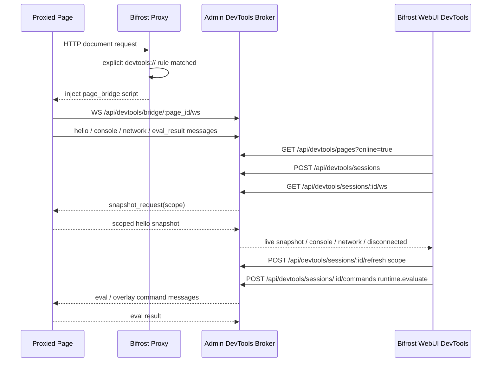

# Bifrost DevTools Remote Control

> 2026-04-29 决策：废弃 Chrome DevTools frontend 集成路线。Bifrost 不再下载、托管、内嵌或启动官方 Chrome DevTools frontend，也不再在 WebUI 暴露 `devtools://devtools/bundled/inspector.html?...` 调试地址。产品入口改为 Bifrost WebUI 自有 DevTools 面板。

## 目标

当用户显式配置 `devtools://` 规则后，所有经过 Bifrost 代理且命中规则的页面都可以被 WebUI 发现并调试。这个能力必须覆盖移动端 Safari 等不能或不愿开启系统调试能力的场景，因此默认依赖 Bifrost 注入的 `page_bridge`，而不是设备系统调试接口。

首版 WebUI 能力范围：

- Elements：展示目标页 DOM tree / DOM snapshot，支持选择节点并在目标页高亮，手动刷新后可看到 DOM 结构变化。
- Network：复用 Traffic 页面虚拟列表风格展示 bridge 捕获到的资源、fetch、XHR 等网络事件，包含序号、状态点、protocol、method、status、host、path、type、size、time 等列。
- Cookies / LocalStorage / SessionStorage：三个独立一级 tab 展示对应存储区域；默认支持新增、编辑、复制、删除，并验证运行中数据变更同步。
- Console：展示完整页面 console 日志级别；默认支持多行输入和表达式执行；对象、数组、DOM 节点、Error 等参数以结构化值传输，默认展示 Chrome-like 摘要，点击后按层级展开并支持复制原始内容。

## 非目标

- 不集成官方 Chrome DevTools frontend。
- 不下载 `chrome-devtools-frontend` npm 包，不把其 tarball 或编译产物放入仓库、安装包或数据目录。
- 不提供 `/api/devtools/frontend/status`、`/api/devtools/frontend/install`、`/api/devtools/frontend/*` 静态资源接口。
- 不提供 `POST /api/devtools/cdp/open/:page_id` 这类由 Bifrost 启动系统 Chrome 的入口。
- 不在 `/api/devtools/cdp/json/list` 中返回 `systemChromeFrontendUrl`。
- 不宣传完整 Chrome DevTools parity；`page_bridge` 是降级调试能力，能力边界由 capability matrix 明确表达。

## 架构

Bridge 与 Admin 的主通信通道必须使用 WebSocket，页面通过同一条连接上报 hello / console / network / eval_result，Admin 通过同一条连接下发 eval / overlay / snapshot_request 命令。页面侧不得再通过 HTTP `POST /bridge/*` 上报 hello / network / console / eval_result，也不得对 `eval-next` / `overlay-next` 发起轮询。事件必须先进入页面内存队列，再按短延迟批量异步 flush 到 WS；WS 未连接时限量缓存并重连，发送失败不能阻塞原页面主流程，避免命中 `devtools://` 的业务页面出现请求风暴和系统卡顿。

WebUI 与 Admin 也建立 session WebSocket。WebUI 打开详情或切换 tab 时，由 Admin 通过目标页 bridge WS 发起 scoped `snapshot_request`，目标页立即重新读取被请求模块并推送给 WebUI：DOM 与 Storage 现场读取，Console 与 Network 来自目标页内的有界 buffer。Bifrost Admin 只保留页面发现、session 路由、短期状态和必要的小型映射（例如 client request id 到 traffic id），不保存完整 DOM / Network / Storage / Console 历史数据；完整可恢复数据以目标页面内存为主。WebUI 断开 session WS 时 Admin 删除对应 session sender；目标页 bridge WS 断开时 Admin 立刻向已连接 WebUI session 推送 `disconnected`，双方都能感知断开状态。在线列表不能只依赖最近数据时间，bridge WS 仍连接的页面必须继续视为在线。

## 后端接口

保留接口：

- `GET /_bifrost/api/devtools/pages?online=true`
- `POST /_bifrost/api/devtools/sessions`
- `GET /_bifrost/api/devtools/sessions/:session_id/snapshot`：仅页面元信息兜底，不保存完整调试历史。
- `POST /_bifrost/api/devtools/sessions/:session_id/refresh`：通过目标页 WS 按 scope 拉取当前模块数据。
- `POST /_bifrost/api/devtools/sessions/:session_id/commands`
- `GET /_bifrost/api/devtools/bridge/:page_id/ws`
- `GET /_bifrost/api/devtools/audit/evaluate`

兼容保留接口：

- `GET /_bifrost/api/devtools/cdp/json/version`
- `GET /_bifrost/api/devtools/cdp/json/list`
- `GET /_bifrost/api/devtools/cdp/:page_id`

CDP shim 暂时保留用于协议级自动化与外部客户端兼容验证，但不再是 WebUI 主路径，也不再服务官方 Chrome DevTools frontend。任何新增 WebUI 能力都优先走 snapshot / semantic command API。

删除接口：

- `GET /_bifrost/api/devtools/frontend/status`
- `POST /_bifrost/api/devtools/frontend/install`
- `GET /_bifrost/api/devtools/frontend/*`
- `POST /_bifrost/api/devtools/cdp/open/:page_id`

## WebUI 设计

WebUI `DevTools` 一级 tab 分为两层：

1. 在线页面列表：只展示命中显式 `devtools://` 规则且在线的页面，卡片显示 title、URL、adapter、fidelity、state、mode。
2. 页面详情工作区：展示页头基本信息和六个自有面板：Elements、Network、Cookies、LocalStorage、SessionStorage、Console。

交互要求：

- 页面详情不显示官方 DevTools 安装入口。
- 页面详情不显示 `devtools://` 调试地址。
- 页面详情不显示“Open in Chrome DevTools”按钮。
- 页面详情页头保持轻量：不再展示 Adapter / Mode / Rule / Traffic 信息卡。页面 title 右侧只保留跳转 Traffic 的入口；URL 在 title 下方展示，hover 后出现复制按钮并写入真实 clipboard。下方 DevTools content 区域必须占满剩余高度，不能因为删除信息卡后留下空洞或让面板维持固定短高度。
- 多页面切换必须重新打开对应 page session，并刷新 snapshot，不能复用上一个页面的 DOM / storage / console。
- 页面列表和 `/json/list` 只展示已经完成 bridge `hello` 的可调试页面；`Candidate` 表示 HTML 响应已注入但脚本尚未运行，不能作为在线页面展示，避免 SPA 路由切换、fetch HTML、prefetch HTML 产生幽灵目标。
- 同一浏览器 tab 刷新或主文档导航时，page bridge 会产生新的注入 page id；Broker 必须通过稳定 `tab_id` 把旧 session 迁移到新 page id，并把旧 page 标记为 `stale` 后隐藏，WebUI snapshot 返回新 page id 时同步当前选择，不能让用户退出详情页后重新进入。
- Elements 面板交互参考 vConsole 的 Element 插件和 Chrome DevTools 的 Elements 面板，主体是可展开/折叠的 DOM tree，标签名、属性名、属性值分色。DOM tree 保留 Chrome DevTools 式闭合标签、空标签单行、选中行高亮。属性值和文本节点默认只展示不超过 120 个字符的预览，超长内容通过行内轻量入口打开弹窗查看完整内容，弹窗提供复制按钮复制完整内容，避免 base64、内联脚本、内联样式撑破布局。
- Elements 面板不能把 `#document` 渲染成无文本的幽灵 root；`#document` 只作为容器，树的首个可见节点应从 `<html>` 开始。纯空白 text node 必须过滤，避免 DOM 树中出现大段空白行；非空白文本节点继续展示。
- Elements 不展示右侧 selected node inspector；节点点击只负责 WebUI 选中高亮和调用 `dom.highlight` semantic command，在目标页显示 Bifrost overlay。该操作不要求 control mode。
- 面板 tab 右侧提供当前模块搜索框。Elements 搜索命中时自动展开父节点并选中第一个匹配节点；Network / Cookies / LocalStorage / SessionStorage / Console 搜索时直接过滤当前模块列表，并高亮匹配文本。
- 手动刷新按钮必须重新读取 session snapshot，用于用户主动确认 DOM / Network / Cookies / LocalStorage / SessionStorage / Console 最新状态。
- WebUI 不做高频全局轮询。页面列表只在未进入详情时低频刷新或由用户点击 refresh；详情页通过 session WS 接收增量推送，tab 切换时只请求当前模块 scoped snapshot；隐藏 tab 销毁组件，不做后台渲染。
- Cookies / LocalStorage / SessionStorage 参考 vConsole Storage 插件，但直接作为一级 tab 与 Network / Console 平级展示。每个 tab 使用 key/value 表格展示当前区域数据，并在行内支持新增、编辑、复制、删除。保存必须走 `storage.set` semantic command，删除必须走 `storage.delete` semantic command，经由 page bridge 在目标页执行实际写入。Storage 编辑默认可用，不受 `mode=read/control` 限制。
- Console 执行按钮默认可用。日志区域在上方滚动，底部轻量多行输入框固定在面板底部，不因日志增长滚出屏幕。每条 Console 行展示低对比度、小字号、精确到毫秒的输出或执行时间。页面日志按 log/info/warn/error/debug 分级显示，并保留每个 console 参数的结构化序列化结果：字符串、数字、布尔值直接分色展示；Object / Array 默认只展示摘要；点击展开后按属性或索引分级渲染子节点，并提供一键复制原始内容。输入框右侧提供全屏编辑入口，弹窗内使用 JavaScript Monaco editor，适合编写多行脚本；弹窗运行后关闭并把脚本写入 input 行。执行时将输入代码作为 `input` 行写入 console 列表，并将执行结果作为 `result` 行写入；目标页 JavaScript 抛错时，semantic command 必须以成功 HTTP 响应返回远端异常详情，由 WebUI 在 Console 中展示真实 JS error，不能退化成 `Request failed with status code 400`。如果用户显式配置 evaluate allowlist，表达式不在 allowlist 中时返回明确错误。
- WebUI 实现按功能拆分组件：页面容器负责 session/snapshot/command 状态；Elements、Network、Storage、Console、shared search/highlight helper 分别维护独立组件文件，避免单文件继续膨胀。

## 安全与权限

- `devtools://` 必须由规则显式配置，不允许对所有代理页面默认开启。
- 裸 `devtools://` 不需要任何 value；规则编辑器、syntax API 和示例都只推荐 `devtools://`。
- 裸 `devtools://` 默认启用 Elements / Network / Cookies / LocalStorage / SessionStorage / Console 全部能力，包括 Storage 修改和 Runtime evaluate。
- `mode=read` / `mode=control` / `evaluate_allowlist` 只作为历史兼容和高级限制能力保留，不出现在默认智能提示中。
- 如果显式配置 `evaluate_allowlist`，evaluate 仍需匹配规则中的 allowlist。
- audit 记录保留表达式 sha256、预览、目标 URL、page id、是否被 allowlist 拒绝等信息。
- bridge token 只由代理注入脚本持有，页面伪造 postMessage 或猜 token 不应改变 Admin 侧页面状态。

## 测试方案

单元测试：

- `BrowserDebugBroker::cdp_targets` 不再序列化 `systemChromeFrontendUrl`。
- `BrowserDebugBroker::list_debuggable_pages` 隐藏 `Candidate` / `Stale` 页面。
- `BrowserDebugBroker::bridge_hello` 使用 `tab_id` 将刷新后的新 page id 迁移到已有 session。
- `BrowserDebugBroker::command("runtime.evaluate")` 验证裸 `devtools://` 默认可执行，并继续覆盖兼容模式和 allowlist。

E2E 测试：

- `e2e-tests/tests/test_devtools_page_bridge_api.sh`
  - 启动临时 Bifrost 代理，必须使用临时 `BIFROST_DATA_DIR` 和 `--no-system-proxy`。
  - 配置显式 `devtools://` 规则。
  - 通过真实浏览器访问目标页面。
  - 验证 bridge 注入、页面发现、session snapshot。
- 验证 WebUI 自有 Elements / Network / Cookies / LocalStorage / SessionStorage / Console 六个面板。
- 验证页面详情不展示 Adapter / Mode / Rule / Traffic 信息卡；title 右侧展示 Traffic 跳转入口；URL hover 后可以复制真实目标 URL；下方 DevTools content 区域占满剩余高度，左右 padding 对称，Elements 超长 DOM 内容不会撑出容器或挤掉右侧搜索框。
- 验证 Elements tree 首个可见节点为 `<html>`，不存在空文本 DOM 行。
- 验证 Elements tree 超长属性/文本只展示 120 字符以内预览，可点击弹窗查看完整单项内容，并可复制完整内容到真实 clipboard。
- 验证 Elements 不渲染 selected-node 右侧侧边栏。
- 验证 Elements 点击节点后目标页出现 highlight overlay。
- 验证目标页 DOM 变更后点击 WebUI refresh 可以看到新增节点。
- 验证 Elements 搜索自动展开并选中第一个匹配节点。
- 验证运行中新发起 fetch 后 Network 面板可见新增记录。
- 验证 Network 搜索过滤列表并高亮匹配内容。
- 验证 Network 列表使用 Traffic 页面同款虚拟列表结构和视觉风格，至少包含 `traffic-table` 结构以及 Protocol / Method / Status / Host / Path 等列。
- 验证运行中新增 cookie/localStorage/sessionStorage 后三个存储一级 tab 完整同步。
- 验证 WebUI Cookies / LocalStorage / SessionStorage 能分别展示对应数据；行内新增/编辑后目标页真实读到新值，刷新后的对应面板也显示新值；复制写入真实 clipboard；删除后目标页和 WebUI 均不再显示该 key。
- 验证 Cookies / LocalStorage / SessionStorage 搜索过滤当前区域数据并高亮匹配内容。
- 验证运行中新增 console info/error/debug 日志后 Console 面板完整同步并按级别区分。
- 验证 console 输出 Object / Array 时，WebUI 默认展示摘要，点击后能按层级展开属性和索引，并能复制原始序列化内容。
- 验证 Console 每行展示 `HH:mm:ss.SSS` 格式时间信息，低对比度、小字号、不抢占主要日志内容。
- 验证 Console 底部多行输入固定在面板底部，执行代码作为 input 行、执行结果作为 result 行展示。
- 验证 Console 全屏 JavaScript 编辑器可打开、可输入多行脚本，并可直接运行得到 result。
- 验证 Console 搜索过滤日志；验证 `window.reload()` 这类 JS 抛错展示远端异常详情，而不是 HTTP 400。
- 验证页面切换后显示 secondary page 的 DOM。
- 验证 fetch/prefetch 到的 HTML 响应即使触发候选注册，也不会出现在 WebUI 页面列表或 CDP target 列表。
- 验证目标页刷新后，WebUI 详情页无需退出重进即可继续 refresh、Elements 展示和 Console 执行。
- 验证 Chrome DevTools frontend 安装、托管、系统打开相关入口均不存在或返回 404。
- 验证 syntax API 将 `devtools://` 暴露为无参数协议，示例只返回裸 `devtools://`，规则编辑器不会提示 `devtools://value`。
- 验证命中 `devtools://` 的页面通过 WebSocket 建立 bridge，Console evaluate / Storage 写入 / Elements highlight / Network 上报均经由 WS 往返；目标页 performance 中不存在 `/_bifrost/api/devtools/bridge/*` HTTP 上报请求。
- 验证 WebUI session 使用 WebSocket 接收 live snapshot / console / network / disconnected；切换 tab 触发对应 scoped refresh，隐藏 tab 不后台渲染；目标页静默但 bridge WS 仍连接时仍出现在在线页面列表。

真实场景测试：

- 更新并执行 `human_tests/chrome-devtools-remote-control.md`。
- 同步更新 `human_tests/readme.md` 索引。

## 校验要求

提交前必须通过：

- `pnpm --dir web run build`
- `cargo fmt --all -- --check`
- `cargo clippy --workspace --all-targets --all-features -- -D warnings`
- `cargo test --workspace --all-features`
- 相关 E2E：`e2e-tests/tests/test_devtools_page_bridge_api.sh`
