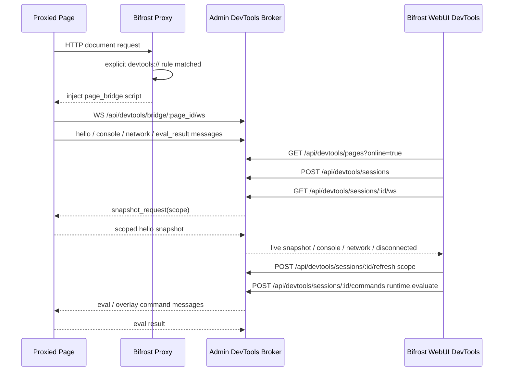

# Bifrost DevTools Remote Control

## 目标

当用户显式配置 `devtools://` 规则后，所有经过 Bifrost 代理且命中规则的页面都可以被 WebUI 发现并调试。这个能力覆盖移动端 Safari 等不能或不愿开启系统调试能力的场景，默认依赖 Bifrost 注入的 `page_bridge`，而不是设备系统调试接口。

WebUI 能力范围：

- Elements：展示目标页 DOM tree / DOM snapshot，支持选择节点并在目标页高亮；支持从 WebUI 进入目标页鼠标拾取模式，点击目标页元素后 WebUI 自动展开并选中对应 DOM node；目标页 overlay 需要展示节点名称、尺寸、color、font、padding、margin 等核心样式信息。
- Network：复用 Traffic 页面虚拟列表风格展示 bridge 捕获到的资源、fetch、XHR 等网络事件，包含序号、状态点、protocol、method、status、host、path、type、size、time 等列。
- Cookies / LocalStorage / SessionStorage：三个独立一级 tab 展示对应存储区域；支持新增、编辑、复制、删除，保存/删除通过 `storage.set` / `storage.delete` semantic command 经由 page bridge 在目标页执行实际写入。
- Console：展示完整页面 console 日志级别；支持多行输入和表达式执行；对象、数组、DOM 节点、Error 等参数以结构化值传输，展示 Chrome-like 摘要，点击后按层级展开并支持复制原始内容。

## 非目标

- 不集成官方 Chrome DevTools frontend。
- 不下载 `chrome-devtools-frontend` npm 包，不把其 tarball 或编译产物放入仓库、安装包或数据目录。
- 不提供 Chrome DevTools frontend 静态资源接口。
- 不提供由 Bifrost 启动系统 Chrome 的入口。
- 不宣传完整 Chrome DevTools parity；`page_bridge` 是降级调试能力，能力边界由 capability matrix 明确表达。

## 架构



### Bridge 通信机制

主通道使用 WebSocket (`/api/devtools/bridge/:page_id/ws`)。页面通过同一条连接上报 hello / console / network / eval_result / close，Admin 通过同一条连接下发 eval / overlay / snapshot_request 命令。HTTP POST bridge 端点作为兼容回退保留（hello / console / network / eval-next / eval-result / overlay-next / close）。

页面上报消息携带递增 `seq`，Admin 对每个 page 保留最近一段 `seq` 并去重，确保 WS reconnect 重放 inflight 消息时不会产生重复日志或重复网络记录。

### WebUI Session 通信

WebUI 与 Admin 建立 session WebSocket (`/api/devtools/sessions/:id/ws`)。WebUI 打开详情或切换 tab 时，由 Admin 通过目标页 bridge WS 发起 scoped `snapshot_request`，目标页立即重新读取被请求模块并推送给 WebUI。

Admin 只保留页面发现、session 路由、短期状态和有界 live ring buffer，不保存完整 DOM / Network / Storage / Console 历史数据；完整可恢复数据以目标页面内存为主。`client request id -> traffic id` 映射写入 Traffic 落库层，WebUI 点击 Network 详情时按 client request id 异步查询。Admin 到目标页、Admin 到 WebUI 的 live channel 使用有界队列（`mpsc::Sender`），慢消费者或断连时移除 stale sender。

WebUI 断开 session WS 时 Admin 删除对应 session sender；目标页 bridge WS 断开时 Admin 立刻向已连接 WebUI session 推送 `Disconnected`。

## 核心类型

```rust
pub struct BrowserDebugBroker {
    pages: RwLock<HashMap<String, DebugPage>>,
    sessions: RwLock<HashMap<String, DebugSession>>,
    eval_next_id: AtomicU64,
    eval_pending: RwLock<HashMap<String, Vec<BridgeEvalCommand>>>,
    eval_results: RwLock<HashMap<u64, Result<serde_json::Value, String>>>,
    overlay_pending: RwLock<HashMap<String, Vec<BridgeOverlayCommand>>>,
    bridge_senders: RwLock<HashMap<String, mpsc::Sender<BridgeServerMessage>>>,
    session_senders: RwLock<HashMap<String, mpsc::Sender<DevtoolsLiveMessage>>>,
    bridge_seen_seqs: RwLock<HashMap<String, VecDeque<u64>>>,
    evaluate_audit: RwLock<VecDeque<EvaluateAuditRecord>>,
    evaluate_audit_capacity: usize,
}

pub enum DebugAdapterKind { PageBridge }
pub enum DebugFidelity { Fallback }
pub enum DebugPageState { Candidate, Discoverable, FallbackAttached, Stale, Denied }
pub enum DevtoolsMode { Read, Control }

pub enum BridgeServerMessage {
    Eval { command: BridgeEvalCommand },
    Overlay { command: BridgeOverlayCommand },
    SnapshotRequest { scope: Option<String> },
}

pub enum DevtoolsLiveMessage {
    Snapshot { snapshot: serde_json::Value },
    Console { message: ConsoleMessage },
    Network { event: NetworkEvent },
    NodeSelected { node_id: u64 },
    Disconnected { page_id: String, reason: String },
}
```

## 后端接口

### DevTools 页面与会话

| 方法 | 路径 | 说明 |
|------|------|------|
| GET | `/_bifrost/api/devtools/pages?online=true` | 列出可调试页面 |
| POST | `/_bifrost/api/devtools/sessions` | 创建调试 session（body: `{page_id}`） |
| GET | `/_bifrost/api/devtools/sessions/:id/snapshot` | 获取 session 元信息快照 |
| POST | `/_bifrost/api/devtools/sessions/:id/refresh` | 按 scope 请求目标页刷新（body: `{scope}`） |
| GET | `/_bifrost/api/devtools/sessions/:id/ws` | Session live-push WebSocket |
| POST | `/_bifrost/api/devtools/sessions/:id/commands` | 发送命令（dom.snapshot / dom.highlight / dom.hide_highlight / console.messages / storage.set / storage.delete / runtime.evaluate） |

### Bridge（页面注入脚本通信）

| 方法 | 路径 | 说明 |
|------|------|------|
| GET | `/_bifrost/api/devtools/bridge/:page_id/ws` | Bridge WebSocket（主通道） |
| POST | `/_bifrost/api/devtools/bridge/:page_id/hello` | Bridge 握手（兼容回退） |
| POST | `/_bifrost/api/devtools/bridge/:page_id/console` | Console 事件上报（兼容回退） |
| POST | `/_bifrost/api/devtools/bridge/:page_id/network` | Network 事件上报（兼容回退） |
| POST | `/_bifrost/api/devtools/bridge/:page_id/eval-next` | 轮询待执行 eval 命令（兼容回退） |
| POST | `/_bifrost/api/devtools/bridge/:page_id/eval-result` | 返回 eval 执行结果（兼容回退） |
| POST | `/_bifrost/api/devtools/bridge/:page_id/overlay-next` | 轮询待执行 overlay 命令（兼容回退） |
| POST | `/_bifrost/api/devtools/bridge/:page_id/close` | 页面关闭通知（兼容回退） |

### CDP 兼容层

| 方法 | 路径 | 说明 |
|------|------|------|
| GET | `/_bifrost/api/devtools/cdp/json/version` | CDP 版本信息 |
| GET | `/_bifrost/api/devtools/cdp/json/list` | CDP target 列表 |
| GET | `/_bifrost/api/devtools/cdp/:page_id` | CDP WebSocket（实现主要 CDP 方法子集） |

CDP WebSocket 仅允许 `localhost`/`127.0.0.1` 来源连接（或通过 `BIFROST_DEVTOOLS_ALLOWED_ORIGINS` 环境变量放行）。

已实现的 CDP 方法：`Browser.getVersion`、`Target.getTargetInfo`、`Target.getTargets`、`DOM.getDocument`、`DOM.getFlattenedDocument`、`CSS.getMatchedStylesForNode`、`CSS.getComputedStyleForNode`、`DOMStorage.getDOMStorageItems`、`Runtime.evaluate`、`Overlay.highlightNode`、`Overlay.hideHighlight`、`Page.getFrameTree` 等；其余方法返回空成功响应（stub）。

### 辅助接口

| 方法 | 路径 | 说明 |
|------|------|------|
| GET | `/_bifrost/api/devtools/network/traffic/:client_req_id` | 根据 bridge 上报的 client request id 查找对应的 traffic id |
| GET | `/_bifrost/api/devtools/audit/evaluate` | 查询 evaluate 审计记录（支持 `?limit=` / `?since=`） |

## devtools:// 规则

### 协议定义

在 `crates/bifrost-core/src/protocol.rs` 中定义 `Protocol::DevTools`。

### 规则值解析

```rust
pub struct DevtoolsRule {
    pub mode: DevtoolsMode,           // Read | Control (默认 Control)
    pub inject: DevtoolsInjectMode,   // Auto | Bridge | Off (默认 Auto)
    pub deny: bool,                   // 默认 false
    pub evaluate_allowlist: Vec<String>,
    pub raw_value: String,
}
```

裸 `devtools://` 不需要任何 value；默认启用 Elements / Network / Cookies / LocalStorage / SessionStorage / Console 全部能力，包括 Storage 修改和 Runtime evaluate。

`mode=read` / `mode=control` / `evaluate_allowlist` 只作为高级限制能力保留，不出现在默认智能提示中。

### 注入决策

`devtools_bridge_requested(rules)` 检查规则是否命中且未 deny 且 inject 非 Off，满足条件时 `maybe_inject_devtools_bridge_html` 注册 page candidate 并在 HTML 响应中注入 bridge 脚本。

### 请求追踪

注入的 bridge 脚本为页面发出的同源 fetch/XHR 请求添加 `x-bifrost-client-request-id` header，代理在请求处理最前面通过 `take_devtools_client_req_id` 提取，写入 `TrafficRecord.devtools_client_req_id` 后由 Traffic 落库层索引。该 header 是 DevTools 内部映射字段，代理必须在转发和 Traffic request headers 记录前剥离，不能进入目标服务端或用户可见 request headers。

`` / `<script>` / `<link>` / `<iframe>` 等浏览器解析器发起的标签资源请求不能由 JS 设置 header。为实现精准映射，Bifrost 在注入 bridge 前只改写同源 HTML 常见资源标签 URL，添加内部 query `__bifrost_client_req_id=...`；bridge 也 patch `setAttribute` 与常见 URL 属性 setter，但仅在同源且当前页面未被 Service Worker 控制时覆盖动态创建的标签资源。跨域、protocol-relative、Service Worker 控制页面的动态标签资源不得追加内部 query，避免破坏业务 SW cache/route 匹配。代理在请求处理最前面通过 `take_devtools_client_req_id_from_uri` 提取该 query 并从 URI 中删除，再继续规则匹配、Traffic 记录与上游转发。该 query 不得出现在真实上游请求、Traffic URL、Traffic request headers 或 WebUI Network 展示 URL 中。

Network 列表以 page bridge 前端采集事件为可见数据源；Traffic 作为 status/header/size/duration/详情的补全来源。Traffic 详情只允许通过 `client_req_id` 精确查询，禁止使用 URL + 时间窗口猜测匹配。Traffic DB 查询同一 `client_req_id` 时以第一条非 replay 记录为准，后续重放或重复请求不得覆盖初始绑定。WebUI 点击 Network 行后，`client_req_id -> traffic id` 查询允许短暂重试，以吸收 bridge 事件先于 Traffic 落库完成的竞态；重试仍失败时才展示 fallback 详情。Performance resource timing 作为标签资源发现和兜底采集，动态 `` / `<script>` / `<link>` 等无法匹配 Traffic 时，也必须展示发起端可采集的 URL、method、status、type、query、时间与 cache hint。若同一 URL/method 已有带 client request id 的事件，必须去重并优先保留带 id 的事件。Admin broker 在处理 live `network` 事件和后续 `hello` / scoped snapshot 重放时必须使用同一套缓存合并逻辑：`client_req_id` 是强主键；没有 id 的 PerformanceResourceTiming fallback 只能作为兜底，不得在已有同 URL/method 且带 id 的 bridge 事件旁边再次展示。

## WebUI 设计

### 组件结构

| 组件 | 文件 | 职责 |
|------|------|------|
| DevTools 页面 | `web/src/pages/DevTools/index.tsx` | 页面列表 + 详情容器 |
| ElementsPanel | `web/src/pages/DevTools/components/ElementsPanel.tsx` | DOM tree 展示、节点高亮、搜索 |
| NetworkPanel | `web/src/pages/DevTools/components/NetworkPanel.tsx` | 网络事件虚拟列表，复用 VirtualTrafficTable |
| ConsolePanel | `web/src/pages/DevTools/components/ConsolePanel.tsx` | Console 日志 + 表达式执行（含 Monaco editor） |
| StoragePanel | `web/src/pages/DevTools/components/StoragePanel.tsx` | Cookies / LocalStorage / SessionStorage 表格编辑 |
| shared | `web/src/pages/DevTools/components/shared.tsx` | HighlightedText、filterBySearch 等工具函数 |

### API Client

`web/src/api/devtools.ts` 导出：`listDevtoolsPages`、`openDevtoolsSession`、`getDevtoolsSnapshot`、`requestDevtoolsSnapshotRefresh`、`buildDevtoolsSessionWsUrl`、`findTrafficForDevtoolsRequest`、`sendDevtoolsCommand`。

### 交互规范

- 页面列表只展示命中显式 `devtools://` 规则且已完成 bridge `hello` 的在线页面；`Candidate` / `Stale` / `Denied` 状态不可见。
- 页面详情页头：title 右侧保留跳转 Traffic 入口；URL 在 title 下方展示，hover 后出现复制按钮。下方 DevTools content 区域占满剩余高度。
- 多页面切换重新打开对应 page session 并刷新 snapshot。
- 同一 tab 刷新或导航时，Broker 通过稳定 `tab_id` 把旧 session 迁移到新 page id，旧 page 标记为 `Stale` 后隐藏。
- Elements：DOM tree 可展开/折叠，标签名/属性名/属性值分色。首个可见节点从 `<html>` 开始，`#document` 仅作为容器。纯空白 text node 过滤。超长属性/文本默认展示 ≤120 字符预览，点击弹窗查看完整内容。节点点击调用 `dom.highlight` 在目标页显示 overlay；点击元素拾取按钮调用 `dom.inspect`，目标页进入鼠标选择模式，hover 时实时高亮，click 时阻止原页面默认点击、退出拾取模式并通过 page bridge WS 上报 `node_selected`，WebUI 收到后展开祖先节点、滚动到对应 DOM row 并设为 selected。
- Network：复用 Traffic 页面虚拟列表结构和视觉风格。列表展示 page bridge 前端采集事件，并用 Traffic 补全 status、size、duration、headers 与详情。点击行优先通过 `x-bifrost-client-request-id` 或 `__bifrost_client_req_id` 映射到 Traffic 详情，在 DevTools 当前页面内展示 TrafficDetail，不跳转到 `/traffic` 路由；映射查询需要短暂重试，避免目标页 bridge 事件先到、Traffic DB 记录稍后落库时概率性展示 fallback。找不到 Traffic 记录时展示前端已上报的 URL / method / status / type / client request id / query / request headers / response headers / cache hint 等 metadata；标签资源受浏览器安全限制无法读取 header 时，仍保留 status/query/timing 等基础事实。默认不采集 request body 或 response body。
- Cookies / LocalStorage / SessionStorage：key/value 表格展示，行内新增/编辑/复制/删除。编辑默认可用，不受 mode 限制。
- Cookies / LocalStorage / SessionStorage 在 400+ 行数据下必须使用有界 DOM 渲染。Storage 面板只挂载视口附近的行，编辑/新增行与虚拟列表 viewport 必须分层布局，避免按钮命中区域被虚拟行覆盖。
- Console：日志区域在上方滚动，底部多行输入框固定。每条行展示低对比度毫秒级时间。Object/Array 默认摘要，点击展开。支持浏览器标准 `%c` 样式格式化并隐藏样式参数文本。全屏编辑入口使用 JavaScript Monaco editor。执行代码作为 `input` 行、结果作为 `result` 行展示。目标页 JS 抛错以成功 HTTP 响应返回异常详情，WebUI 展示真实 JS error。
- 面板 tab 右侧提供当前模块搜索框。Elements 搜索自动展开并选中匹配节点；其他面板搜索直接过滤列表并高亮匹配文本。
- 手动刷新按钮重新读取 scoped snapshot。
- WebUI 不做高频全局轮询。页面列表低频刷新或用户点击 refresh；详情页通过 session WS 接收增量推送；隐藏 tab 销毁组件。
- E2E 进入 WebUI DevTools 时必须优先使用侧栏导航项的稳定属性（`data-testid="app-sidebar-nav-item"` + `data-nav-label="DevTools"`）定位并点击；不能只依赖可见文本 `DevTools`，避免折叠侧栏、图标侧栏或字体渲染延迟导致 `locator.waitFor` 假超时。

## page_bridge 注入脚本

实现于 `crates/bifrost-proxy/src/proxy/http/devtools.rs` 中的 `devtools_bridge_script(page_id, token)` 函数。

功能：
1. 建立 WebSocket 连接到 `/_bifrost/api/devtools/bridge/{page_id}/ws`
2. 发送 `hello`（token、tab_id、title、URL、user_agent、DOM snapshot、storage、console、network）
3. 实时上报 console messages、network events
4. 接收并执行 eval / overlay / snapshot_request 命令
5. 返回 eval 执行结果
6. 监听 DOM mutation 和 storage 变化
7. 暴露 `window.__BIFROST_DEVTOOLS_BRIDGE__` shim 对象

`insert_devtools_bridge_script(html, script)` 将脚本插入 `<head>` 标签之前、`<html>` 后，或作为前缀，保证 bridge 尽可能早于页面脚本启动。

## 安全与权限

- `devtools://` 必须由规则显式配置，不允许对所有代理页面默认开启。
- 裸 `devtools://` 默认启用全部能力。
- 如果显式配置 `evaluate_allowlist`，evaluate 需匹配规则中的 allowlist。
- audit 记录保留表达式 sha256、预览、目标 URL、page id、是否被 allowlist 拒绝等信息（容量默认 1000 条，可通过 `BIFROST_DEVTOOLS_EVALUATE_AUDIT_CAPACITY` 环境变量调整）。
- bridge token 只由代理注入脚本持有，页面伪造 postMessage 或猜 token 不应改变 Admin 侧页面状态。

## 关键文件

| 文件 | 职责 |
|------|------|
| `crates/bifrost-core/src/protocol.rs` | `Protocol::DevTools` 定义 |
| `crates/bifrost-proxy/src/server.rs` | `DevtoolsRule` / `DevtoolsMode` / `DevtoolsInjectMode` 结构体 |
| `crates/bifrost-proxy/src/proxy/http/handler.rs` | HTTP 代理主处理逻辑，调用 devtools 模块完成注入决策 |
| `crates/bifrost-proxy/src/proxy/http/devtools.rs` | DevTools 规则解析、注入决策、bridge 脚本生成 |
| `crates/bifrost-admin/src/devtools.rs` | `BrowserDebugBroker` 核心逻辑 |
| `crates/bifrost-admin/src/handlers/devtools.rs` | HTTP/WebSocket 路由处理 |
| `crates/bifrost-admin/src/router.rs` | `/api/devtools` 路由入口 |
| `web/src/pages/DevTools/` | WebUI DevTools 页面及子组件 |
| `web/src/api/devtools.ts` | 前端 API client |

## 测试

### 单元测试

- `BrowserDebugBroker::cdp_targets` 不序列化 `systemChromeFrontendUrl`。
- `BrowserDebugBroker::list_debuggable_pages` 隐藏 `Candidate` / `Stale` 页面。
- `BrowserDebugBroker::bridge_hello` 使用 `tab_id` 将刷新后的新 page id 迁移到已有 session。
- `BrowserDebugBroker::command("runtime.evaluate")` 验证裸 `devtools://` 默认可执行，并覆盖兼容模式和 allowlist。

### E2E 测试

脚本：`e2e-tests/tests/test_devtools_page_bridge_api.sh`

规则 fixtures：
- `e2e-tests/rules/devtools/page_bridge_basic.txt`
- `e2e-tests/rules/devtools/page_bridge_control.txt`
- `e2e-tests/rules/devtools/page_bridge_deny.txt`
- `e2e-tests/rules/devtools/page_bridge_control_allowlist.txt`

验证点：
- 启动临时 Bifrost 代理（临时 `BIFROST_DATA_DIR` + `--no-system-proxy`）
- 配置显式 `devtools://` 规则
- 验证 bridge 注入、页面发现、session snapshot
- 验证 WebUI 六个面板功能（Elements / Network / Cookies / LocalStorage / SessionStorage / Console）
- 验证 Elements tree 首个可见节点为 `<html>`，无空文本 DOM 行，超长属性/文本 ≤120 字符预览
- 验证 Elements 点击节点后目标页出现 highlight overlay，并展示节点名称、尺寸、color、font、padding、margin
- 验证 Elements 元素拾取模式可以在目标页 hover/click 选中节点，WebUI 自动切换并选中对应 DOM row
- 验证 Network 使用虚拟列表结构，列表以前端采集事件为准，不重复展示 performance/Traffic 派生记录；点击行在 DevTools 内复用 TrafficDetail 展示；fetch/XHR 的 `x-bifrost-client-request-id` 和安全同源标签资源的 `__bifrost_client_req_id` 均可精确映射 Traffic id，且不会进入上游、Traffic URL 或 Traffic request headers；Service Worker / 跨域标签资源不会被内部 query 污染；浏览器侧 metadata 包含 status、query、request headers、response headers 且默认不采集 body；Traffic 匹配失败时 fallback 详情仍展示发起端基础信息；搜索后必须点击匹配业务 URL 的具体虚拟列表行，禁止点击当前首行，避免 CI 中旧行或虚拟列表复用导致 fallback 详情断言概率性落到其它请求；动态标签资源点击时必须覆盖 bridge 事件先于 Traffic 落库的映射重试路径
- 验证 WebUI DevTools 详情刷新按钮仅通过 session WS 请求当前 tab snapshot，不触发目标页 reload 或重新发起业务请求
- 验证 Storage 大列表只渲染视口附近行，LocalStorage / SessionStorage tab 切换不阻塞，且搜索后的行内编辑、复制、删除仍可点击执行
- 验证 HTTPS/TLS 全截包浏览器代理场景下，Network 中 fetch/XHR 与标签资源请求都能匹配到完整 Traffic 记录
- 验证 TLS 场景完成后 WebUI 仍可通过稳定侧栏导航属性进入 DevTools tab，且 DevTools 入口顺序仍在 Scripts 之后
- 验证 CI 中所有会被 DevTools shell E2E 下载使用的 release binary 必须包含真实 WebUI 前端资源，当前包括 Linux `build-e2e` artifact 与 macOS aarch64 CLI artifact；DevTools shell E2E 不允许使用 `Frontend not built` 占位页作为通过条件
- 验证 Storage 行内新增/编辑/删除后目标页真实读到新值
- 验证 Console 执行代码展示 input/result 行，JS 抛错展示远端异常详情，`%c` 样式格式化按浏览器 Console 语义渲染；对象展开断言按真实用户点击语义重试直到 `nested` / `items` 属性可见，避免 CI 中 WebUI snapshot/live 更新时序造成一次性 locator 假超时
- 验证 Bridge 主要经由 WebSocket 通信
- 验证页面切换后显示对应 DOM；目标页刷新后无需退出重进
- 验证 fetch/prefetch HTML 不产生幽灵目标
- 验证 syntax API 将 `devtools://` 暴露为无参数协议
- HTTP fixture 必须使用支持 `/devtools/api/*` 动态路由的 Node.js HTTP server，与 HTTPS fixture 保持同构：API 路径返回 `200` JSON `{ok:true,url}`，其它路径回退读取 `SITE_DIR` 静态文件。禁止使用纯 `python3 -m http.server` 承载会触发 fetch/XHR 的 fixture 页面，避免业务请求 404 导致 DevTools Network / locator 等待路径假失败。

### 真实场景测试

- 更新并执行 `human_tests/chrome-devtools-remote-control.md`
- 回归执行 `TC-CDP-42`：确认 Console 对象摘要在 CI/macOS WebUI 时序下可以稳定展开到 `nested` / `items` 属性，且复制 raw 内容仍包含结构化对象字段
- 同步更新 `human_tests/readme.md` 索引

## 校验要求

提交前必须通过：

- `pnpm --dir web run build`
- `cargo fmt --all -- --check`
- `cargo clippy --workspace --all-targets --all-features -- -D warnings`
- `cargo test --workspace --all-features`
- 相关 E2E：`e2e-tests/tests/test_devtools_page_bridge_api.sh`
