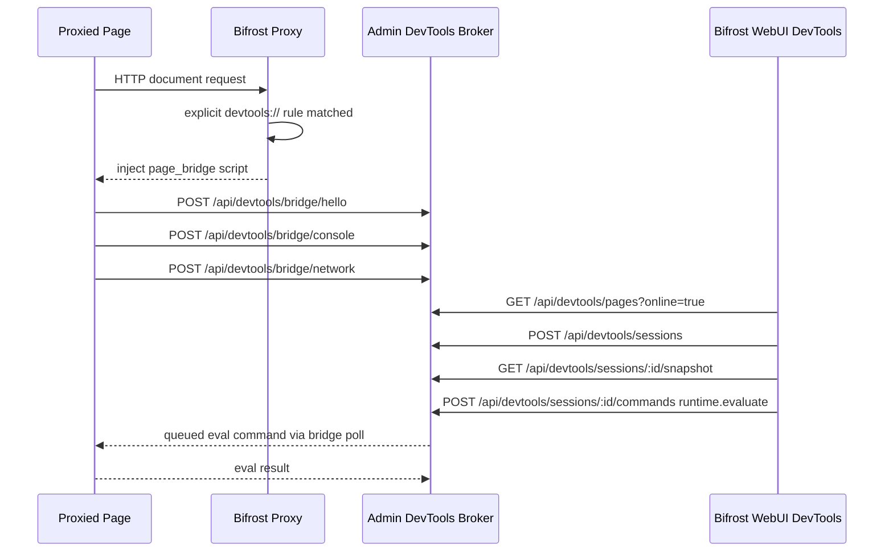

# Bifrost DevTools Remote Control

> 2026-04-29 决策：废弃 Chrome DevTools frontend 集成路线。Bifrost 不再下载、托管、内嵌或启动官方 Chrome DevTools frontend，也不再在 WebUI 暴露 `devtools://devtools/bundled/inspector.html?...` 调试地址。产品入口改为 Bifrost WebUI 自有 DevTools 面板。

## 目标

当用户显式配置 `devtools://` 规则后，所有经过 Bifrost 代理且命中规则的页面都可以被 WebUI 发现并调试。这个能力必须覆盖移动端 Safari 等不能或不愿开启系统调试能力的场景，因此默认依赖 Bifrost 注入的 `page_bridge`，而不是设备系统调试接口。

首版 WebUI 能力范围：

- Elements：展示目标页 DOM tree / DOM snapshot，支持选择节点并在目标页高亮，手动刷新后可看到 DOM 结构变化。
- Network：展示 bridge 捕获到的资源、fetch、XHR 等网络事件，包含 method、status、type、URL。
- Storage：展示 cookies、localStorage、sessionStorage；`mode=control` 下支持修改 cookie/localStorage/sessionStorage，并验证运行中数据变更同步。
- Console：展示完整页面 console 日志级别；`mode=control` 且命中 evaluate allowlist 时支持输入表达式执行。

## 非目标

- 不集成官方 Chrome DevTools frontend。
- 不下载 `chrome-devtools-frontend` npm 包，不把其 tarball 或编译产物放入仓库、安装包或数据目录。
- 不提供 `/api/devtools/frontend/status`、`/api/devtools/frontend/install`、`/api/devtools/frontend/*` 静态资源接口。
- 不提供 `POST /api/devtools/cdp/open/:page_id` 这类由 Bifrost 启动系统 Chrome 的入口。
- 不在 `/api/devtools/cdp/json/list` 中返回 `systemChromeFrontendUrl`。
- 不宣传完整 Chrome DevTools parity；`page_bridge` 是降级调试能力，能力边界由 capability matrix 明确表达。

## 架构

## 后端接口

保留接口：

- `GET /_bifrost/api/devtools/pages?online=true`
- `POST /_bifrost/api/devtools/sessions`
- `GET /_bifrost/api/devtools/sessions/:session_id/snapshot`
- `POST /_bifrost/api/devtools/sessions/:session_id/commands`
- `POST /_bifrost/api/devtools/bridge/*`
- `GET /_bifrost/api/devtools/audit/evaluate`

兼容保留接口：

- `GET /_bifrost/api/devtools/cdp/json/version`
- `GET /_bifrost/api/devtools/cdp/json/list`
- `GET /_bifrost/api/devtools/cdp/:page_id`

CDP shim 暂时保留用于协议级自动化与外部客户端兼容验证，但不再是 WebUI 主路径，也不再服务官方 Chrome DevTools frontend。任何新增 WebUI 能力都优先走 snapshot / semantic command API。

删除接口：

- `GET /_bifrost/api/devtools/frontend/status`
- `POST /_bifrost/api/devtools/frontend/install`
- `GET /_bifrost/api/devtools/frontend/*`
- `POST /_bifrost/api/devtools/cdp/open/:page_id`

## WebUI 设计

WebUI `DevTools` 一级 tab 分为两层：

1. 在线页面列表：只展示命中显式 `devtools://` 规则且在线的页面，卡片显示 title、URL、adapter、fidelity、state、mode。
2. 页面详情工作区：展示页头基本信息和四个自有面板：Elements、Network、Storage、Console。

交互要求：

- 页面详情不显示官方 DevTools 安装入口。
- 页面详情不显示 `devtools://` 调试地址。
- 页面详情不显示“Open in Chrome DevTools”按钮。
- 多页面切换必须重新打开对应 page session，并刷新 snapshot，不能复用上一个页面的 DOM / storage / console。
- Elements 面板交互参考 vConsole 的 Element 插件和 Chrome DevTools 的 Elements 面板：左侧是可展开/折叠的 DOM tree，标签名、属性名、属性值分色；右侧是当前选中节点的属性/文本详情。DOM tree 保留 Chrome DevTools 式闭合标签、空标签单行、选中行高亮。
- Elements 节点点击必须调用 `dom.highlight` semantic command，在目标页显示 Bifrost overlay；该操作不要求 control mode，同时 WebUI 侧需要更新右侧 selected node inspector。
- 手动刷新按钮必须重新读取 session snapshot，用于用户主动确认 DOM / Network / Storage / Console 最新状态。
- Storage 参考 vConsole Storage 插件，列表行提供编辑入口，将当前 key/value 带入编辑器；保存必须走 `storage.set` semantic command，经由 page bridge 在目标页执行实际写入。`mode=read` 下编辑控件禁用。
- Console 执行按钮在 `mode=read` 下禁用，并提示需要 control mode。
- Console 执行必须通过 Admin broker 审计，表达式不在 allowlist 中时返回明确错误。

## 安全与权限

- `devtools://` 必须由规则显式配置，不允许对所有代理页面默认开启。
- `mode=read` 只允许观察 DOM、console、network、storage。
- `mode=control` 才允许 runtime evaluate。
- evaluate 仍需匹配规则中的 `evaluate_allowlist`。
- audit 记录保留表达式 sha256、预览、目标 URL、page id、是否被 allowlist 拒绝等信息。
- bridge token 只由代理注入脚本持有，页面伪造 postMessage 或猜 token 不应改变 Admin 侧页面状态。

## 测试方案

单元测试：

- `BrowserDebugBroker::cdp_targets` 不再序列化 `systemChromeFrontendUrl`。
- `BrowserDebugBroker::command("runtime.evaluate")` 继续验证 read/control 与 allowlist。

E2E 测试：

- `e2e-tests/tests/test_devtools_page_bridge_api.sh`
  - 启动临时 Bifrost 代理，必须使用临时 `BIFROST_DATA_DIR` 和 `--no-system-proxy`。
  - 配置显式 `devtools://` 规则。
  - 通过真实浏览器访问目标页面。
  - 验证 bridge 注入、页面发现、session snapshot。
- 验证 WebUI 自有 Elements / Network / Storage / Console 四个面板。
- 验证 Elements 点击节点后目标页出现 highlight overlay。
- 验证目标页 DOM 变更后点击 WebUI refresh 可以看到新增节点。
- 验证运行中新发起 fetch 后 Network 面板可见新增记录。
- 验证运行中新增 cookie/localStorage/sessionStorage 后 Storage 面板完整同步。
- 验证 WebUI Storage 编辑 cookie/localStorage/sessionStorage 后，目标页真实读到新值，刷新后的 Storage 面板也显示新值。
- 验证运行中新增 console info/error 日志后 Console 面板完整同步。
- 验证 Console 在 control allowlist 下真实执行 `document.title`。
  - 验证页面切换后显示 secondary page 的 DOM。
  - 验证 Chrome DevTools frontend 安装、托管、系统打开相关入口均不存在或返回 404。

真实场景测试：

- 更新并执行 `human_tests/chrome-devtools-remote-control.md`。
- 同步更新 `human_tests/readme.md` 索引。

## 校验要求

提交前必须通过：

- `pnpm --dir web run build`
- `cargo fmt --all -- --check`
- `cargo clippy --workspace --all-targets --all-features -- -D warnings`
- `cargo test --workspace --all-features`
- 相关 E2E：`e2e-tests/tests/test_devtools_page_bridge_api.sh`
