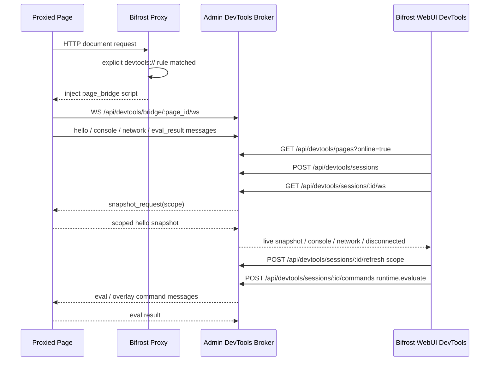

# Bifrost DevTools Remote Control

## 背景

Bifrost 抓包场景下，用户经常需要在被代理页面上排查 DOM、样式、脚本、存储、Console 与网络请求。设备侧 Safari、内嵌 WebView、老旧 Android WebView、桌面浏览器隐私模式等场景下，官方 Chrome DevTools frontend 要么需要重新签名调试证书、要么需要额外的开发者选项、要么因为公司安全策略被禁用；直接给用户装一个 devtools frontend tarball 又会引入巨大二进制、跨平台构建成本、以及不受控的第三方 UI 变化。

同时 Bifrost 已经拥有 HTTPS/TLS 全链路抓包能力，Traffic 页面能看到完整请求/响应，如果 DevTools 能力被割裂在系统 devtools 里，用户就会在 Traffic 与 devtools 之间来回跳转、并且失去 Bifrost 特有的规则/断点/回放语义。本方案提供 Bifrost 自研 DevTools：当用户显式配置 `devtools://` 规则时，Bifrost 代理向 HTML 响应注入 `page_bridge` 脚本，页面通过 WebSocket 与 Bifrost Admin 建立 bridge，WebUI DevTools 面板消费 bridge 上报的实时数据，并复用 Traffic 落库完成网络详情展示。

`page_bridge` 是降级调试能力，明确不追求 Chrome DevTools parity；能力边界由 capability matrix 表达。

## 用户目标验证清单

### 必须实现

- 用户显式配置 `devtools://` 规则后，命中该规则的 HTML 响应被自动注入 `page_bridge`；未命中的页面不注入。
- WebUI DevTools 页面能列出所有在线（`Discoverable` + `FallbackAttached`）页面；`Candidate` / `Stale` / `Denied` 页面不进入列表。
- Elements 面板可展示 DOM tree、支持节点搜索、支持从 WebUI 点击节点后目标页出现 overlay 高亮（含节点名称、尺寸、color、font、padding、margin）。
- Elements 支持从 WebUI 进入目标页鼠标拾取模式，click 目标元素后 WebUI 自动展开并选中对应 DOM node。
- Network 面板复用 Traffic 虚拟列表风格，以 bridge 前端采集事件为可见数据源，点击行时通过 `client_req_id` 精确映射 Traffic 详情。
- Cookies / LocalStorage / SessionStorage 三个独立 tab 支持行内新增、编辑、复制、删除；写入通过 `storage.set` / `storage.delete` 由 page bridge 在目标页真正执行。
- Console 面板展示完整级别日志（含 `%c` 样式）、支持多行 JS 表达式执行、支持对象/数组/DOM/Error 结构化摘要与展开。
- 提供 CDP 兼容端点 `/api/devtools/cdp/*`，实现 CDP 常用方法子集，能被 Playwright / puppeteer 等驱动的浏览器最小接入。
- 页面刷新、tab 迁移、bridge WS 短暂断连不产生重复 page id、重复日志、重复 Network 事件。

### 必须不破坏

- 未配置 `devtools://` 规则的所有 Bifrost 场景保持不变；不会因 DevTools 代码路径改动而影响普通抓包性能或 Traffic 落库。
- Traffic 页面结构、Traffic DB 记录 schema 不变；DevTools 仅新增 `client_req_id` 索引字段。
- `x-bifrost-client-request-id` header 与 `__bifrost_client_req_id` query 是 DevTools 内部字段，必须在转发到真实上游、写入 Traffic URL / request headers 前被剥离。
- 跨域、protocol-relative、Service Worker 控制页面的动态标签资源不允许被内部 query 污染，避免破坏业务 SW cache/route 匹配。
- 亮暗主题、i18n、`data-testid="app-sidebar-nav-item"` 等 WebUI 稳定属性不变。

### 必须真实验证

- 启动临时 Bifrost（临时 `BIFROST_DATA_DIR` + `--no-system-proxy`）并配置 `devtools://` 规则，浏览器访问 fixture 页面后 DevTools 页面列表可看到该 tab。
- Playwright 覆盖 WebUI 六个面板端到端：Elements 节点搜索/展开/highlight/元素拾取；Network 复用 TrafficDetail；Storage 新增/编辑/删除后目标页 `document.cookie` / `localStorage` / `sessionStorage` 真实变更；Console `console.log` / 异常 / 表达式执行结果。
- Mock 页面刷新与并发 tab，验证 `tab_id` 迁移、`seq` 去重、Network cache 按 `client_req_id` 去重、PerformanceResourceTiming fallback 不覆盖带 id 的 bridge 事件。
- Playwright 覆盖 `TC-CDP-41`（Network 详情等待 Traffic 映射落库完成）与 `TC-CDP-42`（Console 对象展开点击在 CI 时序下稳定）。
- HTTPS/TLS 场景下验证 fetch/XHR 与标签资源（`` / `<script>` / `<link>` / `<iframe>`）都能匹配到完整 Traffic 记录。

## 产品语义

### `devtools://` 是显式协议规则

Bifrost 从不默认对所有代理页面开启 DevTools。用户必须写 `*.example.com devtools://` 之类的规则；命中该规则的 HTML 响应才会被注入 `page_bridge`。

裸 `devtools://` 无参数即启用全部能力：Elements + Network + Cookies + LocalStorage + SessionStorage + Console，包括 Storage 修改和 Runtime evaluate。`mode=read` / `mode=control` / `evaluate_allowlist` 是保留的高级限制能力，不出现在默认智能提示中。

### `page_bridge` 是降级调试能力

`page_bridge` 明确不追求 Chrome DevTools parity；WebUI 面板列出的能力就是全部能力。Console 值序列化上限、Network 不采集 body、Storage 只覆盖三种 Web Storage、Elements 不支持全部 CSS pseudo state 等边界由 capability matrix 明确表达，避免用户以为“少了什么功能”。

### Traffic 是 DevTools Network 的补全来源

Network 面板的可见数据源是 bridge 前端采集事件；Traffic 只作为 status / headers / size / duration / 详情的补全来源。原因：

- bridge 事件能覆盖 fetch/XHR/标签资源、resource timing、初始 hello snapshot 等浏览器可见事件；Traffic 侧不知道浏览器发起端是不是相同 tab、不知道 resource type。
- Traffic 详情通过 `client_req_id` 精确匹配，避免 URL + 时间窗口猜测导致错行。
- 找不到 Traffic 时，前端仍展示 URL / method / status / type / query / request headers / response headers / cache hint 等 metadata，不空白。

### 能力矩阵

| 能力 | page_bridge | 备注 |
|------|-------------|------|
| DOM tree / attribute / text | 支持 | 空文本节点过滤，超长内容 ≤120 字符预览 |
| DOM highlight overlay | 支持 | 展示尺寸、color、font、padding、margin |
| DOM element inspect（点击拾取） | 支持 | 目标页阻止原页面默认点击并上报 `node_selected` |
| Network fetch/XHR | 支持 | 通过 `x-bifrost-client-request-id` 精确映射 Traffic |
| Network `/<script>/<link>/<iframe>` | 部分支持 | 同源且非 SW 控制页面通过 `__bifrost_client_req_id` query 追踪；跨域/SW 页面用 Performance fallback |
| Network body / cookies raw | 不支持 | 默认不采集 body |
| Cookies / LocalStorage / SessionStorage 读 | 支持 | 按行虚拟列表 |
| Cookies / LocalStorage / SessionStorage 写 | 支持 | `storage.set` / `storage.delete` 在目标页真正执行 |
| Console 日志 | 支持 | 覆盖全部级别 + `%c` 样式 |
| Console 表达式执行 | 支持 | Monaco editor 编辑，input/result 行分别渲染 |
| Runtime.evaluate 通过 CDP | 支持 | 默认 allow；`evaluate_allowlist` 限制时按 allowlist 匹配 |
| Performance / Memory / Application / Sources | 不支持 | 明确不在本方案范围 |

## 技术细节

### 架构

### Bridge 通信机制

主通道使用 WebSocket (`/api/devtools/bridge/:page_id/ws`)。页面通过同一条连接上报 `hello` / `console` / `network` / `eval_result` / `close`，Admin 通过同一条连接下发 `eval` / `overlay` / `snapshot_request`。HTTP POST bridge 端点作为兼容回退保留（`hello` / `console` / `network` / `eval-next` / `eval-result` / `overlay-next` / `close`）。

页面上报消息携带递增 `seq`，Admin 对每个 page 保留最近一段 `seq` 并去重，确保 WS reconnect 重放 inflight 消息时不会产生重复日志或重复网络记录。

### WebUI Session 通信

WebUI 与 Admin 建立 session WebSocket (`/api/devtools/sessions/:id/ws`)。WebUI 打开详情或切换 tab 时，Admin 通过目标页 bridge WS 发起 scoped `snapshot_request`，目标页立即重新读取被请求模块并推送给 WebUI。

Admin 只保留页面发现、session 路由、短期状态和有界 live ring buffer，不保存完整 DOM / Network / Storage / Console 历史数据；完整可恢复数据以目标页内存为主。`client_req_id -> traffic id` 映射写入 Traffic 落库层，WebUI 点击 Network 详情时按 `client_req_id` 异步查询。Admin 到目标页、Admin 到 WebUI 的 live channel 使用有界队列（`mpsc::Sender`），慢消费者或断连时移除 stale sender。

WebUI 断开 session WS 时 Admin 删除对应 session sender；目标页 bridge WS 断开时 Admin 立刻向已连接 WebUI session 推送 `Disconnected`。

### 核心类型

~~~rust
pub struct BrowserDebugBroker {
    pages: RwLock<HashMap<String, DebugPage>>,
    sessions: RwLock<HashMap<String, DebugSession>>,
    eval_next_id: AtomicU64,
    eval_pending: RwLock<HashMap<String, Vec<BridgeEvalCommand>>>,
    eval_results: RwLock<HashMap<u64, Result<serde_json::Value, String>>>,
    overlay_pending: RwLock<HashMap<String, Vec<BridgeOverlayCommand>>>,
    bridge_senders: RwLock<HashMap<String, mpsc::Sender<BridgeServerMessage>>>,
    session_senders: RwLock<HashMap<String, mpsc::Sender<DevtoolsLiveMessage>>>,
    bridge_seen_seqs: RwLock<HashMap<String, VecDeque<u64>>>,
    evaluate_audit: RwLock<VecDeque<EvaluateAuditRecord>>,
    evaluate_audit_capacity: usize,
}

pub enum DebugAdapterKind { PageBridge }
pub enum DebugFidelity { Fallback }
pub enum DebugPageState { Candidate, Discoverable, FallbackAttached, Stale, Denied }
pub enum DevtoolsMode { Read, Control }

pub enum BridgeServerMessage {
    Eval { command: BridgeEvalCommand },
    Overlay { command: BridgeOverlayCommand },
    SnapshotRequest { scope: Option<String> },
}

pub enum DevtoolsLiveMessage {
    Snapshot { snapshot: serde_json::Value },
    Console { message: ConsoleMessage },
    Network { event: NetworkEvent },
    NodeSelected { node_id: u64 },
    Disconnected { page_id: String, reason: String },
}
~~~

### `devtools://` 规则解析

`Protocol::DevTools` 定义在 `crates/bifrost-core/src/protocol.rs`。规则值：

~~~rust
pub struct DevtoolsRule {
    pub mode: DevtoolsMode,           // Read | Control (默认 Control)
    pub inject: DevtoolsInjectMode,   // Auto | Bridge | Off (默认 Auto)
    pub deny: bool,                   // 默认 false
    pub evaluate_allowlist: Vec<String>,
    pub raw_value: String,
}
~~~

裸 `devtools://` 不需要任何 value，默认启用全部能力。`devtools_bridge_requested(rules)` 检查规则命中且未 deny 且 inject 非 Off；`maybe_inject_devtools_bridge_html` 注册 page candidate 并在 HTML 响应中注入 bridge 脚本。

### 请求追踪

- 注入的 bridge 脚本为页面 fetch/XHR 请求添加 `x-bifrost-client-request-id` header。代理最前面通过 `take_devtools_client_req_id` 提取并写入 `TrafficRecord.devtools_client_req_id`，然后从 request headers 中剥离，不进入上游或 Traffic 记录。
- `` / `<script>` / `<link>` / `<iframe>` 无法由 JS 设置 header。Bifrost 在注入 bridge 前只改写同源 HTML 常见资源标签 URL，追加内部 query `__bifrost_client_req_id=...`；bridge 也 patch `setAttribute` 与常见 URL 属性 setter，但仅在同源且当前页面未被 Service Worker 控制时覆盖动态创建的标签资源。跨域、protocol-relative、SW 控制页面的动态标签资源不追加内部 query。
- 代理最前面通过 `take_devtools_client_req_id_from_uri` 提取该 query 并从 URI 中删除，再继续规则匹配、Traffic 记录与上游转发。该 query 不得出现在真实上游请求、Traffic URL、Traffic request headers 或 WebUI Network 展示 URL 中。
- Traffic 详情只允许通过 `client_req_id` 精确查询，禁止使用 URL + 时间窗口猜测匹配。Traffic DB 查询同一 `client_req_id` 时以第一条非 replay 记录为准，后续重放或重复请求不得覆盖初始绑定。
- WebUI 点击 Network 行后，`client_req_id -> traffic id` 查询允许短暂重试，以吸收 bridge 事件先于 Traffic 落库完成的竞态；重试仍失败时才展示 fallback 详情。
- Performance resource timing 作为标签资源发现和兜底采集，动态资源无法匹配 Traffic 时仍展示发起端可采集的 URL / method / status / type / query / 时间与 cache hint。若同一 URL/method 已有带 `client_req_id` 的事件，去重优先保留带 id 的事件。
- Admin broker 在处理 live `network` 事件和后续 `hello` / scoped snapshot 重放时使用同一套缓存合并逻辑：`client_req_id` 是强主键；无 id 的 PerformanceResourceTiming fallback 只能作为兜底，不得在已有同 URL/method 且带 id 的 bridge 事件旁边再次展示。

### page_bridge 注入脚本

实现于 `crates/bifrost-proxy/src/proxy/http/devtools.rs` 的 `devtools_bridge_script(page_id, token)`。功能：

1. 建立 WebSocket 连接到 `/_bifrost/api/devtools/bridge/{page_id}/ws`
2. 发送 `hello`（token、`tab_id`、title、URL、user_agent、DOM snapshot、storage、console、network）
3. 实时上报 console messages、network events
4. 接收并执行 `eval` / `overlay` / `snapshot_request` 命令
5. 返回 eval 执行结果
6. 监听 DOM mutation 和 storage 变化
7. 暴露 `window.__BIFROST_DEVTOOLS_BRIDGE__` shim 对象

`insert_devtools_bridge_script(html, script)` 将脚本插入 `<head>` 标签之前、`<html>` 后，或作为前缀，保证 bridge 尽可能早于页面脚本启动。

## Admin API

### DevTools 页面与会话

| 方法 | 路径 | 说明 |
|------|------|------|
| GET | `/_bifrost/api/devtools/pages?online=true` | 列出可调试页面 |
| POST | `/_bifrost/api/devtools/sessions` | 创建调试 session（body: `{page_id}`） |
| GET | `/_bifrost/api/devtools/sessions/:id/snapshot` | 获取 session 元信息快照 |
| POST | `/_bifrost/api/devtools/sessions/:id/refresh` | 按 scope 请求目标页刷新（body: `{scope}`） |
| GET | `/_bifrost/api/devtools/sessions/:id/ws` | Session live-push WebSocket |
| POST | `/_bifrost/api/devtools/sessions/:id/commands` | 发送命令（`dom.snapshot` / `dom.highlight` / `dom.hide_highlight` / `dom.inspect` / `console.messages` / `storage.set` / `storage.delete` / `runtime.evaluate`） |

### Bridge

| 方法 | 路径 | 说明 |
|------|------|------|
| GET | `/_bifrost/api/devtools/bridge/:page_id/ws` | Bridge WebSocket（主通道） |
| POST | `/_bifrost/api/devtools/bridge/:page_id/hello` | Bridge 握手（兼容回退） |
| POST | `/_bifrost/api/devtools/bridge/:page_id/console` | Console 事件上报（兼容回退） |
| POST | `/_bifrost/api/devtools/bridge/:page_id/network` | Network 事件上报（兼容回退） |
| POST | `/_bifrost/api/devtools/bridge/:page_id/eval-next` | 轮询待执行 eval 命令（兼容回退） |
| POST | `/_bifrost/api/devtools/bridge/:page_id/eval-result` | 返回 eval 执行结果（兼容回退） |
| POST | `/_bifrost/api/devtools/bridge/:page_id/overlay-next` | 轮询待执行 overlay 命令（兼容回退） |
| POST | `/_bifrost/api/devtools/bridge/:page_id/close` | 页面关闭通知（兼容回退） |

### CDP 兼容层

| 方法 | 路径 | 说明 |
|------|------|------|
| GET | `/_bifrost/api/devtools/cdp/json/version` | CDP 版本信息 |
| GET | `/_bifrost/api/devtools/cdp/json/list` | CDP target 列表 |
| GET | `/_bifrost/api/devtools/cdp/:page_id` | CDP WebSocket（主要 CDP 方法子集） |

CDP WebSocket 仅允许 `localhost` / `127.0.0.1` 来源连接（或通过 `BIFROST_DEVTOOLS_ALLOWED_ORIGINS` 环境变量放行）。

已实现的 CDP 方法：`Browser.getVersion` / `Target.getTargetInfo` / `Target.getTargets` / `DOM.getDocument` / `DOM.getFlattenedDocument` / `CSS.getMatchedStylesForNode` / `CSS.getComputedStyleForNode` / `DOMStorage.getDOMStorageItems` / `Runtime.evaluate` / `Overlay.highlightNode` / `Overlay.hideHighlight` / `Page.getFrameTree`。其余方法返回空成功响应（stub）。

### 辅助接口

| 方法 | 路径 | 说明 |
|------|------|------|
| GET | `/_bifrost/api/devtools/network/traffic/:client_req_id` | 根据 bridge 上报的 client request id 查找对应的 traffic id |
| GET | `/_bifrost/api/devtools/audit/evaluate` | 查询 evaluate 审计记录（支持 `?limit=` / `?since=`） |

## CLI

无 CLI 变更。DevTools 完全通过规则 + WebUI 使用；CLI 的 `bifrost rule` 系列已能创建 `devtools://` 规则，不需要新增专用子命令。

## Web UI

### 组件结构

| 组件 | 文件 | 职责 |
|------|------|------|
| DevTools 页面 | `web/src/pages/DevTools/index.tsx` | 页面列表 + 详情容器 |
| ElementsPanel | `web/src/pages/DevTools/components/ElementsPanel.tsx` | DOM tree 展示、节点高亮、搜索 |
| NetworkPanel | `web/src/pages/DevTools/components/NetworkPanel.tsx` | 网络事件虚拟列表，复用 VirtualTrafficTable |
| ConsolePanel | `web/src/pages/DevTools/components/ConsolePanel.tsx` | Console 日志 + 表达式执行（含 Monaco editor） |
| StoragePanel | `web/src/pages/DevTools/components/StoragePanel.tsx` | Cookies / LocalStorage / SessionStorage 表格编辑 |
| shared | `web/src/pages/DevTools/components/shared.tsx` | HighlightedText、filterBySearch 等共享 React 工具 |
| shared utils | `web/src/pages/DevTools/components/sharedUtils.ts` / `domUtils.ts` / `consoleValueUtils.ts` | DOM 节点格式化、Console 值序列化、过滤等纯函数辅助 |

### API Client

`web/src/api/devtools.ts` 导出：`listDevtoolsPages` / `openDevtoolsSession` / `getDevtoolsSnapshot` / `requestDevtoolsSnapshotRefresh` / `buildDevtoolsSessionWsUrl` / `findTrafficForDevtoolsRequest` / `sendDevtoolsCommand`。

### 交互规范

- 页面列表只展示命中显式 `devtools://` 规则且已完成 bridge `hello` 的在线页面；`Candidate` / `Stale` / `Denied` 状态不可见。
- 页面详情页头：title 右侧保留跳转 Traffic 入口；URL 在 title 下方展示，hover 后出现复制按钮。下方 DevTools content 区域占满剩余高度。
- 多页面切换重新打开对应 page session 并刷新 snapshot。
- 同一 tab 刷新或导航时，Broker 通过稳定 `tab_id` 把旧 session 迁移到新 page id，旧 page 标记为 `Stale` 后隐藏。
- Elements：DOM tree 可展开/折叠；标签名 / 属性名 / 属性值分色。首个可见节点从 `<html>` 开始，`#document` 仅作为容器。纯空白 text node 过滤。超长属性/文本默认展示 ≤120 字符预览，点击弹窗查看完整内容。节点点击调用 `dom.highlight` 在目标页显示 overlay；元素拾取按钮调用 `dom.inspect`，目标页进入鼠标选择模式，hover 实时高亮，click 时阻止原页面默认点击、退出拾取模式并通过 bridge WS 上报 `node_selected`，WebUI 收到后展开祖先节点、滚动到对应 DOM row 并设为 selected。
- Network：复用 Traffic 虚拟列表结构和视觉。列表展示 bridge 前端采集事件，用 Traffic 补全 status / size / duration / headers / 详情。点击行优先通过 `x-bifrost-client-request-id` 或 `__bifrost_client_req_id` 映射到 Traffic 详情，在 DevTools 当前页面内展示 TrafficDetail，不跳转到 `/traffic` 路由；映射查询需要短暂重试，避免目标页 bridge 事件先到、Traffic DB 记录稍后落库时概率性展示 fallback。找不到 Traffic 记录时展示前端已上报的 URL / method / status / type / client request id / query / request headers / response headers / cache hint 等 metadata；标签资源受浏览器安全限制无法读取 header 时，仍保留 status / query / timing 等基础事实。默认不采集 request body 或 response body。
- Cookies / LocalStorage / SessionStorage：key/value 表格展示，行内新增/编辑/复制/删除。编辑默认可用，不受 mode 限制。
- Cookies / LocalStorage / SessionStorage 在 400+ 行数据下必须使用有界 DOM 渲染；只挂载视口附近的行；编辑/新增行与虚拟列表 viewport 必须分层布局，避免按钮命中区域被虚拟行覆盖。
- Console：日志区域在上方滚动，底部多行输入框固定。每行展示低对比度毫秒级时间。Object / Array 默认摘要，点击展开。支持浏览器标准 `%c` 样式格式化并隐藏样式参数文本。全屏编辑入口使用 JavaScript Monaco editor。执行代码作为 `input` 行、结果作为 `result` 行展示。目标页 JS 抛错以成功 HTTP 响应返回异常详情，WebUI 展示真实 JS error。
- 面板 tab 右侧提供当前模块搜索框。Elements 搜索自动展开并选中匹配节点；其他面板搜索直接过滤列表并高亮匹配文本。
- 手动刷新按钮重新读取 scoped snapshot，不触发目标页 reload 或重新发起业务请求。
- WebUI 不做高频全局轮询：页面列表低频刷新或用户点击 refresh；详情页通过 session WS 接收增量推送；隐藏 tab 销毁组件。
- E2E 进入 WebUI DevTools 时必须优先使用侧栏导航项的稳定属性（`data-testid="app-sidebar-nav-item"` + `data-nav-label="DevTools"`）定位并点击；不能只依赖可见文本 `DevTools`，避免折叠侧栏、图标侧栏或字体渲染延迟导致 `locator.waitFor` 假超时。

## Sync 边界

- `page_bridge` 会话与 Broker 状态是本机运行时状态，不参与远端 sync。
- `devtools://` 规则本身是普通规则，由现有 Rules Sync 通道同步。远端设备只有在自身也命中该规则、且自身 Bifrost 版本支持 DevTools 时才注入 bridge。
- Traffic DB 的 `devtools_client_req_id` 字段是本机 DevTools 内部索引，不进入 remote Traffic 上报字段；避免不同设备的 DevTools client id 冲突。

## 实现切分

### Phase 1：协议、规则与注入

- `Protocol::DevTools` 定义与 `DevtoolsRule` 解析。
- `maybe_inject_devtools_bridge_html` 与 `devtools_bridge_script` 完成。
- Proxy 最前面提取并剥离 `x-bifrost-client-request-id` header / `__bifrost_client_req_id` query。
- 单元测试覆盖同源/跨域/SW 控制页面的 URL rewrite 边界。

### Phase 2：Admin Broker 与 Bridge WS

- `BrowserDebugBroker` 与 `DebugPage` / `DebugSession` 状态机。
- Bridge WebSocket 与 HTTP 兼容回退端点。
- `seq` 去重、`tab_id` 迁移、live channel 有界队列。
- Network cache 按 `client_req_id` 强主键去重与 PerformanceResourceTiming fallback 合并。

### Phase 3：WebUI 面板

- DevTools 页面列表 + 详情容器。
- Elements / Network / Console / Storage 四大面板。
- `client_req_id -> traffic id` 异步映射与短暂重试。
- Console Monaco editor 与结构化值渲染。

### Phase 4：CDP 兼容层与文档

- `/api/devtools/cdp/*` 主要方法实现。
- audit `/api/devtools/audit/evaluate`。
- 更新 `human_tests/chrome-devtools-remote-control.md`、`human_tests/readme.md` 索引。
- E2E 脚本与 fixture 更新。

## 测试方案

### 单元测试

- `BrowserDebugBroker::list_debuggable_pages` 隐藏 `Candidate` / `Stale` 页面（`test_page_bridge_close_hides_stale_page_from_debuggable_list`）。
- `BrowserDebugBroker::bridge_hello` 使用 `tab_id` 将刷新后的新 page id 迁移到已有 session，并保证同 `tab_id` 的并发页面相互独立（`test_page_bridge_reload_migrates_open_session_to_new_page_id` / `test_page_bridge_same_tab_id_keeps_concurrent_pages_separate`）。
- Bridge token 校验与 `seq` 去重覆盖重放/伪造场景（`test_page_bridge_rejects_token_replay_or_mismatch` / `test_page_bridge_seq_dedupes_replayed_messages`）。
- Network cache 按 `client_req_id` 去重，并在 hello/snapshot 重放及 PerformanceResourceTiming fallback 与带 id 事件并存时优先保留带 id 事件（`test_page_bridge_network_cache_dedupes_snapshot_replay_by_client_req_id` / `test_page_bridge_network_cache_prefers_client_req_event_over_performance_fallback`）。
- `BrowserDebugBroker::command("runtime.evaluate")` 验证裸 `devtools://` 默认可执行（`test_runtime_evaluate_allowed_for_default_session_scope`）。
- Live channel 有界队列在慢消费者下不阻塞（`test_page_bridge_live_queues_are_bounded`）。

### E2E 测试

脚本：`e2e-tests/tests/test_devtools_page_bridge_api.sh`

规则 fixtures：

- `e2e-tests/rules/devtools/page_bridge_basic.txt`
- `e2e-tests/rules/devtools/page_bridge_control.txt`
- `e2e-tests/rules/devtools/page_bridge_deny.txt`
- `e2e-tests/rules/devtools/page_bridge_control_allowlist.txt`

验证点：

- 启动临时 Bifrost 代理（临时 `BIFROST_DATA_DIR` + `--no-system-proxy`）。
- 配置显式 `devtools://` 规则；验证 bridge 注入、页面发现、session snapshot。
- 验证 WebUI 六个面板功能：Elements / Network / Cookies / LocalStorage / SessionStorage / Console。
- Elements：tree 首个可见节点为 `<html>`；无空文本 DOM 行；超长属性/文本 ≤120 字符预览；节点点击后目标页出现 highlight overlay，展示节点名称、尺寸、color、font、padding、margin；元素拾取模式可在目标页 hover/click 选中节点，WebUI 自动切换并选中对应 DOM row。
- Network：使用虚拟列表结构；列表以前端采集事件为准，不重复展示 performance/Traffic 派生记录；点击行在 DevTools 内复用 TrafficDetail 展示；fetch/XHR 的 `x-bifrost-client-request-id` 和安全同源标签资源的 `__bifrost_client_req_id` 均可精确映射 Traffic id，且不会进入上游、Traffic URL 或 Traffic request headers；Service Worker / 跨域标签资源不会被内部 query 污染；浏览器侧 metadata 包含 status / query / request headers / response headers 且默认不采集 body；Traffic 匹配失败时 fallback 详情仍展示发起端基础信息；搜索后必须点击匹配业务 URL 的具体虚拟列表行，禁止点击当前首行，避免 CI 中旧行或虚拟列表复用导致 fallback 详情断言概率性落到其它请求；动态标签资源点击时必须覆盖 bridge 事件先于 Traffic 落库的映射重试路径。
- WebUI DevTools 详情刷新按钮仅通过 session WS 请求当前 tab snapshot，不触发目标页 reload 或重新发起业务请求。
- Storage：大列表只渲染视口附近行；LocalStorage / SessionStorage tab 切换不阻塞；搜索后行内编辑、复制、删除仍可点击执行；Storage 行内新增/编辑/删除后目标页真实读到新值。
- HTTPS/TLS 全截包浏览器代理场景下，Network 中 fetch/XHR 与标签资源请求都能匹配到完整 Traffic 记录。
- TLS 场景完成后 WebUI 仍可通过稳定侧栏导航属性进入 DevTools tab，且 DevTools 入口顺序仍在 Scripts 之后。
- CI 中所有会被 DevTools shell E2E 下载使用的 release binary 必须包含真实 WebUI 前端资源（当前包括 Linux `build-e2e` artifact 与 macOS aarch64 CLI artifact）；不允许使用 `Frontend not built` 占位页作为通过条件。
- Console：执行代码展示 `input` / `result` 行；JS 抛错展示远端异常详情；`%c` 样式格式化按浏览器 Console 语义渲染；对象展开断言按真实用户点击语义重试直到 `nested` / `items` 属性可见，避免 CI 中 WebUI snapshot/live 更新时序造成一次性 locator 假超时。
- Bridge 主要经由 WebSocket 通信。
- 页面切换后显示对应 DOM；目标页刷新后无需退出重进。
- fetch/prefetch HTML 不产生幽灵目标。
- syntax API 将 `devtools://` 暴露为无参数协议。
- HTTP fixture 必须使用支持 `/devtools/api/*` 动态路由的 Node.js HTTP server，与 HTTPS fixture 同构：API 路径返回 `200` JSON `{ok:true,url}`，其它路径回退读取 `SITE_DIR` 静态文件。禁止使用纯 `python3 -m http.server` 承载会触发 fetch/XHR 的 fixture 页面，避免业务请求 404 导致 DevTools Network / locator 等待路径假失败。

### 真实场景测试 human_tests

更新并执行 `human_tests/chrome-devtools-remote-control.md`（含 TC-CDP-01 ~ TC-CDP-42），重点回归：

- `TC-CDP-41`：Network 行点击后 WebUI 在 CI/macOS 慢落库场景中最多等待约 10 秒查询 `client_req_id -> traffic id`，映射完成后展示 TrafficDetail 而不是过早固定为 fallback。
- `TC-CDP-42`：Console 对象摘要在 CI/macOS WebUI 时序下可以稳定展开到 `nested` / `items` 属性，且复制 raw 内容仍包含结构化对象字段。

同步更新 `human_tests/readme.md` 索引。

### 覆盖率与项目校验

- `pnpm --dir web run build`
- `cargo fmt --all -- --check`
- `cargo clippy --workspace --all-targets --all-features -- -D warnings`
- `cargo test -p bifrost-admin devtools`
- `cargo test -p bifrost-proxy devtools`
- `cargo test --workspace --all-features`
- 相关 E2E：`e2e-tests/tests/test_devtools_page_bridge_api.sh`
- `rust-project-validate`

本机 no-local-coverage 约定生效，`make coverage` 交由远端 CI。

## Review/Fix/Test 闭环方案

### 第 1 轮

- 复核 `devtools://` 规则命中路径、`x-bifrost-client-request-id` / `__bifrost_client_req_id` 剥离是否覆盖上游转发、Traffic URL、Traffic request headers。
- 复核 `BrowserDebugBroker` 状态迁移：`tab_id` 迁移、`seq` 去重、live channel 有界。
- 执行 `git status --short`、`git diff`；跑 broker/proxy 单元测试与 focused Playwright；发现问题立即修复。

### 第 2 轮

- 复查第 1 轮修复后的 diff、human_tests 索引、CDP 兼容层 stub 是否与文档描述一致。
- 复跑 `TC-CDP-41` / `TC-CDP-42` 与 Storage 虚拟列表用例。
- 若仍发现 Network fallback 概率性、Console 展开时序或 SW 控制页面被污染，追加第 3 轮。

## 风险与决策

- `page_bridge` 是降级能力，明确不追求 Chrome DevTools parity；用户如果需要 Performance / Memory / Sources 面板，仍需回到系统 devtools。文档与 WebUI capability matrix 都必须表达这一点，避免误期望。
- 跨域标签资源与 Service Worker 控制页面的动态资源不能被 `__bifrost_client_req_id` 追踪，只能靠 PerformanceResourceTiming fallback；这类请求 Traffic 详情命中率天然低，UI 需要用 fallback 详情展示基础信息避免空白。
- Bridge WS 断连时 Admin 立即向 WebUI 推送 `Disconnected`；但目标页可能只是短暂网络抖动，WebUI 需要允许用户手动重新打开会话，而不是永久标记 page 不可用。
- CDP 兼容层只是 stub 子集，第三方 CDP 客户端可能依赖未实现方法；对未实现方法返回空成功响应而不是 `Method not found`，可以让绝大多数驱动继续工作，但会遮蔽真实能力缺口，`BIFROST_DEVTOOLS_ALLOWED_ORIGINS` 也不宜放开到公网。
- `evaluate` 默认 allow，理论上给了目标页任意 JS 执行入口；风险由“规则必须显式配置 `devtools://`”与 audit 记录（表达式 sha256、预览、URL、page id、是否被 allowlist 拒绝，容量默认 1000，可通过 `BIFROST_DEVTOOLS_EVALUATE_AUDIT_CAPACITY` 调整）共同兜底。生产敏感场景应显式配置 `evaluate_allowlist`。
- Bridge token 只由代理注入脚本持有；页面伪造 postMessage 或猜 token 不应改变 Admin 侧页面状态。相关测试覆盖 `test_page_bridge_rejects_token_replay_or_mismatch`。
