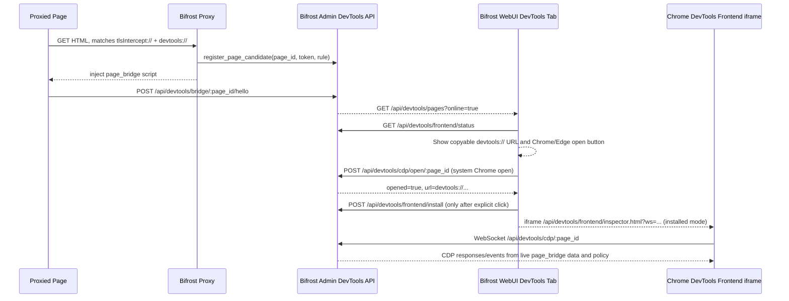
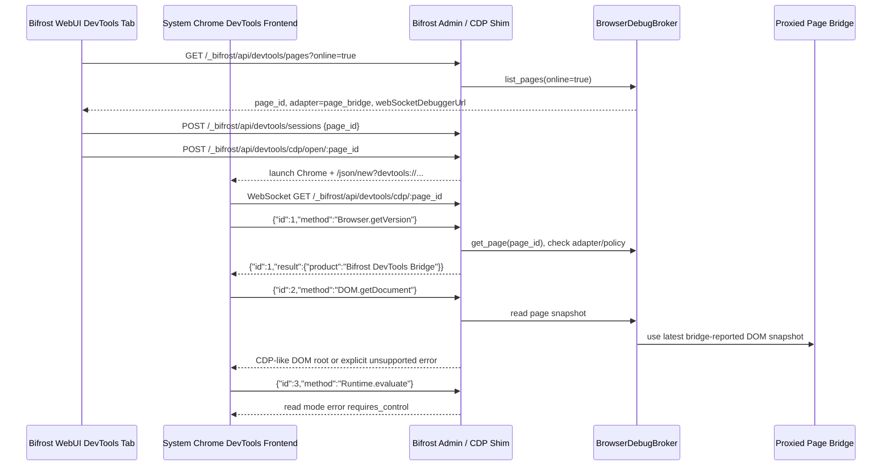

# Browser DevTools Remote Control 集成调研

> 状态：M1 实现中
> 日期：2026-04-28
> 范围：当页面流量经过 Bifrost 代理并命中显式 `devtools://` 规则时，发现并打通远端页面控制通道，提供 Chrome DevTools / Safari Web Inspector 等浏览器调试能力。

## 背景与目标

Bifrost 已经能接管经过代理的 HTTP/HTTPS 请求、TLS MITM、WebSocket/SSE 长连接、流量记录和远程调用。下一步可以把这些能力组合成“显式规则开启的代理页面级 Browser DevTools 控制”：

- 任何真实经过 Bifrost 代理、且命中显式 `devtools://` 规则的浏览器页面都会进入 DevTools 可发现集合。
- 目标设备上的 Bifrost 自动把代理可见的页面请求与浏览器调试 target 关联：桌面 Chrome 用 CDP，iOS/iPadOS Safari 用 Safari/WebKit Inspector adapter。
- Caller 通过 Bifrost 的本地 admin/remote invoke 通道获取一个受授权、可审计、可撤销的浏览器调试会话。
- 上层可以执行页面截图、DOM/CSS/Console/Network/Runtime/Page/Input/Debugger 等能力；不同浏览器 adapter 按实际协议能力声明支持矩阵。

非目标：

- 不把 Chrome remote debugging port 直接暴露到公网或局域网。
- 不默认接管用户主 Chrome profile。
- 不假设所有移动浏览器都支持 CDP；Safari/iOS 优先走 WebKit/Safari Inspector，未启用系统调试能力时走受限 `page_bridge` 降级通道。
- 不把所有调试协议 domain 无条件开放给远端调用方；“经过代理 + 命中 `devtools://`”只代表可发现，不代表自动可控制。
- 不用 HTML 注入脚本替代原生浏览器调试能力。M1 的 `page_bridge` 是移动 Safari 等无系统调试授权场景的降级通道，会通过受控 CDP shim 接入 Chrome DevTools frontend，但必须明确标注 capability 缺口。
- 不把 Chrome DevTools frontend 的 20M+ 编译产物放进仓库或安装包。M1 只内置版本号、下载地址和静态资源托管逻辑，用户首次在 WebUI 点击安装时才缓存到 `BIFROST_DATA_DIR/admin/devtools-frontend/`。

## 外部协议事实

- Chrome DevTools Protocol 通过 HTTP endpoint 暴露浏览器和页面目标。`/json/version` 返回 browser 级 `webSocketDebuggerUrl`，`/json/list` 返回 page target 列表，`/json/protocol` 返回当前 Chrome 实例支持的协议 JSON。官方文档同时说明 `--remote-debugging-port=0` 时端口会写入 profile 下的 `DevToolsActivePort` 文件。
- CDP Target domain 是页面发现、多 target 附着和子 target 自动附着的核心。`Target.attachToTarget` 支持 `flatten`，后续命令通过 `sessionId` 路由；`Target.setAutoAttach` 可跟随 iframe、worker 等相关 target。
- Chrome 从 136 开始不再允许 `--remote-debugging-port` / `--remote-debugging-pipe` 作用于默认 Chrome data directory，必须配合非默认 `--user-data-dir`。自动化场景官方建议使用 Chrome for Testing 或独立 profile。
- Chrome extension 的 `chrome.debugger` 也是 CDP transport，但它要求扩展声明 `debugger` 权限，并且可用 domain 受 Chrome 限制。它适合作为“附着现有用户浏览器”的备选路径，不适合作为首版唯一方案。
- iOS/iPadOS Safari 的原生页面调试走 Safari Web Inspector。Apple 的 Inspecting iOS 文档描述了在 Safari Develop 菜单中按 iOS/iPadOS 设备与 App 分组选择可检查页面。因此移动 Safari 不是 CDP target，需要独立的 Safari/WebKit adapter，并且通常要求目标侧存在能与设备配对/通信的 Apple 调试环境。

参考：

- https://chromedevtools.github.io/devtools-protocol/
- https://chromedevtools.github.io/devtools-protocol/tot/Target/
- https://developer.chrome.com/blog/remote-debugging-port
- https://developer.chrome.com/docs/extensions/reference/api/debugger
- https://developer.apple.com/documentation/safari-developer-tools/inspecting-ios

## 当前 Bifrost 可复用能力

- 规则协议已有 `Http`、`Https`、`Ws`、`Wss`、`HtmlAppend`、`JsAppend`、`Decode`、`TlsIntercept` 等类型。DevTools 应作为明确的控制类规则协议接入：只有命中 `devtools://` 的代理页面才进入远程控制集合。见 `crates/bifrost-core/src/protocol.rs`。
- Admin router 已有 `/api/rules`、`/api/traffic`、`/api/websocket/connections`、`/api/push`、`/api/remote-invoke` 等通道，可新增 `/api/devtools/*` 与前端推送事件。见 `crates/bifrost-admin/src/router.rs`。
- Proxy WebSocket 捕获链路已经能解压、记录、decode WebSocket frame，并关联 traffic/rule/request context。CDP 也是 WebSocket JSON-RPC，可以复用帧存储、连接监控和 push 机制，但 CDP control plane 不应混在普通业务 WebSocket traffic 中。见 `crates/bifrost-proxy/src/proxy/http/websocket/capture.rs`。
- Remote Invoke 已有 relay、grant、call frame、stream frame、加密 payload、历史记录和撤销能力。Browser DevTools 远程控制应复用这条通道，新增 `remote_devtools_read` / `remote_devtools_control` scope，而不是单独暴露浏览器调试端口。见 `crates/bifrost-admin/src/remote_invoke/*`。
- 已有 Computer Use RFC 把 GUI 控制放进 remote invoke 的授权模型。CDP 应作为比 Computer Use 更结构化、更低风险的浏览器专用能力：能用 CDP 时优先用 CDP，只有 CDP 不可达时才退回截图/点击。

## 推荐架构

```
Caller Web/CLI
  |
  | /_bifrost/api/devtools/sessions
  | or remote invoke devtools.*
  v
Bifrost Admin
  |
  | local: loopback CDP websocket
  | remote: encrypted relay call stream
  v
Browser Debug Broker (target side)
  |
  | Chrome CDP / Safari Web Inspector adapter
  v
Chrome / Safari on proxied device / WebKit target
  |
  | Target discovery / page inspection session
  v
Page target for proxied page
```

### M1 WebUI 与 Chrome DevTools frontend 集成

M1 不再自研一个“仿 DevTools”的主页面。WebUI `DevTools` tab 的主体验是官方 Chrome DevTools frontend，Bifrost 提供受控 CDP endpoint 和按需缓存的 frontend 静态资源：

1. `GET /_bifrost/api/devtools/frontend/status` 返回当前数据目录中是否已缓存 Chrome DevTools frontend。
2. `POST /_bifrost/api/devtools/frontend/install` 从 npm tarball 下载已包含 `front_end/inspector.html` 的 `chrome-devtools-frontend` 编译产物并解包到 `BIFROST_DATA_DIR/admin/devtools-frontend/chrome-devtools-frontend-<version>/`。注意：最新 npm 包可能是源码形态而非可直接托管的编译形态，不能只按 `latest` 盲目拉取。
3. WebUI 选择在线页面后默认展示轻量详情：页面标题、URL、在线状态、可复制的 `devtools://devtools/bundled/inspector.html?ws=...` 调试地址。
4. 如果检测到当前 WebUI 运行在 Chrome/Chromium/Edge 中，额外展示 `Open in Chrome DevTools` 按钮。由于普通网页直接跳转 `devtools://` 会被 Chrome 拦截为 `Not allowed to load local resource`，该按钮必须调用 Bifrost 本地 Admin API，由 Bifrost 启动真实 Chrome/Edge/Chromium，并通过该浏览器的本地 remote debugging `/json/new?devtools://...` 创建 DevTools target；这是默认推荐路径，零下载、零安装体积。
5. `GET /_bifrost/api/devtools/frontend/inspector.html?ws=<host>/_bifrost/api/devtools/cdp/<page_id>` 只在用户明确点击 `Install Chrome DevTools` 后托管官方 frontend 页面。
6. 安装过程中 WebUI 展示进度；安装成功后当前右侧区域切换为官方 Chrome DevTools frontend iframe。未点击安装前不得自动下载或托管大资源。
7. WebUI 侧边栏中 `DevTools` 是辅助调试入口，排序必须位于 `Scripts` 之后，避免与 `Network`、`Replay`、`Rules` 等主工作流入口竞争高优先级位置。

通信流程：



M1 CDP shim 覆盖 DevTools frontend 启动所需的基础 discovery/attach/enable/frame/document/runtime/context 方法；未实现的协议方法必须返回明确的 CDP error，不能静默成功。`mode=read` 下 `Runtime.evaluate` 返回 `requires_control`，避免官方 frontend 或第三方客户端绕过 Bifrost rule policy。

协议验收不能只验证 Chrome DevTools frontend “能打开”。`e2e-tests/tests/test_devtools_page_bridge_api.sh` 必须维护 `AV-CDP-20` 协议矩阵：在真实 `/_bifrost/api/devtools/cdp/:page_id` WebSocket 上逐项发送当前 shim 分支覆盖的 Browser/Target/Runtime/Page/DOM/CSS/Network/DOMStorage/IndexedDB/CacheStorage/Storage/Overlay/Debugger/Emulation 等方法，并区分四类预期：真实数据响应、Chrome frontend 兼容 no-op 响应、`screencast_disabled`、稳定 `unsupported CDP method`。新增或删除任何 shim method 时必须同步更新该矩阵，避免 UI 看起来连上但 Console、Elements、Network 或 Application 实际不可用。

page_bridge 页面身份不能只按 URL 合并：两个独立 tab 可以打开同一个 URL，必须显示为两个 target；同一个 tab reload 时必须替换旧 target。M1 使用页面端 `window.name` 命名空间保存 bridge tab id 做同 tab reload 去重，并通过周期 `hello` 心跳保活，避免仍在调试的页面因为一次性采集后超过 online cutoff 而从 WebUI Online Pages 消失。

注入了 bridge token 的 HTML 不能被浏览器缓存复用，否则新 tab 会复用旧 `page_id/token`，导致 target 身份错乱。M1 对命中 `devtools://` 且注入 bridge 的 HTML 响应设置 `Cache-Control: no-store, no-cache, must-revalidate, max-age=0` 与 `Pragma: no-cache`，确保每次 document load 都拿到新的 bridge 身份。

核心选择：

1. 在目标设备上引入 `BrowserDebugBroker`，负责浏览器 adapter 管理、target discovery、target 过滤、session multiplex、domain 权限检查和审计。
2. 新增 `ProxiedPageRegistry`，由代理请求链路持续登记“哪些浏览器页面经过了 Bifrost 且命中 `devtools://`”。页面发现以 traffic/page registry 与显式规则命中的交集为准。
3. 新增规则协议 `devtools://`，用于声明“匹配站点允许进入 DevTools 控制集合及其策略”，例如：

   ```text
   example.com tlsIntercept://
   example.com devtools://mode=control,domains=Page,Runtime,DOM,CSS,Network,Input
   * devtools://mode=read,domains=Page,DOM,CSS,Network
   ```

4. `devtools://` 是 control policy protocol，不修改请求/响应；规则命中后把该代理页面登记为 DevTools candidate，并设置该 origin/path 的控制策略。
5. 原生浏览器调试连接只在 target 侧建立：Chrome adapter 连接 loopback CDP endpoint，Safari adapter 连接本机可访问的 WebKit/Safari Inspector endpoint；跨设备传输走 Bifrost remote invoke 的加密 call stream。
6. Admin/Web UI 提供会话列表、target 列表、权限状态、连接状态、最近命令与审计入口；实际 CDP 消息由 broker 转发。

## 页面发现语义

默认目标：远程控制任何经过代理且被显式 `devtools://` 规则允许的页面。

“经过代理的页面”定义：

- 浏览器主文档请求经过 Bifrost，并命中 `devtools://` 规则，例如 `GET https://site-a.test/page` 的 `Sec-Fetch-Dest: document`、HTML `Content-Type`、或 direct navigation traffic 被记录。
- 页面子资源、XHR、fetch、WebSocket/SSE 经过 Bifrost 时，如果能关联到已有 document/page target，也可更新该 page 的活跃状态。
- 仅有后台 API 请求但没有可关联 document 的流量，不自动视为可控页面；它只是一条 traffic record。
- HTTPS 页面如果没有 TLS 解包，Bifrost 只能稳定识别 host/SNI/CONNECT，无法看到 path 和 document 内容；此时仍可做 host 级候选，但 path 级页面关联需要 `tlsIntercept://` 或浏览器调试 target URL 补充。

`ProxiedPageRegistry` 数据模型建议：

| 字段 | 说明 |
| --- | --- |
| `page_key` | Bifrost 生成的页面候选 ID |
| `origin` | 从代理请求或浏览器调试 target URL 提取的 origin |
| `url` | 最可信 URL；优先浏览器 target URL，其次代理 document request URL |
| `traffic_ids` | 与该页面相关的 traffic records |
| `process/app` | 代理可见的客户端进程/设备信息，优先识别 Chrome/Chromium/Chrome for Testing/Safari |
| `browser` | `chrome` / `safari-ios` / `safari-macos` / `unknown` |
| `debug_target_id` | 与浏览器调试 target 匹配成功后写入 |
| `last_seen_at` | 页面活跃时间 |
| `matched_devtools_rule` | 触发该页面进入控制集合的规则来源 |
| `control_state` | `discoverable` / `session_open` / `detached` / `denied` |

发现流程：

1. Proxy 记录 document-like request，并检查合并规则中是否命中 `devtools://`。
2. 只有命中 `devtools://` 的页面写入 `ProxiedPageRegistry`。
3. `BrowserDebugBroker` 周期性或事件驱动调用 adapter 的 target discovery。
4. Broker 用 URL origin/path、客户端 IP、进程/设备信息、时间窗口、可选 badge/page handshake 把 proxy page candidate 与浏览器 target 合并。
5. Admin API/Remote Invoke 返回“可发现页面”，并标注浏览器类型、adapter 状态、是否已匹配调试 target、是否缺少 TLS/path 信息。
6. 用户或 Agent 选择页面后打开 debug session；授权和 policy 决定可执行命令。

## 规则策略设计

新增 `Protocol::DevTools`，解析名 `devtools://`。这是页面进入 DevTools 控制集合的必要条件。

建议首版参数：

| 参数 | 默认值 | 说明 |
| --- | --- | --- |
| `mode` | `read` | `read` 只允许 Page/DOM/CSS/Network observe 等预定义只读命令；`control` 才允许 Input、Debugger、Runtime.evaluate |
| `domains` | policy 默认 | 允许的 CDP domain 白名单 |
| `target` | `proxied-origin` | 只允许 URL origin/path 与经过代理页面匹配的 page target |
| `auto_attach` | `true` | 使用 `Target.setAutoAttach(flatten=true)` 跟随 iframe/worker |
| `ttl` | `session` | 会话生命周期：一次页面、一次浏览器 session、固定分钟数 |
| `deny` | `false` | 显式禁止某个 origin/path 被远程控制，可用于覆盖更宽泛的 devtools 规则 |

规则行为：

- 没有 `devtools://` 规则时，页面不进入 DevTools 可发现/可控集合。
- 命中 `devtools://mode=read/control` 时，该页面进入候选集合，并设置该 origin/path 的能力上限。
- 命中 `devtools://deny=true` 时，该页面从可控集合中移除或显示为 denied；用于从 `* devtools://...` 这类宽泛规则中排除敏感站点。
- HTTPS 站点若需要 path 级策略，仍需要 `tlsIntercept://`，否则 CONNECT 阶段只能做 host 级策略。
- WebSocket/SSE 请求：不直接代表 page target，但可以作为同 origin 活跃信号，帮助把 traffic 与 target 关联。
- 多 tab 同站点：必须返回候选 target 列表，除非规则指定 `target=first-active` 或 `target=latest-active`。

## Browser Debug Broker 模块

新增 crate/module 建议：

- `crates/bifrost-admin/src/devtools/types.rs`
- `crates/bifrost-admin/src/devtools/broker.rs`
- `crates/bifrost-admin/src/devtools/adapters/chrome.rs`
- `crates/bifrost-admin/src/devtools/adapters/safari.rs`
- `crates/bifrost-admin/src/devtools/policy.rs`
- `crates/bifrost-admin/src/handlers/devtools.rs`
- 远程调用集成：`remote_invoke::devtools_ops`

职责：

1. Adapter discovery
   - `isolated` profile：由 Bifrost 启动 Chrome/Chrome for Testing，指定 `--remote-debugging-port=0 --user-data-dir=<BIFROST_DATA_DIR>/chrome-devtools/<session-id>`，读取 `DevToolsActivePort`。
   - 已存在 CDP endpoint：仅允许 `127.0.0.1` 或 unix/named pipe，且必须由用户显式配置。
   - 默认不支持主 profile remote debugging。
   - Safari/iOS：目标侧 Bifrost 检测是否存在 Safari Web Inspector 可用环境。首选 adapter 通过 Apple 官方调试栈或 WebKit Inspector bridge 发现已启用 Web Inspector 的 iPhone/iPad Safari 页面；若不可用，页面仍显示为 `adapter_unavailable`，并给出“需要开启 iOS Web Inspector / 与目标 Mac 配对 / 允许本机调试”的状态提示。

2. Target discovery
   - Chrome adapter 连接 browser websocket，调用 `Target.setDiscoverTargets` 与 `Target.getTargets`。
   - Safari adapter 通过 WebKit/Safari Inspector target list 获取 iOS/iPadOS Safari 页面。
   - 保留 URL 与 `ProxiedPageRegistry` 匹配的 `page` target；registry 只包含命中 `devtools://` 的代理页面。
   - 如果 target URL 没有对应代理流量，默认不暴露；用户显式开启“显示未经过代理的本地 target”时也只能本地可见，不能远程控制。
   - Chrome 对 iframe/worker 使用 `Target.attachToTarget(flatten=true)` 与 `Target.setAutoAttach(flatten=true)`；Safari adapter 按 WebKit Inspector 能力映射，不能假设 flat CDP session。

3. Session multiplex
   - 一个 browser websocket 对应多个 logical session。
   - 本地 API 使用 `session_id`；远程 invoke 使用 `call_id + devtools_session_id`。
   - 每条 debug command 记录：时间、caller、browser、target id、domain.method、参数摘要、返回摘要、错误码。

4. Policy guard
   - 根据 grant scope、全局 policy、可选 `devtools://` 策略、target origin/path 做多层判断。
   - `remote_devtools_read`：允许跨 adapter 的只读能力，例如截图、DOM/CSS 查询、console/network 观察；具体命令由 adapter capability matrix 映射。
   - `remote_devtools_control`：允许输入、导航、断点、Runtime evaluate 等会改变页面状态的能力，但需要显式用户授权。
   - 默认禁止影响整个浏览器或泄漏高敏数据的命令，例如 Chrome `Browser.*`、cookie/localStorage dump、下载路径修改、权限授予、文件系统相关 domain；Safari adapter 也必须按等价能力禁用。

5. Lifecycle
   - 页面不再经过代理或 Chrome target 关闭时，已有会话进入 grace period 后关闭。
   - `devtools://deny=true` 或策略收紧时，立即 detach 不再满足策略的 target。
   - grant 撤销时立即 detach target 并关闭跨端 stream。
   - Bifrost 停止时关闭 isolated Chrome profile。

## 平台差异无感化设计

目标：调用方不需要知道页面来自桌面 Chrome、Android Chrome、macOS Safari 还是 iOS Safari。调用方只面对 Bifrost 的统一页面调试模型；平台差异只出现在 capability、状态提示和少量不可避免的错误码里。

### 统一抽象层

对外只暴露四类稳定对象：

| 对象 | 含义 | 不暴露内容 |
| --- | --- | --- |
| `DebugPage` | 一个经过 Bifrost 代理且命中 `devtools://` 的页面 | 不暴露 CDP target / WebKit target 的原始连接细节 |
| `DebugSession` | 对 `DebugPage` 的一次授权调试会话 | 不要求调用方理解 CDP sessionId / WebKit connection id |
| `DebugCommand` | Bifrost 统一命令，如 `page.screenshot`、`runtime.evaluate`、`dom.query` | 不要求调用方直接发送底层协议 method |
| `DebugEvent` | Bifrost 统一事件，如 `console.message`、`network.request`、`page.navigated` | 不要求调用方处理不同协议事件命名 |

底层 adapter 可以保留 escape hatch：

```json
{
  "method": "devtools.command_raw",
  "adapter": "chrome_cdp",
  "raw": {
    "method": "Page.captureScreenshot",
    "params": {"format": "png"}
  }
}
```

但 raw command 默认只允许本地调试或高信任 scope，远程调用优先使用统一命令。

### Adapter Contract

每个浏览器平台实现同一个 trait/接口：

```rust
trait BrowserDebugAdapter {
    fn adapter_id(&self) -> &'static str;
    fn platform(&self) -> DebugPlatform;
    async fn probe(&self) -> AdapterStatus;
    async fn list_targets(&self) -> Result<Vec<NativeDebugTarget>>;
    async fn attach(&self, target: &NativeDebugTarget) -> Result<Box<dyn DebugSessionHandle>>;
    fn capabilities(&self) -> CapabilityMatrix;
    fn translate_command(&self, command: DebugCommand) -> Result<NativeCommand>;
    fn translate_event(&self, event: NativeEvent) -> Option<DebugEvent>;
}
```

首批 adapter：

| Adapter | 目标 | 连接方式 | 首版定位 |
| --- | --- | --- | --- |
| `chrome_cdp` | Chrome/Chromium/Chrome for Testing | loopback CDP websocket / pipe | 功能最完整的基准 adapter |
| `safari_webkit` | macOS Safari / iOS Safari | Safari/WebKit Inspector bridge | 移动 Safari 一等支持，能力按 WebKit 暴露 |
| `page_bridge` | 未启用原生调试能力的移动浏览器，包括 iOS Safari | Bifrost 注入的页面内 JS bridge | 不依赖系统 Web Inspector，受限降级，只做 console/DOM/runtime/network patch，不冒充完整 DevTools |

### Capability Matrix

统一 API 不承诺每个平台能力完全一样，而是先查询 capability：

```json
{
  "page_id": "pg_...",
  "browser": "safari-ios",
  "adapter": "safari_webkit",
  "capabilities": {
    "page.screenshot": "supported",
    "dom.query": "supported",
    "console.subscribe": "supported",
    "network.observe": "partial",
    "input.dispatch": "unsupported",
    "debugger.breakpoints": "partial",
    "runtime.evaluate": "requires_control"
  }
}
```

状态枚举：

| 状态 | 语义 |
| --- | --- |
| `supported` | 当前 adapter 原生支持 |
| `partial` | 支持核心能力，但字段、事件或参数不完整 |
| `requires_control` | 需要 `mode=control` 和远程授权 |
| `requires_local_setup` | 需要本机/设备准备，例如 iOS Web Inspector、设备配对 |
| `unsupported` | 当前平台不可用 |
| `fallback_available` | 可通过 `page_bridge` 做受限降级 |

### 统一命令命名

对外命令用稳定语义命名，不直接使用 CDP/WebKit method 名：

| Bifrost command | Chrome CDP adapter | Safari/WebKit adapter | 降级 bridge |
| --- | --- | --- | --- |
| `page.screenshot` | `Page.captureScreenshot` | Web Inspector screenshot 等价能力；不可用时返回 capability | DOM snapshot + viewport metadata，非真实截图 |
| `page.navigate` | `Page.navigate` | WebKit navigation 等价能力 | `location.href = ...`，需要 control |
| `runtime.evaluate` | `Runtime.evaluate` | WebKit runtime evaluate 等价能力 | control-only injected bridge evaluate，严格沙箱 |
| `dom.snapshot` | `DOMSnapshot.*` / `DOM.*` | WebKit DOM tree 能力 | `document.documentElement.outerHTML` |
| `console.subscribe` | `Runtime.consoleAPICalled` / `Log.*` | WebKit console event | monkey patch console，标记为 fallback |
| `network.observe` | `Network.*` | WebKit network timeline 能力 | PerformanceResourceTiming + fetch/XHR patch，partial |
| `input.dispatch` | `Input.*` | Safari adapter 若支持则映射；否则 unsupported | DOM event dispatch，默认不等价于真实输入 |

调用方逻辑：

1. `devtools.list_pages` 返回页面与 capability。
2. 调用方优先选择语义命令，例如 `page.screenshot`。
3. Broker 根据 adapter 翻译为底层协议。
4. 若能力不可用，返回结构化错误和可操作准备建议。

### 平台准备状态

平台差异必须体现在状态，而不是体现在调用方猜测：

| code | 场景 | 用户提示 |
| --- | --- | --- |
| `adapter_unavailable` | 当前机器没有可用 adapter | 安装/启用对应 adapter 或选择降级 bridge |
| `web_inspector_disabled` | iOS Safari 未开启 Web Inspector | 在 iPhone/iPad 设置中开启 Safari Web Inspector |
| `device_not_paired` | iOS 设备未与目标 Mac 配对 | 先完成设备信任/配对 |
| `target_not_found` | 代理页面存在，但原生调试 target 未发现 | 刷新页面或检查浏览器调试开关 |
| `capability_unsupported` | adapter 无此能力 | UI 灰显该操作并展示替代方案 |
| `raw_protocol_denied` | 远程请求 raw CDP/WebKit command | 使用 Bifrost semantic command 或提升本地调试权限 |

### 降级原则

降级必须诚实，不能把页面注入 bridge 包装成完整 DevTools：

- `chrome_cdp` / `safari_webkit` 可提供原生 DevTools 级能力。
- `page_bridge` 只能提供页面 JavaScript 可见范围内的能力，不能可靠提供真实网络栈、断点、浏览器权限、真实输入、跨 origin frame。
- UI/API 必须显示 `adapter=page_bridge` 和 `fidelity=fallback`。
- 安全策略仍然相同：页面必须经过代理、命中 `devtools://`、通过 grant/policy。

### 无系统调试能力的 Page Bridge

这是移动 Safari 的关键降级路径：用户不需要在 iOS 设置里开启 Web Inspector，也不需要把设备与 Mac 配对。只要页面流量经过 Bifrost、命中 `devtools://`，且 Bifrost 能修改 HTML 响应，就可以注入 bridge。

生效条件：

- HTTP 页面可直接注入。
- HTTPS 页面需要 Bifrost 能解密并重写响应，因此需要设备信任 Bifrost CA，并对目标 host 启用 `tlsIntercept://` 或等价 TLS 解包策略。
- 响应必须是可重写的 HTML document；非 HTML、streaming、下载、CSP 极端限制场景可能只能部分启用。
- 页面必须允许 bridge 与 Bifrost 建立回连。优先使用同源注入的 `/_bifrost/page-bridge/<page_id>` WebSocket/SSE endpoint，避免跨域 CORS；必要时通过代理把该路径映射到 Bifrost admin。

注入内容：

```html
<script id="__bifrost_devtools_bridge__">
  // 建立 page_id 绑定、心跳、命令分发、事件上报。
</script>
```

Bridge 能力：

| 能力 | 可实现程度 | 说明 |
| --- | --- | --- |
| `console.subscribe` | 高 | monkey patch `console.*`，上报后再调用原函数 |
| `runtime.evaluate` | 中 | 在页面 JS 上下文执行；首版整体归入 control scope，不尝试静态证明表达式只读 |
| `dom.query` / `dom.snapshot` | 高 | DOM/CSSOM 查询、outerHTML、computed style |
| `dom.mutate` | 中 | 修改 DOM/style，属于 control 能力 |
| `network.observe` | 中/低 | 可 patch `fetch`/`XMLHttpRequest`；无法看到注入前请求、浏览器原生导航请求、图片/css 等全部资源 |
| `storage.inspect` | 中 | 只能读取页面 JS 可访问的 localStorage/sessionStorage/cookie；默认敏感，需显式授权 |
| `page.screenshot` | 低 | 不能原生截屏；可返回 DOM snapshot、viewport、关键元素 box，或用 html2canvas 类能力但必须标记为 synthetic |
| `input.dispatch` | 低 | 只能派发 DOM event，不等价于真实用户输入；不能绕过浏览器 trusted event 限制 |
| `debugger.breakpoints` | 不支持 | 无法暂停 JS 引擎或设置原生断点 |
| `network.blocking` | 不支持/另走代理 | 页面内 bridge 不能可靠阻断所有网络；可由 Bifrost 代理规则实现请求拦截 |

Bridge 与原生 adapter 的关系：

- 如果 `safari_webkit` 可用，默认使用原生 adapter，`page_bridge` 作为补充事件源。
- 如果 `safari_webkit` 不可用，但 bridge 注入成功，页面显示为 `adapter=page_bridge`、`fidelity=fallback`、`native_debug=unavailable`。
- 如果二者都可用，可以双通道合并：原生 adapter 提供截图/DOM/网络/断点，bridge 提供更稳定的业务埋点、console 补充或页面内 helper。

安全要求：

- Bridge token 必须与 `page_id`、traffic record、devtools rule、grant 绑定，短 TTL，页面关闭后失效。
- Bridge command 必须经过同一套 policy guard；不能因为它是页面脚本就绕过 `remote_devtools_read/control`。
- 注入脚本必须进行 HTML/JS 转义，不能把规则文本或用户输入拼成可执行脚本。
- Bridge 不应默认暴露 cookie/localStorage；这些能力需要显式 domain 白名单与 control scope。
- 所有 bridge command/event 都要进入审计，并标记 `adapter=page_bridge`。

### 调用方体验

对 CLI/Web/远程 Agent 的理想体验：

```bash
bifrost devtools pages
bifrost devtools screenshot <page_id> --out page.png
bifrost devtools eval <page_id> "document.title"
```

不需要调用方指定 `--cdp` 或 `--webkit`。只有排障时才显示 adapter 细节：

```bash
bifrost devtools pages --verbose
# page_id  browser      adapter         capability      status
# pg_1     safari-ios   safari_webkit   partial         device_not_paired
# pg_2     chrome       chrome_cdp      full            ready
```

Web UI 同理：默认展示页面和可用操作；不可用操作灰显并给出准备步骤。这样用户感知的是“这个被代理页面能不能调试、能调试哪些能力”，不是“这个浏览器属于哪套底层协议”。

## WebUI DevTools Tab 设计

这是用户感知的主入口。Bifrost WebUI 应新增一级 `DevTools` tab，目标体验是：用户打开 WebUI，看到所有在线且命中 `devtools://` 的页面，点选一个页面后即可像使用 Chrome DevTools 一样调试。

### 成熟方案复用策略

不能只选一个现成项目直接覆盖所有场景。推荐采用“双轨复用”：

1. `chrome_cdp` native 模式：复用 Chrome DevTools frontend。
2. `page_bridge` fallback 模式：复用移动页面内调试组件的思想或部分 UI/插件，例如 Eruda/vConsole，但通过 Bifrost bridge 接管远程传输、权限、审计和页面列表。

可复用选项：

| 方案 | 适用范围 | 优点 | 限制 | 建议 |
| --- | --- | --- | --- | --- |
| Chrome DevTools frontend | Chrome/Chromium CDP target | 最接近 Chrome DevTools 原生体验；Elements/Console/Network/Sources 完整 | 主要面向 CDP；体积大；不是普通 React 组件；与 Bifrost 权限/多页面/adapter 状态集成成本高 | 用 iframe 或独立 route 承载，作为 `chrome_cdp` 的 native workspace |
| Chrome 提供的 `/devtools/inspector.html` | 正在运行的 Chrome remote debugging endpoint | Chrome 官方 endpoint 已提供前端入口 | 只能连 CDP websocket；不适合 Safari/page_bridge；直接暴露 WS 有安全问题 | 不直接暴露原始 endpoint，经 Bifrost broker 生成受控 websocket |
| Eruda | 移动 Web 页面内调试 | MIT，移动端成熟，console/DOM/network/storage 插件生态 | 页面内 JS 能力，不是原生 DevTools；无法断点/真实截屏/完整网络 | 可作为 `page_bridge` UI/能力参考，或选择性内嵌插件 |
| vConsole | 移动 Web 页面内调试 | MIT，轻量、可扩展，日志/网络/元素/storage/JS command | 同样是页面内能力，远程控制和审计需要 Bifrost 自己实现 | 可作为 `page_bridge` 的轻量 fallback 基座 |
| 自研 Bifrost DevTools shell | 跨 Chrome/Safari/bridge | 能统一 adapter、Traffic、权限、审计、页面列表 | 初期功能不如 Chrome DevTools frontend 完整 | 必须有，作为所有 adapter 的统一外壳 |

推荐落地方式：

- WebUI `DevTools` tab 的外壳自研：Online Pages、target bar、adapter 状态、grant、Traffic 联动、Capabilities 面板必须是 Bifrost 自己控制。
- 对 `chrome_cdp` 页面，右侧 workspace 可以提供 “Open native DevTools” 模式，把 Chrome DevTools frontend 嵌入 iframe 或新窗口。Bifrost broker 对外模拟受控 CDP websocket，只转发 policy 允许的命令。
- 对 `safari_webkit` 页面，不能直接使用 Chrome DevTools frontend，除非做复杂协议兼容层；首版用 Bifrost 自研面板映射 WebKit 能力更稳。
- 对 `page_bridge` 页面，复用 Eruda/vConsole 的插件思路，但 UI 不应直接在被调试手机页面上成为唯一入口；Bifrost WebUI 仍是主控台，手机页面中的 bridge 只负责采集和执行。

Chrome DevTools frontend 集成注意点：

- 官方 CDP 文档说明 remote debugging endpoint 会提供 `/devtools/inspector.html` 和 page target websocket；Chrome DevTools frontend 是围绕这些 CDP endpoint 工作的。
- `chrome-devtools-frontend` npm 包存在，但包体很大，不能直接提交 tarball，也不应默认打进 Bifrost 安装包。默认交付只提供受控 CDP discovery/WebSocket endpoint 与 `devtools://devtools/bundled/inspector.html?ws=...` 系统 Chrome DevTools 打开入口；若后续要内嵌 frontend，必须做按需下载/缓存或独立可选资源包，并有体积门禁。
- Bifrost 不应让 DevTools frontend 直连真实 Chrome debug port；应连接 Bifrost broker 暴露的 session websocket，以便执行 origin、scope、method 级鉴权和审计。
- 对 `page_bridge`，不要试图让 Chrome DevTools frontend 直接工作；bridge 不具备完整 CDP 语义。若要复用 Chrome DevTools UI，需要实现一个“伪 CDP target”，成本高且容易给用户造成能力误导。

当前 M1 已打通的是“Chrome DevTools frontend 能连接的受控 CDP 入口”，不是完整 Chrome DevTools frontend parity：

1. WebUI 选择页面后展示 `webSocketDebuggerUrl=ws://<bifrost-host>/_bifrost/api/devtools/cdp/<page_id>`。
2. WebUI 生成 `systemChromeFrontendUrl=devtools://devtools/bundled/inspector.html?ws=<bifrost-host>/_bifrost/api/devtools/cdp/<page_id>`；复制地址后用户可手动粘贴到 Chrome/Edge 地址栏。点击 `Open in Chrome DevTools` 时，WebUI 调用 `POST /_bifrost/api/devtools/cdp/open/:page_id`，由 Bifrost 启动真实 Chrome/Edge/Chromium 并通过 Chrome remote debugging 创建该 `devtools://` target，避免普通网页直接打开 `devtools://` 被浏览器安全策略拦截。
3. Chrome DevTools frontend 发出的 JSON-RPC 消息只进入 Bifrost 的受控 CDP websocket，不会直连真实浏览器或移动设备。
4. Bifrost CDP shim 按 policy 和 adapter capability 处理命令；M1 已支持 discovery、version、target info、enable、DOM document skeleton、read mode 下 `Runtime.evaluate` 拒绝等最小验证路径。
5. 对移动 Safari / 无系统调试能力页面，真实数据源来自 `page_bridge` 上报的 hello、console、DOM snapshot。完整 Elements/Console/Network 面板体验需要继续扩展 `page_bridge_cdp_shim` 的 CDP domain 映射。

Chrome DevTools frontend 使用 `Target.attachToTarget(flatten=true)` 后，会在后续 CDP request 顶层携带 `sessionId`。Bifrost CDP shim 必须在对应 response 与事件中原样带回同一个 `sessionId`，否则 Chrome frontend 会把响应视为不属于当前 target，表现为 DevTools 已打开但面板长期空白、只能看到页面 URL。M1 shim 还需要把 page_bridge 上报的真实页面数据映射到 CDP domain：`DOM.getDocument` 返回页面端序列化的 DOM tree，`CSS.getInlineStylesForNode` / `CSS.getComputedStyleForNode` 返回可供 Styles/Metrics 面板消费的真实 inline style 与基础盒模型字段，`Runtime.enable` 推送 console buffer，`Network.enable` 推送 bridge 捕获的资源/fetch/XHR 事件，`DOMStorage.getDOMStorageItems` 返回页面端 local/session storage snapshot。页面端必须采用变化驱动同步：初始 hello 上报一次 DOM，之后仅在 MutationObserver 合并到真实 DOM 结构变化时重传 DOM，network/storage 只在新资源或存储快照变化时同步；禁止周期性整页 DOM 重传，避免 Chrome Elements 树被反复重建导致选中节点抖动。DOM 同步必须过滤 Bifrost 自己注入的 bridge/overlay 节点，属性变化、style/class 抖动和 overlay 线框更新不允许触发 `DOM.documentUpdated`；外部页面 childList 结构变化才触发整树刷新，且刷新前使用 DOM tree 签名去重。Elements 选择体验通过 `Overlay.highlightNode` / `Overlay.hideHighlight` 走只读 overlay 队列投递到目标页，在目标页画线框并跟随 scroll/resize 更新，不需要 control mode，也不执行任意用户脚本。`mode=control` 下 `Runtime.evaluate` 必须通过 bridge 投递到真实页面执行；`mode=read` 下继续返回 `requires_control`。`Page.startScreencast` 明确返回 `screencast_disabled`，page_bridge 不再使用 canvas/html-to-image 同步近似画面，避免在 Chrome frontend 左侧展示低可信截图。Bifrost 托管的 embedded Chrome DevTools frontend 会在返回 `screencast/ScreencastApp.js` 时强制关闭 `screencastEnabled`、隐藏手机 toggle，并阻止 ScreencastView 创建；所有 frontend 静态资源按 `no-store` 返回，避免旧缓存继续露出左侧渲染区。

当前 M1 的 Chrome DevTools frontend 通信时序：



### Page Bridge 到 CDP 兼容层

可以做一个 `page_bridge_cdp_shim`，把移动 Safari 的 bridge 能力转换成 Chrome DevTools frontend 能理解的 CDP 子集，从而在 WebUI 右侧尽量复用 Chrome DevTools frontend，实现更一致的交互体验。

架构：

```
Chrome DevTools frontend
  |
  | CDP websocket (Bifrost controlled)
  v
page_bridge_cdp_shim
  |
  | Bifrost DebugCommand / DebugEvent
  v
page_bridge session
  |
  | injected JS bridge
  v
Mobile Safari page
```

关键点：

- shim 对 DevTools frontend 看起来像一个 CDP target，但它不是 Chrome。
- shim 只实现受限 CDP domains，并对不支持的命令返回标准 CDP error。
- shim 必须在 UI 上显示 `adapter=page_bridge`、`fidelity=fallback`，避免用户误以为这是完整 Chrome DevTools。
- shim 仍然走 Bifrost policy guard，不能因为 DevTools frontend 发来 raw CDP command 就绕过授权。

可映射 CDP 子集：

| CDP domain/method | page_bridge 映射 | 预期体验 |
| --- | --- | --- |
| `Runtime.enable` / `Runtime.consoleAPICalled` | console monkey patch + event buffer | Console 面板可用 |
| `Runtime.evaluate` | control-only bridge evaluate | Console 输入需要 control；read mode 只订阅 console event |
| `DOM.enable` / `DOM.getDocument` | DOM snapshot 转成 CDP-like node tree | Elements tree 基础可用 |
| `DOM.querySelector` / `DOM.getOuterHTML` | 页面内 DOM API | 节点搜索/HTML 查看可用 |
| `CSS.getComputedStyleForNode` | `getComputedStyle` | Styles/Computed 基础可用 |
| `Network.enable` | Bifrost Traffic DB + fetch/XHR patch | Network 面板部分可用 |
| `Log.enable` / `Log.entryAdded` | console/error bridge | Log 基础可用 |
| `Page.enable` / lifecycle events | bridge heartbeat/navigation detection | 页面生命周期基础可用 |

必须显式不支持或 partial 的能力：

| CDP domain/method | 处理方式 | 原因 |
| --- | --- | --- |
| `Debugger.*` | `MethodNotFound` 或 `unsupported` | 无法控制 JS 引擎断点/call stack |
| `Profiler.*` / `HeapProfiler.*` | unsupported | 无原生采样/堆快照 |
| `Input.*` | 默认 unsupported；可选 DOM event fallback | DOM event 不等价于 trusted input |
| `Page.captureScreenshot` | partial synthetic snapshot 或 unsupported | 页面 JS 无原生屏幕截图权限 |
| `Network.getResponseBody` | 仅对 Bifrost 已保存 body 或 patched fetch/XHR 可用 | 无法读取所有浏览器缓存/跨域响应 |
| `Security.*` / `Browser.*` | unsupported | 浏览器级权限/安全状态不可由页面 JS 提供 |
| `Target.*` 多 target | 仅返回当前 page target | bridge 只在单页面上下文内 |

实现策略：

1. 首版不要追求完整 Chrome DevTools frontend 全面可用，只让 Console、Elements、Network 三个面板达到“可用但标注 partial”。
2. shim 启动时返回定制的 `/json/protocol` 或 capability hints，尽量减少 DevTools frontend 调用未实现 domain。
3. 对未实现命令返回稳定错误：

   ```json
   {
     "id": 99,
     "error": {
       "code": -32601,
       "message": "CDP method Debugger.setBreakpointByUrl is unsupported by Bifrost page_bridge"
     }
   }
   ```

4. Bifrost WebUI 外壳仍然保留 Capabilities 面板和 fallback badge；即使右侧嵌了 Chrome DevTools frontend，也要让用户知道当前是 shim。
5. Network 面板最好由 Bifrost 自研面板优先承载，因为 Bifrost Traffic DB 比 page_bridge 更真实；CDP shim 的 `Network.*` 可以作为兼容补充。

推荐结论：

- 可以做 `page_bridge -> CDP shim -> Chrome DevTools frontend`，它能提升 Console/Elements 的体验一致性。
- 不应把它作为唯一 UI。Bifrost 自研 DevTools shell 仍然必须存在，用来展示在线页面、授权、capability、Traffic、fallback 状态。
- 技术上先做 Bifrost semantic command 面板，再做 CDP shim 更稳；否则会被 Chrome DevTools frontend 的大量 CDP domain 牵着走。

### 信息架构

```
DevTools
├── 左侧：Online Pages
│   ├── 搜索 / 过滤
│   ├── 页面卡片列表
│   └── adapter / capability / grant 状态
└── 右侧：Debug Workspace
    ├── 顶部 target bar
    ├── 面板 tabs
    │   ├── Elements
    │   ├── Console
    │   ├── Network
    │   ├── Sources
    │   ├── Application
    │   └── Capabilities
    └── 底部状态栏
```

左侧是“在线页面选择器”，右侧是“当前页面调试工作台”。切换页面时保留每个页面最近的面板状态、筛选条件和 console 输入历史。

### Online Pages 列表

页面来源：

- `GET /_bifrost/api/devtools/pages?online=true`
- WebSocket push：页面上线、离线、URL 变化、adapter 状态变化、capability 变化、session 关闭。

页面卡片字段：

| 字段 | 示例 | 说明 |
| --- | --- | --- |
| title | `Checkout - Example` | 优先来自 browser target 或 bridge 上报 |
| url | `https://m.example.com/pay` | 可复制，可跳转到 Traffic 过滤 |
| device | `iPhone 15 / Safari` | 来自客户端 IP、UA、adapter |
| adapter | `page_bridge` / `safari_webkit` / `chrome_cdp` | 以小标签展示 |
| fidelity | `native` / `fallback` / `partial` | 明确调试保真度 |
| rule | `mobile-debug` line 3 | 命中的 `devtools://` 规则来源 |
| traffic | `12 reqs` | 关联流量数量 |
| last seen | `3s ago` | 在线状态依据 |
| grant | `read` / `control pending` | 当前授权状态 |

列表交互：

- 搜索 URL/title/device。
- 过滤 adapter、fidelity、grant、online/offline。
- 点击页面卡片打开或恢复 session。
- 右键/更多菜单：复制 URL、复制 page id、打开 Traffic 关联视图、关闭 session、撤销授权。

空状态：

- 没有规则：提示创建 `* devtools://mode=read` 或目标站点规则。
- 有规则但没有在线页面：提示确认设备代理已连接、页面刷新、HTTPS 是否需要 `tlsIntercept://`。
- Safari 原生 adapter 不可用但 bridge 可用：展示 “Fallback bridge active”。
- bridge 也不可用：展示 `html_not_rewritable` / `html_streaming_or_too_large` / `csp_blocked` / `tls_not_intercepted` 的具体原因。

### Debug Workspace

顶部 target bar：

- 页面 title、URL、设备、adapter/fidelity、授权 mode、在线状态。
- 操作按钮：刷新页面、重新连接、关闭 session、升级到 control、打开关联 Traffic、复制诊断信息。
- 能力提示：如果当前是 `page_bridge`，显示清晰但不打扰的 fallback 标识；点击可展开能力矩阵。

面板设计：

| 面板 | native adapter | page_bridge fallback |
| --- | --- | --- |
| Elements | DOM tree、computed style、节点搜索、轻量编辑 | DOM snapshot/query、computed style、受限 DOM/style 修改 |
| Console | console events、eval、错误堆栈 | console monkey patch、受限 eval、注入后日志 |
| Network | 原生 network events + Bifrost traffic 合并 | Bifrost traffic 为主，fetch/XHR patch 为补充 |
| Sources | 脚本列表、断点、call stack | 显示不可用；可展示 inline scripts/source URL 与错误堆栈 |
| Application | storage/cookie/cache | 默认只读且敏感；bridge 仅显示 JS 可访问 storage |
| Capabilities | 当前 adapter 能力矩阵 | 同左，解释 partial/unsupported 原因 |

设计原则：

- 面板结构接近 Chrome DevTools，降低学习成本。
- 不可用能力不隐藏，灰显并说明原因，例如 “Requires native Safari Web Inspector”。
- Network 面板必须融合 Bifrost traffic，因为这是 Bifrost 的强项，也能补齐 bridge 看不到的请求。
- Console eval 默认禁用；切到 control mode 并授权前只允许查看 console events 和执行预定义只读查询。
- Sources/Debugger 在 fallback 下不伪装，明确显示 “Breakpoints are unavailable in page bridge mode”。

### 会话切换与多页面

会话模型：

- 一个 `DebugPage` 可以有 0 或 1 个 active local WebUI session。
- 切换页面时不销毁 session，进入 background attached 状态。
- 页面离线后保留最近 snapshot、console、network，状态变为 stale。
- 页面重新上线且 page identity 可匹配时自动恢复 session。

状态机：

| 状态 | UI 表现 |
| --- | --- |
| `discoverable` | 页面在线，可点击打开 |
| `attaching` | 右侧显示连接进度 |
| `attached` | 面板可用 |
| `fallback_attached` | 面板可用但显示 fallback fidelity |
| `permission_required` | 需要 grant/control 授权 |
| `adapter_unavailable` | 页面存在，但原生 adapter 不可用 |
| `bridge_unavailable` | 页面存在，但 HTML 不可注入或 bridge 未连上 |
| `stale` | 页面离线，展示最后快照 |
| `detached` | 会话关闭 |

### API 与前端状态

新增或扩展 API：

| API | 用途 |
| --- | --- |
| `GET /api/devtools/pages?online=true` | 页面列表 |
| `POST /api/devtools/pages/:page_id/session` | 打开/恢复 session |
| `GET /api/devtools/sessions/:id/snapshot` | 获取当前 DOM/console/network 初始快照 |
| `POST /api/devtools/sessions/:id/commands` | 发送统一 debug command |
| `GET /api/devtools/sessions/:id/events` | SSE 订阅事件 |
| `DELETE /api/devtools/sessions/:id` | 关闭 session |
| `POST /api/devtools/sessions/:id/grant-control` | 请求升级到 control |

前端状态建议：

- `useDevtoolsPages()`：订阅在线页面和 adapter 状态。
- `useDebugSession(pageId)`：管理 attach/detach/reconnect。
- `usePanelState(sessionId)`：保存当前 tab、过滤条件、选中节点、console history。
- `useCapability(pageId/sessionId)`：统一控制按钮是否可用。

### 与 Traffic 的联动

DevTools tab 不替代 Traffic，而是与 Traffic 双向打通：

- DevTools 页面卡片显示关联 traffic 数量。
- Network 面板底层优先使用 Traffic DB，按 `page_id` 聚合请求。
- Traffic detail 中显示 “Open in DevTools”。
- DevTools Network request 可跳转到 Traffic detail 查看原始 headers/body/timing/rule hit。

这样移动 Safari `page_bridge` 即使拿不到完整 native network events，也能通过代理层给用户一个接近 DevTools Network 的体验。

## 可执行实现蓝图

本节把方案压成可直接拆 PR 的模块边界。原则：先打通 `devtools:// -> page registry -> page_bridge -> WebUI DevTools tab` 的最小闭环，再逐步接 Chrome CDP、Safari WebKit 和 CDP shim。

### 后端文件落点

新增模块：

| 路径 | 职责 |
| --- | --- |
| `crates/bifrost-admin/src/devtools/mod.rs` | 模块导出与共享类型 |
| `crates/bifrost-admin/src/devtools/types.rs` | `DebugPage`、`DebugSession`、`DebugCommand`、`CapabilityMatrix`、错误码 |
| `crates/bifrost-admin/src/devtools/registry.rs` | `ProxiedPageRegistry`，记录命中 `devtools://` 的在线页面 |
| `crates/bifrost-admin/src/devtools/broker.rs` | `BrowserDebugBroker`，统一 session/adapter/policy 调度 |
| `crates/bifrost-admin/src/devtools/policy.rs` | scope、rule、capability、method 白名单判断 |
| `crates/bifrost-admin/src/devtools/page_bridge.rs` | bridge token、注册、命令分发、事件上报 |
| `crates/bifrost-admin/src/devtools/adapters/chrome.rs` | Chrome CDP adapter |
| `crates/bifrost-admin/src/devtools/adapters/safari.rs` | Safari/WebKit adapter，占位 + 状态探测 |
| `crates/bifrost-admin/src/devtools/cdp_shim.rs` | page_bridge -> CDP 子集兼容层 |
| `crates/bifrost-admin/src/handlers/devtools.rs` | Admin API handler |

修改模块：

| 路径 | 修改 |
| --- | --- |
| `crates/bifrost-admin/src/lib.rs` | 导出 `devtools` 模块 |
| `crates/bifrost-admin/src/handlers/mod.rs` | `pub mod devtools;` |
| `crates/bifrost-admin/src/router.rs` | `/api/devtools` 路由到 handler |
| `crates/bifrost-admin/src/state.rs` | `AdminState` 增加 `devtools_broker: Option<SharedBrowserDebugBroker>` |
| `crates/bifrost-core/src/protocol.rs` | 增加 `Protocol::DevTools` 与 parser/syntax 支持 |
| `crates/bifrost-core/src/syntax.rs` | Monaco/规则语法提示补 `devtools://` |
| `crates/bifrost-proxy/src/proxy/http/handler.rs` | document-like request 命中 `devtools://` 时注册 page candidate |
| `crates/bifrost-proxy/src/transform/response.rs` | HTML 可重写时注入 page bridge |
| `crates/bifrost-proxy/src/transform/badge.rs` | 复用安全转义/HTML 注入经验，避免脚本逃逸 |

### 前端文件落点

新增文件：

| 路径 | 职责 |
| --- | --- |
| `web/src/api/devtools.ts` | DevTools API client |
| `web/src/stores/useDevtoolsStore.ts` | 页面列表、session、capability、events 状态 |
| `web/src/pages/DevTools/index.tsx` | DevTools tab 主页面 |
| `web/src/pages/DevTools/index.module.css` | 稳定布局与密集工作台样式 |
| `web/src/pages/DevTools/components/OnlinePages.tsx` | 左侧在线页面列表 |
| `web/src/pages/DevTools/components/TargetBar.tsx` | 右侧顶部 target/status/action bar |
| `web/src/pages/DevTools/components/DebugWorkspace.tsx` | 面板容器 |
| `web/src/pages/DevTools/panels/ConsolePanel.tsx` | Console/evaluate/events |
| `web/src/pages/DevTools/panels/ElementsPanel.tsx` | DOM tree/style |
| `web/src/pages/DevTools/panels/NetworkPanel.tsx` | Traffic 聚合网络面板 |
| `web/src/pages/DevTools/panels/CapabilitiesPanel.tsx` | capability matrix 与准备步骤 |
| `web/src/pages/DevTools/native/ChromeDevToolsFrame.tsx` | Chrome DevTools frontend iframe/route 容器 |

修改文件：

| 路径 | 修改 |
| --- | --- |
| `web/src/App.tsx` | 增加 `<Route path="devtools" element={<DevTools />} />` |
| `web/src/components/Layout/index.tsx` | 侧边栏增加 DevTools 菜单项 |
| `web/src/components/IconSidebar/index.tsx` | 若仍被某些入口使用，同步 DevTools 菜单项 |
| `web/src/api/index.ts` | 导出 devtools API |
| `web/src/services/pushService.ts` | 订阅 devtools page/session 事件，或在 store 内独立 SSE |
| `web/src/components/TrafficDetail/index.tsx` | 增加 “Open in DevTools” 操作 |
| `web/src/pages/Traffic/index.tsx` | 网络表格上下文菜单增加 DevTools 入口 |

### 核心数据结构

Rust 初版类型：

```rust
#[derive(Debug, Clone, Serialize, Deserialize)]
pub struct DebugPage {
    pub page_id: String,
    pub title: Option<String>,
    pub url: String,
    pub origin: String,
    pub browser: DebugBrowser,
    pub adapter: DebugAdapterKind,
    pub fidelity: DebugFidelity,
    pub state: DebugPageState,
    pub matched_rule: Option<MatchedDevtoolsRule>,
    pub traffic_ids: Vec<String>,
    pub last_seen_at_ms: u64,
    pub capabilities: CapabilityMatrix,
    pub status_reason: Option<DebugStatusReason>,
}

#[derive(Debug, Clone, Serialize, Deserialize)]
pub struct DebugSession {
    pub session_id: String,
    pub page_id: String,
    pub adapter: DebugAdapterKind,
    pub mode: DevtoolsMode,
    pub state: DebugSessionState,
    pub opened_at_ms: u64,
}
```

前端对应类型放在 `web/src/api/devtools.ts`，字段名保持 snake_case 或在 API client 统一转换；建议直接沿用 snake_case，减少序列化摩擦。

### API Payload 初版

`GET /_bifrost/api/devtools/pages?online=true`

```json
{
  "pages": [
    {
      "page_id": "pg_01",
      "title": "Checkout",
      "url": "https://m.example.com/pay",
      "origin": "https://m.example.com",
      "browser": "safari-ios",
      "adapter": "page_bridge",
      "fidelity": "fallback",
      "state": "discoverable",
      "matched_rule": {"name": "mobile-debug", "line": 3},
      "traffic_ids": ["12345", "12346"],
      "last_seen_at_ms": 1777392000000,
      "capabilities": {
        "console.subscribe": "supported",
        "dom.snapshot": "supported",
        "runtime.evaluate": "requires_control",
        "network.observe": "partial",
        "debugger.breakpoints": "unsupported"
      },
      "status_reason": null
    }
  ]
}
```

`POST /_bifrost/api/devtools/pages/:page_id/session`

```json
{
  "mode": "read",
  "preferred_adapter": "auto"
}
```

`POST /_bifrost/api/devtools/sessions/:id/commands`

```json
{
  "command": "dom.snapshot",
  "params": {"depth": 4}
}
```

`GET /_bifrost/api/devtools/sessions/:id/events`

SSE JSON lines:

```json
{"type":"console.message","payload":{"level":"log","text":"ready"}}
{"type":"network.request","payload":{"traffic_id":"12345","url":"https://m.example.com/api"}}
```

### Page Bridge 注入闭环

1. 规则合并结果中出现 `devtools://`。
2. Proxy 识别主文档 HTML 响应。
3. `ProxiedPageRegistry::upsert_candidate()` 创建 `page_id` 和短期 `bridge_token`。
4. HTML 响应注入 `__bifrost_devtools_bridge__`，携带 `page_id`、`bridge_token`、bridge endpoint。
5. 页面 JS 建立 WebSocket/SSE：`/_bifrost/api/devtools/bridge/:page_id/connect?token=...`。
6. Bridge 上报 hello：title、url、userAgent、viewport、capabilities。
7. WebUI DevTools tab 收到 page online push，用户点击打开 session。
8. Console/DOM/Network 命令经 `BrowserDebugBroker` -> `page_bridge` 执行并审计。

### 关键工程决策

- 第一阶段不接真实 Chrome DevTools frontend，先完成 Bifrost 自研工作台 + page_bridge。这样能最快覆盖移动 Safari 无系统调试能力的关键需求。
- Chrome CDP adapter 作为第二阶段接入，因为它依赖本地 Chrome endpoint 管理和较多安全边界。
- `page_bridge_cdp_shim` 作为第三阶段高级兼容能力，避免早期被 Chrome DevTools frontend 的完整 CDP 面拖慢。
- Safari/WebKit 原生 adapter 可以和 CDP shim 并行 spike，但不阻塞 page_bridge 的移动端基础调试闭环。

### PR 拆分计划

| PR | 范围 | 主要文件 | 验收标准 |
| --- | --- | --- | --- |
| PR-1 | 规则协议与 registry | `protocol.rs`、`syntax.rs`、`devtools/types.rs`、`devtools/registry.rs` | `devtools://` 可解析；命中规则的 document request 可生成 page candidate |
| PR-2 | Page bridge 注入与连接 | `devtools/page_bridge.rs`、`handlers/devtools.rs`、proxy response transform | 移动 Safari/普通浏览器页面能注册 online，Console hello 可见 |
| PR-3 | DevTools Admin API + WebUI shell | `handlers/devtools.rs`、`web/src/api/devtools.ts`、`web/src/pages/DevTools/*` | WebUI DevTools tab 能列在线页面并打开 fallback session |
| PR-4 | Console/Elements/Network 面板 | `ConsolePanel`、`ElementsPanel`、`NetworkPanel`、Traffic 联动 | 可看 console、DOM snapshot、按 page_id 聚合 Traffic |
| PR-5 | Remote Invoke 接入 | `remote_invoke::devtools_ops`、grant scope、Recent Calls | 远程设备页面可被 relay 查询和执行 read command |
| PR-6 | Chrome CDP adapter | `adapters/chrome.rs`、Chrome endpoint 管理 | Chrome 页面 native session 可截图/console/DOM |
| PR-7 | page_bridge CDP shim | `cdp_shim.rs`、`ChromeDevToolsFrame.tsx` | Chrome DevTools frontend 兼容模式下 Console/Elements smoke 通过 |
| PR-8 | Safari/WebKit adapter spike | `adapters/safari.rs` | adapter 状态可探测；可用环境下能列出 iOS Safari target |

每个 PR 都必须同步更新 `design/`、自动测试和 `human_tests/chrome-devtools-remote-control.md` 对应用例状态。

### 阶段验收门禁

#### M0：规则与 registry 可用

必须完成：

- `devtools://` 语法解析、校验、Monaco 提示。
- 命中规则的 document request 生成 `DebugPage`。
- 未命中 `devtools://` 的页面不会进入 registry。

验证：

- 单元测试：
  - `test_parse_devtools_protocol_with_mode_domains`
  - `test_proxied_page_registry_records_document_request_with_devtools_rule`
  - `test_proxied_page_registry_ignores_document_without_devtools_rule`
- E2E：
  - 本地 HTML server + Bifrost 代理 + 规则命中，`GET /api/devtools/pages` 返回 page。
- human_tests：
  - `TC-CDP-01` 的页面发现部分。

#### M1：Page Bridge 最小闭环

必须完成：

- HTML 注入 bridge。
- Bridge hello/heartbeat。
- WebUI 能显示 online page。
- Console message 从手机 Safari 回到 WebUI。

验证：

- 单元测试：
  - `test_page_bridge_injection_requires_devtools_rule`
  - `test_page_bridge_capabilities_mark_native_gaps`
- E2E：
  - `devtools_mobile_safari_page_bridge_without_web_inspector`
- human_tests：
  - `TC-CDP-08`

#### M2：WebUI 工作台可用

必须完成：

- DevTools tab 一级入口。
- Online Pages + Target Bar + Console/Elements/Network/Capabilities 面板。
- 切换页面保留 session。
- Traffic detail 与 DevTools 双向跳转。

验证：

- 前端单元/组件测试：
  - `useDevtoolsStore` 状态流转。
  - capability 灰显逻辑。
- UI E2E：
  - `devtools_webui_select_online_page_and_debug`
- human_tests：
  - `TC-CDP-09`
  - `TC-CDP-10`

#### M3：远程调用可用

必须完成：

- `remote_devtools_read` / `remote_devtools_control` scope。
- relay command/query/event stream。
- Recent Calls 与审计。

验证：

- 单元测试：
  - scope/policy allow/deny。
  - command 审计脱敏。
- E2E：
  - `devtools_remote_relay_command`
  - `devtools_grant_revoke_detaches_session`
- human_tests：
  - `TC-CDP-05`

#### M4：Native adapters 与 CDP shim

必须完成：

- Chrome CDP adapter native session。
- page_bridge CDP shim Console/Elements smoke。
- Safari adapter 状态探测。

验证：

- E2E：
  - `devtools_local_capture_screenshot_for_ruled_proxied_page`
  - `devtools_page_bridge_cdp_shim_console_elements_smoke`
  - `devtools_mobile_safari_proxy_page_discovery`
- human_tests:
  - `TC-CDP-07`
  - `TC-CDP-11`

### 风险与先行 spike

必须先 spike 的问题：

1. HTML 注入可靠性：gzip/br/zstd、CSP、streaming HTML、`</script>` 转义、Content-Length 修正。
2. iOS Safari bridge 连接：设备代理访问 HTTPS 页面时，bridge endpoint 是否稳定同源可达。
3. page identity：同一移动设备多个 Safari tab 如何避免 page_id 混淆。
4. Traffic 聚合：document request、XHR/fetch、静态资源如何归属到同一 `page_id`。
5. WebUI 性能：Network 面板按 page_id 聚合时不能拖慢现有 Traffic 页面。
6. 安全：bridge token 泄漏、规则文本注入、Runtime evaluate 越权、storage 泄漏。

Spike 输出必须是可合并的小 PR 或 `design/` 附录，不接受只在聊天里记录。

## 可行性 Review 与防错补充

本节是进入实现前的强制 review 结论，用来防止把“可降级调试”误实现成“无条件完整 DevTools”。总体结论：

- `devtools://` 规则驱动的页面发现可行。
- 移动 Safari 无系统调试降级可行，但只对“经过 Bifrost 代理、响应可重写、bridge 可连接”的页面成立。
- 不开启系统 Web Inspector 时，无法获得 Safari 原生 Debugger、真实断点、真实页面截图、浏览器级 Input、完整 Service Worker/缓存视角。只能用 `page_bridge` 提供 Console、DOM snapshot、有限 runtime、XHR/fetch 观察和 Bifrost Traffic 聚合。
- Chrome DevTools frontend 可以复用，但不能作为第一阶段的产品壳。它适合 `chrome_cdp` 原生 adapter，或在 `page_bridge_cdp_shim` 中承载 Console/Elements 子集。fallback 模式必须稳定返回 unsupported，不能伪装成完整 CDP。

### 不可承诺能力

以下能力在 `page_bridge` 模式下首版明确不可承诺：

| 能力 | `page_bridge` 结论 | 原因 |
| --- | --- | --- |
| JS 断点、单步、call frame 修改 | unsupported | 页面脚本无法接入浏览器调试器内部 VM |
| 浏览器级 screenshot | unsupported | JS 无法读取跨域像素和浏览器合成结果 |
| 真实鼠标键盘输入 | unsupported 或 requires native | JS 只能派发非 trusted event |
| 完整 Network timeline | partial | 代理层可见网络，bridge 只能补充 fetch/XHR 和页面内 timing |
| Service Worker 内部请求 | partial | 若请求不经过代理或不经过 patched fetch/XHR，无法完整捕获 |
| Cookie/Storage 全量导出 | disabled by default | 高敏感数据，必须单独授权和审计 |
| 跨域 iframe 深度调试 | partial | Same Origin Policy 与 iframe sandbox 限制 |

WebUI 必须在 Capabilities 面板和每个禁用按钮上展示上述差异。任何 adapter 返回 unsupported 都应包含稳定 `reason`，例如 `requires_native_adapter`、`requires_control_scope`、`bridge_injected_too_late`。

### Page Bridge 前置条件

`page_bridge` 只有在以下条件同时满足时才算可用：

1. 请求必须经过 Bifrost 代理。
2. 请求必须命中显式 `devtools://` 规则。
3. HTTPS 页面必须已被 TLS intercept 解包，设备已信任 Bifrost CA。未解包的 CONNECT tunnel 只能产生 traffic 记录，不能注入 bridge。
4. 主文档响应必须是可重写 HTML。非 HTML、下载、WebSocket、SSE、视频流、过大 body、无法解码压缩体都不能注入。
5. 页面 CSP 必须允许 bridge 脚本执行，或规则显式允许 Bifrost 对 CSP 做最小改写。
6. bridge endpoint 必须从移动设备同源可达，且 token 未过期。

`DebugStatusReason` 至少需要覆盖：

| reason | 场景 | UI 提示 |
| --- | --- | --- |
| `tls_not_intercepted` | HTTPS 仍是 CONNECT tunnel | 需要配置 `tlsIntercept://` 和信任 CA |
| `html_not_rewritable` | 非 HTML 或内容不可解码 | 当前响应无法注入 bridge |
| `html_streaming_or_too_large` | chunked/streaming/超限 HTML | 需要刷新、关闭流式输出，或用 native adapter |
| `csp_blocked` | CSP 拦截 bridge | 需要显式允许 CSP relax，或使用 native adapter |
| `bridge_connect_failed` | 注入成功但未连上 | 检查设备代理、WebSocket/SSE 可达性 |
| `service_worker_cached` | 导航由 SW/cache 命中 | 需要 hard reload 或清理站点缓存 |
| `bridge_token_expired` | token 过期或重放 | 刷新页面重新建立会话 |
| `page_unloaded` | 页面关闭或导航 | 会话进入 stale |

实现上必须复用或抽取现有 badge 注入里的安全经验，尤其是脚本 JSON 转义、`</script>` 防逃逸和 body 长度修正。bridge 脚本应尽量早注入到 `<head>` 开始处，因为 Console monkey patch、fetch/XHR patch 和错误监听都需要早于业务脚本加载。若只能在 `</body>` 或 `</html>` 前注入，页面仍可上线，但状态必须标记 `bridge_injected_late`，Network/Console 只保证捕获注入后的事件。

当前代理侧已有 streaming/大响应判断逻辑，首版不要强行改成无界缓冲。若命中 `devtools://` 的 HTML 是 chunked 或被判定为 streaming，默认返回 `html_streaming_or_too_large`。只有在明确增加“有上限的 HTML buffering”并配套 E2E 后，才能对 chunked HTML 做注入。

### CSP 处理策略

CSP 是方案成败的关键，不能简单全局删除。

推荐规则参数：

| 参数 | 默认值 | 说明 |
| --- | --- | --- |
| `csp=respect` | yes | 不改写 CSP，若 bridge 被挡住则报 `csp_blocked` |
| `csp=relax` | no | 仅对命中 `devtools://` 的主文档最小改写 CSP，允许 Bifrost bridge 脚本 |
| `csp=report` | no | 只记录会被 CSP 挡住的风险，不改变页面 |

改写策略：

- 优先注入外部 bridge script，例如 `https://target-origin/__bifrost_devtools__/bridge.js?...`，由 Bifrost 在代理层拦截该虚拟路径返回脚本。
- 该虚拟路径必须是每个页面随机生成的不可预测 path prefix，不使用固定全局路径，避免和站点真实路由冲突。
- 若需要改写 CSP，只追加最小 `script-src` 允许项和必要的 `connect-src` 允许项，不删除原策略。
- `Content-Security-Policy-Report-Only` 不应被静默删除；可用于诊断。
- 所有 CSP relax 都必须写入 audit，并在 WebUI 上显示“页面安全策略已被本次 devtools 规则放宽”。

### 页面身份与多标签

不能用 `client_ip + url` 作为最终 page identity。移动设备同一浏览器多个 tab、同 URL 刷新、SPA navigation 都会导致误合并。

身份模型：

| 字段 | 作用 |
| --- | --- |
| `page_id` | Bifrost 分配的稳定调试页面 ID |
| `page_instance_id` | bridge 首次加载时生成并持久在当前 browsing context 的随机 ID |
| `navigation_id` | 每次 top-level document load 递增 |
| `rule_fingerprint` | 命中的 `devtools://` 规则摘要 |
| `document_traffic_id` | 触发候选页面的主文档 traffic ID |

规则：

- bridge hello 到达前，registry 中的记录只能是 candidate，不能作为可控制 session。
- 同一 URL 的两个 tab 必须产生两个不同 `page_instance_id` 和两个 `page_id`。
- 同一 browsing context 的 SPA navigation 保留 `page_id`，更新 URL 和 `navigation_id`。
- hard reload 可以复用 `page_id`，但必须重新签发 token；如果无法证明同一 browsing context，则创建新 `page_id`。
- 离线页面进入 stale，TTL 到期后清理；重连只能在 token、rule_fingerprint、page_instance_id 均匹配时恢复。

### 规则语义补充

`devtools://` 不是普通转发协议，而是调试授权开关。建议参数：

| 参数 | 示例 | 说明 |
| --- | --- | --- |
| `mode` | `read` / `control` | 当前规则允许的最高权限 |
| `adapter` | `auto` / `bridge` / `chrome_cdp` / `safari_webkit` | 选择或限制 adapter |
| `inject` | `auto` / `bridge` / `off` | 是否允许 HTML 注入 |
| `csp` | `respect` / `relax` / `report` | CSP 处理 |
| `domains` | `Console,DOM,Network` | 允许的协议域或 Bifrost 语义域 |
| `ttl` | `10m` | page/session 最大存活时间 |
| `deny` | `true` | 显式排除更具体的 origin/path |

推荐匹配行为：

- 更具体规则优先，`deny=true` 必须能关闭已发现页面并 detach 现有 session。
- `devtools://mode=control` 只是能力上限，不等于打开 WebUI 后直接可控制。远程调用或高风险命令仍需 grant/control 授权。
- 大范围 `* devtools://...` 必须在 UI 中显示风险提示，并支持用户配置 exclude/deny。

### 安全与审计防线

必须实现的安全约束：

- bridge token 绑定 `page_id`、`page_instance_id`、`rule_fingerprint`、`document_traffic_id`、客户端连接信息和短 TTL。
- token 一次性或可轮换，重放必须被拒绝并审计。
- bridge 只能连接 broker，不能自行声明更高 capability 或越权打开其他 page。
- WebUI command、Remote Invoke command、bridge event 都进入统一 audit envelope。
- `Runtime.evaluate` 首版归为 control scope。read mode 只允许预定义的只读命令，例如 DOM snapshot、computed style query、console subscribe。
- 不记录完整 eval 表达式、返回值、cookie、storage、headers body；默认只记录摘要、大小、hash 和截断 preview。
- Storage/Cookie/API key 类数据读取默认禁用，后续若开放必须单独 scope、二次确认和脱敏审计。
- 撤销 grant、删除/禁用规则、页面离线、token 异常都必须立即 detach session。

### WebUI 集成边界

WebUI 首版应采用 Bifrost 自有面板，不直接把 Chrome DevTools frontend 作为唯一入口：

- 自有面板可以准确表达 `page_bridge` partial 状态和 Bifrost Traffic 聚合，这是 Chrome DevTools frontend 不知道的上下文。
- Chrome DevTools frontend iframe 只作为 native CDP 或 CDP shim 的高级模式。
- iframe 必须隔离样式和权限，不能让 DevTools frontend 直接访问 Bifrost admin token 或任意 API。
- 页面列表全局订阅只推送轻量 page/status 事件；Console/Network/DOM 大事件只在用户选中页面并 attach session 后订阅，避免拖慢现有 WebUI。

### Remote Invoke 边界

远程 DevTools 不能绕过本地 WebUI/admin 授权：

- 新增 `RemoteDevToolsRead` 与 `RemoteDevToolsControl` scope。
- read/control 权限必须和 method whitelist 同时满足。
- relay 上传输截图、DOM snapshot、Network body 等大 payload 时必须有大小上限、分页或 chunking；超过上限返回明确错误。
- Recent Calls 只记录命令摘要和目标 page，不记录完整敏感数据。
- grant revoke 必须关闭 relay event stream 和本地 session。

### 实现顺序修正

为了降低误实现概率，建议把 M1 拆得更细：

| 子阶段 | 目标 | 不允许做的事 |
| --- | --- | --- |
| M1a | `devtools://` registry + no-injection discovery | 不开放任何 control 命令 |
| M1b | bridge 注入 + hello/heartbeat + status reason | 不做 eval |
| M1c | Console subscribe + DOM snapshot | 不做 storage/cookie |
| M1d | Traffic 聚合 Network 面板 | 不依赖 bridge 作为唯一网络来源 |
| M1e | `Runtime.evaluate` control-only | 不尝试静态判断表达式是否只读 |

只有 M1a-M1d 全部通过后，才进入 CDP shim 或 Chrome DevTools frontend 集成。否则前端体验会被协议兼容细节拖住。

## API 设计

本地 Admin API：

| API | 说明 |
| --- | --- |
| `GET /_bifrost/api/devtools/status` | BrowserDebugBroker 状态、adapter、profile、endpoint 安全检查 |
| `GET /_bifrost/api/devtools/pages` | 列出经过代理的页面候选与浏览器调试 target 关联状态 |
| `GET /_bifrost/api/devtools/targets?origin=https://example.com` | 列出经过代理且 policy 允许的 page targets |
| `POST /_bifrost/api/devtools/sessions` | 对 target 建立 browser debug session |
| `POST /_bifrost/api/devtools/sessions/:id/command` | 发送单条 debug command |
| `GET /_bifrost/api/devtools/sessions/:id/events` | SSE 订阅 debug events |
| `DELETE /_bifrost/api/devtools/sessions/:id` | detach 并关闭 session |

远程调用 method：

| method | scope | 说明 |
| --- | --- | --- |
| `devtools.list_targets` | `remote_devtools_read` | 查询可控制页面 |
| `devtools.open_session` | `remote_devtools_read` | 附着目标页面 |
| `devtools.command` | read/control 按 method 判定 | 发送浏览器调试命令，Chrome 透传/映射 CDP，Safari 透传/映射 WebKit Inspector |
| `devtools.subscribe_events` | `remote_devtools_read` | 流式返回事件 |
| `devtools.close_session` | `remote_devtools_read` | 关闭会话 |

Debug command envelope：

```json
{
  "method": "devtools.command",
  "session_id": "bdt_...",
  "target_id": "chrome-target-id",
  "protocol": "cdp",
  "command": {
    "id": 42,
    "method": "Page.captureScreenshot",
    "params": {"format": "png"}
  }
}
```

返回 envelope 保持底层协议 result/error，但外层补充 Bifrost metadata：

```json
{
  "ok": true,
  "session_id": "bdt_...",
  "browser": "chrome",
  "target_origin": "https://example.com",
  "result": {"data": "...base64..."},
  "audit_id": "..."
}
```

## 为什么不直接代理 Chrome debugging port

直接把 `127.0.0.1:9222` 或 Safari Inspector 端口经 Bifrost 暴露出去实现最短，但不优雅也不安全：

- CDP remote debugging endpoint 通常没有应用层认证，拿到 websocket 就等于拿到浏览器控制权。
- Chrome 136 已经明确收紧默认 profile remote debugging，说明该能力本身是高敏感面。
- 裸 TCP/WS 代理无法按 Bifrost grant 做 domain/method/target 级鉴权，也难以审计 `Runtime.evaluate`、`Network.getResponseBody` 等高风险命令。
- 无法把“用户配置的 `devtools://` 规则边界”强制投射到 CDP target 上，容易越权控制其他 tab。
- 更重要的是，用户目标是“通过明确规则控制任意经过代理的页面”，裸代理 Chrome port 无法证明某个 target 是否真的经过了 Bifrost，也无法证明它是否命中了 `devtools://` 授权规则。
- 对移动端 Safari，裸 Chrome CDP 代理根本不适用；必须通过 Safari/WebKit adapter 把 iOS Safari 页面映射成 Bifrost 统一 debug session。

因此首选 broker 模式：浏览器原生调试端口只在 target 侧可达，Bifrost 只暴露受控、按 adapter 映射的 DevTools 子集。

## 安全边界

必须默认启用的限制：

- Chrome endpoint 只能监听 `127.0.0.1` 或 pipe，不允许 `0.0.0.0`。
- 默认使用独立 user-data-dir，不复用用户主 profile。
- 默认只允许控制与 `ProxiedPageRegistry` 匹配的 page target；跨 origin iframe/worker 需独立 policy。
- 移动 Safari 必须证明页面来自已通过 Bifrost 代理接入的设备 IP/连接，并命中 `devtools://`；不能仅凭 Safari Inspector target list 暴露所有 iPhone 页面。
- “经过代理 + 命中 `devtools://`”是页面进入候选集合的必要条件，不是充分授权；远程 control 仍需要 grant scope 和 policy。
- 调试协议 method 白名单按 scope 和 adapter 拆分，敏感 domain 默认禁止。
- `Runtime.evaluate` 默认禁止或要求 `mode=control` + 用户确认；表达式与返回值只记录摘要，避免日志泄漏 secret。
- `Storage`、`Network.getCookies`、`Browser.grantPermissions`、`Page.setDownloadBehavior` 等能力首版禁用。
- 所有 command/event 都进入审计，和 Remote Invoke Recent Calls/Grants 可关联。
- 会话必须可撤销，撤销后立即 detach target。

## 与 Computer Use 的关系

优先级：

1. Browser DevTools adapter：结构化、可审计、可限定 origin/domain，适合网页控制。Chrome 用 CDP，Safari/iOS 用 WebKit/Safari Inspector adapter。
2. Computer Use：当页面不是 Chrome、CDP 不可用、或需要操作浏览器外部 UI 时使用。
3. HTML 注入：只用于页面内提示、轻量辅助脚本，不作为控制通道主路径。

这避免把网页自动化退化成截图点击，也避免把高权限浏览器控制藏在普通页面脚本里。

## 实施阶段

### Phase 0：最小本地 POC

- 新增 `BrowserDebugBroker`，首个 adapter 只支持手工配置 `BIFROST_CHROME_DEBUG_ENDPOINT=http://127.0.0.1:<port>`。
- 新增内存版 `ProxiedPageRegistry`，从已有 traffic record 中人工/测试方式登记命中 `devtools://` 的页面。
- Admin API 支持 list pages、list targets、open session、send command、close session。
- 只允许 `Page.captureScreenshot`、`DOM.getDocument` 等明确只读命令；`Runtime.evaluate` 仅在显式 control scope 的测试会话中开放。
- 不接 remote invoke，不启动 Chrome。

### Phase 1：代理页面发现 + Chrome adapter

- Proxy 在 document-like request 命中 `devtools://` 时写入 `ProxiedPageRegistry`。
- Bifrost 启动 isolated Chrome profile，读取 `DevToolsActivePort`。
- 支持 target origin 过滤、Target auto attach、会话 TTL。
- 新增 `Protocol::DevTools` 与 `devtools://` 解析/校验，作为页面进入控制集合的显式开关和 policy override。

### Phase 1.5：移动 Safari adapter

- 支持移动端设备通过 Bifrost 代理访问页面并命中 `devtools://` 后进入候选集合。
- 目标侧 macOS Bifrost 接入 Safari/WebKit Inspector target discovery，列出已启用 Web Inspector 的 iPhone/iPad Safari 页面。
- 用设备 IP、页面 URL、最近 document request 时间窗口把 iOS Safari target 与 `ProxiedPageRegistry` 合并。
- 若 Safari adapter 不可用，返回结构化状态：`safari_adapter_unavailable`、`web_inspector_disabled`、`device_not_paired`、`target_not_found`。

### Phase 1.6：Page Bridge 降级调试

- 在命中 `devtools://` 的 HTML document 响应中注入 `__bifrost_devtools_bridge__`。
- Bridge 连接 Bifrost page bridge endpoint，注册 `page_id`、URL、viewport、user agent、capability。
- 支持 console、DOM snapshot/query、control-only runtime evaluate、fetch/XHR observe 的最小能力集。
- UI/API 明确显示 `adapter=page_bridge`、`fidelity=fallback`，并把 screenshot/input/debugger/native network 等能力标为 partial 或 unsupported。
- 在移动 Safari 未开启 Web Inspector 时，仍能通过 bridge 提供基础调试体验。

### Phase 2：Remote Invoke 集成

- 新增 `GrantScope::RemoteDevToolsRead` / `RemoteDevToolsControl` 与 `CommandKind::DevTools`。
- 新增 `remote_invoke::devtools_ops`。
- 复用 encrypted call frame / stream frame 传输 debug command result 与 event stream。
- Recent Calls 记录 devtools command 摘要。

### Phase 3：Web UI 与高级能力

- Rules 页面支持 `devtools://` 参数编辑和提示。
- Traffic detail 中显示“该请求关联的代理页面 / page target / 打开 DevTools session”。
- 新增 DevTools Pages 页面，默认列出所有经过代理且命中 `devtools://` 的可发现页面，包含浏览器类型与 adapter 状态。
- DevTools 面板提供 console、network、DOM tree、storage、event stream；page_bridge 禁用 screenshot/screencast 图片同步。
- WebUI 新增一级 `DevTools` tab：默认用全屏 Online Pages 卡片列表展示所有可发现页面；点击卡片后导航到全屏 Debug Workspace，左上角返回按钮回到列表，支持页面切换、session 恢复、adapter capability 灰显、Traffic 双向跳转。
- 按 policy 逐步开放 Debugger/Input/Tracing 等能力。

## 测试方案

### 单元测试

- `test_parse_devtools_protocol_with_mode_domains`：验证 `devtools://mode=read,domains=Page,DOM` 解析为策略参数。
- `test_proxied_page_registry_records_document_request_with_devtools_rule`：验证 document-like 请求命中 `devtools://` 才会登记页面候选。
- `test_proxied_page_registry_ignores_document_without_devtools_rule`：验证没有 `devtools://` 时页面不进入候选集合。
- `test_devtools_policy_rejects_unproxied_or_unruled_target`：没有代理页面记录或没有明确规则时拒绝打开 target session。
- `test_devtools_policy_rejects_cross_origin_target`：代理页面是 `example.com` 时拒绝 `other.com` target。
- `test_devtools_policy_blocks_sensitive_storage_methods_by_default`：默认拒绝 `Storage.*` / cookie dump 类命令。
- `test_devtools_scope_read_rejects_input_dispatch_key_event`：read scope 下拒绝 `Input.dispatchKeyEvent`。
- `test_devtools_audit_redacts_runtime_evaluate_params`：审计只保留参数摘要。
- `test_safari_adapter_unavailable_reports_actionable_status`：Safari adapter 不可用时返回可读状态，不把页面误判为不可调试或已授权失败。
- `test_page_bridge_injection_requires_devtools_rule`：只有命中 `devtools://` 的 HTML document 才注入 bridge。
- `test_page_bridge_capabilities_mark_native_gaps`：bridge capability 中 screenshot/input/debugger/native network 标记为 partial/unsupported。
- `test_page_bridge_rejects_token_replay`：同一个 bridge token 被重复使用时拒绝连接并记录审计事件。
- `test_page_bridge_injection_reports_streaming_html`：chunked/streaming/超限 HTML 不做注入，返回 `html_streaming_or_too_large`。
- `test_page_bridge_csp_respect_reports_blocked`：`csp=respect` 下 CSP 拦截 bridge 时返回 `csp_blocked`，不静默放宽策略。
- `test_devtools_registry_distinguishes_same_url_tabs`：同一设备同一 URL 的两个 tab 生成不同 `page_id`，命令不会串到另一个 tab。
- `test_runtime_evaluate_requires_control_scope`：`Runtime.evaluate` 在 read scope 下被拒绝，只在 control scope 且授权通过后执行。
- `test_devtools_page_status_maps_to_ui_state`：后端 page/session 状态可稳定映射到 WebUI 的 `discoverable/attached/fallback_attached/stale` 等状态。
- `test_page_bridge_cdp_shim_rejects_unsupported_debugger_domain`：CDP shim 对 `Debugger.*` 返回稳定 unsupported error，不伪装成功。
- `test_page_bridge_cdp_shim_maps_runtime_console_and_dom_subset`：CDP shim 能把 Runtime console event 与 DOM snapshot 映射为 Chrome DevTools frontend 可消费的 CDP 子集。

### E2E 测试

- `devtools_local_capture_screenshot_for_ruled_proxied_page`：启动 isolated Chrome + 本地测试站点，配置 `* devtools://mode=read` 或目标站点 `devtools://mode=read`，页面经过代理后可通过 API 打开 session 并调用 `Page.captureScreenshot`，断言返回 PNG base64。
- `devtools_unproxied_tab_denied`：同一 Chrome 中打开一个未经过代理的 tab，断言该 target 不可远程控制。
- `devtools_no_rule_denied`：页面经过代理但没有 `devtools://` 规则时，不出现在远程可控集合。
- `devtools_policy_rule_can_deny_or_escalate_proxied_origin`：用 `* devtools://mode=read` 发现页面，再用更具体的 `devtools://deny=true` 禁止控制，或用 `devtools://mode=control` 提升该 origin 的能力上限。
- `devtools_remote_relay_command`：通过 remote invoke grant 调用 `devtools.list_targets` 与 `Page.captureScreenshot`，断言 relay frame/event 正常回传。
- `devtools_grant_revoke_detaches_session`：撤销 grant 后已有 session 关闭，后续 command 返回 permission denied。
- `devtools_mobile_safari_proxy_page_discovery`：iPhone/iPad Safari 通过 Bifrost 代理访问命中 `devtools://` 的页面，Bifrost 能在 DevTools Pages 中显示该页面和 Safari adapter 状态。
- `devtools_mobile_safari_page_bridge_without_web_inspector`：iPhone/iPad Safari 不开启 Web Inspector，通过 Bifrost 代理访问命中 `devtools://` 的 HTML 页面，bridge 注册成功，console/DOM/runtime 基础命令可用，页面显示 `adapter=page_bridge`。
- `devtools_page_bridge_no_rule_no_injection`：HTML 页面经过代理但没有命中 `devtools://` 时，响应中没有 bridge 脚本，也不会出现在 DevTools Online Pages。
- `devtools_page_bridge_csp_blocked_reports_status`：测试站点设置严格 CSP，默认 `csp=respect` 时 bridge 不可用且 WebUI/API 返回 `csp_blocked`；改为 `csp=relax` 后才允许注入。
- `devtools_page_bridge_same_url_tabs_are_isolated`：同一移动设备打开两个相同 URL tab，分别执行 console/DOM 命令，断言 page/session/traffic 不串联。
- `devtools_page_bridge_token_replay_denied`：抓取一次 bridge connect URL 后重复连接，断言第二次被拒绝并产生审计记录。
- `devtools_page_bridge_streaming_html_reports_unavailable`：chunked/streaming HTML 命中规则后不注入，页面状态显示 `html_streaming_or_too_large`。
- `devtools_webui_select_online_page_and_debug`：WebUI DevTools tab 展示在线页面，点击页面后打开 session，Console/Elements/Network 至少一个面板可用，adapter 不支持的面板灰显并说明原因。
- `devtools_page_bridge_cdp_shim_console_elements_smoke`：移动 Safari page_bridge 页面通过 CDP shim 打开 Chrome DevTools frontend，Console 和 Elements 基础功能可用，Debugger/Screenshot 显示 unsupported 或 fallback 提示。

### 自动验证用例定义

实现阶段必须把下面用例落成可重复执行的自动化资产。自动化用例是开发验收的主入口，不能只保留自然语言描述。

建议文件落点：

| 文件 | 用途 |
| --- | --- |
| `e2e-tests/rules/devtools/page_bridge_basic.txt` | `devtools://mode=read,inject=bridge,csp=respect` 基础规则 |
| `e2e-tests/rules/devtools/page_bridge_control.txt` | `devtools://mode=control,inject=bridge,csp=respect` 控制能力规则 |
| `e2e-tests/rules/devtools/page_bridge_csp_relax.txt` | `devtools://mode=read,inject=bridge,csp=relax` CSP 放宽规则 |
| `e2e-tests/rules/devtools/page_bridge_deny.txt` | 更具体 `devtools://deny=true` 覆盖规则 |
| `e2e-tests/mock_servers/devtools_site_server.*` | 提供 HTML、strict CSP、streaming HTML、XHR/fetch、console、DOM fixture |
| `e2e-tests/tests/test_devtools_page_bridge_api.sh` | Shell/Admin API 层自动验证，负责构建、启动、规则配置、API 断言 |
| `web/tests/ui/devtools-page-bridge.spec.ts` | Playwright WebUI 层自动验证，负责浏览器访问、WebUI 点击和面板断言 |
| `web/tests/ui/devtools-cdp-shim.spec.ts` | Chrome DevTools frontend/shim smoke，后续阶段启用 |

统一启动约束：

```bash
CARGO_TARGET_DIR=./.bifrost-devtools-target cargo build --bin bifrost
BIFROST_DATA_DIR="$(mktemp -d -t bifrost-devtools-e2e.XXXXXX)"
./.bifrost-devtools-target/debug/bifrost start -p "$BIFROST_PORT" --unsafe-ssl --no-system-proxy
curl -fsS "http://127.0.0.1:$BIFROST_PORT/_bifrost/api/proxy/address"
```

自动化脚本必须使用非 9900 随机空闲端口，必须设置临时 `BIFROST_DATA_DIR`，必须在退出时清理 Bifrost 进程、mock server 和临时目录。

#### AV-CDP-01：Page Bridge Happy Path + WebUI 全链路

目标：证明“启动代理 -> 配置规则 -> 浏览器访问目标页 -> 页面内 bridge 注入 -> WebUI DevTools 发现页面 -> 选择页面 -> Console/Elements/Network/Capabilities 可用”这条主链路真实可用。

前置 fixture：

- mock site 提供 `GET /devtools/basic.html`，页面包含：
  - `<title>Bifrost DevTools Basic</title>`
  - `<div id="debug-fixture" data-case="basic">ready</div>`
  - 页面加载时执行 `console.log("bifrost-devtools-basic-ready")`
  - 页面加载后执行 `fetch("/devtools/api/ping?case=basic")`

自动步骤：

1. 构建最新 `bifrost`，启动代理和 mock site。
2. 通过 Admin API 创建启用规则：目标 host/path 命中 `devtools://mode=read,inject=bridge,csp=respect`。
3. Playwright 新建 browser context，显式配置代理 `http://127.0.0.1:$BIFROST_PORT`。
4. 打开 `http://devtools-fixture.test:$SITE_PORT/devtools/basic.html?case=av-cdp-01`。
5. 在目标页断言：
   - `document.querySelector('script[id="__bifrost_devtools_bridge__"]')` 存在。
   - `window.__BIFROST_DEVTOOLS_BRIDGE__?.state` 最终为 `connected`。
   - `window.__BIFROST_DEVTOOLS_BRIDGE__?.page_id` 非空。
6. 通过 Admin API 断言 `GET /_bifrost/api/devtools/pages?online=true` 返回一条 URL 包含 `case=av-cdp-01` 的 page，且：
   - `adapter == "page_bridge"`
   - `fidelity == "fallback"`
   - `state in ["discoverable", "fallback_attached"]`
   - `matched_rule` 指向本用例规则。
7. 打开 WebUI `http://127.0.0.1:$BIFROST_PORT/_bifrost/`，点击侧边栏 `DevTools`。
8. 在全屏 Online Pages 卡片列表中搜索 `av-cdp-01`，点击对应卡片后进入全屏 Debug Workspace；需要切换页面时点击左上角返回按钮回到卡片列表。
9. 断言 Target Bar 显示：
   - title 为 `Bifrost DevTools Basic`
   - adapter 为 `page_bridge`
   - fidelity 为 `fallback`
   - online 状态为 connected/online。
10. 打开 Console 面板，断言出现 `bifrost-devtools-basic-ready`。
11. 打开 Elements 面板，触发 DOM snapshot，断言能看到 `#debug-fixture` 和 `data-case="basic"`。
12. 打开 Network 面板，断言出现 `/devtools/api/ping?case=basic`，并且该行有可跳转的 Traffic 详情入口。
13. 打开 Capabilities 面板，断言：
    - `console.subscribe` supported。
    - `dom.snapshot` supported。
    - `network.observe` partial。
    - `debugger.breakpoints` unsupported。
    - `page.screenshot` unsupported 或 partial synthetic，但不能显示 native supported。

验收断言：以上任一步失败都视为 DevTools 主链路未完成，不允许进入后续 adapter/CDP shim 开发。

#### AV-CDP-02：无 `devtools://` 规则时绝不注入

目标：证明页面经过代理但没有明确规则时，不会被监听、不会注入、不会出现在 WebUI。

自动步骤：

1. 启动代理和 mock site，不配置 `devtools://`，或只配置普通转发规则。
2. Playwright 通过代理打开 `/devtools/basic.html?case=av-cdp-02`。
3. 断言页面内不存在 `#__bifrost_devtools_bridge__` script。
4. 断言 `window.__BIFROST_DEVTOOLS_BRIDGE__` 未定义。
5. 断言 Admin API `devtools/pages` 不返回该 URL。
6. 打开 WebUI DevTools tab，断言 Online Pages 中没有该页面。

验收断言：无规则页面一旦出现 bridge 或在线 page，即为安全回归。

#### AV-CDP-03：WebUI 选择页面后调试功能符合权限

目标：证明 WebUI 不是只列页面，而是真的能按 read/control 权限驱动调试命令。

自动步骤：

1. 使用 `page_bridge_basic` 规则打开 `/devtools/basic.html?case=av-cdp-03`。
2. WebUI 选择该页面。
3. Console 面板中确认 console event 可见。
4. 在 read mode 下尝试执行 console expression `document.title`。
5. 断言 UI 显示 `requires_control` 或等价 permission denied，且后端审计记录命令被拒绝。
6. 通过规则/API 将该页面切换到 `mode=control`，或按产品流程点击“升级到 control”并完成授权。
7. 再次执行 `document.title`，断言结果为 `Bifrost DevTools Basic`。
8. 执行受限表达式 `document.querySelector("#debug-fixture").textContent = "changed"`，断言页面 DOM 和 Elements 面板快照都更新为 `changed`。

验收断言：read mode 不能执行 eval；control mode 能执行受限 eval 且有审计。

#### AV-CDP-04：Network 与 Traffic 双向联动

目标：证明 DevTools Network 不是纯 bridge 推测，而是能关联 Bifrost Traffic。

自动步骤：

1. 目标页加载后触发：
   - `fetch("/devtools/api/ping?case=av-cdp-04")`
   - 加载 ``
2. WebUI DevTools Network 面板过滤 `av-cdp-04`。
3. 断言 fetch 请求和图片请求都能在 Network 面板看到；fetch 可带 bridge metadata，图片至少来自 Traffic DB。
4. 点击 fetch 请求的 “Open in Traffic”。
5. 断言跳转到 Traffic detail，URL、method、status、matched rules 与 Network 行一致。
6. 在 Traffic detail 点击 “Open in DevTools”。
7. 断言回到同一个 `page_id` 的 DevTools session。

验收断言：Network 面板必须以 Traffic DB 为主数据源，bridge 只是补充。

#### AV-CDP-05：`deny=true` 关闭发现与已有 session

目标：证明宽泛监听规则可被更具体规则安全排除。

自动步骤：

1. 配置宽泛 `* devtools://mode=read,inject=bridge`，打开 `/devtools/basic.html?case=av-cdp-05`。
2. WebUI 选择页面并确认 session online。
3. 添加更具体 deny 规则，例如该 URL path 命中 `devtools://deny=true`。
4. 触发规则 reload 或刷新目标页。
5. 断言已有 session 收到 detached/denied 事件。
6. 断言 Online Pages 不再显示该页面，或显示为 denied 且不可打开。
7. 断言目标页刷新后不再注入 bridge。

验收断言：deny 生效必须同时影响 registry、bridge 注入和现有 session。

#### AV-CDP-06：CSP 默认尊重，显式 relax 才放宽

目标：证明 CSP 处理不会静默削弱页面安全策略。

自动步骤：

1. mock site 提供 `/devtools/csp-strict.html?case=av-cdp-06`，响应头包含严格 `Content-Security-Policy: script-src 'self'; connect-src 'self'`，且不允许当前 bridge 形式。
2. 使用 `csp=respect` 规则访问页面。
3. 断言 API/WebUI page 状态为 `csp_blocked`，审计不包含 CSP relax。
4. 切换为 `csp=relax` 规则，再次访问页面。
5. 断言 bridge connected。
6. 断言响应头只追加必要 `script-src` / `connect-src` 允许项，不删除原始 CSP。
7. 断言审计记录包含 `csp_relaxed=true`、rule、page_id、URL。

验收断言：默认不改 CSP；只有显式规则才允许最小 relax。

#### AV-CDP-07：Streaming/Chunked HTML 明确不可注入

目标：证明不可重写页面不会被误判为调试成功。

自动步骤：

1. mock site 提供 `/devtools/streaming.html?case=av-cdp-07`，使用 chunked/streaming 响应。
2. 配置 `devtools://mode=read,inject=bridge`。
3. Playwright 访问该页面。
4. 断言页面没有 bridge script。
5. 断言 Admin API/WebUI 对该 URL 返回 `html_streaming_or_too_large`。
6. 断言 Traffic 中仍能看到主文档请求。

验收断言：状态必须解释不可用原因，不能显示为 online 或静默失败。

#### AV-CDP-08：同 URL 双标签隔离

目标：证明 `page_id` 不会按 URL/IP 粗暴合并。

自动步骤：

1. 同一 browser context 打开两个 page，URL 都是 `/devtools/basic.html?case=av-cdp-08`。
2. 等待两个页面 bridge connected。
3. 断言两个页面的 `page_id`、`page_instance_id` 不同。
4. WebUI Online Pages 显示两个条目，title/URL 相同但 page id 不同。
5. 选择 page A，control mode 下修改 `#debug-fixture` 为 `tab-a`。
6. 断言 page A DOM 变为 `tab-a`，page B 仍为 `ready`。
7. Network/Console 面板切换 A/B 时只显示对应 page 的事件或明确标注 shared traffic 归属。

验收断言：任何命令串到另一个 tab 都是 P0 阻断。

#### AV-CDP-09：bridge token 重放拒绝

目标：证明注入 URL 或 token 泄漏后不能被重放接管页面。

自动步骤：

1. 打开 `/devtools/basic.html?case=av-cdp-09`，记录 bridge connect URL 或 token。
2. 等待页面首次 bridge connected。
3. 用测试客户端复用同一个 token 再连接一次。
4. 断言第二次连接返回 401/403 或 structured error `bridge_token_replay`。
5. 断言 WebUI 不新增第二个页面。
6. 断言审计记录 token replay/expired，且原页面 session 不被劫持。

验收断言：token 必须绑定页面实例并防重放。

#### AV-CDP-10：CDP shim 只暴露受支持子集

目标：证明 Chrome DevTools frontend 兼容模式不会假装完整 DevTools。

自动步骤：

1. 使用 page bridge 页面打开 CDP shim endpoint。
2. Chrome DevTools frontend 或协议客户端调用 `Runtime.enable`、`DOM.getDocument`，断言成功。
3. 调用 `Debugger.setBreakpointByUrl`、`Page.captureScreenshot`、`Input.dispatchMouseEvent`。
4. 断言返回 stable unsupported error，错误消息包含 `page_bridge` 和 unsupported reason。
5. WebUI Capabilities 面板同步显示这些能力 unsupported/partial。

验收断言：fallback shim 不允许“假成功”。

#### AV-CDP-11：真实移动 Safari 无系统调试降级验收

目标：覆盖核心产品诉求：移动 Safari 不启用 Web Inspector，只通过代理和规则获得基础调试能力。

自动化等级：

- CI 必跑：使用 Playwright WebKit + mobile UA 验证 page_bridge 语义、WebUI 流程和 API contract。
- 设备实验室可选自动：若存在 iOS Simulator，可用 `xcrun simctl openurl` 打开目标 URL，只通过 Bifrost API/WebUI 观察 page bridge，不使用 Web Inspector。
- human_tests 必跑：真实 iPhone/iPad Safari 连接 Bifrost 代理，按 `TC-CDP-08` 执行。

自动步骤（CI 版本）：

1. Playwright `webkit` context 使用移动 Safari UA、viewport 和 Bifrost HTTP proxy。
2. 打开 HTTPS fixture；若测试 TLS intercept，则设备/浏览器需信任测试 CA。
3. 断言 bridge connected，adapter 显示 `page_bridge`，fidelity 显示 `fallback`。
4. WebUI DevTools 选择该页面，验证 Console、Elements、Network、Capabilities 与 AV-CDP-01 一致。
5. 断言 Safari native-only 能力显示 unsupported，不要求 Web Inspector。

验收断言：CI 验证降级协议和 WebUI 行为；真实设备体验由 human_tests 补足，不能用 CI WebKit 冒充真实 iOS Safari 完整验收。

### 真实场景测试（human_tests 计划）

实现阶段必须新增 `human_tests/chrome-devtools-remote-control.md` 并更新 `human_tests/readme.md`，至少覆盖：

`human_tests` 用例必须复用上面的自动验证 fixture 和用例编号。人工/真实设备验证不是重新发明一套步骤，而是对 `AV-CDP-*` 自动化链路做真实用户感知确认，尤其覆盖真实 iPhone/iPad Safari。

- `TC-CDP-01`：本地 isolated Chrome 访问经过 Bifrost 代理的测试站点，配置 `* devtools://mode=read` 或目标站点 `devtools://mode=read` 后，Web UI 能列出目标页面并截图。
- `TC-CDP-02`：同一个 Chrome 中打开未经过代理的页面，该 tab 不出现在远程可控列表，或显示为 unproxied/denied。
- `TC-CDP-03`：read scope 下尝试 `Input.dispatchMouseEvent` 被拒绝，错误信息可读。
- `TC-CDP-04`：control scope 经用户授权后可执行 `Page.navigate` 或 `Input.*`，并能撤销。
- `TC-CDP-05`：远端设备通过 relay 执行 `devtools.list_targets` 和截图，Recent Calls/审计可见。
- `TC-CDP-06`：新增 `devtools://deny=true` 规则后，对应已代理页面从可控集合移除，已有 session 被关闭。
- `TC-CDP-07`：移动端 Safari 通过 Bifrost 代理访问命中 `devtools://` 的页面，Web UI 能显示设备、浏览器类型、页面 URL 和 Safari adapter 状态；adapter 可用时能打开调试会话，adapter 不可用时给出明确准备步骤。
- `TC-CDP-08`：移动端 Safari 不开启系统 Web Inspector，仅配置设备代理和 Bifrost CA/TLS 解包，访问命中 `devtools://` 的 HTTPS 页面后，Web UI 显示 `page_bridge` 降级会话，可查看 console、DOM snapshot；在 control 授权后可执行受限 `runtime.evaluate`，同时 screenshot/input/debugger 显示为 partial/unsupported。
- `TC-CDP-09`：打开 Bifrost WebUI 的 DevTools tab，左侧 Online Pages 列出当前命中 `devtools://` 的在线页面；切换不同页面时右侧工作台更新 target bar、Console、Elements、Network，并保留上一页面的会话状态。
- `TC-CDP-10`：从 DevTools Network 面板跳转到 Traffic detail，再从 Traffic detail 返回对应 DevTools 页面，确认 page/session 关联正确。
- `TC-CDP-11`：移动 Safari `page_bridge` 会话使用 Chrome DevTools frontend 兼容模式打开，Console 在 control 授权后可执行受限表达式，Elements 可查看 DOM；尝试设置断点时返回明确 unsupported，而不是假成功或崩溃。
- `TC-CDP-12`：严格 CSP 页面默认 `csp=respect` 时 bridge 被拦截，WebUI 显示 `csp_blocked`；改成显式 `csp=relax` 后 bridge 上线，并在审计中记录 CSP relax。
- `TC-CDP-13`：同一移动 Safari 打开两个相同 URL tab，Online Pages 显示两个独立页面；对 A 执行 DOM/console 操作不会影响 B。
- `TC-CDP-14`：删除 `devtools://` 或添加更具体 `devtools://deny=true` 后，页面不再注入 bridge，已有 session 关闭，Online Pages 给出 denied/removed 状态。
- `TC-CDP-15`：复用已过期或已使用的 bridge token 连接失败，WebUI 不新增页面，审计记录 token replay/expired。
- `TC-CDP-16`：命中规则的 streaming/chunked HTML 页面不注入 bridge，WebUI 显示 `html_streaming_or_too_large`，Traffic 仍可查看原始请求。

执行要求：

```bash
BIFROST_DATA_DIR=./.bifrost-test-cdp cargo run --bin bifrost -- start -p 8800 --unsafe-ssl --no-system-proxy
HTTP_PROXY=http://127.0.0.1:8800 HTTPS_PROXY=http://127.0.0.1:8800 curl -I http://site-a.test/
```

测试不得使用 9900 端口，不得修改系统代理。

## 校验要求

实现阶段必须按顺序执行：

1. 相关单元测试。
2. 相关 E2E 测试；涉及代理核心规则/请求路径时执行 rules E2E。
3. `human_tests/chrome-devtools-remote-control.md` 全部用例逐条真实执行。
4. `cargo test --workspace --all-features`。
5. `cargo fmt --all -- --check`。
6. `cargo clippy --workspace --all-targets --all-features -- -D warnings`。
7. 按修改范围选择 `scripts/ci/local-ci.sh`，例如代理核心逻辑使用 `bash scripts/ci/local-ci.sh --e2e-only rules`。

DevTools 功能分阶段最低自动化门禁：

| 阶段 | 必须自动通过的用例 |
| --- | --- |
| M1a registry/discovery | `AV-CDP-02` |
| M1b bridge 注入/状态 | `AV-CDP-01`、`AV-CDP-06`、`AV-CDP-07`、`AV-CDP-09` |
| M1c Console/DOM | `AV-CDP-01`、`AV-CDP-03` |
| M1d Network/Traffic | `AV-CDP-04` |
| M1e control eval | `AV-CDP-03` |
| 多页面隔离 | `AV-CDP-08` |
| 规则 deny | `AV-CDP-05` |
| CDP shim | `AV-CDP-10` |
| 移动 Safari 降级 | `AV-CDP-11` 的 CI 版本 + `TC-CDP-08` 真实设备 human_tests |

任何阶段若对应 `AV-CDP-*` 未实现或失败，该阶段不得标记完成，也不得继续把功能宣传为“像 Chrome DevTools 一样可用”。

## 开放问题

- 是否首版只支持 Bifrost 启动的 isolated Chrome，还是允许用户配置已有 Chrome for Testing endpoint。
- `Runtime.evaluate` 首版已归入 control scope；后续是否增加表达式 allowlist 做只读快捷查询，需要独立安全评审。
- Debug event stream 经 remote invoke 时，是否需要新增二进制 frame 支持以优化截图/trace 大 payload。
- WebUI 首版已定为 Bifrost 自有面板；后续是否嵌入 DevTools frontend / Safari Web Inspector 风格面板，需要在 CDP shim smoke 通过后再决策。
- Windows/Linux 上 Chrome/Chrome for Testing 路径发现策略与 profile 清理策略需单独补充。
- iOS Safari adapter 是直接集成 Apple/WebKit 调试栈，还是先依赖外部 bridge 进程，需要进一步 spike；但产品语义上必须把移动 Safari 作为一等 adapter，而不是 fallback。
- `page_bridge` 注入在强 CSP、SRI、COOP/COEP、流式 HTML、压缩重写失败等场景下的可用性需要专项验证；不可用时必须明确返回 `csp_blocked`、`html_streaming_or_too_large` 或 `html_not_rewritable`。

## 结论

优雅方案不是“把 Chrome debug port 转发出去”，也不是要求用户为每个站点手写 DevTools 监听规则，而是把 Browser DevTools 做成 Bifrost 的一等受控能力：

- 用 `devtools://` 明确声明“哪些代理页面允许进入 DevTools 控制集合”，宽泛规则可覆盖任意经过代理页面，具体规则可收窄或 deny。
- 用 `ProxiedPageRegistry` 表达“哪些页面真实经过了 Bifrost 代理且命中了 DevTools 规则”。
- 用 target-side `BrowserDebugBroker` 持有真实浏览器调试连接：Chrome/CDP、Safari/WebKit Inspector 等按 adapter 接入。
- 用 Remote Invoke grant/relay/encrypted stream 承载跨设备控制。
- 用 policy guard 限制 origin、target、scope、domain、method。
- 用 admin audit / Recent Calls / traffic 关联保证可观测和可撤销。

这样才能同时满足“通过明确规则远程控制任意经过代理的页面”、跨浏览器 DevTools 的扩展空间，以及 Bifrost 一贯的安全和可审计边界。
