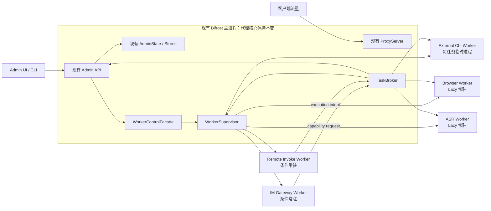
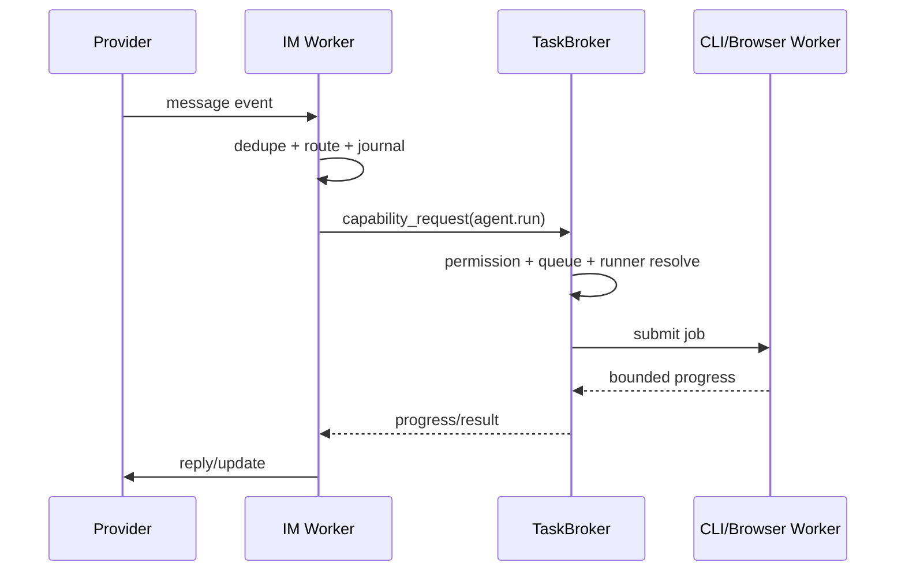

# Bifrost 附加能力独立进程隔离与按需调度技术方案

> 状态：Draft for Review（第二版）
> 设计基线：`bifrost-proxy/bifrost` `main@08b094de7708c2a5165c8cc6bdebad3bbe6a567f`
> 基线日期：2026-08-12
> 方案边界：**不改动现有 Proxy 核心转发、TLS、规则处理、AdminState 与流量状态管理，只把 External CLI、ASR、Browser、IM Gateway、Remote Invoke 等附加能力逐步移出主进程。**

---

## 0. 本版方案的边界调整

上一版方案把目标扩大到了代理数据面与控制面的彻底解耦，包括移除 `bifrost-proxy -> bifrost-admin` 依赖、拆分 Proxy/Control Runtime、重构 `AdminState`、调整 Traffic Pipeline 等。这些改造从长期架构纯度看有价值，但会直接触碰当前已经稳定运行的代理核心，改造面和回归风险都偏大。

本版采用更保守、可落地的策略：

1. **把当前稳定的 Proxy 核心视为不可变基座。**
2. **不改变 ProxyServer、规则、TLS、流量记录和现有状态管理模型。**
3. **仅在现有 Admin/功能层外围增加 WorkerSupervisor、IPC 和进程边界。**
4. **优先搬走会启动外部进程、长期保持连接、占用大量 CPU/内存或可能输出爆炸的能力。**
5. **所有改造都通过 feature flag 灰度，单项失败可独立回滚。**

本版明确取消以下硬门禁：

| 上一版要求 | 本版处理 |
|---|---|
| 移除 `bifrost-proxy -> bifrost-admin` | 不做 |
| Proxy Runtime / Control Runtime 拆分 | 不做 |
| `AdminState` God Object 拆解 | 不做 |
| 代理热路径改为不可变快照 | 不做 |
| Traffic Store 独立进程 | 不纳入本轮 |
| 规则脚本执行模型改造 | 不纳入本轮 |
| Admin 路由跨 Runtime 分发 | 不做 |

本轮只保证：**附加能力自身发生崩溃、卡死、输出洪水、重启风暴或资源泄漏时，故障尽可能被限制在对应 worker 进程中，不再直接拖垮 Bifrost 主进程。**

---

## 1. 执行摘要

Bifrost 当前已经不只是流量代理，还承载了 External CLI Agent、ASR、ChatGPT Web 浏览器自动化、IM Gateway、Remote Invoke 等能力。这些能力的共同特征是：

- 会启动外部进程；
- 会持有长期连接或 scheduler；
- 可能长时间占用 CPU、内存、GPU、文件句柄；
- 可能生成大体积 stdout/stderr、音频、附件或浏览器下载；
- 发生卡死时需要强制终止整个进程树；
- 与代理流量转发没有必然的同进程要求。

因此，本方案在不修改代理核心的前提下，引入一个增量式的附加能力运行层：

```text
现有 Bifrost 主进程
  ├── 现有 ProxyServer / TLS / Rules / Traffic / AdminState（保持不变）
  ├── 现有 Admin API 和配置 Store（保持不变）
  ├── WorkerControlFacade（新增，薄封装）
  ├── TaskBroker（新增，功能请求路由）
  └── WorkerSupervisor（新增，负责进程生命周期）
          ├── External CLI Worker      每任务临时进程
          ├── Browser Worker           Lazy 常驻，空闲退出
          ├── ASR Worker               Lazy 常驻，空闲退出
          ├── IM Gateway Worker        有启用配置时常驻
          └── Remote Invoke Worker     Remote 启用时常驻
```

核心策略如下：

- **External CLI：** 延续当前一任务一子进程的设计，统一纳入 Supervisor；真实 CLI、PTY、输出解析和文件落盘都在 worker 中完成。
- **Browser：** 新增独立 Browser Worker，唯一拥有 Chromium 生命周期、profile、debug port、CDP 和 tab pool；取消 `bifrost start` 时主动登录检查，真正使用时才启动。
- **ASR：** 新增 ASR Job Worker，把 ffmpeg、ffprobe、转码、切片、压缩、模型推理、diarization 和作业执行整体移出主进程；主进程继续持有原有任务配置和状态 Store。
- **IM Gateway：** 主进程保留配置 CRUD 和状态入口，provider 长连接、event loop、scheduler、reconnect 移入 IM Runtime Worker；需要 Agent/Browser 时通过主进程 TaskBroker 调度，worker 不直接 fork。
- **Remote Invoke：** relay、heartbeat、pairing、crypto、frame 协议移入 Remote Worker；收到命令后生成 ExecutionIntent，由主进程二次鉴权并路由到现有服务或执行 worker，Remote Worker 自身不执行 shell/PTY/Agent。
- **统一 IPC：** 第一阶段使用 stdio NDJSON；大输出、大文件和音频只传 ArtifactRef，不通过 JSON 内联。
- **统一资源边界：** 每个 worker 都有启动策略、并发、队列、超时、心跳、输出配额、进程优先级、进程组 kill、重启退避和熔断。

这套方案刻意不追求一次性重构整个进程架构，而是先移走最主要的不稳定源，以较小风险换取最大的可靠性收益。

---

## 2. 目标与非目标

### 2.1 核心目标

1. External CLI、ASR、Browser、IM Gateway、Remote Invoke 的重任务和常驻循环不再直接运行在 Bifrost 主进程中。
2. 任一 worker 崩溃、卡死或被强制杀死时，不触发主进程退出。
3. worker 大输出不会被完整加载到主进程内存。
4. worker 子进程及其孙进程能够被整体回收，不遗留孤儿进程。
5. 可选能力启动失败时，只影响对应功能，不影响代理服务状态。
6. worker 按实际需求启动，不在 `bifrost start` 时无条件拉起所有能力。
7. 保持当前 Admin API、任务配置、运行记录和 UI 语义尽量兼容。
8. 每个能力可独立灰度、独立回滚，不要求五项一次性切换。

### 2.2 明确非目标

本轮不做：

- 不修改 `bifrost-proxy` 的协议转发、TLS、规则匹配、连接状态管理；
- 不重构 `ProxyServer` 与 `AdminState` 的关系；
- 不拆分主进程 Tokio Runtime；
- 不改变流量数据库、BodyStore、FrameStore 和 AsyncTrafficWriter；
- 不改变现有规则 DSL 和 QuickJS 脚本执行模型；
- 不重构现有 Admin 路由；
- 不追求容器级、虚拟机级安全沙箱；
- 不把所有 worker 拆成独立安装包；首期可以复用当前 `bifrost` 可执行文件的隐藏子命令。

### 2.3 可接受的剩余风险

本方案完成后，以下风险仍然存在：

- Proxy、Admin 和流量状态仍在同一主进程；
- 主进程自身的 OOM、native crash 或核心代码死锁仍会影响代理；
- worker 与主进程仍竞争系统总 CPU、内存、磁盘和网络资源；
- Traffic DB、规则脚本、Admin 大查询等未被隔离；
- 部分功能状态仍需通过 IPC 同步，worker 短暂不可用时 UI 状态可能延迟。

这些属于本轮主动接受的权衡，不应在实现过程中悄悄扩展为代理核心重构。

---

## 3. 当前代码现状与拆分依据

### 3.1 External CLI 已有较好的进程化基础

相关代码：

- `crates/bifrost-admin/src/im_gateway/external_cli/mod.rs`
- `crates/bifrost-cli/src/commands/agent.rs`

当前生产路径已经具备：

- 隐藏 worker 子命令；
- stdio JSON 控制；
- `run/stop/guide`；
- worker 内启动真实 Codex/Claude 等 CLI；
- process group 终止；
- run directory、stdout/stderr/events/result 文件；
- 测试外默认 out-of-process。

因此 External CLI 不需要重新设计业务逻辑，重点是把现有散落的进程管理收敛到统一 Supervisor，并补齐心跳、并发、输出和状态边界。

### 3.2 Browser 生命周期仍缺少明确 owner

相关代码：

- `crates/bifrost-admin/src/im_gateway/chatgpt_web/browser.rs`
- `crates/bifrost-admin/src/im_gateway/chatgpt_web.rs`
- `crates/bifrost-admin/src/handlers/im_gateway/service.rs`

当前存在进程级静态状态：

- `BROWSER_PORTS`；
- `BROWSER_PIDS`；
- profile launch locks；
- conversation tab pool；
- CDP 连接和 target 映射。

短生命周期 External CLI worker 可以触发一个长期存活的 Chromium，但 External CLI worker 退出后，浏览器仍可能继续存在。当前启动流程还会执行 ChatGPT Web startup auth check，导致浏览器能力参与主服务启动。

Browser 是最适合独立为 Lazy 常驻 worker 的模块。

### 3.3 ASR 的重任务大部分仍在 Admin 进程

相关代码：

- `crates/bifrost-admin/src/handlers/asr_jobs/*`
- `crates/bifrost-admin/src/handlers/asr_jobs/audio_processing.rs`
- `crates/bifrost-admin/src/handlers/asr_jobs/diarization.rs`
- `crates/bifrost-asr/*`

虽然 diarization 已经有点状隐藏 worker，但整体任务仍包含：

- ffmpeg/ffprobe；
- 音频 normalize、split、cut、compress；
- ASR server/fork 策略；
- native 模型；
- diarization 和 voiceprint；
- scheduler、重试、暂停、checkpoint；
- 大量文件和音频处理。

这些能力 CPU、内存和外部进程风险都很高，适合把完整作业执行边界移入 ASR Worker，而不是继续只拆模型调用。

### 3.4 IM Gateway 的长连接与调度循环在主进程

相关代码：

- `crates/bifrost-admin/src/handlers/im_gateway/service.rs`
- `crates/bifrost-admin/src/im_gateway/*`

当前 `ImGatewayService` 同时承担：

- provider/target/route/schedule store；
- provider 长连接；
- event processing；
- scheduler；
- reconnect supervisor；
- Agent session/queue/progress；
- Browser/External CLI 调度。

其中配置和 Store 属于控制面，可以保留；长连接、scheduler、reconnect 和 event loop 属于运行面，应移入 worker。

### 3.5 RemoteInvokeWorker 目前不是 OS 进程

相关代码：

- `crates/bifrost-admin/src/remote_invoke/worker.rs`
- `crates/bifrost-admin/src/remote_invoke/executor.rs`

当前 `RemoteInvokeWorker::start()` 本质是主进程内 `tokio::spawn`，并直接持有执行器，可执行：

- traffic query/search；
- PTY/shell；
- file；
- power；
- IM Gateway。

Remote Invoke 的网络协议、加解密和执行能力处于同一故障域。应把 relay transport 移入独立 worker，并把执行重新交给主进程 broker 或执行 worker。

---

## 4. 设计原则

### 4.1 Proxy 核心冻结原则

本轮实现必须遵守：

1. 不修改 `crates/bifrost-proxy` 的核心行为。
2. 不改变现有代理 listener、Admin path 判定、TLS、规则和流量处理。
3. 不要求 `ProxyServer` 移除 `AdminState`。
4. 不改变现有配置 reload 和连接生命周期语义。
5. 不把 worker 化作为代理 listener ready 的前置条件。

### 4.2 附加能力隔离原则

1. 需要启动外部进程的代码优先放入 worker。
2. 长期连接、scheduler 和 reconnect loop 优先放入 worker。
3. worker 不得通过 stdout 发送普通日志，stdout 只用于 IPC。
4. 大数据只落盘，通过 ArtifactRef 返回。
5. 主进程对 worker IPC 必须有界，不能因 worker event flood 无限增长。
6. worker crash 只改变该能力状态，不触发 Bifrost restart。
7. worker 之间不直接通信，由主进程 TaskBroker 中转。
8. 主进程仍是配置、权限和用户可见状态的最终入口。
9. worker 只拿到执行某个任务所需的最小配置快照和目录权限。
10. 首期优先可靠和可回滚，不追求协议或抽象的一步到位。

### 4.3 按需启动原则

不同能力采用不同按需模型：

| 能力 | 启动模型 | 启动条件 | 停止条件 |
|---|---|---|---|
| External CLI | Ephemeral per job | 有任务到达 | 任务结束后退出 |
| Browser | Lazy persistent | 首次 browser/login/send 请求 | 空闲超时或显式 stop |
| ASR | Lazy persistent | 首次 ASR 执行任务 | 队列为空且空闲超时 |
| IM Gateway | Conditional persistent | 存在启用的 provider/schedule | 所有 runtime 配置关闭 |
| Remote Invoke | Conditional persistent | Remote Invoke 被启用 | Remote Invoke 被关闭 |

“按需”不等于所有 worker 都必须一任务一进程。Browser 和 ASR 有明显的启动/模型加载成本，适合 Lazy 常驻；IM 和 Remote 必须保持接收能力，适合配置驱动常驻。

---

## 5. 目标架构



### 5.1 主进程保留

- 当前 ProxyServer；
- 当前 AdminState；
- 当前配置和业务 Store；
- Admin API 和 UI；
- 权限校验；
- 对外任务状态；
- worker 配置快照；
- WorkerSupervisor；
- TaskBroker；
- 小体积 worker progress/result 索引。

### 5.2 Worker 中运行

- External CLI 真实执行、PTY、stdout/stderr parser；
- Chromium、CDP、profile 和 tab pool；
- ffmpeg、ASR 模型、diarization、压缩；
- IM provider 长连接、scheduler、reconnect、event loop；
- Remote relay、heartbeat、pairing、crypto、frame loop；
- 所有由这些能力衍生出的子进程。

### 5.3 主进程不再直接执行

在对应能力切换到 worker 模式后，主进程不应继续：

- `Command::new` 启动 Codex/Claude；
- 启动 Chromium；
- 执行 ffmpeg/ffprobe；
- 加载 native ASR/diarization 模型；
- 维持 IM provider 长连接；
- 维持 Remote relay SSE/heartbeat；
- 在 Remote worker 中直接创建 PTY 或 shell。

---

## 6. 状态所有权与兼容策略

本方案不重构现有状态管理，但必须明确主进程和 worker 的写入边界，避免跨进程同时修改同一状态文件。

### 6.1 总体规则

- **主进程是配置和用户可见状态的 source of truth。**
- **worker 是运行时执行状态的 source of truth。**
- worker 接收 versioned config/job snapshot，不直接持有 `AdminState`。
- worker 不直接修改主进程正在写入的 JSON/SQLite Store。
- worker 只写自己 scoped 的 runtime journal、spool 和 artifact。
- worker 通过 IPC 发送事件，主进程按现有方式更新 Store。

### 6.2 各能力状态边界

| 能力 | 主进程保留 | Worker 持有 |
|---|---|---|
| External CLI | runner 配置、session 映射、job 状态、UI | 真实进程、PTY、输出、单次 run artifact |
| Browser | runner/browser 配置、用户操作入口 | PID、port、profile lock、CDP、tab、auth runtime |
| ASR | task 定义、schedule 配置、任务记录 | 当前 job phase、模型、ffmpeg、checkpoint、输出 |
| IM Gateway | provider/route/target/schedule 配置、用户可见记录 | connection、event loop、reconnect、scheduler runtime、inbox/outbox journal |
| Remote Invoke | enable 配置、审批入口、审计展示 | relay connection、pairing session、crypto/session、frame state |

### 6.3 配置快照

所有 persistent worker 使用：

```json
{
  "configGeneration": 42,
  "workerKind": "im_gateway",
  "payload": {}
}
```

规则：

- 主进程每次配置变化生成单调递增 generation；
- worker 校验后返回 `config_applied`；
- apply 失败时继续运行旧 generation；
- 主进程 UI 显示 desired/applied generation；
- worker 重启后主进程重发最新完整快照，不依赖增量事件重放。

### 6.4 兼容现有 API

首期尽量保持现有 API 路径和响应字段不变：

- handler 内部从“直接执行”切换成“提交 worker job”；
- 原有同步接口可内部等待 worker 结果，但必须有 deadline；
- 原有 streaming 接口映射 worker progress；
- 原有任务 ID 和 session key 尽量保留；
- 新增 `executionMode`、`workerState`、`workerInstanceId` 等诊断字段时应向后兼容。

---

## 7. WorkerSupervisor

### 7.1 定位

WorkerSupervisor 是附加能力唯一的进程生命周期入口，但不接管 Proxy 或现有主进程生命周期。

建议代码位置：

```text
crates/bifrost-admin/src/worker_runtime/
  supervisor.rs
  process.rs
  protocol.rs
  registry.rs
  artifacts.rs
```

或后续抽成独立 crate：

```text
crates/bifrost-worker-runtime/
```

### 7.2 职责

- 启动/停止 worker；
- 维护 PID、进程组或 Job Object；
- hello/heartbeat/readiness；
- worker restart/backoff；
- ephemeral job queue；
- persistent worker request dispatch；
- cancel/timeout；
- 输出和 artifact quota；
- 状态查询和诊断；
- parent shutdown 时回收进程树；
- 清理上次崩溃留下的 worker runtime metadata。

### 7.3 不负责

- 不解释 ASR、IM、Remote 等业务语义；
- 不直接读写现有业务 Store；
- 不做用户权限决策；
- 不参与 Proxy 请求处理；
- 不根据 worker 故障重启 Bifrost 主进程。

### 7.4 运行位置

为了不触碰现有 Proxy Runtime，可采用两种实现：

#### 首选：独立 Supervisor 线程

- 主进程启动一个专用 OS thread；
- 在线程中运行小型 Tokio current-thread runtime；
- 专门处理 worker stdin/stdout、heartbeat、waitpid 和 timer；
- Admin handler 通过 bounded channel 与其通信。

优点：不会把 worker stdout flood、waitpid 和重启 timer 全放入当前共享 runtime。

#### 备选：现有 Runtime 内运行

若首期跨线程改造成本过高，也可以先使用现有 Tokio runtime，但必须：

- 所有 channel 有界；
- 不做阻塞 I/O；
- child stdout 持续 drain；
- 不在队列满时无限 spawn；
- 通过压测确认不会影响代理。

本方案不把“独立 Supervisor 线程”设为第一阶段硬门禁，但建议在 External CLI/Browser 上线前完成。

### 7.5 Worker 状态机

```text
Disabled
  -> Stopped
      -> Starting
          -> Ready
              -> Busy
              -> Degraded
              -> Stopping -> Stopped
          -> Backoff
              -> Starting
              -> CircuitOpen
```

状态说明：

- `Stopped`：按需 worker 尚未启动，正常状态；
- `Starting`：进程已 spawn，等待 hello/ready；
- `Ready`：可接受请求；
- `Busy`：达到并发上限；
- `Degraded`：进程可用，但部分依赖异常；
- `Backoff`：异常退出后等待重启；
- `CircuitOpen`：重启频率过高，暂时停止自动拉起；
- `Disabled`：配置关闭。

### 7.6 Persistent Worker 重启策略

建议默认：

- 第 1 次异常退出：1 秒后重启；
- 后续：2、4、8、16、30 秒；
- 5 分钟内异常退出 5 次：熔断 60 秒；
- 用户显式 restart 可立即解除；
- 每次启动生成新的 `workerInstanceId`；
- 旧实例迟到事件全部丢弃。

IM/Remote worker 重启后，主进程重发完整配置快照；Browser/ASR worker 没有待处理任务时不自动重启，等下一次需求再拉起。

### 7.7 Ephemeral Job 策略

External CLI 等 per-job worker：

- 每个 job 独立 PID/process group；
- job 结束 worker 退出；
- 任务失败默认不透明重试；
- 仅 worker 尚未开始真实执行前的 spawn/handshake 失败可自动重试一次；
- 已产生外部副作用后禁止自动重跑。

---

## 8. IPC 协议

### 8.1 V1 Transport

第一阶段采用 stdio NDJSON：

- parent 写 worker stdin；
- worker 写 parent stdout；
- worker 普通日志写 stderr 或独立日志文件；
- 一行一个 JSON frame；
- 大文件不内联。

原因：

- 当前 External CLI 已使用相似模式；
- 跨 macOS、Windows、Linux 实现成本最低；
- 可复用当前隐藏子命令；
- 后续可以无损升级到 Unix Socket/Named Pipe。

### 8.2 Hello

worker 启动后在固定时间内发送：

```json
{
  "v": 1,
  "type": "hello",
  "workerKind": "browser",
  "workerInstanceId": "uuid",
  "pid": 12345,
  "buildVersion": "0.0.179",
  "protocolMin": 1,
  "protocolMax": 1,
  "capabilities": ["browser.send", "browser.login", "browser.status"]
}
```

Supervisor 校验：

- worker kind；
- protocol version；
- build compatibility；
- instance id；
- startup token；
- hello timeout。

### 8.3 通用消息

```json
{
  "v": 1,
  "type": "request",
  "requestId": "uuid",
  "jobId": "uuid",
  "deadlineUnixMs": 1780000000000,
  "payload": {}
}
```

消息类型至少包括：

- `hello`
- `ready`
- `request`
- `response`
- `event`
- `heartbeat`
- `cancel`
- `config_apply`
- `config_applied`
- `capability_request`
- `capability_response`
- `shutdown`
- `goodbye`

### 8.4 帧限制

建议初始值：

- 单帧默认上限：256 KiB；
- parser 硬上限：1 MiB；
- 单日志/progress 文本：64 KiB；
- 单 worker pending requests：有界；
- progress backlog：128；
- final response：必须有硬上限；
- 超限视为协议违规，终止对应 worker。

### 8.5 ArtifactRef

stdout/stderr、音频、附件、截图、下载、模型输出都使用：

```json
{
  "artifactId": "uuid",
  "relativePath": "jobs/<job-id>/stdout.log",
  "sizeBytes": 123456,
  "mediaType": "text/plain",
  "sha256": "...",
  "complete": true
}
```

规则：

- job spool dir 由主进程创建；
- worker 只收到该目录的 scoped path；
- relative path canonicalize 后必须仍在 job root；
- 主进程只保存索引，不默认读取完整文件；
- UI 使用 range/tail API；
- worker final response 只返回摘要和 ArtifactRef。

### 8.6 Progress 背压

progress 是可合并数据：

- 同一 job 只保留最新状态快照；
- 高频 token/日志 delta 可批量或采样；
- queue 满时丢弃中间 progress，不丢 final；
- heartbeat 使用独立高优先级小队列；
- 主进程订阅者断开后，worker 不继续缓存无限事件。

---

## 9. TaskBroker

### 9.1 目的

IM Gateway 和 Remote Invoke worker 会触发其他能力，但不能直接 fork External CLI 或启动 Browser，否则 worker 之间形成新的耦合和不可控进程树。

主进程增加一个薄的 TaskBroker：

```text
submit_external_cli(request)
submit_browser(request)
submit_asr(request)
execute_remote_query(request)
execute_remote_shell(request)
send_im_control(request)
```

它只做：

- 调用者身份和 capability 校验；
- schema 校验；
- 并发和队列检查；
- 路由到 WorkerSupervisor 或现有主进程服务；
- 将 progress/result 转回原 worker。

### 9.2 不需要一次性做成通用插件框架

首期可以是强类型 enum：

```rust
pub enum WorkerCapabilityRequest {
    ExternalCliRun(ExternalCliRunRequest),
    BrowserRun(BrowserRunRequest),
    RemoteShell(RemoteShellRequest),
    QueryReadonly(RemoteQueryRequest),
    ImSend(ImSendRequest),
}
```

先保证边界和可靠性，后续再抽象通用 capability registry。

### 9.3 双向请求

IM/Remote worker 发送 `capability_request` 后：

1. Supervisor 接收；
2. 交给 TaskBroker；
3. Broker 二次鉴权；
4. 提交目标 job；
5. progress 以有界事件流返回；
6. final result 返回摘要和 ArtifactRef。

worker 不能直接连接其他 worker 的 stdin/socket。

---

## 10. External CLI Worker

### 10.1 设计选择

继续使用 **per-job ephemeral worker**，不改成长驻池。

```text
Admin / IM / Remote
  -> TaskBroker
  -> WorkerSupervisor
  -> external-cli-worker(job)
  -> Codex / Claude Code / Trae / other CLI
```

### 10.2 复用现有能力

现有：

- `AgentCommands::ExternalRunnerWorker`；
- `ExternalCliWorkerCommand`；
- `ExternalCliWorkerEvent`；
- `run/guide/stop`；
- process group kill；
- run artifacts。

改造重点：

1. 把 spawn/wait/kill 纳入 Supervisor；
2. worker hello/heartbeat；
3. 统一 job registry；
4. 默认全局并发 1；
5. queue capacity；
6. stdout/stderr 增量落盘；
7. final IPC 结果限长；
8. range/tail 读取；
9. worker crash 状态标准化；
10. process alias 和隐藏子命令兼容。

### 10.3 主进程保留

- runner 配置；
- session key 与用户可见会话关系；
- stop/guide API；
- job 状态；
- progress registry；
- artifact 索引；
- 权限和 allowWorkDirs 校验。

### 10.4 Worker 内执行

- build command spec；
- 启动真实 CLI；
- PTY/process group；
- stdin/guide/stop；
- stdout/stderr drain；
- progress parser；
- stdout/stderr/events/result 落盘；
- timeout/idle timeout；
- 退出清理。

### 10.5 输出策略

当前 worker 仍有部分 `Vec<u8>` 聚合路径。改造为：

- stdout/stderr 持续写 job spool；
- 内存仅保留固定 tail，例如各 1 MiB；
- progress parser 使用流式行读取；
- 超长单行截断用于 progress，但原始文件可继续保存；
- 达到单 job quota 后标记 `outputTruncated`；
- 根据 runner 类型选择继续运行或终止；
- final response 正文设置上限，完整内容通过 artifact 获取。

### 10.6 并发与 session

建议默认：

```text
max_concurrency = 1
queue_capacity = 16
per_session_concurrency = 1
startup_timeout = 5s
stop_grace = 5s
```

同一 session 的新任务：

- 默认排队；
- 用户显式“替换当前任务”时先 stop，再启动；
- stop/guide 控制消息不进入普通 job queue。

### 10.7 ChatGPT Web 分流

`adapter == chatgpt_web` 时，不再进入 External CLI worker 内部执行浏览器逻辑，而由 TaskBroker 路由到 Browser Worker。

过渡期可保持现有 runner 配置和 adapter 名称，避免 UI/配置迁移，但执行后端必须分开。

---

## 11. Browser Worker

### 11.1 Worker 唯一拥有的状态

Browser Worker 内迁移：

- `BROWSER_PORTS`；
- `BROWSER_PIDS`；
- profile launch locks；
- Chromium/Edge 进程树；
- remote debugging port；
- CDP client；
- conversation tab pool；
- LRU；
- auth runtime；
- download/screenshot artifact；
- orphan detection 和清理。

主进程不再持有浏览器 PID、port 或 tab Arc。

### 11.2 Lazy 启动

必须移除启动阶段的：

```text
spawn_chatgpt_web_startup_auth_check()
```

以下操作才启动 Browser Worker：

- ChatGPT Web `send/create/wait`；
- 用户点击“登录”；
- 用户显式“检查登录状态”；
- Admin 显式启动 worker。

仅打开设置页面或读取 overview 不应启动 Chromium。

### 11.3 Worker 与 Chromium 关系

- Browser Worker 是 Chromium 进程树的 owner；
- Chromium 必须继承 worker process group/Job Object；
- Browser Worker 异常退出时，Supervisor 清理整棵 Chromium 树；
- profile 文件保留，运行进程不保留；
- 首期可保留 orphan recovery 兼容逻辑，但只作为升级迁移兜底；
- 正常运行不再依赖扫描任意系统进程寻找 owner。

### 11.4 常驻和空闲退出

建议：

```text
worker startup = lazy
worker idle shutdown = 10 min
browser active automation = 1 per profile
worker max profiles = configurable, default 2
```

空闲判断：

- 无 active job；
- 无登录交互；
- 无待下载 artifact；
- tab 没有被显式 pin；
- 超过 idle timeout。

空闲退出后 profile/cookie 仍保留，下一次重新启动。

### 11.5 Headed 登录

- 登录动作显式触发 headed browser；
- worker 状态显示 `login_waiting`；
- 用户关闭登录窗口时 worker返回结构化结果；
- login 完成后可按配置关闭 headed browser；
- 不默认要求 headed browser跨 Bifrost 重启持续存活。

### 11.6 故障语义

| 故障 | 行为 |
|---|---|
| worker 启动失败 | Browser API 返回 503，不影响其他功能 |
| Chromium crash | 当前 job 失败，worker可重新拉起 |
| profile lock | 仅对应 profile degraded |
| CDP 卡死 | job timeout，重启 browser tree |
| 重启风暴 | Browser circuit open |
| 登录失效 | 返回 `login_required`，不视为 worker crash |

---

## 12. ASR Worker

### 12.1 分阶段迁移方式

为了不大改现有 ASR Store 和 API，建议先做一个“完整 ASR Job 进程包装层”。

#### Phase 3A：完整任务 out-of-process

- 新增隐藏子命令 `bifrost worker asr`；
- 主进程继续解析 API 和读取任务配置；
- 创建不可变 `AsrJobRequest`；
- worker 内调用现有 `handlers/asr_jobs` 执行逻辑；
- worker 通过 IPC 返回 progress；
- 主进程继续按现有结构更新任务 Store。

这样首先实现故障域隔离，不要求立刻重构 ASR 模块代码布局。

#### Phase 3B：整理为独立 runtime crate

稳定后再把执行代码从 handler 目录抽到：

```text
crates/bifrost-asr-runtime/
```

主进程只链接协议/类型，worker 链接 native ASR 实现。

### 12.2 完整作业边界

worker 内执行：

- ffprobe；
- ffmpeg normalize/cut/split；
- source compression；
- hash；
- 模型检查和 lazy init；
- ASR server/fork；
- chunk orchestration；
- diarization；
- voiceprint；
- timeline/subtitle；
- retry；
- checkpoint；
- output manifest。

主进程不得再为 worker 模式任务直接执行以上操作。

### 12.3 Lazy Persistent

ASR 模型加载成本较高，建议 worker 常驻一段时间：

```text
startup = lazy
job concurrency = 1
transcode concurrency = 1
inference concurrency = 1
queue capacity = 8
idle shutdown = 15 min
priority = low
```

worker 内可以复用模型或 ASR server，但不同 job 仍保持独立 job directory。

### 12.4 请求模型

```json
{
  "jobId": "uuid",
  "taskId": "task-id",
  "taskSnapshot": {},
  "inputArtifacts": [],
  "outputDir": "...",
  "deadlineUnixMs": 0,
  "configGeneration": 42
}
```

只传任务快照，worker 不读取主进程内存状态。

### 12.5 取消与恢复

- 主进程发送 `cancel(jobId)`；
- worker 终止当前 ffmpeg/model 子进程组；
- worker 写入 `cancelled` checkpoint；
- worker crash 时主进程将 job 标记 `interrupted`；
- 首期不要求自动续跑，允许用户重试；
- 后续对明确幂等的 phase 增加 checkpoint resume。

### 12.6 文件和内存约束

- 音频通过路径/ArtifactRef，不内联 base64；
- ffmpeg stderr 流式落盘；
- 模型日志只保留 tail；
- 单 job 输出配额；
- 模型下载也属于 worker job；
- worker 磁盘不足时拒绝 ASR job；
- 读取 WAV header 使用固定大小读取，避免完整文件进内存；
- 主进程不读取完整 ASR artifact。

### 12.7 优先级

macOS/Linux：

- worker `nice`/`setpriority` 为较低优先级；
- ffmpeg 和模型子进程继承；
- 推理默认并发 1。

Windows：

- BELOW_NORMAL_PRIORITY_CLASS；
- Job Object 控制进程树。

这些限制不能完全避免系统级资源竞争，但能显著降低 ASR 抢占代理主进程调度的概率。

---

## 13. IM Gateway Worker

### 13.1 Control / Runtime 边界

主进程继续保留：

- provider/target/route/schedule CRUD；
- secret 管理；
- 配置 Store；
- 用户可见 message/run/event 记录；
- Admin API；
- 权限；
- TaskBroker；
- worker desired state。

IM Worker 负责：

- provider 长连接；
- inbound event loop；
- reconnect；
- scheduler tick；
- provider API；
- Admin 发消息与附件上传的实际 provider 调用（主进程只传私有 spool 文件引用）；
- message dedupe runtime；
- durable inbox/outbox journal；
- progress/card update 调度；
- 向 TaskBroker 发 Agent/Browser capability request。

### 13.2 条件常驻

IM Worker 不是无条件随主进程启动。

启动条件：

```text
存在任一 enabled provider（包括仅用于 outbound send/upload 的 provider）
或存在 enabled schedule
或用户显式 start
```

停止条件：

```text
没有启用 provider
且没有启用 schedule
且没有 active send/job
```

配置变化时由主进程重新计算 desired state。

### 13.3 配置同步

主进程发送完整：

```text
providers
routes
targets
schedules
agent routing config
provider secrets（仅启用项）
config generation
```

worker 校验后开始连接。配置 apply 失败时：

- 保留旧 runtime；
- 返回错误；
- UI 显示 desired/applied mismatch；
- 不重启 Bifrost。

### 13.4 事件队列

替换 provider path 上的无界 channel：

- 每 provider bounded inbound queue；
- critical message 与 telemetry 分离；
- critical queue 满时写 worker inbox journal；
- typing、重复 status、密集 progress 可合并；
- scheduler 同一 schedule 不允许重入；
- 全局 schedule concurrency 默认 1；
- provider reconnect 指数退避；
- event storm 不允许 per-event 无限 spawn。

### 13.5 Agent 调度

IM worker 收到需要 Agent 的消息后：



IM worker 不得：

- 直接启动 `bifrost agent external-runner-worker`；
- 直接启动 Chromium；
- 直接执行 shell；
- 直接打开主进程 Store 文件写入。

### 13.6 Runtime journal

为避免 worker crash 后重复处理：

- worker 使用独立 `runtime/im-gateway/` 目录；
- 持久化 provider message id、outbox 状态和最后 checkpoint；
- journal 与现有用户可见 Store 分开；
- worker 事件最终由主进程写入现有 Store；
- 重启后先恢复 dedupe/outbox，再连接 provider。

---

## 14. Remote Invoke Worker

### 14.1 进程边界

Remote Worker 内保留：

- relay registration；
- heartbeat/SSE；
- reconnect；
- discovery/pair code；
- pairing；
- grant/session crypto；
- frame encrypt/decrypt；
- anti-replay；
- active remote call transport；
- relay stream sequencing。

Remote Worker 内移除：

- `SharedAdminState`；
- `AdminQueryService`；
- PTY/shell；
- file operation；
- power operation；
- IM operation；
- 直接 fork 外部命令。

### 14.2 条件常驻

启动条件：

- Remote Invoke 配置启用；
- 或存在要求持续在线的有效 remote 配置。

必须在代理 listener ready 之后异步启动，但启动失败不能改变代理状态。

停止条件：

- 用户关闭 Remote Invoke；
- 主进程 shutdown；
- 显式 worker stop。

### 14.3 ExecutionIntent

Remote Worker 完成 transport 层解密和初步 scope 校验后，发送：

```json
{
  "type": "capability_request",
  "capability": "shell.exec",
  "callId": "...",
  "grantId": "...",
  "callerFingerprint": "...",
  "scopeSnapshot": {},
  "command": {},
  "deadlineUnixMs": 0
}
```

主进程 TaskBroker 必须再次校验：

- grant 是否仍有效；
- broker capability token 必须绑定单一 relay，relay 只能由主进程根据 token 推导，不能由 Remote Worker 在请求中指定；
- capability 是否在 scope 中；
- command schema；
- cwd/path/env allowlist；
- per-caller rate；
- active call 数；
- wall-clock/idle/output quota；
- 目标 worker readiness。

Grant 的读取、有效性校验、scope/file-access/caller/SSH fingerprint 校验、单次额度消费、撤销和持久化必须使用同一个跨进程事务锁与原子替换协议。授权失败不得扣减额度；同一 grant 的并发请求不得重复消费同一次额度，也不得覆盖并发撤销结果。

对于 `shell.exec`，Remote Worker 提交的 `policy_id` 不可信。主进程必须从持久化 grant 的 `policy_binding` 重新选择策略，并校验 `shell_policy_set_version_snapshot`；策略集版本变化时要求重新连接授权。Remote Execution Worker 只接收经过该流程重建的命令，不得持有真实 Admin listener 的 host/port 或通过 loopback 绕过 broker。

### 14.4 执行路由

| Remote capability | 执行位置 |
|---|---|
| traffic get/list/search | 现有主进程 query/service，固定 timeout |
| status/config readonly | 现有主进程 service |
| shell.exec/pty | 独立 Execution Worker，或 External CLI worker binary 的独立 job kind |
| agent.cli | External CLI Worker |
| browser.* | Browser Worker |
| file.* | 独立受限 Execution Worker，首期可保留主进程实现但必须 bounded |
| power.* | 现有主进程 service，固定 timeout |
| im.* | IM Gateway Worker |

注意：

- Remote Worker 不能自己执行；
- 也不应把所有 Remote 命令都强行解释成 Coding Agent CLI；
- 首期可复用同一个 worker binary，但 `shell_exec` 和 `agent_cli` 必须是不同 job type、不同权限和不同配额。

### 14.5 流式 stdout/stdin

- Execution Worker 产生 stdout/stderr；
- 主进程做 bounded stream bridge；
- Remote Worker 只处理 relay frame；
- 每方向固定 buffer 和 byte quota；
- stdin queue 满时向 caller backpressure 或拒绝；
- worker crash 时 Remote Worker 仍能发送结构化 exit；
- relay reconnect 后不得自动重复执行已开始的有副作用命令。

### 14.6 Remote 控制 API

主进程现有 Remote Admin API 改为 facade：

- `status/list_calls/pairing/grant` 查询通过 RPC 到 worker；
- 用户审批由主进程校验后发回 worker；
- worker unavailable 时返回结构化 `remote_worker_unavailable`；
- 不因为 worker down 重启主进程。

---

## 15. 进程树与资源治理

### 15.1 Unix/macOS

每个 worker：

- 独立 process group；
- worker 启动的子进程继承 group；
- graceful stop 先发 IPC/SIGTERM；
- 超过 grace 后 `killpg(SIGKILL)`；
- child FD 使用 close-on-exec；
- External CLI/ASR/Browser 设置较低优先级；
- Supervisor 记录 worker PID 和 start time，避免 PID reuse 误杀。

### 15.2 Windows

- 每个 worker 放入 Job Object；
- `JOB_OBJECT_LIMIT_KILL_ON_JOB_CLOSE`；
- 可设置 active process 和 working set；
- worker 及所有子进程一并清理；
- IPC 首期 stdio，后续可迁移 Named Pipe。

### 15.3 输出与磁盘

每个 worker/job 配置：

- stdout/stderr quota；
- artifact quota；
- runtime journal quota；
- file count；
- retention；
- low-disk rejection。

主进程只保留固定大小 metadata 和 tail，不持有完整大文件。

### 15.4 CPU 和内存

跨平台首期采用：

- 并发限制；
- 低优先级；
- 模型/浏览器 lazy；
- idle shutdown；
- process RSS 监控；
- soft limit 告警；
- hard limit 可用平台执行强杀。

Linux 后续可增加 cgroup v2；macOS/Windows 的硬内存限制需要按平台能力实现，不能声称完全等价。

### 15.5 全局重任务预算

Supervisor 维护：

```text
global_max_worker_processes
global_heavy_jobs
external_cli_concurrency
asr_concurrency
browser_automation_concurrency
remote_shell_concurrency
```

建议默认：

- External CLI 1；
- ASR 1；
- Browser automation 1；
- Remote shell 1；
- 全局重任务 2。

当预算满时，对附加能力排队或返回 429，不做无限 spawn。

---

## 16. 配置模型

建议新增独立配置段，不修改 Proxy 配置语义：

```toml
[workers]
enabled = true
transport = "stdio"
spool_dir = "~/.bifrost/runtime/workers"
global_max_processes = 8
global_heavy_job_concurrency = 2
protocol_frame_max_bytes = 262144

[workers.external_cli]
enabled = true
startup_strategy = "per_job"
max_concurrency = 1
queue_capacity = 16
startup_timeout_ms = 5000
job_timeout_ms = 1800000
idle_timeout_ms = 300000
shutdown_grace_ms = 5000
max_artifact_bytes_per_job = 10737418240

[workers.browser]
enabled = true
startup_strategy = "lazy"
max_concurrency = 1
queue_capacity = 8
heartbeat_interval_ms = 5000
heartbeat_timeout_ms = 15000
idle_shutdown_ms = 600000
max_profiles = 2

[workers.asr]
enabled = true
startup_strategy = "lazy"
queue_capacity = 8
job_concurrency = 1
transcode_concurrency = 1
inference_concurrency = 1
idle_shutdown_ms = 900000
process_priority = "low"

[workers.im_gateway]
enabled = true
startup_strategy = "when_configured"
provider_event_queue_capacity = 512
scheduled_run_concurrency = 1
heartbeat_interval_ms = 5000
heartbeat_timeout_ms = 15000

[workers.remote_invoke]
enabled = true
startup_strategy = "when_enabled"
max_active_calls = 4
frame_queue_capacity = 256
heartbeat_interval_ms = 5000
heartbeat_timeout_ms = 15000
```

所有用户可配置值都需要 hard cap，防止极端配置绕过保护。

---

## 17. Admin API 与诊断

### 17.1 Worker API

建议新增：

```text
GET  /api/workers
GET  /api/workers/{kind}
POST /api/workers/{kind}/start
POST /api/workers/{kind}/stop
POST /api/workers/{kind}/restart
```

返回：

- desired state；
- actual state；
- PID；
- worker instance id；
- uptime；
- heartbeat age；
- config generation；
- queue depth；
- active jobs；
- restart count；
- circuit state；
- last error；
- RSS/CPU/FD；
- child process count。

### 17.2 Job API

```text
GET  /api/worker-jobs
GET  /api/worker-jobs/{job_id}
POST /api/worker-jobs/{job_id}/cancel
GET  /api/worker-jobs/{job_id}/events
GET  /api/worker-jobs/{job_id}/artifacts
GET  /api/worker-jobs/{job_id}/artifacts/{artifact_id}?offset=&limit=
```

原有 Agent/ASR/IM API 可以继续存在，内部复用该 registry。

### 17.3 错误模型

```json
{
  "code": "worker_unavailable",
  "message": "ASR worker is in restart backoff",
  "retryable": true,
  "retryAfterMs": 30000,
  "details": {
    "workerKind": "asr",
    "state": "backoff"
  }
}
```

可选能力错误不得映射成“代理不可用”。

---

## 18. 启动、按需调度与关闭

### 18.1 Bifrost 启动

保持当前代理启动流程为主，不要求重排 Proxy 核心初始化。只增加以下约束：

1. WorkerSupervisor 初始化不得阻塞 listener ready；
2. Browser/ASR/External CLI 不在启动时拉起；
3. 移除 ChatGPT Web startup auth check；
4. IM/Remote 在 listener ready 后异步评估是否需要启动；
5. worker 启动失败只记录能力 degraded；
6. 不因 worker 状态改变系统代理启停决策。

### 18.2 按需启动流程

```text
API 收到任务
  -> 查询 worker state
  -> Stopped：Supervisor 启动
  -> 等待 hello/ready，受 startup timeout 约束
  -> 提交任务
  -> stream progress
  -> 返回 result
  -> 空闲计时
  -> 到 idle timeout 关闭
```

多个请求同时触发 lazy worker：

- 只允许一个实际 spawn；
- 其他请求等待同一 startup future；
- startup 失败统一返回；
- 不允许并发拉起多个同类 persistent worker，除非配置明确允许多实例。

### 18.3 主进程正常关闭

1. Supervisor 停止接收新 worker job；
2. 向 persistent worker 发 shutdown；
3. 向 ephemeral worker 发 cancel；
4. 等待 grace；
5. kill process group/Job Object；
6. 保存 interrupted job 状态；
7. 主进程继续执行现有 Proxy shutdown 流程。

不改动当前系统代理恢复和 Proxy 关闭机制。

### 18.4 主进程异常退出

- Unix 使用 process group、parent heartbeat 等 best-effort 清理；
- Windows Job Object 随 parent handle 关闭清理；
- worker 定期检测 parent heartbeat/pipe EOF；
- parent 消失后 worker 主动退出；
- 下一次启动扫描 runtime metadata，清理确认属于旧实例的遗留 worker；
- Browser profile 文件保留，浏览器进程默认不保留。

---

## 19. 可观测性与代理保护验证

本轮不修改 Proxy 核心 metrics，主要通过现有指标和外部探针验证 worker 不影响代理。

### 19.1 Worker Metrics

- `worker_state{kind}`；
- `worker_start_total{kind,result}`；
- `worker_restart_total{kind,reason}`；
- `worker_heartbeat_age_ms{kind}`；
- `worker_queue_depth{kind}`；
- `worker_active_jobs{kind}`；
- `worker_job_duration_ms{kind}`；
- `worker_job_failed_total{kind,code}`；
- `worker_protocol_violation_total{kind}`；
- `worker_output_bytes{kind}`；
- `worker_artifact_bytes{kind}`；
- `worker_rss_bytes{kind}`；
- `worker_cpu_percent{kind}`；
- `worker_open_fds{kind}`；
- `worker_child_processes{kind}`；
- `worker_orphan_cleanup_total{kind}`；
- `worker_circuit_open_total{kind}`。

### 19.2 主进程 Metrics

新增但不触碰 Proxy 热路径：

- Supervisor channel depth；
- TaskBroker queue depth；
- worker event dropped/coalesced；
- artifact index size；
- worker IPC bytes；
- main process RSS/CPU/FD；
- worker 功能 degraded 状态。

### 19.3 代理稳定性外部探针

在 E2E/压测中持续运行：

- HTTP/HTTPS 代理请求；
- CONNECT + TLS interception；
- WebSocket/SSE；
- SOCKS5；
- 现有 rule/script case；
- 长连接；
- 高连接 churn。

同时注入 worker 压力，比较：

- 请求成功率；
- p50/p95/p99；
- 现有连接中断；
- 主进程 RSS/CPU/FD；
- worker 退出是否传播到主进程；
- 是否产生孤儿进程。

### 19.4 建议门禁

| 指标 | 建议门禁 |
|---|---|
| worker kill/crash | 主进程不退出 |
| worker 产生 10GB 输出 | 主进程 RSS 增量 `<= 64MB` |
| External CLI/ASR/Browser 重任务 | 代理错误率增量 `<= 0.1` 个百分点 |
| 重任务下代理 p99 增量 | `<= max(10ms, 10%)`，先以现状基线校准 |
| 1000 次 worker 启停 | 主进程 FD 无持续增长 |
| 1000 次 worker 启停 | 无遗留 worker/child tree |
| worker queue 满 | 对应功能 429/503，不阻塞代理 |
| Browser 未使用 | `bifrost start` 后无 Chromium |
| ASR 未使用 | `bifrost start` 后无 ASR 模型进程 |
| IM/Remote 未启用 | 对应 worker 不启动 |

由于本版不重构 Proxy Runtime，SLO 门禁应以当前稳定版本基线为参照，而不是承诺绝对零影响。

---

## 20. 故障与降级语义

| 故障 | 对应行为 | 不允许的行为 |
|---|---|---|
| External CLI queue 满 | 429/排队状态 | 阻塞 Admin handler 无限等待 |
| External CLI worker crash | 当前 job failed | 重启 Bifrost |
| Browser login required | 返回 login_required | 标记代理 unhealthy |
| Browser crash | 当前 job failed，可重拉 | 关闭 IM/Remote |
| ASR worker OOM | 当前 job interrupted | 主进程 OOM |
| ffmpeg 卡死 | job timeout，kill group | 主进程等待无上限 |
| IM worker down | provider disconnected，自动 backoff | 重启 Proxy |
| IM event storm | inbox/bounded queue/合并 | 无界 channel 和无限 spawn |
| Remote relay down | reconnecting | 影响代理 listener |
| Remote shell child 卡死 | kill execution worker group | 卡住 Remote transport loop |
| IPC 超大帧 | worker protocol violation/kill | 主进程分配超大内存 |
| worker 重启风暴 | circuit open | 高频无限 restart |
| 磁盘配额满 | 拒绝新附加任务 | 继续无限写 artifact |

---

## 21. 四阶段落地路线

## Phase 1：观测、按需启动和统一硬边界

### 目标

不移动大块业务代码，先建立 worker 基础设施和最小风险保护。

### 工作项

1. 新增 WorkerSupervisor/Registry 基础；
2. stdio NDJSON V1；
3. hello/heartbeat/start/stop/cancel；
4. process group/Job Object；
5. worker/job/artifact 基础 API；
6. bounded IPC channel；
7. frame/output/artifact hard cap；
8. 全局重任务并发；
9. restart/backoff/circuit；
10. process/RSS/CPU/FD metrics；
11. 移除 ChatGPT Web startup auth check；
12. 明确 Browser/ASR/External CLI lazy；
13. IM/Remote 仅在配置启用时启动；
14. 建立代理外部压测基线；
15. 不改 Proxy、AdminState 和 Traffic Pipeline。

### 门禁

- 未使用 Browser/ASR 时不启动进程；
- worker handshake failure 不影响主进程；
- worker stdout flood 不造成主进程 RSS 无界增长；
- process group/Job Object 能回收测试子进程树；
- 现有 Proxy 回归测试完全通过。

## Phase 2：External CLI + Browser

### External CLI

1. 把现有 worker spawn 纳入 Supervisor；
2. 保留现有业务协议兼容层；
3. 默认并发 1；
4. job registry；
5. 输出流式落盘；
6. final response 限长；
7. range/tail；
8. stop/guide 走统一控制通道；
9. 进程树和 timeout 统一治理。

### Browser

1. 新增 Browser Worker hidden subcommand；
2. 迁移 PID/port/launch lock/tab pool；
3. Chromium 由 worker 唯一管理；
4. ChatGPT Web adapter 路由到 Browser Worker；
5. lazy startup；
6. explicit login；
7. idle shutdown；
8. orphan compatibility；
9. 浏览器故障和 circuit UI。

### 门禁

- 10GB CLI 输出主进程 RSS 达标；
- External CLI kill 后无子进程残留；
- Browser worker crash 不退出主进程；
- `bifrost start` 不启动 Chromium；
- 原 Agent/ChatGPT Web API 兼容。

## Phase 3：ASR 完整任务进程化

### 工作项

1. `bifrost worker asr`；
2. 定义 AsrJobRequest/Progress/Result；
3. 将完整 task run 放入 worker；
4. ffmpeg/ffprobe 移出主进程；
5. native ASR/diarization 移出执行路径；
6. lazy persistent；
7. 模型复用；
8. cancel/timeout/process group；
9. job journal/checkpoint；
10. artifact 化；
11. 主进程继续使用现有 task Store；
12. 逐 API 灰度 legacy/worker mode。

### 门禁

- ASR 满 CPU 时主进程稳定；
- ASR worker OOM 只中断 ASR job；
- ffmpeg 卡死能完整回收；
- 主进程不再为 worker mode 任务直接执行 ffmpeg/model；
- 现有 ASR 任务配置和 UI 基本兼容。

## Phase 4：IM Gateway + Remote Invoke

### IM Gateway

1. Control/Runtime facade；
2. provider 长连接移入 worker；
3. scheduler/reconnect/event loop 移入 worker；
4. Admin send/upload provider 调用移入 worker，大 payload 只传私有 spool 引用；
5. bounded provider queue；
6. runtime inbox/outbox journal；
7. config generation；
8. capability reverse RPC；
9. worker crash/reconnect 恢复。

### Remote Invoke

1. relay transport worker；
2. pairing/crypto/frame 进程化；
3. ExecutionIntent；
4. 从 Remote Worker 移除直接 executor；
5. TaskBroker 二次鉴权；
6. shell/Agent/Browser/IM 分路由；
7. bounded stream bridge；
8. Remote Admin facade；
9. relay chaos 和 worker restart。

### 门禁

- IM provider event storm 不退出主进程；
- IM/Remote 未启用时不启动 worker；
- Remote shell 卡死可回收 execution process tree；
- Remote Worker 不持有 `SharedAdminState`；
- worker-to-worker 不直连；
- relay/provider 故障不影响代理流量。

---

## 22. 测试矩阵

### 22.1 Supervisor Unit Test

- 状态机；
- concurrent lazy start；
- hello timeout；
- heartbeat timeout；
- restart/backoff；
- circuit open；
- old instance event rejection；
- queue capacity；
- cancel race；
- shutdown race；
- artifact path traversal；
- protocol frame oversize；
- partial NDJSON frame；
- child exit before final；
- PID start-time validation。

### 22.2 External CLI

- 正常 run；
- guide；
- stop；
- stdout 10GB；
- stderr 10GB；
- 超长单行；
- child fork tree；
- child 不退出；
- worker kill -9；
- parent shutdown；
- output quota；
- session concurrency；
- queue full；
- final result artifact。

### 22.3 Browser

- 首次 lazy start；
- concurrent first request；
- login required；
- headed login；
- headless send；
- profile lock；
- Chromium crash；
- CDP hang；
- worker crash；
- tab LRU；
- idle shutdown；
- restart后 profile复用；
- orphan cleanup；
- helper tree cleanup。

### 22.4 ASR

- ffprobe failure；
- ffmpeg timeout；
- pause/cancel；
- worker crash；
- model init failure；
- model OOM；
- diarization child crash；
- large WAV；
- disk full；
- checkpoint；
- idle shutdown；
- concurrent job queue；
- legacy/worker result compare。

### 22.5 IM Gateway

- provider connect/reconnect；
- 10k event burst；
- duplicate message；
- queue saturation；
- scheduler reentry；
- worker restart；
- config generation mismatch；
- secret reload；
- outbox recovery；
- Admin send/upload 不回落主进程；
- capability request timeout；
- External CLI/Browser unavailable。

### 22.6 Remote Invoke

- relay disconnect；
- heartbeat timeout；
- pairing；
- crypto invalid frame；
- replay frame；
- ExecutionIntent 拒绝；
- shell output flood；
- stdin backpressure；
- execution worker crash；
- Remote Worker restart；
- caller cancel；
- relay reconnect 不重复执行。

### 22.7 代理联合压测

在上述每个 chaos 场景期间持续跑：

- HTTP；
- HTTPS MITM；
- CONNECT；
- WebSocket；
- SSE；
- SOCKS5；
- 长连接；
- 规则处理；
- 大 body。

验收重点不是证明 Proxy 架构完全隔离，而是证明新增 worker 改造没有破坏现有稳定性，并显著降低附加能力故障传播。

---

## 23. 灰度与回滚

### 23.1 Execution Mode

```toml
[workers.external_cli]
execution_mode = "legacy" # legacy | worker

[workers.browser]
execution_mode = "legacy"

[workers.asr]
execution_mode = "legacy"

[workers.im_gateway]
execution_mode = "legacy"

[workers.remote_invoke]
execution_mode = "legacy"
```

每个模块独立切换。

### 23.2 灰度顺序

1. 内部开发环境；
2. worker mode 手动启用；
3. 默认启用 External CLI；
4. 默认启用 Browser；
5. ASR 小流量；
6. IM 单 provider；
7. Remote 内部账号；
8. 全量。

### 23.3 回滚原则

- 单个 worker 可切回 legacy；
- worker protocol 与业务 Store 版本独立；
- 不迁移或删除原配置；
- job artifact 保持可读；
- 旧模式恢复后不要求 Proxy restart，能热切则热切，不能热切时只重启主服务；
- 回滚不恢复 Browser eager startup；
- 回滚不得删除新 journal，避免丢失待恢复状态。

### 23.4 禁止双跑的场景

以下有副作用能力不得 shadow 双执行：

- External CLI Agent；
- Browser send；
- IM send；
- Remote shell/file；
- schedule run。

ASR 可对离线样本做 compare，但生产任务不能自动重复写输出。

---

## 24. 建议代码布局

首期尽量少拆 crate：

```text
crates/bifrost-admin/src/worker_runtime/
  mod.rs
  protocol.rs
  supervisor.rs
  registry.rs
  process.rs
  artifacts.rs
  task_broker.rs
  external_cli.rs
  browser.rs
  asr.rs
  im_gateway.rs
  remote_invoke.rs
```

隐藏子命令：

```text
bifrost worker external-cli
bifrost worker browser
bifrost worker asr
bifrost worker im-gateway
bifrost worker remote-invoke
bifrost worker execution
```

稳定后再拆：

```text
crates/bifrost-worker-protocol/
crates/bifrost-worker-runtime/
crates/bifrost-browser-runtime/
crates/bifrost-asr-runtime/
crates/bifrost-im-runtime/
crates/bifrost-remote-runtime/
```

### 24.1 单 binary 与多 binary

首期推荐复用当前 `bifrost` binary 的隐藏子命令：

优点：

- 发布和升级简单；
- 复用现有代码；
- 跨平台打包成本低；
- 外部 CLI 已有先例。

缺点：

- 主 binary 仍链接较多模块；
- worker 攻击面没有最小化；
- binary 体积较大。

待 worker 模式稳定后，再按能力拆独立 binary，不作为首期门禁。

---

## 25. 建议 PR 拆分

### Phase 1

1. Worker protocol types；
2. Supervisor state machine；
3. process group/Job Object；
4. registry/artifact；
5. heartbeat/metrics；
6. worker API/UI；
7. Browser startup auth 改 lazy；
8. global heavy-job budget；
9. external proxy stress baseline。

### Phase 2

1. External CLI Supervisor adapter；
2. External CLI output streaming；
3. range/tail；
4. Browser Worker skeleton；
5. browser state migration；
6. adapter route switch；
7. Browser login/status API；
8. Phase 2 chaos gate。

### Phase 3

1. ASR worker protocol；
2. ASR whole-job wrapper；
3. ffmpeg/model execution migration；
4. progress/cancel；
5. checkpoint/artifact；
6. legacy/worker feature flag；
7. Phase 3 chaos gate。

### Phase 4

1. IM config snapshot；
2. IM worker connection runtime；
3. scheduler/reconnect migration；
4. IM journal/bounded queue；
5. capability reverse RPC；
6. Remote transport worker；
7. ExecutionIntent；
8. execution routing；
9. Remote Admin facade；
10. Phase 4 chaos gate。

---

## 26. 主要风险与权衡

### 26.1 不改 Proxy 核心意味着不是完全隔离

本方案主要隔离附加能力，但 Admin、Traffic、Rules 等仍在主进程。它能显著降低 External CLI、ASR、Browser、IM、Remote 导致主进程异常的概率，但不能证明主进程绝对不会受其他模块影响。

### 26.2 Worker 进程仍竞争系统资源

ASR 100% CPU 或 Browser 占用大量内存，仍可能通过操作系统层面影响代理。必须依赖：

- 低优先级；
- 并发 1；
- 全局重任务预算；
- idle shutdown；
- resource monitoring；
- 必要时 kill。

进程隔离解决的是故障回收和主进程内存/FD/崩溃边界，不等于资源完全独占。

### 26.3 IM/Remote 拆分比 External CLI/Browser 成本高

IM 和 Remote 具有双向流、长期状态和配置热更新，不能简单包一层 `Command.output()`。因此安排在 Phase 4，先用 External CLI、Browser、ASR 验证统一 Supervisor 和 IPC。

### 26.4 主进程状态与 worker runtime 最终一致性

跨进程后状态不再是同步内存读取，需要接受短暂延迟。必须使用：

- generation；
- heartbeat；
- event seq；
- full snapshot on restart；
- structured `unknown/stale` 状态。

不能为了“状态实时”重新引入共享文件并发写或无界事件流。

### 26.5 External CLI 与 Remote Shell 是否共用执行 worker

可以复用 binary 和 Supervisor 基础设施，但必须有不同：

- job kind；
- capability；
- policy；
- cwd/env；
- timeout；
- output quota；
- 审计。

不能把 Remote Shell 直接等同于 Codex/Claude Agent。

---

## 27. Review 重点决策

本轮建议确认以下决策：

1. **是否确认 Proxy、AdminState、Traffic、Rules 本轮冻结。**
   建议：确认，避免范围再次扩张。

2. **Supervisor 是否使用独立 OS thread。**
   建议：首选；若实现成本过高，可先运行在现有 runtime，但必须压测。

3. **External CLI 是否继续 per-job ephemeral。**
   建议：继续，不改长驻池。

4. **Browser 是否从 External CLI adapter 内完全分流。**
   建议：分流，Browser Worker 唯一拥有 Chromium。

5. **Browser 是否取消 startup auth check。**
   建议：取消，改为显式/首次使用触发。

6. **ASR 是否以完整 job 为隔离边界。**
   建议：是，不只拆 diarization/model。

7. **IM worker 启动条件。**
   建议：仅存在启用 provider/schedule 时启动。

8. **Remote Worker 是否只负责 transport，不直接执行。**
   建议：是，命令交给 TaskBroker。

9. **主进程和 worker 是否允许同时写同一业务 Store。**
   建议：禁止，worker 只写独立 runtime journal/artifact。

10. **worker 之间是否允许直连。**
    建议：禁止，统一通过 TaskBroker。

11. **单项 legacy/worker feature flag 是否保留到至少两个稳定版本。**
    建议：保留，确保可回滚。

12. **代理 SLO 门禁是否采用当前版本基线对比。**
    建议：采用，worker 压力下不得有明显回归。

---

## 28. 最终验收定义

只有同时满足以下条件，才认为本轮“附加能力隔离治理”完成：

- Proxy 核心、AdminState 和 Traffic Pipeline 未因本方案发生结构性重构；
- External CLI 默认真实执行在独立 job worker；
- Browser 的 Chromium、PID、port、profile lock 和 tab pool 归 Browser Worker；
- `bifrost start` 不主动启动 Browser 或检查 ChatGPT 登录；
- ASR worker mode 下 ffmpeg、模型、diarization 和完整 job 执行均不在主进程；
- IM provider 长连接、scheduler、reconnect 和 event loop 在 IM Worker；
- Remote relay、heartbeat、pairing、crypto 和 frame loop 在 Remote Worker；
- Remote Worker 不直接执行 shell、PTY、Agent、file 或 IM；
- 所有 worker 都有 hello、heartbeat、timeout、并发、队列、输出配额和进程树 kill；
- 大输出、音频、附件和下载均 Artifact 化；
- worker IPC channel 全部有界；
- worker 重启风暴会熔断，不会触发 Bifrost restart；
- 未启用或未使用的 worker 不启动；
- worker crash/OOM/kill 不导致主进程退出；
- 10GB 输出、ASR 满载、Browser crash、IM event storm、Remote shell 卡死等 chaos 测试通过；
- 外部代理压测相对当前稳定基线无明显回归；
- 每项能力可独立切回 legacy 模式；
- UI 能区分“代理服务状态”和“附加能力 worker 状态”。

---

## 附录 A：代码证据索引

| 结论 | 代码位置 |
|---|---|
| External CLI 已有 stdio worker | `crates/bifrost-admin/src/im_gateway/external_cli/mod.rs` |
| CLI 暴露 ExternalRunnerWorker hidden command | `crates/bifrost-cli/src/commands/agent.rs` |
| Browser PID/port/tab 为进程静态状态 | `crates/bifrost-admin/src/im_gateway/chatgpt_web/browser.rs` |
| Browser startup auth check | `crates/bifrost-admin/src/handlers/im_gateway/service.rs` |
| ASR 重任务集中在 Admin handlers | `crates/bifrost-admin/src/handlers/asr_jobs/*` |
| ffmpeg/ffprobe/音频处理 | `crates/bifrost-admin/src/handlers/asr_jobs/audio_processing.rs` |
| diarization 已有点状 worker | `crates/bifrost-admin/src/handlers/asr_jobs/diarization.rs` |
| IM 长连接、scheduler、reconnect 在主进程 | `crates/bifrost-admin/src/handlers/im_gateway/service.rs` |
| RemoteInvokeWorker 当前为 Tokio task | `crates/bifrost-admin/src/remote_invoke/worker.rs` |
| Remote executor 直接执行多类命令 | `crates/bifrost-admin/src/remote_invoke/executor.rs` |
| 主启动流程创建 IM/Remote runtime | `crates/bifrost-cli/src/commands/start.rs` |

---

## 附录 B：一句话架构原则

> **保持已经稳定的代理核心不动；凡是会启动外部进程、长期保持连接、执行重计算或产生大输出的附加能力，都通过独立 worker 按需运行，并在故障时只牺牲自己，不把故障带回 Bifrost 主进程。**
