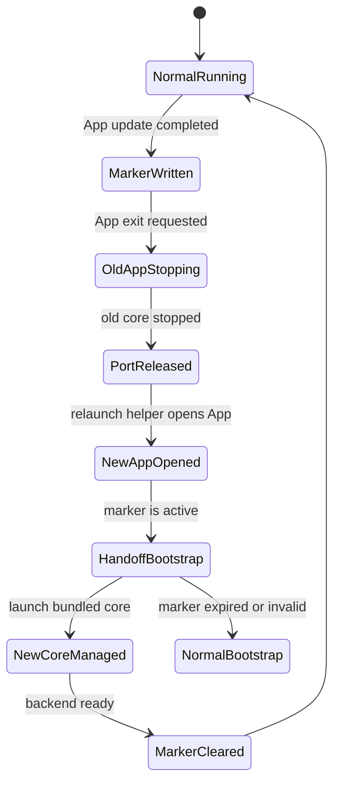

# Desktop Upgrade Handoff

## Problem

Desktop App upgrade currently has two independent lifecycles:

- the old App exits and asynchronously runs `bifrost stop`
- the new App is launched immediately and reuses any healthy backend on port `9900`

During an App-driven upgrade, the backend that looks healthy to the new App can still be owned by
the old App shutdown helper. The new App then records the backend as external, the old helper stops
it, the startup gate asks the user to start core, and CLI install requests can fail with a network
error while the backend is being restarted.

## Goals

- App-driven upgrades must have an explicit handoff between old App shutdown and new App startup.
- The new App must not reuse a backend that belongs to an in-progress upgrade handoff.
- CLI install from Desktop must recover from a transient core reconnect instead of showing a
  terminal install failure immediately.
- Normal Desktop startup, manual core start, and watchdog recovery behavior must remain unchanged
  outside the upgrade handoff path.

## Handoff Model

The upgrade restart command writes a one-shot marker in the shared Bifrost data directory:

```json
{
  "schema_version": 1,
  "created_at_ms": 1783612164000,
  "old_app_pid": 33300,
  "old_core_pid": 33310,
  "proxy_port": 9900,
  "app_target": "/Applications/Bifrost.app"
}
```

The marker is intentionally local and short-lived. It is not a durable upgrade record; it only
coordinates one App relaunch.

### Old App

1. `restart_desktop_after_update` resolves the current App bundle and backend state.
2. It writes the one-shot marker before requesting App exit.
3. It starts a detached relaunch helper using the desktop executable in helper mode.
4. It exits through the existing shutdown path, which still runs `bifrost stop`.

### Relaunch Helper

The helper is a small process mode of the desktop executable:

1. Read the marker path and App bundle from environment variables.
2. Wait for the old App PID to disappear.
3. Wait for the recorded core PID to disappear when available.
4. Wait for the recorded proxy port to stop answering health checks.
5. Remove the helper-only `HELPER`, `MARKER`, and `TARGET` environment variables from the relaunch
   command.
6. Relaunch the App bundle.

The helper does not start core itself. Its only responsibility is to avoid opening the new App while
the old App still owns the shutdown operation. Clearing the helper-only environment is a hard
one-shot boundary: on macOS, LaunchServices otherwise propagates the environment of `open -n` into
the new App, which would make every new App enter helper mode, exit, and open another App forever.

### New App

1. Startup reads a fresh one-shot marker from the data directory.
2. If the marker is active, backend bootstrap runs in upgrade handoff mode.
3. In upgrade handoff mode, `ensure_backend_running` skips health-based reuse entirely.
4. It waits briefly for the recorded port to release, then runs the existing stale-marker cleanup and
   launches the bundled backend as a managed child.
5. Readiness for the newly launched child requires both a healthy backend response and a
   `runtime.json` marker whose `pid` and `port` match that child. A health response from another
   process on the same port is not enough to complete managed startup.
6. After the backend becomes ready, the marker is removed.

Expired or invalid markers are removed and normal startup continues.

## State Machine



## Testable Contracts

- A fresh marker is considered active.
- A stale marker is ignored and deleted.
- Startup with an active marker disables existing backend reuse.
- Managed startup does not accept a healthy response from an unrelated process on the same port.
- Managed startup only accepts readiness when `runtime.json` belongs to the child it just spawned.
- Successful handoff startup clears the marker.
- Relaunch helper waits for process/port release before opening the App.
- The command that opens the new App explicitly removes all helper-only environment variables, for
  both macOS `.app` targets and direct executable targets.
- A real macOS update relaunch creates one new stable App process instead of a recursive Dock-icon
  launch/exit loop.
- CLI install reconnect errors trigger runtime/status recheck instead of permanently entering
  install-error state.
- The shell contract is executable when desktop system dependencies and sidecar resources are
  prepared. Runners without Linux `glib-2.0.pc` or `desktop/src-tauri/resources/bin/*` skip this
  desktop-only contract explicitly instead of failing unrelated shell E2E suites.

## Residual Boundaries

- If the old backend never exits, the helper eventually relaunches the App; the new App still sees
  the active marker and performs the no-reuse cleanup path.
- The marker is best-effort local coordination, not a security boundary.
