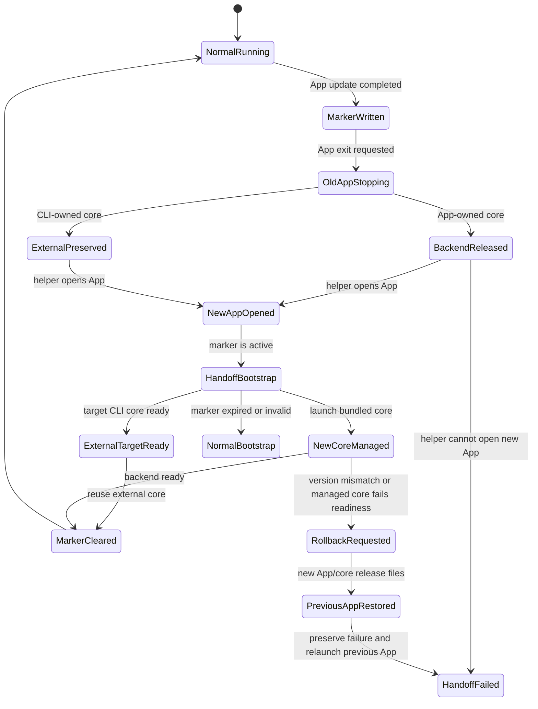

# Desktop Upgrade Handoff

## Problem

Desktop App upgrade has two ownership models that must not share the same shutdown behavior:

- an App-owned core is a managed child of the Desktop shell and must stop with that shell
- a CLI-owned core is restarted by the CLI updater and must survive Desktop shell shutdown

The original failure occurred when a CLI updater had already restarted the external core to the
target version, but the old Desktop shell unconditionally ran `bifrost stop` during exit and killed
that new core. The relaunched App then waited for another PID change that could never happen. Its
fresh relaunch marker remained valid for 15 minutes, so startup and every `Start Bifrost Service`
click repeated the same 30-second wait before returning to the recovery screen.

## Goals

- App-driven upgrades must have an explicit handoff between old App shutdown and new App startup.
- The new App must not reuse a backend that belongs to an in-progress upgrade handoff.
- Normal Desktop startup must reuse only a backend whose PID and port match the runtime marker in
  the same data directory. A healthy Bifrost service from another data directory is not a valid
  candidate, even when it listens on the preferred port or an adjacent fallback port.
- CLI install from Desktop must recover from a transient core reconnect instead of showing a
  terminal install failure immediately.
- A user who already has the failed marker/progress left by an older Desktop version must recover
  automatically after installing and opening the fixed App, without deleting state files manually.
- Desktop shutdown must stop only a core whose ownership can be proven.
- Normal Desktop startup, manual core start, and watchdog recovery behavior must remain unchanged
  outside the upgrade handoff path.
- Explicit CLI lifecycle commands must not silently change a live Desktop-owned runtime into a
  daemon. `bifrost stop` and `bifrost restart` reject a verified live
  `runtime_start_mode=desktop` runtime and direct the user to quit the Desktop app instead.

## One restart owner per upgrade

Before installation, the CLI snapshots `runtime_start_mode` to decide whether it may restart the
server. Desktop ownership disables the CLI restart for the entire transaction, including after
Desktop has replaced or removed the shared runtime marker. CLI ownership runs the CLI restart to
readiness before updating/relaunching Desktop. If that restart fails, the companion step does not run.
Windows deferred replacement performs the companion continuation from its helper after CLI restart.

Terminal-driven companion upgrades also write `desktop-upgrade-relaunch.json`, preserving the owner
and actual runtime port before stopping the App. Desktop-owned relaunch uses exactly that port;
port conflict is a failure rather than permission to choose the next port. A failed companion removes
only its own unchanged marker before restoring the previous App.

A failed Desktop child is cleaned up by its own process handle. It must never invoke a shared
`bifrost stop`: another CLI process may have won the bind race and now own `runtime.json`. Normal
startup can reuse that healthy winner; an unready competing runtime causes a visible failure.

## Handoff Model

The upgrade restart command writes a one-shot marker in the shared Bifrost data directory:

```json
{
  "schema_version": 1,
  "created_at_ms": 1783612164000,
  "old_app_pid": 33300,
  "old_core_pid": 33310,
  "proxy_port": 9900,
  "app_target": "/Applications/Bifrost.app"
}
```

The marker is intentionally local and short-lived. It is not a durable upgrade record; it only
coordinates one App relaunch.

### Old App

1. `restart_desktop_after_update` resolves the current App bundle and backend state.
2. It writes the one-shot marker before requesting App exit.
3. It starts a detached relaunch helper using the desktop executable in helper mode.
4. It exits through an ownership-aware shutdown path:
   - a live managed child is stopped
   - a `runtime_start_mode=desktop` runtime is stopped only when its PID and port still match the
     active backend identity
   - a daemon, unknown, or stale runtime marker is preserved as external CLI-owned state

### Relaunch Helper

The helper is a small process mode of the desktop executable:

1. Read the marker path and App bundle from environment variables.
2. Wait for the old App PID to disappear.
3. For an App-owned marker, wait for the recorded core PID and proxy port to be released.
4. For a CLI-owned marker (`old_core_pid=null`), preserve the external core and do not wait for its
   PID or port to disappear; the CLI updater owns that restart.
5. Remove the helper-only `HELPER`, `MARKER`, and `TARGET` environment variables from the relaunch
   command.
6. Relaunch the App bundle.

The helper does not start core itself. Its only responsibility is to avoid opening the new App while
the old App still owns the shutdown operation. Clearing the helper-only environment is a hard
one-shot boundary: on macOS, LaunchServices otherwise propagates the environment of `open -n` into
the new App, which would make every new App enter helper mode, exit, and open another App forever.

### New App

1. Startup reads a fresh one-shot marker from the data directory.
2. If the marker is active, backend bootstrap runs in upgrade handoff mode.
3. In upgrade handoff mode, `ensure_backend_running` skips health-based reuse entirely.
4. If the marker represents an App-managed core, it waits briefly for the recorded port to release,
   then runs the existing stale-marker cleanup and launches the bundled backend as a managed child.
5. If the marker represents a CLI-owned core, it waits for a backend serving the pinned target
   version. The target version is authoritative: the PID may differ, or may remain unchanged when
   the CLI updater has already completed before Desktop relaunch. Legacy markers without a pinned
   target retain the stricter PID-change requirement.
6. If no target backend appears, Desktop reports a CLI restart failure. It must not start a
   managed core, stop an old CLI core, or select an adjacent port, even when the recorded port is free.
7. A previous `Failed` progress for the same CLI handoff error makes the next attempt recheck with
   zero additional handoff wait. It still preserves CLI ownership; recovery requires the CLI service
   to become ready on the recorded port.
8. While a CLI handoff marker remains active, ordinary health polling accepts only a backend that
   satisfies the marker's target identity. A healthy wrong-version service cannot clear the startup
   gate or remove the marker. A matching target backend completes progress and clears the marker.
9. Readiness for the newly launched child requires both a healthy backend response and a
   `runtime.json` marker whose `pid` and `port` match that child. A health response from another
   process on the same port is not enough to complete managed startup.
10. For a deferred Windows MSI/EXE, the helper keeps the pre-install directory snapshot and pending
   guard until the relaunched App verifies both its compiled version and its managed core. A version
   mismatch or managed-core startup failure writes `Failed` and asks the App to shut down normally;
   the still-running helper then restores the complete previous install and relaunches it.
11. After the backend becomes ready, the marker is removed and the Windows helper commits the
   transaction by deleting the snapshot, pending guard, and updater-owned package.
12. The new App is the final terminal-progress owner: it rewrites progress to `Completed` only after
   the managed core is ready; helper relaunch failure or managed-core startup failure rewrites it to
   `Failed` while preserving the selected target/source for diagnosis and retry.

Expired or invalid markers are removed and normal startup continues.

### Normal Startup Ownership

Outside an upgrade handoff, Desktop may reuse an already-running backend only when all of these
conditions hold:

1. the current Desktop data directory contains a valid `runtime.json`
2. the candidate port equals the marker port
3. `/_bifrost/api/system` reports the same PID as the marker
4. the support endpoint is healthy

Desktop does not scan for and reuse an arbitrary healthy Bifrost service without this identity
proof. If another data directory owns an adjacent candidate port, Desktop skips that port and starts
its own managed core on a different available port. This keeps configuration, certificates, traffic,
and update ownership scoped to the selected data directory.

### CLI Lifecycle Boundary

The shared runtime marker is authoritative for explicit CLI lifecycle commands:

- `bifrost stop` may stop foreground, daemon, unknown, or legacy runtimes, but it refuses a live
  Desktop-owned runtime before changing system proxy state or sending a signal.
- `bifrost restart` performs the same check before creating its detached orphan. It never converts a
  Desktop-managed child into a CLI daemon.
- A stale Desktop marker whose PID is no longer running, or whose recorded process start time
  mismatches the current process using that PID, is still cleaned through the existing stale marker
  path. Legacy markers without a start time retain the compatible PID-only check.
- `--force` does not override Desktop ownership. It remains an override for daemon restart failures,
  not permission to steal App ownership.

## State Machine



## Testable Contracts

- A fresh marker is considered active.
- A stale marker is ignored and deleted.
- Startup with an active marker for a managed core disables existing backend reuse.
- A marker with no managed `old_core_pid` records the observed external CLI PID and pinned target.
  The relaunched App reuses any PID serving that pinned target, falls back to the bundled backend
  when the port is free, safely takes over a wrong-version core only when its PID/port match the same
  data directory runtime marker, and fails instead of killing or shadowing an unrelated listener.
- Desktop shutdown stops a live managed child or a verified `runtime_start_mode=desktop` backend,
  and preserves daemon/unknown/stale external runtimes.
- The CLI-owned helper waits only for the old App process; it does not wait for the external core
  or its port to be released.
- A prior matching CLI handoff `Failed` state, including one paired with a legacy marker lacking
  `target_version`, retries with zero wait after App upgrade.
- Runtime polling cannot complete a CLI handoff from a healthy wrong-version backend; a matching
  target backend publishes `Completed` and clears the relaunch marker.
- Managed startup does not accept a healthy response from an unrelated process on the same port.
- Managed startup only accepts readiness when `runtime.json` belongs to the child it just spawned.
- Normal startup reuses a healthy backend only when the same data directory runtime marker matches
  the candidate Admin PID and port.
- CLI stop/restart rejects a live Desktop-owned runtime before cleanup, fork, signal, or daemon
  spawn; stale Desktop markers remain removable.
- Successful handoff startup clears the marker.
- Successful handoff refreshes terminal progress only after the new managed core is ready.
- The relaunched App never deletes a Windows rollback snapshot, pending guard, or updater-owned
  package. It only publishes `Completed`; the waiting helper durably observes that terminal state
  before it commits cleanup. A crash or progress write failure therefore still leaves rollback
  material available to the helper.
- Relaunch/open or managed-core startup failures persist `Failed` progress with the original target.
- Relaunch helper waits for process/port release only for App-owned cores.
- A running Windows desktop process selects App-owned handoff only when the live runtime marker is
  also `Desktop`; a desktop shell that is reusing a CLI-owned core must not change progress ownership
  or cause the relaunched App to start a second bundled core.
- Windows pending-install and relaunch markers remain active for 15 minutes. This exceeds the helper's
  explicit maximum of 30 seconds waiting for the App, 30 seconds waiting for core, and 10 minutes
  waiting for MSI/EXE installation, so a second updater cannot enter during a still-valid handoff.
- Before invoking a Windows MSI/EXE installer, the updater snapshots the existing desktop install
  directory outside the install target. The install and pinned-target version probe form one
  transaction: installer failure or post-install version mismatch restores the complete previous
  directory; a failed first install is removed. If a failed installer did not change any file, the
  updater compares the installed tree with its snapshot, reports that the previous App is unchanged,
  and skips a redundant write back into a protected machine-wide directory. A real content change,
  including equal-length byte changes, still takes the restore path. Rollback failure is reported
  together with the original install error instead of being hidden.
- The deferred Windows helper owns the same transaction across App processes: it must not remove the
  pending guard, updater package, or install snapshot merely because the installer exits successfully.
  It commits only after the relaunched App/core reports `Completed`; on version mismatch, early App
  exit, verification timeout, or managed-core failure it releases scoped install processes, restores
  the snapshot, preserves `Failed`, and relaunches the previous App.
- Windows self-update CI builds the current and pinned target executables separately with the same
  `BIFROST_VERSION` injection used by release builds. Before exercising replacement, the target
  executable must pass both `bifrost --version` and a real `/api/system.version` core probe; CLI-only
  byte rewriting is not accepted as proof that the upgrade package contains the requested core.
- `bifrost upgrade --local-assets <DIR>` is the release-rehearsal source. It accepts exactly one
  release-named CLI archive for the running target and the same-version Desktop package, rejects
  empty files and symlinks, then feeds those files into the normal extraction, atomic replacement,
  Desktop install, version verification, restart, and rollback flow. The override environment is
  scoped to the upgrade process and inherited by the staged Windows handoff, so local mode changes
  only asset discovery rather than creating a second installer implementation. A legacy installed
  CLI that predates the flag may use `scripts/windows/invoke-local-upgrade.ps1`; that wrapper waits
  for the executable hash to change before its single version probe so the test harness cannot lock
  the file being replaced. Local rehearsal fails closed when the running CLI belongs to Homebrew,
  npm, or pnpm: those managers own their install trees and cannot consume the release archive
  directory without contacting their package source. Normal upgrades without `--local-assets`
  retain the package-manager path; local rehearsal must use a standalone or install-script binary.
- `scripts/windows/build-local-upgrade-assets.ps1` creates the CLI archive and Desktop package with
  the exact release filenames and version injection on the Windows VM. It snapshots and restores
  tracked Cargo/Tauri metadata byte-for-byte, allowing repeated `local.N` builds without publishing
  a tag or contaminating the source diff.
- Windows CLI self-replacement delegates helper generation to the staged target executable through
  a hidden `windows-upgrade-handoff` command. Once the running updater contains this handoff, its
  staged target owns retry/cleanup fixes before replacing the installed CLI. Compatibility fixes for
  earlier updaters cannot rely on that handoff: those binaries may still start the Desktop companion
  from the old installed CLI, so the first fixed Desktop MSI must be correct independently. The
  handoff validates that it is executing from
  `.bifrost.exe.pending.<old-pid>` beside the sole allowed `bifrost.exe` target, rejects PID zero,
  cross-directory paths, arbitrary target names, and malformed target versions, then creates the
  no-window PowerShell helper that waits for the original updater PID. The old updater does not wait
  for the staged process to exit, because that process and its PowerShell descendant both participate
  in replacing the updater executable. Instead, it polls a validated sibling
  `.bifrost-upgrade-handoff.<old-pid>.ready` marker written by the PowerShell helper before the helper
  starts waiting. A bounded 10-second handshake proves the detached helper is alive without forming
  an updater → staged target → helper → updater wait cycle; all participants remove the marker on
  success, failure, or timeout.
- Windows Desktop release versions use Tauri/MSI-safe fourth components. Post-install comparison
  maps semantic prereleases with the same algorithm as `scripts/sync-tauri-version.mjs` (`alpha`,
  `beta`, `rc`, numeric and fallback channels), so `0.0.181-10008` is accepted as the packaged form
  of `0.0.181-alpha.8` without weakening pinned-target verification.
- An existing Windows MSI registration is authoritative for both install scope and install location.
  HKLM products keep `ALLUSERS=1`; HKCU products keep `ALLUSERS=2 MSIINSTALLPERUSER=1`. Elevated
  machine-wide replacement also passes `INSTALLDIR=<existing directory>` explicitly, because WiX can
  otherwise resolve its default directory against the interactive administrator's LocalAppData while
  still writing an HKLM product registration. Tauri's upstream WiX template runs `AppSearch` after
  parsing command-line properties and searches directly into `INSTALLDIR`, which overwrites an explicit
  machine path with either the default value or `InstallDir` under
  `HKCU\Software\bifrost\Bifrost`. Bifrost's version-pinned WiX template searches those values into
  `PREVINSTALLDIR` instead, marks public `INSTALLDIR` as `Secure` so it crosses the elevated MSI
  client/server boundary, then copies the prior value only when the caller did not provide a directory.
  This keeps interactive installs at their previous custom directory while making an explicit updater
  directory authoritative inside the MSI itself, including upgrades initiated by older CLIs. The
  updater passes MSI switches as native switches and quotes only arguments that require Windows
  command-line quoting, including paths with spaces.
- The command that opens the new App explicitly removes all helper-only environment variables, for
  both macOS `.app` targets and direct executable targets.
- A real macOS update relaunch creates one new stable App process instead of a recursive Dock-icon
  launch/exit loop.
- CLI install reconnect errors trigger runtime/status recheck instead of permanently entering
  install-error state.
- The shell contract is executable when desktop system dependencies and sidecar resources are
  prepared. Runners without Linux `glib-2.0.pc` or `desktop/src-tauri/resources/bin/*` skip this
  desktop-only contract explicitly instead of failing unrelated shell E2E suites.

## Residual Boundaries

- If the old backend never exits, the helper eventually relaunches the App; the new App still sees
  the active marker and performs the no-reuse cleanup path.
- The marker is best-effort local coordination, not a security boundary.
- The macOS bundle installer stages and verifies the target before rename swapping it. If the
  process is interrupted after moving the old bundle to its PID-scoped backup, the next attempt
  restores that backup before staging again; it must never delete the only known-good App.
- Windows deferred CLI replacement updates the installed App to the same pinned target first,
  keeps an executable backup during replacement, verifies `bifrost --version`, and restores the
  previous executable before publishing `failed` when replacement verification fails.
- Release-level Windows acceptance is always a clean-install transition, never an in-place retry on
  an already contaminated VM: uninstall every registered Bifrost MSI/legacy installer, terminate
  Bifrost processes, remove Program Files/LocalAppData/user data and all upgrade helper artifacts,
  install the immediately previous version, and let that previous executable initiate the update.
  A release is not accepted until both a locked-file failure/rollback run and an unlocked success
  run finish with one installer registration and no pending/backup/helper/status residue. The first
  fixed release is additionally followed by a fixed-release-to-next-release transition to prove the
  staged-target handoff itself, rather than only compatibility with the legacy helper.
- Before creating that release, the same commit must pass the local Windows asset matrix: a stale
  HKCU AppSearch directory with a machine-wide MSI, an invalid-package rollback, and a transient
  target-file lock followed by an unlocked success. Publishing another tag is not a debugging loop;
  the final remote run is allowed only after local versions converge with one HKLM registration,
  Program Files ownership, no terminal window, and no helper/pending/backup residue.
- Because the WiX template is copied from `@tauri-apps/cli` 2.10.1, upgrading the Tauri CLI requires
  an explicit template comparison and Windows MSI rebuild before accepting the dependency update.
- Release discovery follows the running binary's semantic channel. A stable binary queries only
  published stable releases. An `alpha` binary scans published prereleases and selects only the
  newest `alpha` release; `beta`, `rc`, draft, and stable releases are excluded. Prerelease ordering
  uses semantic numeric identifiers, so `alpha.10` is newer than `alpha.9`. Cached results are
  reusable only when their channel matches the running binary, including stale-cache fallback.
  The first binary containing this discovery fix must be installed explicitly; acceptance then
  publishes one more adjacent alpha and proves the fixed alpha discovers and upgrades to it through
  the default `bifrost upgrade` command. The stable path uses the same replacement/handoff flow but
  never opts into prereleases.
- The Windows helper removes its ready marker and transaction log after publishing the durable
  terminal status, in addition to deleting its argument file and PowerShell script. Direct CLI
  upgrades and failed transactions therefore do not accumulate helper artifacts when no Desktop
  observer is present.
- Windows Installer registration is still maintained by MSI/EXE itself; the updater transaction
  guarantees that the previous launchable App files are restored when package verification fails.
