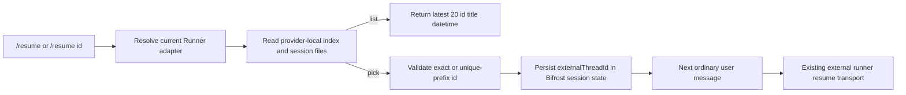

# External Runner 本地 Session Resume

## 背景

Bifrost 的 Codex、Traex 与 Claude Code external runner 已能保存新建会话返回的
`threadId`，并在后续 turn 使用 provider 原生命令恢复。但用户无法把客户端已经存在的
本地 session 绑定到当前 Bifrost Chat/IM session，只能从 Bifrost 内新建会话。

本设计增加统一 `/resume` slash command：读取当前 Runner 对应 provider 的本地 session
索引，列出最近 20 条，并允许用户用 `/resume <id>` 选择。选择动作只更新 Bifrost 当前
session 的外部 thread 绑定；下一条普通消息继续走现有 external runner runtime、队列、
权限、进度和历史链路。

### Traex legacy thread 兼容

Traex 0.201.4 的 app-server 在恢复部分包含 compaction 记录的旧 session 时，默认会为
`thread/resume` 响应物化完整 `thread.turns`。旧 rollout 中同一个 turn 可能被重复投影到
`thread_turns`，从而在读取历史阶段触发 `(thread_id, turn_id)` 唯一键冲突。此时同一个
session 通过 `traex resume <session-id>` 可以继续，但 Bifrost 的 app-server 路径会在
`turn/start` 之前失败。

Bifrost 对已有 Traex thread 的 `thread/resume` 请求发送实验参数
`excludeTurns: true`。该参数只省略 resume 响应里的历史 turns，不更换 thread、不删除或
改写 Traex session 数据，也不影响 Traex 在后续 `turn/start` 中加载原上下文。Bifrost
initialize 已声明 `experimentalApi: true`，因此不需要增加新的握手能力。

兼容处理严格限定为 Traex resume：Traex `thread/start`、Codex start/resume 以及
`thread/fork` 均保持原参数和响应语义。

## 用户目标验证清单

### 必须实现

- Codex、Traex、Claude Code Runner 均支持 `/resume`。
- `/resume` 按最近更新时间倒序列出最多 20 条，字段固定为 `id / title / datetime`。
- `/resume <id>` 验证本地 session 后绑定到当前 `sessionKey + adapter + runnerId`。
- 下一条普通消息分别使用 Codex/Traex 的 `threadId` resume 或 Claude Code 的
  `--resume <sessionId>`。
- Web Chat slash 面板展示 `/resume`；IM `/help` 展示该命令。

### 必须不破坏

- 不读取或返回 session 正文；列表只暴露 id、标题和时间。
- 不允许用任意未验证 id 写入 session state；完整 id 与唯一前缀均须命中本地文件。
- 不跨 provider 查找：Traex 不能命中 Codex session，Claude Code 同理。
- 不在 runner 正在执行时换绑 session。
- 不直接启动 CLI；选择后仍由下一条普通消息进入既有 runtime。
- 不清除当前 Bifrost 可见聊天历史、模型/effort/fast override 或工作目录。
- 不修改、清理或重建 Traex thread-store、rollout 与 session 文件。
- Codex resume 仍返回完整 turns；Traex start、fork 与 checkpoint fork 不添加
  `excludeTurns`。

### 必须真实验证

- 用隔离 HOME/provider home 和合成 JSONL 验证三 provider 的发现、排序、标题与时间。
- 通过真实 Chat Gateway `/chat` 或 `/chat/stream` 验证列表和 pick 不执行 mock runner。
- pick 后发送普通消息，断言 mock Codex/Traex/Claude Code 收到对应 resume 参数。
- 对真实本机会话只做只读 smoke：确认能列出且不修改 provider session 文件。
- 用 app-server mock 断言 Traex resume 请求包含 `excludeTurns: true`，成功响应后继续发送
  `turn/start`；同时断言 Traex start 和 Codex resume 不包含该字段。
- 在正式数据的隔离副本中，用已知会触发 legacy history 唯一键冲突的 Traex session
  验证 resume 可以进入下一轮；测试不得写入正式 provider home。

## 命令语义

```text
/resume
/resume <full-id-or-unique-prefix>
```

- `/resume`：当前 Runner adapter 不支持时返回明确错误；没有本地 session 时返回空状态。
- `/resume <id>`：优先完整匹配；否则允许唯一前缀。零匹配返回未找到，多匹配要求使用
  更长 id。
- pick 成功回复 provider、title、datetime 和 id，并提示“下一条消息将恢复此会话”。
- `/resume` 带多个空白分隔参数、超长 id 或非法字符时返回用法错误。

## Provider 数据源

| Provider | Session 文件 | 标题/时间辅助索引 | 环境变量 |
| --- | --- | --- | --- |
| Codex | `<CODEX_HOME>/sessions/**/*.jsonl` | `<CODEX_HOME>/session_index.jsonl` | `CODEX_HOME` |
| Traex | `<TRAE_HOME>/cli/sessions/**/*.jsonl` | `<TRAE_HOME>/cli/history.jsonl` | `TRAE_HOME`, `TRAEX_HOME` |
| Claude Code | `<CLAUDE_CONFIG_DIR>/projects/**/*.jsonl` | `<CLAUDE_CONFIG_DIR>/history.jsonl` + session `ai-title` | `CLAUDE_CONFIG_DIR`, `CLAUDE_HOME` |

未设置 provider home 时，从当前 OS 用户 home 下的 `.codex`、`.trae`、`.claude`
读取。Traex rollout 与 Codex-like metadata 共享小型解析 helper，但 root、辅助索引和
adapter id 始终独立。

## 扫描与安全边界

- 只遍历固定 provider root 下的常规 `.jsonl` 文件，不跟随目录 symlink。
- 单文件设置上限；坏行、截断行和未知事件向前兼容地跳过，不能导致整个列表失败。
- title 只取索引标题、`ai-title` 或第一条用户文本；压成单行并截断，禁止把正文、工具
  输出或控制字符带入回复。
- datetime 统一输出 UTC RFC3339 秒精度；优先 session 事件/索引时间，最后回退文件
  mtime。
- 同 id 只保留更新时间最新且信息最完整的一条。

## 状态与运行链路



状态写入复用 `ImAgentSessionState.external_thread_id`。pick 时清除旧
`external_conversation_id`，避免不同 provider 会话标识混用；其它 session 字段保持不变。

## 测试计划

- 单元测试：parser、三 provider fixture、20 条截断、排序、标题清洗、完整/前缀/歧义 id、
  session state 写入与 command spec resume 参数。
- E2E：`e2e-tests/tests/test_im_gateway_local_session_resume.sh` 用隔离目录、mock runner 和
  Chat Gateway 验证 list → pick → next turn resume；app-server mock 验证 Traex resume 的
  `excludeTurns` 参数及后续 `turn/start`。
- human tests：`human_tests/local-session-resume.md` 逐条执行隔离链路及真实本机只读 smoke。
- 回归矩阵：Traex resume 添加 `excludeTurns: true`；Traex start、Codex resume 和 fork
  均不添加；坏 legacy session 的隔离副本可继续且正式文件哈希不变。
- Rust 生产代码变更后执行 `make coverage-changed`，远端执行 workspace coverage gate。
