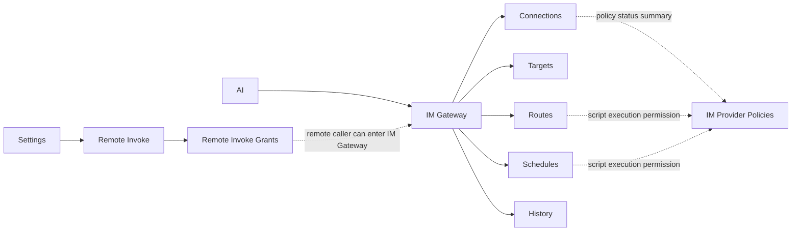
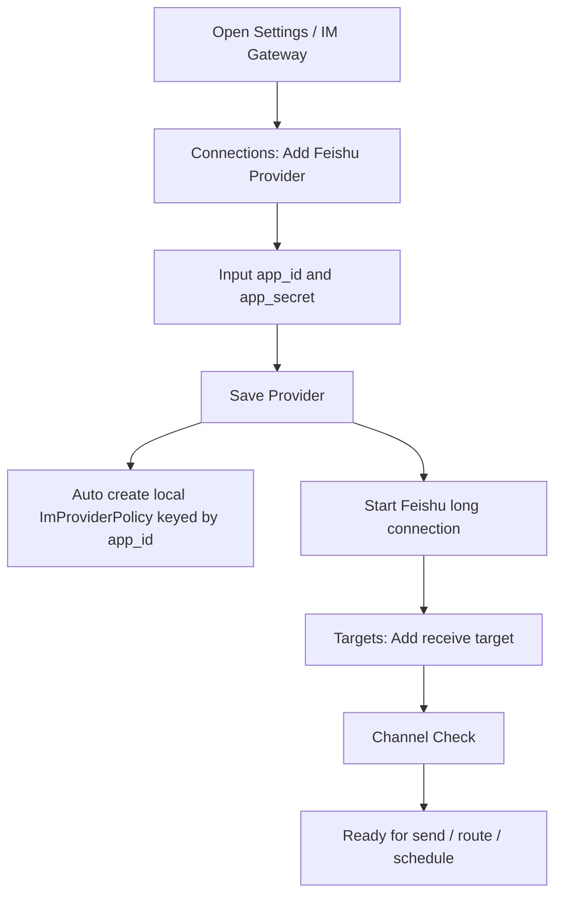
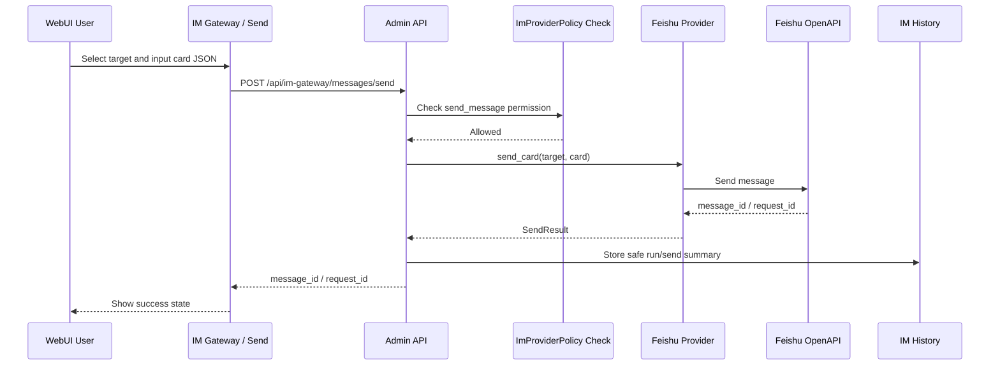
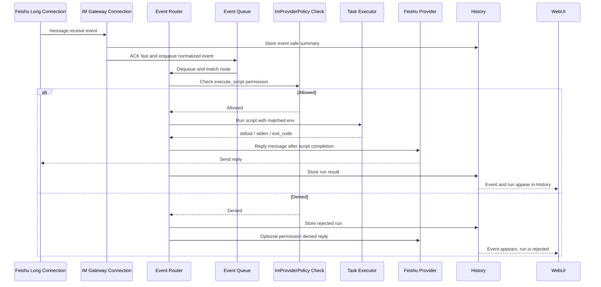
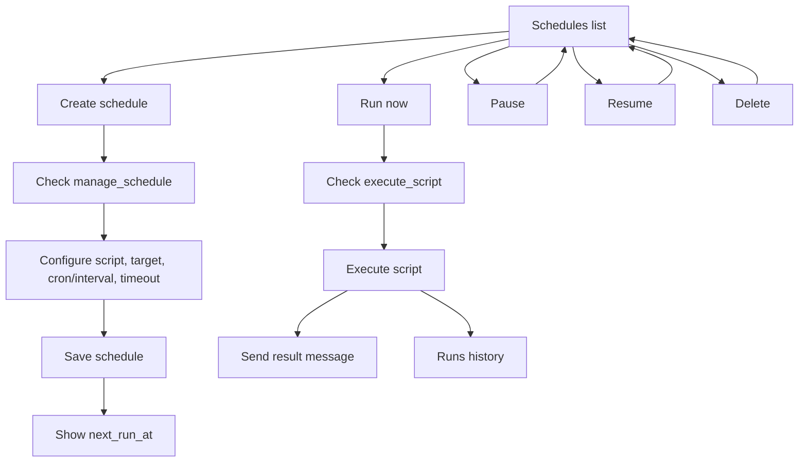
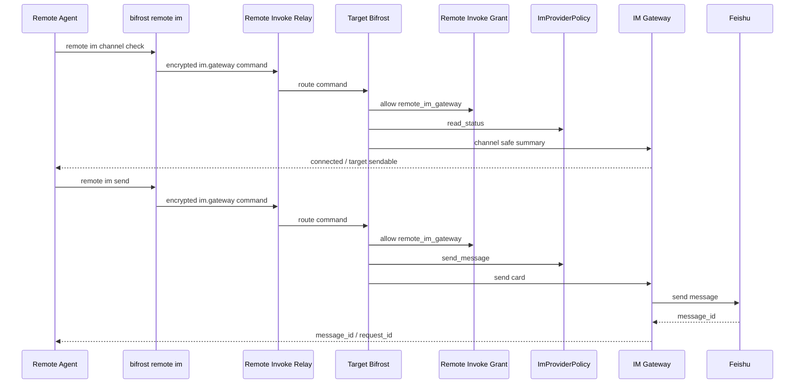

# IM Gateway 顶级网关设计

> 状态：讨论稿
> 范围：先设计，不实现
> 目标版本：第一阶段支持 Feishu，架构预留 WeChat 等其他 IM provider

## 背景

当前 Remote Invoke 已经具备跨设备发起远程命令的基础能力，但用户提出的 IM 能力不应被建模为 Remote Invoke 的一个子功能。它本质上是一个顶级消息网关：

- 能配置 IM 机器人凭据和目标接收对象
- 能主动发送 IM 消息，第一阶段要求支持飞书兼容的卡片消息
- 能建立与飞书开放平台的长连接，接收机器人消息事件
- 能把收到的 IM 消息路由到任务执行器；第一版本仅执行脚本并在脚本完成后返回消息，后续预留触发已有任务等 agent 能力
- 能管理定时任务，包括新增、删除、修改、暂停、恢复、手动执行、超时控制和执行历史
- 后续需要平滑接入 WeChat 等其他 IM 通道

因此本方案把能力命名为 `IM Gateway`，作为 WebUI 一级 `AI` 页面中的 IM 通道管理区和 CLI 顶级命令，而不是放进 `Remote Invoke` Tab。

## 设计结论

1. 新增顶级模块 `IM Gateway`。
2. WebUI 提供与 Settings 同级的一级 `AI` 入口，并在其中整合 `Agent` 与 `IM Gateway` 子导航。
3. Feishu 是第一阶段 provider，但内部抽象必须按多 IM provider 设计。
4. Feishu 必须使用开放平台长连接模式接收事件，不使用 Webhook 作为第一阶段主路径。
5. `app_id` / `app_secret` 只保存在目标 Bifrost 本地数据目录，不通过 relay 明文传输，不写入 Recent Calls 明文，不写入 caller 本地连接文件。
6. Remote Invoke 只作为“远程管理 IM Gateway”的控制入口。飞书长连接始终由目标端 Bifrost 本地进程直接连接飞书开放平台。
7. 远程创建或修改可执行脚本的 route / schedule 是高权限持久化执行能力，必须独立授权，不能复用普通 query 或 shell grant。
8. IM Gateway 的脚本执行策略使用独立的 `ImProviderPolicy` 作为本地权限事实源；Remote Invoke 只负责远程管理入口的授权，不承载 provider 本地事件触发的权限主体。
9. Feishu 第一版本默认以 `app_id` 作为 provider identity key，用于绑定 `ImProviderPolicy`、审计和远程安全摘要；不把 provider 伪装成 Remote Invoke caller grant。

## 目标与非目标

### 目标

- WebUI 新增与 `Settings` 同级的一级 `AI` 页面，独立于 `Remote Invoke`。
- 支持配置 Feishu provider：
  - `app_id`
  - `app_secret`
  - API base URL，默认 `https://open.feishu.cn/open-apis`
  - 长连接开关
  - 事件订阅状态展示
- 支持配置目标接收对象：
  - 人
  - 群
  - 邮箱或其他飞书支持的 receive id 类型
- 支持直接发送飞书兼容卡片消息：
  - 本地 CLI
  - 本地 Admin API
  - Remote CLI
  - WebUI
- 支持主动发送图片与图文卡片：
  - 图片来源支持已有 `image_key`，或由 CLI / Admin API 提供图片 bytes/base64 后由 provider 上传获得 `image_key`
  - 图文卡片支持标题、Markdown 文本、图片 `image_key` 或上传图片，最终映射为 Feishu `interactive` card
  - 继续保留原始 card JSON 直通能力，避免破坏高级用户手写 Feishu card 的路径
- 支持 Feishu 长连接事件接收：
  - 消息事件
  - 机器人被 @ 的消息
  - 后续可扩展卡片回调等事件类型
- 支持事件路由：
  - 第一版本仅支持接收消息后执行脚本，并在脚本执行完成后把结果作为消息返回
  - 按 provider / chat_id / user_id / keyword / regex 匹配
  - 为后续 agent 任务执行、卡片交互回调、触发已有任务等能力预留统一路由模型，但不进入 V1 交付范围
- 支持定时任务：
  - cron 表达式
  - fixed interval
  - 手动 run once
  - timeout
  - 并发限制
  - pause / resume
  - 执行历史
- 支持远程管理 IM Gateway：
  - `bifrost remote im ...`
  - 需要独立的 `remote_im_gateway` Remote Invoke grant scope，授权远程 caller 进入目标端 IM Gateway 管理 API
  - 面向各种 coding agent / automation agent 的运行场景，提供安全的通知与任务配置能力：
    - 检查 IM 通道是否可用
    - 检查指定 target 是否可发送
    - 发送通知卡片
    - 创建、修改、暂停、恢复、删除定时通知任务
    - 手动执行已配置任务
    - 查询任务运行状态和必要的执行摘要
  - 明确不提供通过 remote 获取密钥、获取完整 provider 配置详情、导出原始配置的能力

### 非目标

- 第一阶段不实现 WeChat，只保证 provider 抽象能承载。
- 第一阶段不做通用工作流编排器，只提供 IM event -> route -> task 的最小闭环。
- 第一阶段不把 IM Gateway 放到 relay 执行。relay 只转发加密 remote command。
- 第一阶段不把 Feishu event 原始 payload 永久完整保存为默认行为。
- 第一阶段不支持卡片回调触发脚本或任务。
- 第一阶段不支持从任意未授权群聊触发脚本执行。
- 第一阶段不支持跨设备共享同一个 provider secret。
- 第一阶段不支持 `bifrost remote im` 读取 `app_secret`、secret_ref 明文、完整 provider config、完整 raw event payload。
- 第一阶段不支持远程导出可直接迁移到另一台机器的 IM Gateway 配置包。

## 用户体验

### AI 一级页面

主侧栏新增与 `Settings` 同级的 `AI` 入口。`AI` 页面把原 Settings 内的 `Agent` 与 `IM Gateway` 两个 tab 合并为一条左侧子导航：

```text
AI
  Agent
    - General
    - Model
    - Runtime
    - History
    - Memories
    - Skills
    - Memory Records
    - MCP Servers
    - Sessions
  IM Gateway
    - Connections
    - Targets
    - Routes
    - Schedules
    - History
```

`Remote Invoke` 继续管理远程授权、连接、Recent Calls、Shell Access、File Access 等远控相关内容。

`IM Gateway` 独立管理 IM 通道、发送、事件接收和任务。

### IM Gateway 页面内部结构

AI 页内部使用左侧二级导航，每次只在右侧渲染当前面板，并通过 URL 查询参数 `aiSection` 记录合并后的当前面板；保留 `agentSection` 与 `imGatewaySection` 用于各子模块刷新恢复：

```text
IM Gateway
  - Connections
  - Targets
  - Routes
  - Schedules
  - History
```

刷新或复制链接后应恢复到同一个二级面板，例如 `AI?aiSection=im-gateway-routes&imGatewaySection=routes` 直接打开 Routes。桌面端左侧二级导航固定在自身列，右侧面板内容独立滚动；窄屏下导航退化为顶部横向滚动导航。Settings 页不再展示 `Agent` 或 `IM Gateway` tab。

#### Connections

展示 provider 和长连接状态：

- provider 名称
- provider 类型：`feishu`
- enabled 状态
- app_id，展示脱敏值
- secret 状态：已配置 / 未配置，永不展示明文
- 长连接状态：
  - disconnected
  - connecting
  - connected
  - reconnecting
  - failed
- 最近连接时间
- 最近事件时间
- 重连次数
- 最近错误
- 订阅事件列表

#### Targets

管理接收对象：

- target id
- provider id
- receive_id_type
- receive_id
- display name
- 默认消息类型
- enabled

第一阶段 Feishu 支持：

- `open_id`
- `user_id`
- `union_id`
- `email`
- `chat_id`

### Outbound 图片与图文消息

当前实现现状：

- `send_text` 已支持 Feishu `text` 消息。
- `send_card` 已支持把调用方提供的原始 Feishu `interactive` card JSON 直通发送；如果调用方自己准备好了带 `img_key` 的卡片 JSON，底层可以发送。
- 缺口是 provider/API/CLI 没有一等图片消息、图片上传、以及“图片 + 文本”图文卡片构造入口。

补齐方案：

1. Provider 抽象新增图片能力：
   - `upload_image(config, image_type, file_name, bytes, mime_type) -> UploadedImage`
   - `send_image(config, target, image_key, uuid) -> SendResult`
2. Feishu provider 映射：
   - 上传图片：`POST /im/v1/images`，multipart 字段为 `image_type=message` 和 `image=<file>`，返回 `data.image_key`
   - 发送图片：`POST /im/v1/messages?receive_id_type=...`，`msg_type=image`，`content={"image_key":"..."}`
   - 发送图文卡片：仍走 `msg_type=interactive`，卡片元素包含 `img` 和 `markdown`
3. Admin API `POST /_bifrost/api/im-gateway/messages/send` 兼容字段：
   - 旧字段 `content` / `text` / `card` 保持不变
   - 新增 `image`：`{ "image_key": "..."}`
   - 新增 `image` 上传：`{ "data_base64": "...", "file_name": "chart.png", "mime_type": "image/png", "image_type": "message" }`
   - 新增 `rich_card`：`{ "title": "...", "text": "...", "image_key": "..." }`
   - 新增 `rich_card.image`，结构同 `image`，用于上传后生成卡片图片元素
4. CLI `bifrost im send` 新增参数：
   - 图片消息：`--image-key <key>` 或 `--image-file <path>`
   - 图文卡片：`--card-title <title> --card-text <markdown> --card-image-key <key>`
   - 图文卡片上传图片：`--card-image-file <path>`
   - 兼容路径：`--text`、`--card-json`、`--card-file` 不变
5. 安全与边界：
   - 图片 bytes 只在请求体和 provider 调用中流转，不写入 provider 配置、message log 或文档
   - message log 只记录 `[image:<image_key>]` 或卡片标题 preview
   - provider secret 仍只通过本地配置读取，所有响应保持脱敏
   - 未支持的 `msg_type` 明确拒绝，避免默默当作卡片发送
6. Agent 最终输出 Markdown 图片：
   - Agent final reply / session-free reply / continuation reply / streaming progress final flush 在进入 Feishu 卡片前扫描非代码块 Markdown 图片
   - 本地绝对路径、`file://`、以及相对 Provider `agent_config.work_dir` 的图片会上传到 Feishu，并把 `` 改写为 ``
   - 上传缓存按 `provider_id + canonical path + size + mtime` 命中，避免流式输出或重复回复时反复上传同一张图片造成卡顿
   - HTTP/HTTPS 图片按链接文本降级；本地图片上传失败时降级为文本占位，禁止把本地路径 Markdown 图片原样送入 Feishu card，避免卡片整体发送失败

验证计划：

- 单元测试：
  - CLI build send body 覆盖 `--image-key` 和图文卡片参数
  - Admin handler 覆盖 image payload 归一化、rich card 构造
  - Agent reply Markdown 图片路径解析、上传失败 fallback、缓存 key 行为
  - Feishu provider 编译覆盖 multipart 上传和 `msg_type=image` 发送路径
- E2E 测试：
  - 更新 `e2e-tests/tests/test_im_cli_provider_selection_send_owner.sh`，fake Feishu 同时覆盖 token、图片上传、图片消息发送、图文卡片发送
- human_tests：
  - 在 `human_tests/im-gateway.md` 增加图片消息、图片上传图文卡片、原始 card JSON 兼容、Agent Markdown 图片自动上传和缓存回归用例，并立即按用例执行
- Review/Fix/Test：
  - 第 1 轮复查 provider/API/CLI/doc/test 对齐，复跑 IM 单元与 E2E
  - 第 2 轮复查兼容性、secret 不泄露、message log preview 和 human_tests 索引，复跑受影响测试

#### Routes

管理 inbound event 触发规则：

- route id / name
- provider id
- event type，第一版本仅启用 message receive / app mention 这类消息接收事件
- match 条件
- action 类型，第一版本固定为 script then reply
- timeout
- enabled
- 最近触发状态

示例：

```text
收到 oc_xxx 群里的 "/check bifrost" 消息
  -> 执行 ./scripts/check-service.sh bifrost
  -> 脚本执行完成后，把 stdout / stderr 摘要转成消息回复到原群
```

第一版本不交付以下 inbound action，只在模型上保留扩展空间：

- 收到消息后触发已有 schedule
- 收到消息后只发送静态卡片、不执行脚本
- 卡片交互回调触发任务
- 多轮 agent 会话

#### Schedules

管理定时任务：

- schedule id / name
- target id
- cron 或 interval
- script
- timeout
- enabled / paused
- next_run_at
- last_run_at
- last_status

#### History

展示两类历史：

- inbound events：收到的 IM 事件摘要
- task runs：route / schedule / manual run 的执行历史

历史展示默认脱敏，只保留必要摘要。需要排查时可通过受控开关保存更详细 payload。

### WebUI 交互示意图

#### 一级信息架构



说明：

- `IM Gateway` 位于与 Settings 同级的 `AI` 一级页面内，不放进 `Remote Invoke` 内部。
- `ImProviderPolicy` 是 provider 本地发送、route、schedule、脚本执行权限的事实源。
- `Remote Invoke Grants` 只管理远程 caller 是否可以执行 `bifrost remote im ...`，不管理 Feishu 长连接事件触发权限。
- `IM Gateway` 内展示 provider policy 状态摘要和权限缺失提示；Remote Invoke Tab 展示 remote caller grant，不出现两套 provider 权限事实源。

#### Provider / Target 配置流程



交互要求：

- `app_secret` 输入后不再回显，页面只显示 `secret configured`。
- provider 卡片展示 masked app_id、长连接状态、最近事件时间、最近错误。
- provider 创建成功后，IM Gateway Connections 中必须能看到对应 `ImProviderPolicy` 摘要；Remote Invoke Grants 中不会自动出现 provider policy。
- `Channel Check` 只返回 safe summary，不展示 secret_ref、token cache 或完整 provider config。

#### 发送消息流程



失败展示：

- provider 未连接：显示 channel disconnected / reconnecting。
- target 不可用：显示 target invalid 或 send permission denied。
- permission 缺失：跳转或提示去 IM Gateway Provider Policy 调整权限。
- 所有错误都不得展示 secret、token 或完整 provider config。

#### 接收消息执行脚本并回复



V1 交互边界：

- 只支持收到消息后执行脚本，脚本完成后回复消息。
- 不支持收到消息后触发已有 schedule。
- 不支持卡片交互回调触发任务。
- 长连接事件 handler 必须在飞书要求的短处理窗口内完成：只做鉴权、归一化、摘要落盘、入队和 ACK；脚本执行、回复消息全部异步进行，避免触发飞书超时重推。
- route 创建页要把 action 固定为 `Run Script and Reply`，后续 action 显示为 disabled 或不展示。

#### 定时任务管理流程



界面状态：

- schedule 行展示 enabled / paused / running / last status / next run。
- `Run now` 缺少 `execute_script` 时禁用或点击后明确报权限不足。
- `Pause` 后 next_run_at 停止推进。
- `Delete` 需要确认，删除后不影响历史摘要。

#### Remote Agent 使用路径



Remote WebUI / CLI 共同要求：

- remote 只能读取 safe summary。
- remote 不能读取密钥、完整 provider config、token cache 或 raw event payload。
- remote 新增/修改 schedule 或 route 时，审批文案必须提示持久化脚本执行风险。

### UI 布局线框图

#### IM Gateway 总体布局

```text
┌──────────────────────────────────────────────────────────────────────────────┐
│ AI                                                                           │
├──────────────┬───────────────────────────────────────────────────────────────┤
│ Agent        │ ┌──────────────┬────────────────────────────────────────────┐ │
│ General      │ │ Connections  │ [current section content]                  │ │
│ Model        │ │ Targets      │                                            │ │
│ Runtime      │ │ Routes       │                                            │ │
│ Sessions     │ │ Schedules    │                                            │ │
│ IM Gateway   │ │ History      │                                            │ │
│ Connections ◀│ └──────────────┴────────────────────────────────────────────┘ │
│ Targets      │                                                               │
│ Routes       │                                                               │
└──────────────┴───────────────────────────────────────────────────────────────┘
```

布局原则：

- 左侧复用 `AI` 页面自身的合并子导航，并与主侧栏的 Settings 同级。
- 右侧 `IM Gateway` 内容由 `AI` 子导航切换，不使用顶部 tabs；当前项以 `aria-current="true"` 标记。
- `aiSection` 与 `imGatewaySection` URL 参数共同负责恢复 Connections / Targets / Routes / Schedules / History 当前面板。
- 页面不再嵌套大卡片；只对 provider、target、route、schedule 这类重复项使用紧凑 card 或表格行。
- 所有 secret 只显示 configured / missing，不显示可复制明文。

#### Connections 子页

```text
┌──────────────────────────────────────────────────────────────────────────────┐
│ IM Gateway / Connections                                      [+ Provider]   │
├──────────────────────────────────────────────────────────────────────────────┤
│ Summary                                                                      │
│ Connected providers: 1    Last event: 14:03:12    Failed providers: 0        │
├──────────────────────────────────────────────────────────────────────────────┤
│ Provider list                                                                │
│ ┌──────────────────────────────────────────────────────────────────────────┐ │
│ │ Feishu Main                                      connected   [⋯]         │ │
│ │ type: feishu    app_id: cli_***abcd    secret: configured               │ │
│ │ long connection: connected    reconnects: 0    last event: 14:03:12     │ │
│ │ policy: read_status, send_message, manage_schedule, execute_script       │ │
│ │ [Channel Check] [Targets] [Routes] [Policy]                             │ │
│ └──────────────────────────────────────────────────────────────────────────┘ │
│                                                                              │
│ ┌──────────────────────────────────────────────────────────────────────────┐ │
│ │ Add / Edit Provider Drawer                                               │ │
│ │ Provider type: [Feishu v]                                                │ │
│ │ Display name: [ Feishu Main                 ]                            │ │
│ │ App ID:       [ cli_xxx                     ]                            │ │
│ │ App Secret:   [ ************************    ] [Replace]                  │ │
│ │ Long connection: [on/off]                                                │ │
│ │ Event types: [message.receive] [app.mention]                             │ │
│ │                         [Cancel] [Save]                                  │ │
│ └──────────────────────────────────────────────────────────────────────────┘ │
└──────────────────────────────────────────────────────────────────────────────┘
```

关键状态：

- `Policy` 动作打开当前 provider 的本地 `ImProviderPolicy` 编辑抽屉。
- provider 行只展示 policy summary，完整权限编辑仍在 IM Gateway 内完成。
- 长连接失败时 provider 行显示最近错误摘要和 reconnect 状态。

#### Targets 子页

```text
┌──────────────────────────────────────────────────────────────────────────────┐
│ IM Gateway / Targets                                           [+ Target]    │
├──────────────────────────────────────────────────────────────────────────────┤
│ Filters: Provider [Feishu Main v]   Type [all v]   Search [              ]   │
├──────────────────────────────────────────────────────────────────────────────┤
│ Target table                                                                 │
│ ┌──────────────┬──────────┬────────────────┬──────────┬─────────┬────────┐ │
│ │ Name         │ Provider │ receive_id_type│ receive_id│ Status  │ Action │ │
│ ├──────────────┼──────────┼────────────────┼──────────┼─────────┼────────┤ │
│ │ Oncall Group │ Feishu   │ chat_id        │ oc_***42 │ sendable│ ⋯      │ │
│ │ Eden         │ Feishu   │ open_id        │ ou_***ab │ sendable│ ⋯      │ │
│ └──────────────┴──────────┴────────────────┴──────────┴─────────┴────────┘ │
│                                                                              │
│ Right drawer: Add / Edit Target                                              │
│ - Provider                                                                   │
│ - receive_id_type                                                            │
│ - receive_id                                                                 │
│ - Display name                                                               │
│ - [Channel Check] [Save]                                                     │
└──────────────────────────────────────────────────────────────────────────────┘
```

关键状态：

- `receive_id` 可以显示完整值，因为它不是 secret，但列表中可按需要做中间截断。
- `Channel Check` 返回 provider connected / target sendable / permission denied。
- target 删除前要提示会影响 route / schedule。

#### Routes 子页

```text
┌──────────────────────────────────────────────────────────────────────────────┐
│ IM Gateway / Routes                                             [+ Route]    │
├──────────────────────────────────────────────────────────────────────────────┤
│ Notice: V1 only supports "message -> run script -> reply".                   │
├──────────────────────────────────────────────────────────────────────────────┤
│ Route list                                                                   │
│ ┌──────────────────────────────────────────────────────────────────────────┐ │
│ │ /check service                                      enabled   last: ok   │ │
│ │ provider: Feishu Main    event: message.receive                         │ │
│ │ match: chat_id=oc_***42, regex=^/check (?P<service>\S+)$                │ │
│ │ action: Run Script and Reply    timeout: 30s                             │ │
│ │ policy: execute_script allowed                                           │ │
│ │ [Test Match] [Run Sample] [Pause] [Edit] [Delete]                        │ │
│ └──────────────────────────────────────────────────────────────────────────┘ │
│                                                                              │
│ Right drawer: Add / Edit Route                                               │
│ ┌──────────────────────────────────────────────────────────────────────────┐ │
│ │ Basic                                                                    │ │
│ │   Name: [ /check service             ]                                   │ │
│ │   Provider: [ Feishu Main v          ]                                   │ │
│ │   Event: [ message.receive v         ]                                   │ │
│ │ Match                                                                    │ │
│ │   Chat IDs: [ oc_xxx, ...            ]                                   │ │
│ │   User IDs: [ optional               ]                                   │ │
│ │   Keyword:  [ optional               ]                                   │ │
│ │   Regex:    [ ^/check (?P<service>\S+)$ ]                                │ │
│ │ Action                                                                   │ │
│ │   [Run Script and Reply]                                                  │ │
│ │   Script: [script_text | script_file]                                     │ │
│ │   CWD:    [ /repo/path               ]                                   │ │
│ │   Env:    [ KEY=VALUE                ]                                   │ │
│ │   Timeout: [30s]    Max output: [4KiB]                                    │ │
│ │ Reply                                                                    │ │
│ │   Reply target: [original chat v]                                         │ │
│ │   Reply mode:   [text summary v]                                          │ │
│ │ Permission                                                               │ │
│ │   execute_script: allowed / missing                                      │ │
│ │                         [Cancel] [Save]                                  │ │
│ └──────────────────────────────────────────────────────────────────────────┘ │
└──────────────────────────────────────────────────────────────────────────────┘
```

关键状态：

- 如果 provider policy 缺少 `execute_script`，保存按钮禁用或保存后 route 保持 disabled，并提示调整 `ImProviderPolicy`。
- `Test Match` 只测试 matcher，不执行脚本。
- `Run Sample` 执行脚本，必须走 `execute_script` 和 Remote Shell 风格策略。

#### Schedules 子页

```text
┌──────────────────────────────────────────────────────────────────────────────┐
│ IM Gateway / Schedules                                      [+ Schedule]     │
├──────────────────────────────────────────────────────────────────────────────┤
│ Filters: Enabled [all v]   Target [all v]   Search [                    ]    │
├──────────────────────────────────────────────────────────────────────────────┤
│ Schedule table                                                               │
│ ┌──────────────┬──────────────┬──────────┬──────────┬────────────┬────────┐ │
│ │ Name         │ Target       │ Trigger  │ Status   │ Next run   │ Action │ │
│ ├──────────────┼──────────────┼──────────┼──────────┼────────────┼────────┤ │
│ │ heartbeat    │ Oncall Group │ */30 * * │ enabled  │ 14:30:00   │ ⋯      │ │
│ │ daily report │ Oncall Group │ 09:00    │ paused   │ -          │ ⋯      │ │
│ └──────────────┴──────────────┴──────────┴──────────┴────────────┴────────┘ │
│                                                                              │
│ Row actions: [Run now] [Pause/Resume] [Edit] [Delete] [Runs]                 │
│                                                                              │
│ Right drawer: Add / Edit Schedule                                            │
│ - Name                                                                       │
│ - Target                                                                     │
│ - Trigger: cron / interval                                                   │
│ - Script text/file                                                           │
│ - CWD / Env                                                                  │
│ - Timeout / max output                                                       │
│ - Reply card/text template                                                   │
│ - Permission summary: manage_schedule + execute_script                       │
└──────────────────────────────────────────────────────────────────────────────┘
```

关键状态：

- `Run now` 必须同时检查 `manage_schedule` 和 `execute_script`。
- `Pause/Resume` 只需要 `manage_schedule`。
- timeout run 要在表格 last status 中展示 `timeout`，进入 Runs 可看 stderr 摘要。

#### History 子页

```text
┌──────────────────────────────────────────────────────────────────────────────┐
│ IM Gateway / History                                                         │
├──────────────────────────────────────────────────────────────────────────────┤
│ Tabs: Events | Runs                                                          │
├──────────────────────────────────────────────────────────────────────────────┤
│ Events                                                                       │
│ ┌────────────┬──────────┬──────────────┬──────────────┬──────────────────┐ │
│ │ Time       │ Provider │ Event        │ Source       │ Summary          │ │
│ ├────────────┼──────────┼──────────────┼──────────────┼──────────────────┤ │
│ │ 14:03:12   │ Feishu   │ msg.receive  │ oc_***42     │ /check bifrost   │ │
│ └────────────┴──────────┴──────────────┴──────────────┴──────────────────┘ │
│                                                                              │
│ Runs                                                                         │
│ ┌────────────┬──────────┬──────────────┬──────────┬────────────┬──────────┐ │
│ │ Time       │ Trigger  │ Route/Job    │ Status   │ Duration   │ Action   │ │
│ ├────────────┼──────────┼──────────────┼──────────┼────────────┼──────────┤ │
│ │ 14:03:13   │ message  │ /check       │ success  │ 320ms      │ Details  │ │
│ │ 14:05:00   │ schedule │ heartbeat    │ timeout  │ 30s        │ Details  │ │
│ └────────────┴──────────┴──────────────┴──────────┴────────────┴──────────┘ │
│                                                                              │
│ Details drawer                                                               │
│ - safe event summary                                                         │
│ - stdout/stderr preview                                                      │
│ - exit_code / duration / digest                                              │
│ - provider request id / message id                                           │
│ - no secret, no token, no raw full payload by default                         │
└──────────────────────────────────────────────────────────────────────────────┘
```

关键状态：

- Events 和 Runs 默认只展示 safe summary。
- Details 中只显示 stdout/stderr preview 和 digest，不显示完整敏感 payload。
- 如后续增加 debug raw payload，也必须有短期 retention 和显式开关。

## 架构

### 模块分层

```text
crates/bifrost-admin/src/im_gateway/
  mod.rs
  types.rs
  provider.rs
  feishu.rs
  connection.rs
  target_store.rs
  provider_store.rs
  route_store.rs
  schedule_store.rs
  event_store.rs
  run_store.rs
  scheduler.rs
  event_router.rs
  task_executor.rs

crates/bifrost-admin/src/handlers/im_gateway.rs

crates/bifrost-cli/src/commands/im.rs

web/src/pages/Settings/tabs/ImGatewayTab.tsx
web/src/api/imGateway.ts
```

### 逻辑链路

Outbound：

```text
CLI / WebUI / Remote command
  -> Admin API / Remote Invoke encrypted command
  -> IM Gateway sender
  -> Provider adapter
  -> Feishu OpenAPI
  -> message_id / error
  -> History
```

Inbound：

```text
Feishu Open Platform
  -> long connection event
  -> Feishu provider connection
  -> IM Gateway event normalizer
  -> Event Router
  -> Task Executor
  -> optional card reply
  -> History
```

Schedule：

```text
Scheduler tick
  -> due schedule
  -> Task Executor
  -> stdout/stderr/status
  -> optional card send
  -> Run History
  -> compute next_run_at
```

Remote management：

```text
bifrost remote im ...
  -> existing remote invoke relay path
  -> encrypted RemoteCommand(kind = im.gateway)
  -> target local IM Gateway executor
  -> result
```

飞书长连接不经过 Bifrost relay：

```text
target Bifrost process <-> Feishu Open Platform WebSocket
```

## Provider 抽象

### Trait 形态

```rust
#[async_trait]
pub trait ImProvider: Send + Sync {
    fn provider_type(&self) -> ImProviderType;
    async fn validate_config(&self, config: &ProviderConfig) -> Result<ProviderValidation>;
    async fn connect_events(&self, config: ProviderConfig, sink: EventSink) -> Result<ConnectionHandle>;
    async fn send_card(&self, config: &ProviderConfig, target: &ImTarget, card: serde_json::Value, opts: SendOptions) -> Result<SendResult>;
}
```

### Provider 类型

```rust
pub enum ImProviderType {
    Feishu,
    WeChat,
    Webhook,
}
```

第一阶段只实现 `Feishu`，但 store / API / UI 均按 `provider_type` 分发。

## Feishu Provider

### 官方约束参考

- 长连接接收事件：`https://feishu.apifox.cn/doc-7518429`
- 长连接接收事件说明：`https://s.apifox.cn/apidoc/docs-site/532425/doc-7518444`
- 长连接接收回调：`https://feishu.apifox.cn/doc-7518486`
- 发送消息 API：`https://feishu.apifox.cn/api-58348294`

本方案的 V1 只使用消息事件 `im.message.receive_v1` 和发送消息 API；卡片回调 `card.action.trigger` 仅作为后续扩展参考，不进入 V1 交付范围。

### 认证

配置项：

```json
{
  "id": "feishu-main",
  "type": "feishu",
  "enabled": true,
  "display_name": "Feishu Main",
  "base_url": "https://open.feishu.cn/open-apis",
  "app_id": "cli_xxx",
  "secret_ref": "local:feishu-main",
  "event_connection_enabled": true,
  "event_types": [
    "im.message.receive_v1"
  ]
}
```

`app_secret` 明文不直接进入 provider config，而是进入本地 secret store。第一阶段 secret store 必须满足：

- 文件独立于普通 provider config：`im_gateway_secrets.json`。
- 文件权限限制为当前用户读写，例如 Unix `0600`；权限异常时拒绝加载并提示修复。
- macOS 优先使用 Keychain 或同等系统凭据存储；如果先落地为 JSON，必须至少用本机派生密钥加密，不能以明文 JSON 长期保存。
- CLI、WebUI、Admin API、remote call summary、history、日志、测试输出都只能显示 `secret_configured=true` 和 masked app id。
- `secret_ref` 仅作为本地不透明引用，不通过 remote 返回明文，不允许作为可迁移配置导出。

每个 provider/config 创建时必须同步创建或绑定一条本地 `ImProviderPolicy`：

```json
{
  "policy_id": "policy-feishu-main",
  "provider_id": "feishu-main",
  "provider_type": "feishu",
  "identity_key_type": "app_id",
  "identity_key_masked": "cli_***abcd",
  "permissions": [
    "read_status",
    "send_message"
  ],
  "script_policy_binding": null,
  "status": "active",
  "created_at": 1710000000000,
  "updated_at": 1710000000000
}
```

第一版本 Feishu 默认使用 `app_id` 作为 provider identity key。它只用于本地 policy 绑定、审计和远程安全摘要；不作为 Remote Invoke `GrantInfo` 的 `caller_fingerprint` 或 `client_instance_id`。如果后续 provider 没有 app_id，则必须定义同等稳定的 provider identity key。

### Token 缓存

Feishu provider 本地维护 token cache：

- key：provider id
- value：tenant_access_token / expire_at
- 提前刷新窗口：到期前 5 分钟
- 失败后指数退避

### 发送卡片

发送接口抽象参数：

```json
{
  "target_id": "oncall-group",
  "msg_type": "interactive",
  "card": {},
  "uuid": "optional-idempotency-key"
}
```

Feishu provider 转换为飞书消息接口：

- query：`receive_id_type=<target.receive_id_type>`
- body：
  - `receive_id`
  - `msg_type`
  - `content`
  - `uuid`

卡片内容保持飞书兼容 JSON。IM Gateway 不重新发明卡片 DSL，后续如需更友好的模板再加 `card_template` 层。

### 长连接

第一阶段要求使用飞书开放平台长连接模式。根据飞书官方文档，长连接是飞书开放平台 SDK 提供的 WebSocket 全双工通道，优势是不需要公网 URL 或内网穿透；但它也带来几个实现约束：

- 长连接模式仅支持企业自建应用。
- 目标 Bifrost 进程必须能主动访问公网，与飞书开放平台建立出站 WebSocket。
- 事件/回调处理需要在 3 秒内完成且不能抛出异常，否则会触发飞书超时重推。
- 每个应用最多建立 50 个连接。
- 同一应用部署多个 client 时，事件按集群模式随机投递给其中一个 client，不是广播。
- 长连接建连时完成鉴权；事件推送阶段不需要再做 Webhook 的解密/验签流程。

实现路径：

- V1 不引入独立 helper 进程，优先在 `crates/bifrost-admin/src/im_gateway/feishu.rs` 内实现长连接 client。
- 如果官方没有可用 Rust SDK，使用轻量 WebSocket client 实现飞书长连接协议，并把鉴权、心跳、重连、事件反序列化封装在 `FeishuLongConnection`；不得把这些细节泄漏到 route/schedule 层。
- connection manager 按 provider id 管理一个 active client，支持启动、停止、自动重连、状态上报和 last error。
- 事件 handler 只做归一化、safe summary 落盘、去重检查、入队和 ACK；不得同步执行脚本或同步调用发送回复。
- 后台 worker 从队列中异步执行 route -> task -> reply，允许脚本运行超过 3 秒，但必须记录 run 状态并在完成后调用消息发送 API。
- 因为多 client 随机投递，第一阶段不支持多 Bifrost 实例共享同一个 provider secret；如检测到同一 provider 多实例同时在线，只在 UI 中提示风险，不尝试跨实例协调。

统一事件模型：

```json
{
  "event_id": "evt_xxx",
  "provider_id": "feishu-main",
  "provider_type": "feishu",
  "event_type": "message.receive",
  "source": {
    "chat_id": "oc_xxx",
    "user_id": "ou_xxx",
    "message_id": "om_xxx"
  },
  "message": {
    "text": "/check bifrost",
    "mentions": [],
    "raw_type": "text"
  },
  "received_at": 1710000000000,
  "raw_digest": "sha256:..."
}
```

默认不持久化完整 raw payload。需要排查时可配置短期 debug retention。

## 数据模型

### ProviderConfig

```rust
pub struct ImProviderConfig {
    pub id: String,
    pub provider_type: ImProviderType,
    pub display_name: String,
    pub enabled: bool,
    pub base_url: Option<String>,
    pub app_id: Option<String>,
    pub secret_ref: Option<String>,
    pub event_connection_enabled: bool,
    pub event_types: Vec<String>,
    pub created_at: u64,
    pub updated_at: u64,
}
```

### Target

```rust
pub struct ImTarget {
    pub id: String,
    pub provider_id: String,
    pub display_name: String,
    pub receive_id_type: String,
    pub receive_id: String,
    pub default_msg_type: String,
    pub enabled: bool,
    pub created_at: u64,
    pub updated_at: u64,
}
```

### ImProviderPolicy

```rust
pub struct ImProviderPolicy {
    pub policy_id: String,
    pub provider_id: String,
    pub provider_type: ImProviderType,
    pub identity_key_type: String,
    pub identity_key_masked: String,
    pub status: ImProviderPolicyStatus,
    pub permissions: BTreeSet<ImPermission>,
    pub script_policy_binding: Option<ImScriptPolicyBinding>,
    pub created_at: u64,
    pub updated_at: u64,
}

pub enum ImPermission {
    ReadStatus,
    SendMessage,
    ManageTarget,
    ManageRoute,
    ManageSchedule,
    ExecuteScript,
}

pub struct ImScriptPolicyBinding {
    pub shell_policy_ids: Vec<String>,
    pub default_policy_id: Option<String>,
    pub allow_script_text: bool,
    pub allow_script_file: bool,
}
```

`ImProviderPolicy` 是 IM Gateway provider 本地权限事实源。它不继承 Remote Invoke grant 的生命周期，也不使用 Remote Invoke caller 身份字段。Remote caller 通过 `bifrost remote im ...` 进入目标端后，仍必须同时通过：

1. Remote Invoke `remote_im_gateway` grant：确认这个远程 caller 可以管理 IM Gateway。
2. Provider 对应 `ImProviderPolicy`：确认该 provider 允许 send / manage / execute 等具体动作。

### Route

```rust
pub struct ImRoute {
    pub id: String,
    pub provider_id: String,
    pub name: String,
    pub enabled: bool,
    pub event_type: ImEventType,
    pub matcher: ImEventMatcher,
    pub action: ImRouteAction,
    pub timeout_ms: u64,
    pub max_output_bytes: u64,
    pub created_at: u64,
    pub updated_at: u64,
}
```

Matcher：

```rust
pub struct ImEventMatcher {
    pub chat_ids: Vec<String>,
    pub user_ids: Vec<String>,
    pub keyword: Option<String>,
    pub regex: Option<String>,
}
```

Action：

```rust
pub enum ImRouteAction {
    RunScriptAndReply {
        script_text: Option<String>,
        script_file: Option<String>,
        cwd: Option<String>,
        env: BTreeMap<String, String>,
        reply_target: ReplyTarget,
        reply_mode: ReplyMode,
    },
}
```

第一版本只实现 `RunScriptAndReply`。`RunSchedule`、`SendCard`、`CardAction`、`AgentTask` 等 action 类型作为后续扩展，不进入 V1 交付范围。

### Schedule

```rust
pub struct ImSchedule {
    pub id: String,
    pub name: String,
    pub enabled: bool,
    pub target_id: String,
    pub trigger: ScheduleTrigger,
    pub script: TaskScript,
    pub timeout_ms: u64,
    pub max_output_bytes: u64,
    pub concurrency_policy: ConcurrencyPolicy,
    pub retry: RetryPolicy,
    pub next_run_at: Option<u64>,
    pub last_run_at: Option<u64>,
    pub created_at: u64,
    pub updated_at: u64,
}
```

Trigger：

```rust
pub enum ScheduleTrigger {
    Cron { expr: String, timezone: String },
    Interval { every_ms: u64 },
}
```

### Run History

```rust
pub struct ImTaskRun {
    pub run_id: String,
    pub trigger_source: TriggerSource,
    pub route_id: Option<String>,
    pub schedule_id: Option<String>,
    pub provider_id: Option<String>,
    pub target_id: Option<String>,
    pub status: TaskRunStatus,
    pub started_at: u64,
    pub ended_at: Option<u64>,
    pub duration_ms: Option<u64>,
    pub exit_code: Option<i32>,
    pub stdout_preview: Option<String>,
    pub stderr_preview: Option<String>,
    pub stdout_digest: Option<String>,
    pub stderr_digest: Option<String>,
    pub error: Option<String>,
}
```

## 持久化

建议文件：

```text
BIFROST_DATA_DIR/admin/im_gateway_providers.json
BIFROST_DATA_DIR/admin/im_gateway_secrets.json
BIFROST_DATA_DIR/admin/im_gateway_policies.json
BIFROST_DATA_DIR/admin/im_gateway_targets.json
BIFROST_DATA_DIR/admin/im_gateway_routes.json
BIFROST_DATA_DIR/admin/im_gateway_schedules.json
BIFROST_DATA_DIR/admin/im_gateway_events.json
BIFROST_DATA_DIR/admin/im_gateway_runs.json
```

第一阶段可沿用现有 Remote Invoke store 的版本化 JSON 模式：

- 每个文件带 version
- 不兼容版本可 reset，因项目数据库协议允许不兼容重建
- run / event history 做数量和时间裁剪
- secret store 输出永远 mask
- policy store 不保存明文 app_id，只保存 masked identity key 和 provider id；需要完整 app_id 时从 provider config 读取并统一脱敏输出

## CLI 设计

### 本地命令

```bash
bifrost im provider list
bifrost im provider add feishu-main --type feishu --app-id cli_xxx --secret env:FEISHU_APP_SECRET
bifrost im provider update feishu-main --enable-long-connection true
bifrost im provider delete feishu-main
bifrost im provider status feishu-main

bifrost im target list
bifrost im target add oncall-group --provider feishu-main --receive-id-type chat_id --receive-id oc_xxx
bifrost im target update oncall-group --receive-id oc_yyy
bifrost im target delete oncall-group

bifrost im send --target oncall-group --card-file ./card.json
bifrost im send --target oncall-group --card-json '{"config":{},"elements":[]}'

bifrost im route list
bifrost im route add deploy-check --provider feishu-main --event message.receive --chat-id oc_xxx --regex '^/check (?P<service>\\S+)$' --script-file ./check-service.sh --reply card
bifrost im route pause deploy-check
bifrost im route resume deploy-check
bifrost im route delete deploy-check

bifrost im schedule list
bifrost im schedule add health-check --target oncall-group --cron '*/5 * * * *' --script-file ./health-check.sh --timeout-ms 30000
bifrost im schedule update health-check --cron '*/10 * * * *'
bifrost im schedule pause health-check
bifrost im schedule resume health-check
bifrost im schedule run health-check
bifrost im schedule logs health-check
bifrost im schedule delete health-check

bifrost im history events
bifrost im history runs
```

### 远程命令

```bash
bifrost remote im provider list
bifrost remote im provider status feishu-main
bifrost remote im channel check --provider feishu-main
bifrost remote im channel check --target oncall-group
bifrost remote im target list
bifrost remote im send --target oncall-group --card-file ./card.json
bifrost remote im route list
bifrost remote im route add deploy-check --provider feishu-main --event message.receive --chat-id oc_xxx --regex '^/check (?P<service>\\S+)$' --script-file ./check-service.sh --reply card
bifrost remote im schedule add health-check --target oncall-group --cron '*/5 * * * *' --script-file ./health-check.sh --timeout-ms 30000
bifrost remote im schedule pause health-check
bifrost remote im schedule resume health-check
bifrost remote im schedule run health-check
bifrost remote im history runs
```

远程命令不会把 provider secret 带到 caller。配置 secret 的远程命令第一阶段禁止；如果后续确实需要远程引导配置，只能写入 target 本地已有 secret reference，例如由本地管理员预先创建的 `local:feishu-main`，不允许 caller 直接传 secret 明文。

远程 provider / target 查询也必须返回安全摘要，不返回完整配置：

```json
{
  "provider_id": "feishu-main",
  "provider_type": "feishu",
  "enabled": true,
  "connection_state": "connected",
  "app_id_masked": "cli_***abcd",
  "secret_configured": true,
  "last_connected_at": 1710000000000,
  "last_event_at": 1710000005000,
  "last_error": null
}
```

不允许 remote 返回：

- `app_secret`
- 可还原 secret 的 `secret_ref` 明文
- 完整 provider JSON
- 完整 raw event payload
- token cache
- 长连接内部鉴权材料

## Admin API

```text
GET    /api/im-gateway/providers
POST   /api/im-gateway/providers
GET    /api/im-gateway/providers/:id
PATCH  /api/im-gateway/providers/:id
DELETE /api/im-gateway/providers/:id
GET    /api/im-gateway/providers/:id/status
GET    /api/im-gateway/providers/:id/policy
PATCH  /api/im-gateway/providers/:id/policy
POST   /api/im-gateway/providers/:id/policy/bind-shell

GET    /api/im-gateway/targets
POST   /api/im-gateway/targets
PATCH  /api/im-gateway/targets/:id
DELETE /api/im-gateway/targets/:id

POST   /api/im-gateway/messages/send

GET    /api/im-gateway/routes
POST   /api/im-gateway/routes
PATCH  /api/im-gateway/routes/:id
DELETE /api/im-gateway/routes/:id
POST   /api/im-gateway/routes/:id/pause
POST   /api/im-gateway/routes/:id/resume

GET    /api/im-gateway/schedules
POST   /api/im-gateway/schedules
PATCH  /api/im-gateway/schedules/:id
DELETE /api/im-gateway/schedules/:id
POST   /api/im-gateway/schedules/:id/pause
POST   /api/im-gateway/schedules/:id/resume
POST   /api/im-gateway/schedules/:id/run
GET    /api/im-gateway/schedules/:id/runs

GET    /api/im-gateway/history/events
GET    /api/im-gateway/history/runs
```

## Remote Invoke 协议扩展

新增命令 kind：

```rust
CommandKind::ImGateway
```

序列化值：

```text
im.gateway
```

新增 grant scope：

```rust
GrantScope::RemoteImGateway
```

第一阶段采用单 Remote Invoke scope + IM command 内细分 action 字段。Remote Invoke 的职责是确认远程 caller 是否能进入 IM Gateway 管理入口；进入目标端后，实际 provider 操作再由 `ImProviderPolicy` 判定。

新增远程命令 payload：

```rust
pub struct RemoteImGatewayCommand {
    pub action: RemoteImGatewayAction,
    pub provider_id: Option<String>,
    pub target_id: Option<String>,
    pub payload: serde_json::Value,
}

pub enum RemoteImGatewayAction {
    ChannelCheck,
    ProviderList,
    ProviderStatus,
    TargetList,
    SendMessage,
    RouteList,
    RouteAdd,
    RouteUpdate,
    RoutePause,
    RouteResume,
    RouteDelete,
    ScheduleList,
    ScheduleAdd,
    ScheduleUpdate,
    SchedulePause,
    ScheduleResume,
    ScheduleRun,
    ScheduleDelete,
    HistoryRuns,
}
```

协议落点清单：

- `crates/bifrost-admin/src/remote_invoke/types.rs`
  - 新增 `CommandKind::ImGateway`，序列化值 `im.gateway`。
  - 新增 `GrantScope::RemoteImGateway`。
  - `GrantScope::allows_command()` 只允许 `RemoteImGateway -> ImGateway`；不隐式允许 shell/file/power。
  - `RemoteCommand::summary_label()` 增加 `im.gateway` 摘要。
- `crates/bifrost-admin/src/remote_invoke/worker.rs`
  - `scope_allows_command()` 通过后，把 `RemoteCommand(kind=ImGateway)` 交给 IM Gateway remote executor。
  - call summary 只保存 action、provider/target/schedule id 和 payload digest。
- `crates/bifrost-admin/src/remote_invoke/executor.rs`
  - 新增 `execute_im_gateway_op()`，解析 `args_json` 为 `RemoteImGatewayCommand`。
  - executor 调用本地 IM Gateway service，而不是把 IM Gateway 映射成 query.readonly 或 shell.exec。
- `packages/bifrost-sync-server` 与 `bifrost-server-v4`
  - TypeScript `CommandKind` / grant scope / relay schema 同步加入 `im.gateway` 和 `remote_im_gateway`。
  - relay 只做 route、grant scope 和加密 payload 透传，不解析 provider secret 或完整 card。
- `crates/bifrost-cli`
  - 新增顶级 `im` 本地命令和 `remote im` 远程命令。
  - `remote im` 构造 `RemoteCommand(kind=ImGateway, args_json=RemoteImGatewayCommand)`。
  - 所有命令支持 `--format json`，错误码稳定。
- `web/src/api/remoteInvoke.ts` 和 `RemoteInvokeTab`
  - Grants 只展示 `remote_im_gateway` caller grant，用于说明某个远程 caller 是否能管理 IM Gateway。
  - Provider 权限不在 Remote Invoke Grants 中编辑，改由 AI 页内的 IM Gateway provider policy 编辑。

IM command action 到 provider policy permission 的映射：

| Remote action | Remote Invoke scope | Provider policy permission |
| --- | --- | --- |
| provider list/status/channel check | `remote_im_gateway` | `read_status` |
| target list | `remote_im_gateway` | `read_status` |
| send message | `remote_im_gateway` | `send_message` |
| route add/update/delete/pause/resume | `remote_im_gateway` | `manage_route` |
| schedule add/update/delete/pause/resume | `remote_im_gateway` | `manage_schedule` |
| schedule run | `remote_im_gateway` | `manage_schedule` + `execute_script` |
| history runs | `remote_im_gateway` | `read_status` |

其中 read 权限只允许读取安全摘要：

- provider / channel 健康状态
- target 列表摘要
- route / schedule 列表摘要
- run history 摘要
- 最近错误摘要

read 权限不允许读取：

- provider secret
- 完整 provider config
- token cache
- raw event payload
- 完整 card payload 历史

Remote Agent 推荐使用的最小能力面：

```bash
bifrost remote im channel check --target oncall-group
bifrost remote im send --target oncall-group --card-file ./notify.json
bifrost remote im schedule add agent-heartbeat --target oncall-group --cron '*/30 * * * *' --script-file ./heartbeat.sh
bifrost remote im schedule pause agent-heartbeat
bifrost remote im schedule resume agent-heartbeat
bifrost remote im schedule run agent-heartbeat
bifrost remote im history runs --schedule agent-heartbeat
```

这些命令的返回值必须适合 agent 消费：

- 支持 `--format json`
- 有稳定错误码
- 不包含密钥或完整敏感配置
- send 成功时返回 provider message id / request id
- schedule 操作成功时返回 schedule id / next_run_at / status

审批弹窗必须清楚展示高风险能力：

```text
This remote grant can manage IM Gateway on this device.
Provider policies still decide whether a channel may send messages or execute scripts.
If the caller creates routes or schedules, they may persist tasks that run local scripts after IM events or timers.
```

Remote Invoke relay 只需要：

- 允许 `command_kind=im.gateway`
- 做 grant scope 校验
- 继续端到端加密 command payload
- 只保存 route-only summary，不保存 provider secret、完整卡片明文、完整 route 脚本或完整 provider config

relay 和 caller 本地连接文件都不得保存 IM Gateway 密钥材料或完整配置。call summary 只能是可审计的摘要，例如：

```json
{
  "command_preview": "im.send target=oncall-group",
  "masked_args_json": "{\"target\":\"oncall-group\",\"msg_type\":\"interactive\",\"card_digest\":\"sha256:...\"}"
}
```

### Provider policy 管理

IM Gateway 模块新增 provider policy 管理 API 和 WebUI，不复用 Remote Invoke Grants 作为 provider 权限事实源。

Provider policy 的来源：

- 创建 Feishu provider/config 时自动创建默认 policy。
- 默认 key 为 `app_id` 的 masked 形式。
- policy 与 provider/config 生命周期绑定；provider 删除后 policy 标记 removed。
- provider disable 时 policy 不删除，但所有 channel check 返回 channel disabled。

本地 CLI 管理能力：

```bash
bifrost im provider policy show feishu-main
bifrost im provider policy update feishu-main --permission read_status,send_message,manage_schedule
bifrost im provider policy bind-shell feishu-main --policy oncall-script --allow-script-file true --allow-script-text false
```

WebUI `IM Gateway / Connections` 展示 provider policy：

- provider type：`feishu`
- provider display name
- identity key：脱敏后的 `app_id`
- permissions：read_status / send_message / manage_target / manage_schedule / manage_route / execute_script
- script policy binding：Shell Access policy ids
- status
- last_policy_update_at

Remote Invoke Grants 只展示 remote caller grant：

- grant scope：`remote_im_gateway`
- caller identity
- auth method
- status
- last_command_at
- command summary 中只展示 `remote im <action>` 与 digest

建议第一版本 IM permissions：

```text
read_status
send_message
manage_target
manage_schedule
manage_route
execute_script
```

其中 `execute_script` 是最高风险权限：无论脚本来自 route 还是 schedule，只要会实际执行本地脚本，就必须检查该 permission 和绑定的 Shell policy。

### 权限检查规则

所有 IM Gateway 操作都必须先解析 provider/config 对应的 `ImProviderPolicy`，再判断具体 permission：

| 操作 | 必需权限 |
| --- | --- |
| channel check | `read_status` |
| target list safe summary | `read_status` |
| target add/update/delete | `manage_target` |
| send card/message | `send_message` |
| schedule add/update/delete/pause/resume | `manage_schedule` |
| schedule manual run | `manage_schedule` + `execute_script` |
| route add/update/delete/pause/resume | `manage_route` |
| inbound route script execution | `execute_script` |
| history safe summary | `read_status` |

缺少 permission 时，必须拒绝并写入审计。不能因为消息来自 Feishu 长连接就绕过 `ImProviderPolicy`；inbound event 触发脚本同样要用 provider 绑定的 policy 做策略检查。远程 caller 触发的操作还必须先通过 `remote_im_gateway` grant。

## 任务执行器

### 脚本执行

第一阶段任务脚本字段：

```rust
pub struct TaskScript {
    pub script_text: Option<String>,
    pub script_file: Option<String>,
    pub cwd: Option<String>,
    pub env: BTreeMap<String, String>,
}
```

执行约束：

- 执行任何 route / schedule 脚本前，必须读取 provider/config 绑定的 `ImProviderPolicy`，并确认具备 `execute_script` 权限。
- route / schedule 配置变更必须分别检查 `manage_route` / `manage_schedule` 权限。
- 手动执行 schedule 需要同时具备 `manage_schedule` 和 `execute_script` 权限。
- 必须设置 timeout
- 必须设置 max_output_bytes
- 默认不继承完整环境变量
- env key 必须在 allowlist 中
- cwd 必须在 allowlist 中，或由本地配置限定
- route 触发和 schedule 触发都必须走同一个 executor

建议复用 Remote Shell 的 policy 校验能力，避免产生第二套 shell 安全模型。IM Gateway 只负责根据 `ImProviderPolicy` 判断是否允许进入脚本执行阶段；进入执行阶段后，cwd/env/timeout/output 等仍复用现有 Shell Access policy 风格做细粒度约束。

具体执行方案：

- 新增 `ImTaskExecutor`，输入 `ImTaskExecutionRequest`，输出 `ImTaskRun`。
- `ImTaskExecutionRequest` 必须包含 `provider_id`、`trigger_source`、`policy_id`、`script_policy_binding`、`script`、`cwd`、`env`、`timeout_ms`、`max_output_bytes`。
- `script_text` 默认关闭，只有 `ImScriptPolicyBinding.allow_script_text=true` 时允许；推荐 V1 默认只允许 `script_file`。
- `script_file` 必须是绝对路径，或在绑定 Shell policy 的 `cwd_allowlist`/允许根目录内解析后的路径；不能从 remote caller 任意上传脚本文本后直接持久化。
- 执行时复用 Shell Access 的 cwd/env/timeout/output 校验逻辑，但不要创建 Remote Invoke call，也不要把 inbound Feishu event 伪装成 remote caller。
- 审计主体写为 `im_provider:<provider_id>`，触发源写为 `inbound_message` / `schedule` / `manual_run` / `remote_manual_run`。
- cancel 语义：V1 支持 timeout kill；手动 cancel 可后续扩展。所有子进程必须进入 task registry，Bifrost 停止时统一 kill。

### 并发策略

```rust
pub enum ConcurrencyPolicy {
    Forbid,
    SkipIfRunning,
    QueueOne,
}
```

第一阶段默认 `SkipIfRunning`。

### 超时

- 默认 timeout：30 秒
- 最大 timeout：由本地 IM Gateway 配置限制
- 超时后 kill 子进程
- run status 标记为 `timeout`
- 发送可选失败卡片

## 安全设计

### Secret 保护

- `app_secret` 不出现在 CLI 输出
- `app_secret` 不出现在 WebUI 明文
- `app_secret` 不进入 relay
- `app_secret` 不进入 caller local state
- `app_secret` 不进入 Recent Calls
- provider config 导出时默认不包含 secret

### Inbound 触发保护

默认拒绝所有 inbound event 触发脚本，必须显式配置 route。

route 必须限定至少一个触发边界：

- chat_id
- user_id
- keyword / regex

不允许创建“任意消息触发任意脚本”的默认 route。

### Remote 管理保护

远程新增 route / schedule 是持久化执行能力，必须独立授权。

建议审批 UI 明确区分：

- send only
- read status/history
- manage targets/providers
- manage routes/schedules
- execute scripts

### 审计

所有管理操作写入 admin audit：

- provider create/update/delete
- target create/update/delete
- route create/update/delete/pause/resume
- schedule create/update/delete/pause/resume/manual run
- remote im send
- inbound event triggered task

### 数据保留

默认：

- event history：最近 1000 条或 7 天
- run history：最近 2000 条或 30 天
- stdout/stderr preview：最多 4 KiB
- 完整 stdout/stderr 默认不落盘，只保存 digest

## 错误处理

Feishu provider 需要把错误分层：

- config_invalid：app_id / secret / event config 错误
- auth_failed：token 获取失败
- connection_failed：长连接失败
- connection_reconnecting：自动重连中
- send_failed：发送消息失败
- rate_limited：飞书限流
- target_invalid：receive_id 不合法或无权限
- task_timeout：任务超时
- task_rejected：安全策略拒绝

WebUI 和 CLI 输出必须避免泄露 secret，同时保留 request id / error code 方便排查。

## 测试方案

本节是实现前的测试用例设计草案。正式实现时必须把真实场景用例落到 `human_tests/im-gateway.md` 并立即逐条执行；当前仍处于方案 review 阶段，所以不提前创建 human_tests 文件。

### 测试凭据安全要求

如果需要使用真实飞书测试应用做验证，测试凭据只允许从本机文件读取：

```text
<USER_HOME>/ak.txt
```

强制要求：

- 禁止把该文件内容写入任何设计文档、human_tests、E2E 脚本注释、日志、CLI 输出、截图说明或提交信息。
- 禁止在 shell history 中展开打印凭据；测试脚本只能读取文件并传入进程环境或临时 stdin。
- 禁止把真实 `app_id` / `app_secret` 写入仓库内任何文件。
- 如果测试失败，错误输出必须只展示 masked app_id、request id、错误码和错误摘要。
- 测试结束后必须检查 CLI 输出、Recent Calls、IM History、relay 日志、store 文件均不包含该文件中的任何完整密钥值。

建议 E2E 默认仍使用 fake Feishu server；只有需要验证真实飞书长连接 / 真实消息收发时，才读取 `<USER_HOME>/ak.txt` 作为运行时输入。

### 单元测试

| 用例 ID | 测试函数 | 前置数据 | 步骤 | 断言 |
| --- | --- | --- | --- | --- |
| UT-IMG-01 | `test_im_provider_config_masks_secret` | provider 含 `app_id=cli_abc`、`app_secret=sk_xxx` | 序列化 safe summary / CLI display / WebUI DTO | 输出包含 masked app_id 和 `secret_configured=true`，不包含 `sk_xxx`、token、secret_ref 明文 |
| UT-IMG-02 | `test_feishu_provider_creates_default_policy_from_app_id` | Feishu provider config | 调用 provider create store | 自动创建 `ImProviderPolicy`，identity key 为 masked app_id，默认 permission 只有 `read_status/send_message` |
| UT-IMG-03 | `test_feishu_token_cache_refreshes_before_expiry` | token 还有 4 分钟过期 | 调用 token resolver | 触发刷新；未到刷新窗口时复用缓存 |
| UT-IMG-04 | `test_feishu_send_card_builds_receive_id_type_query` | target 为 `chat_id=oc_xxx` | 构造 send request | URL query 包含 `receive_id_type=chat_id`，body 包含 `receive_id`、`msg_type`、`content`、`uuid` |
| UT-IMG-05 | `test_im_target_rejects_invalid_receive_id_type` | `receive_id_type=bad_id` | 创建 target | 返回校验错误，不落盘 |
| UT-IMG-06 | `test_im_route_requires_trigger_boundary` | route 无 chat/user/keyword/regex 限制 | 创建 route | 拒绝创建，错误说明必须设置触发边界 |
| UT-IMG-07 | `test_im_event_normalizer_maps_feishu_message_receive` | Feishu `im.message.receive_v1` payload | 归一化事件 | 得到 `ImEvent{event_type=message.receive, chat_id, user_id, text}`，raw 只保存 digest |
| UT-IMG-08 | `test_im_route_regex_extracts_named_groups` | regex `^/check (?P<service>\\S+)$`，消息 `/check bifrost` | route matcher 匹配 | 命中 route，脚本 env 中包含 `BIFROST_IM_MATCH_SERVICE=bifrost` |
| UT-IMG-09 | `test_im_route_v1_accepts_run_script_and_reply_only` | action 分别为 `RunScriptAndReply`、`RunSchedule`、`SendCard` | 创建 route | V1 只接受 `RunScriptAndReply`，其他 action 返回 unsupported |
| UT-IMG-10 | `test_im_route_reply_uses_script_completion_output` | 脚本 stdout/stderr/exit_code | 构造 reply message | 成功时回复 stdout 摘要；失败时回复 exit_code + stderr 摘要；超长输出被截断并保留 digest |
| UT-IMG-11 | `test_im_scheduler_computes_next_run_for_cron` | cron `*/5 * * * *` | 计算 next_run_at | next_run_at 大于 now 且符合 cron |
| UT-IMG-12 | `test_im_scheduler_timeout_marks_run_timeout` | sleep 脚本，timeout 100ms | 执行 schedule | 子进程被终止，run status 为 `timeout`，history 有记录 |
| UT-IMG-13 | `test_im_policy_rejects_missing_execute_script` | provider policy 只有 `read_status/send_message` | inbound message 命中 route | 记录 event，但拒绝执行脚本，写 audit，run status 为 rejected |
| UT-IMG-14 | `test_im_policy_allows_send_without_execute` | provider policy 有 `send_message` 无 `execute_script` | 执行 send card | send 成功；script run 仍被拒绝 |
| UT-IMG-15 | `test_remote_im_command_summary_masks_card_and_secret` | remote im send card + provider secret | 构造 remote command summary | summary 只含 target/msg_type/card_digest，不含完整 card、secret、token |
| UT-IMG-16 | `test_remote_im_provider_safe_summary_excludes_config_details` | provider config + secret + token cache | remote provider status/list DTO | 返回 channel state、masked app_id、secret_configured，不返回完整 provider JSON |
| UT-IMG-17 | `test_im_policy_revocation_blocks_send_schedule_and_inbound_script` | provider policy revoked | 分别执行 send、manual schedule run、inbound route | 三者都被拒绝，错误码稳定 |
| UT-IMG-18 | `test_im_script_policy_applies_cwd_env_timeout_output_limits` | cwd/env/timeout/output policy | 执行脚本 | 未授权 cwd/env 被拒，timeout 生效，输出被限制 |

### E2E 测试

E2E 必须使用 fake Feishu server，不能依赖真实飞书环境。fake server 至少包含：

- token endpoint
- message send endpoint
- long-connection mock WebSocket endpoint
- event push 控制接口
- request capture API

所有 E2E 启动 Bifrost 时必须使用临时 `BIFROST_DATA_DIR`，不能使用 9900 端口，必须带 `--no-system-proxy`。

#### `test_im_gateway_feishu_e2e.sh`

| 用例 ID | 场景 | 步骤 | 断言 |
| --- | --- | --- | --- |
| E2E-IMG-01 | 本地 provider + policy 初始化 | 启动 fake Feishu；启动 Bifrost；创建 provider | provider status 为 enabled；IM Gateway policy API 返回 provider policy，identity key 为 masked app_id |
| E2E-IMG-02 | 本地 target 创建与通道检查 | 创建 `chat_id` target；执行 `bifrost im channel check --target ...` | 返回 connected / sendable；不输出 secret |
| E2E-IMG-03 | 本地直接发送卡片 | 执行 `bifrost im send --target ... --card-file card.json --format json` | fake Feishu 捕获 `receive_id_type=chat_id`、`msg_type=interactive`；CLI 返回 message_id/request_id |
| E2E-IMG-04 | 长连接接收消息并异步执行脚本回复 | fake WebSocket 推送 `/check bifrost`；route 执行脚本 `printf ok` | fake WebSocket handler 先 ACK/入队；脚本完成后 fake Feishu 收到回复消息；run history 为 success；event history 有摘要 |
| E2E-IMG-05 | route V1 只支持脚本后回复 | 尝试创建 `RunSchedule` 或 `SendCard` inbound action | 创建失败，提示 V1 only supports script then reply |
| E2E-IMG-06 | route 无触发边界拒绝 | 创建无 chat_id/user_id/keyword/regex 的脚本 route | 创建失败；不会注册危险 route |
| E2E-IMG-07 | 缺少 execute_script 拒绝 inbound 脚本 | 移除 provider policy `execute_script`；推送匹配消息 | event 被记录；脚本未执行；fake Feishu 收到权限拒绝回复或 history 记录 rejected |
| E2E-IMG-08 | schedule 手动执行发送通知 | 创建 schedule；执行 `bifrost im schedule run ...` | fake Feishu 收到消息；run history 为 success |
| E2E-IMG-09 | schedule 超时 | 创建 sleep 脚本 schedule，timeout 100ms；手动 run | 子进程被终止；run history 为 timeout；有错误摘要 |
| E2E-IMG-10 | secret 防泄露 | 执行 provider list/status/history/runs；读取 call summary 和 history 文件 | 不包含 app_secret、token cache、secret_ref 明文、完整 provider JSON |

#### `test_remote_im_gateway_e2e.sh`

| 用例 ID | 场景 | 步骤 | 断言 |
| --- | --- | --- | --- |
| E2E-RIMG-01 | remote 授权 IM Gateway caller grant | 启动 relay / target / caller；完成 pairing；授权 `remote_im_gateway` | caller 可执行 `remote im channel check`；target Grants 列表显示 remote caller grant，不显示 provider policy |
| E2E-RIMG-02 | remote channel check 安全摘要 | 执行 `bifrost remote im channel check --target ... --format json` | 返回 provider/target 可用性摘要；无 secret/config 详情 |
| E2E-RIMG-03 | remote send 通知 | 执行 `bifrost remote im send --target ... --card-file ...` | target fake Feishu 收到消息；caller 收到 message_id/request_id |
| E2E-RIMG-04 | remote schedule 管理 | 执行 add/pause/resume/run/delete | 每步返回稳定 JSON；run 时 fake Feishu 收到消息；delete 后列表不可见 |
| E2E-RIMG-05 | remote 不允许读取密钥/完整配置 | 执行 provider list/status/show 类命令 | 只返回 safe summary；没有 app_secret、secret_ref 明文、token cache、完整 provider JSON |
| E2E-RIMG-06 | revoke remote_im_gateway grant 后拒绝 remote 能力 | revoke remote caller grant；再次执行 channel check/send/schedule run | 全部拒绝，错误码为 permission denied / grant revoked |
| E2E-RIMG-07 | relay 不保存敏感明文 | 检查 relay call record / events / logs | call summary 只有 digest 和 target；无完整 card、secret、token |
| E2E-RIMG-08 | inbound 脚本仍受 provider policy 限制 | 通过 IM Gateway policy 去掉 `execute_script`；fake Feishu 推送匹配消息 | 脚本不执行；history 记录 permission denied |

### Human Tests

实现阶段必须新增：

```text
human_tests/im-gateway.md
```

并更新：

```text
human_tests/readme.md
```

建议正式用例：

| 用例 ID | 名称 | 前置条件 | 操作步骤 | 预期结果 |
| --- | --- | --- | --- | --- |
| TC-IMG-01 | AI 一级页 IM Gateway 子导航 | Bifrost 以临时数据目录启动 | 打开 AI | 主侧栏中出现 `AI`，AI 子导航中出现 `IM Gateway` 分组，且不是 Remote Invoke 子面板 |
| TC-IMG-02 | 创建 Feishu provider 并脱敏 | fake Feishu 可用 | 在 IM Gateway 创建 provider，输入 app_id/app_secret | 页面只显示 masked app_id 和 secret configured；不显示 secret 明文 |
| TC-IMG-03 | provider 自动创建本地 policy | 完成 TC-IMG-02 | 打开 IM Gateway provider policy | 出现 `ImProviderPolicy`，identity key 为 masked app_id，默认只允许 read/send |
| TC-IMG-04 | Feishu 长连接 connected | provider 已启用长连接 | 在 Connections 查看状态 | 状态变为 connected，显示 last_connected_at |
| TC-IMG-05 | 创建 chat target | provider connected | 创建 chat_id target | target 列表显示 target，可执行 channel check |
| TC-IMG-06 | 本地发送卡片 | target 存在 | 上传/输入卡片 JSON，点击 Send | fake Feishu 或真实测试通道收到卡片，页面显示 message_id/request_id |
| TC-IMG-07 | 接收消息执行脚本并回复 | route 绑定 `/check xxx`，脚本输出 `ok` | 通过 fake Feishu 推送或真实飞书发送 `/check bifrost` | 脚本执行完成后原群收到结果消息，History 有 event 和 run |
| TC-IMG-08 | V1 拒绝非脚本后回复 action | provider connected | 尝试创建“收到消息后触发已有 schedule”的 route | UI/API 拒绝，提示 V1 only supports script then reply |
| TC-IMG-09 | 无边界 route 被拒绝 | provider connected | 创建没有 chat/user/keyword/regex 的脚本 route | 创建失败，提示必须设置触发边界 |
| TC-IMG-10 | schedule 创建与 next_run | target 存在 | 创建 cron schedule | 列表显示 enabled 和 next_run_at |
| TC-IMG-11 | 手动执行 schedule | schedule 存在 | 点击 Run now | 产生 run history，收到通知消息 |
| TC-IMG-12 | 暂停 schedule | schedule enabled | 点击 Pause，等待一个周期 | 状态为 paused，不自动执行 |
| TC-IMG-13 | 超时 schedule | sleep 脚本，timeout 很短 | 手动执行 | run status 为 timeout，子进程被终止 |
| TC-IMG-14 | Remote channel check | 完成 remote pairing 和 `remote_im_gateway` 授权 | 执行 `bifrost remote im channel check --target ... --format json` | 返回 safe summary，不含密钥/完整配置 |
| TC-IMG-15 | Remote send 通知 | remote 已授权 | 执行 `bifrost remote im send --target ... --card-file ...` | 消息发送成功，返回 message_id/request_id |
| TC-IMG-16 | Remote 管理定时任务 | remote 已授权 | 执行 schedule add/pause/resume/run/delete | 每步成功，run 时收到通知 |
| TC-IMG-17 | Remote 不可读密钥配置 | provider 有 secret | 执行 provider list/status/show 类 remote 命令 | 输出不包含 app_secret、secret_ref 明文、token cache、完整 provider JSON |
| TC-IMG-18 | 撤销 remote_im_gateway grant 后拒绝远程能力 | remote caller grant active | 在 Remote Invoke Grants revoke caller grant，再执行 remote send/schedule | remote 能力被拒绝，本地 inbound route 不受 remote caller grant 影响 |
| TC-IMG-19 | 缺少 execute_script 拒绝 inbound 脚本 | provider policy 仅保留 send/read | 发送命中 route 的消息 | event 被记录，脚本不执行，返回/记录 permission denied |
| TC-IMG-20 | 脚本策略受 Remote Shell 风格限制 | route 脚本使用未授权 cwd/env | 发送命中 route 的消息 | 脚本执行被拒绝，错误指向 cwd/env policy |
| TC-IMG-21 | 输出与日志不泄露 secret | 已执行 send/route/schedule/remote 命令 | 检查 CLI 输出、Recent Calls、IM History、relay 日志、store 文件 | 均不包含 app_secret/token/secret_ref 明文 |

## 校验要求

实现完成后至少执行：

```bash
cargo test -p bifrost-admin im_gateway -- --nocapture
cargo test -p bifrost-cli remote_im -- --nocapture
bash e2e-tests/tests/test_im_gateway_feishu_e2e.sh
bash e2e-tests/tests/test_remote_im_gateway_e2e.sh
cargo test --workspace --all-features
cargo fmt --all -- --check
cargo clippy --workspace --all-targets --all-features -- -D warnings
```

如果修改了前端：

```bash
pnpm --dir web test
pnpm --dir web lint
```

最后按修改范围选择执行：

```bash
bash scripts/ci/local-ci.sh --e2e-only shell
```

如果 IM Gateway E2E 被纳入新 suite，则改为对应 suite。

## 文档更新要求

实现阶段需要更新：

- `design/im-gateway.md`
- `human_tests/im-gateway.md`
- `human_tests/readme.md`
- 顶层 CLI help 中新增 `im` 命令说明
- 如 README 维护功能列表，则补充 `IM Gateway`
- 如 `skill_remote.md` 暴露 remote 能力，需要补充 `remote im` 的边界和授权要求

## 开放问题

1. 远程配置 provider secret 第一阶段已建议禁止；是否需要提供“引用 target 本地已有 secret_ref”的受控配置入口？
2. schedule 错过执行窗口后是否需要 catch-up？当前建议默认不补跑。
3. History 是否需要提供短期 raw payload debug 模式？当前建议默认关闭。
4. 第一阶段是否只支持飞书中国区 `open.feishu.cn`，还是同时抽象 Lark 国际区 base URL？
5. 如果官方后续提供稳定 Rust SDK，是否替换当前轻量 WebSocket 实现路径？

## 2026-05-06 Provider 创建 Secret 映射回归修复

### 问题

WebUI `Add IM Provider` 和 CLI `bifrost im provider add ... --secret ...` 都向后端提交 `app_secret` 字段；但 `POST /api/im-gateway/providers` 原实现直接把请求体反序列化为 `ImProviderConfig`，该结构体只包含内部字段 `secret_ref`。Serde 默认忽略未知字段，导致创建请求虽然返回成功，但落盘 provider 的 `secret_ref` 为空，列表显示 `secret_configured=false`，后续长连接或发送消息会在缺少 secret 时失败。

### 实现逻辑

- 在 provider create 入口先读取 JSON value。
- 保存前把 `app_secret` 映射到内部 `secret_ref`；如果调用方显式传入 `secret_ref`，保留显式值。
- 映射后移除 `app_secret` 再反序列化，避免该字段进入后续处理。
- API 响应继续走 `sanitize_provider`，只返回 `secret_configured`，不返回 `secret_ref` 或 `app_secret` 明文。
- PATCH 路径已有 `app_secret -> secret_ref` 逻辑，本次保持不变。

### 测试方案

- 单元测试：`provider_create_payload_maps_app_secret_without_exposing_it` 验证 create payload 中的 `app_secret` 会写入 `secret_ref`，且 sanitized response 不包含 secret 明文。
- E2E 测试：使用临时数据目录和非 9900 端口启动 Bifrost，通过 `POST /_bifrost/api/im-gateway/providers` 发送 WebUI 等价 payload，断言列表中 `secret_configured=true` 且响应不含 secret 明文，然后删除 provider。
- 真实场景测试：更新并执行 `human_tests/im-gateway.md` 的 `TC-IMG-32`，覆盖 WebUI 等价创建请求的回归路径。

### 校验要求

```bash
cargo test -p bifrost-admin provider_create_payload_maps_app_secret_without_exposing_it
cargo test -p bifrost-admin im_gateway -- --nocapture
BIFROST_DATA_DIR=./.bifrost-test-im-provider-secret cargo run --bin bifrost -- start -p 18886 --unsafe-ssl --no-system-proxy
curl -s -X POST http://127.0.0.1:18886/_bifrost/api/im-gateway/providers ...
curl -s http://127.0.0.1:18886/_bifrost/api/im-gateway/providers ...
cargo test --workspace --all-features
cargo fmt --all -- --check
cargo clippy --workspace --all-targets --all-features -- -D warnings
```

### 文档更新

- `design/im-gateway.md`
- `human_tests/im-gateway.md`
- `human_tests/readme.md`

## 2026-05-13 Handler 模块化拆分

### 问题

`crates/bifrost-admin/src/handlers/im_gateway.rs` 承载了 IM Gateway 的 Provider、Target、Route、Schedule、Agent Chat、Agent API、消息发送、事件循环和通用 helper，单文件超过 7000 行。该结构让路由入口和业务处理混在一起，后续维护者难以定位模块 ownership，也违反单文件 1500 行以内的维护约束。

### 实现逻辑

- `handlers/im_gateway.rs` 只保留公共 imports、真实子模块声明、`ImGatewayService` re-export 和 `handle_im_gateway` 路由分发。
- 子模块按功能拆分：
  - `service.rs`: `ImGatewayService`、Provider client wrapper、启动/自动连接/调度循环。
  - `providers.rs`: Provider CRUD、连接管理、Weixin 登录状态和 Provider 级 Agent 配置合并。
  - `event_loop.rs`: IM 长连接事件循环、去重和路由触发。
  - `agent_chat.rs`: IM Agent 对话、忙碌/队列/引导消息和进度事件交错处理。
  - `agent_reply.rs`: Agent 回复卡片、Markdown 图片上传、错误卡片和 Provider policy。
  - `messages.rs`: Target、Route 和 outbound message/card/image 发送。
  - `schedules.rs`: Schedule CRUD、手动运行、Script/Agent schedule 执行和运行通知。
  - `agent_api.rs`: `/agent` 配置、sessions、memories、MCP status 和 `/agent/chat` HTTP API。
  - `utils.rs`: 共享响应转换、payload patch、status 文案和通用 helper。
  - `tests.rs`: 原 handler 模块单元/集成测试。
- 子模块之间使用真实 Rust `mod` 边界与 `pub(super)` 可见性，不使用 `include!` 机械拼接。
- 远端 CI 回归中 Windows rules shard 1 在 30 分钟外层 job timeout 下被取消，32 个其它 job 已成功。将 `e2e-windows-rules.timeout-minutes` 放宽到 60，保持内部 suite timeout 不变，避免慢 Windows runner 在无产品失败信号时被外层 envelope 提前取消。

### 测试方案

- 编译验证：`cargo check -p bifrost-admin` 确认真实子模块边界无作用域或可见性错误。
- 后端回归：`cargo test -p bifrost-admin im_gateway::tests -- --nocapture` 覆盖 Provider config、消息发送、Agent reply、事件循环和图片输入路径。
- 管理端构建：`cargo check -p bifrost-admin` 的 build script 同步执行 `web` 的 `tsc -b && vite build`。
- 真实端到端：启动源码版 Bifrost，使用 `/agent/chat` 通过 schedule tools 创建 Script/Agent 两类任务、更新配置并读取 schedules API。
- CI 回归：推送后使用 GitHub Actions PAT watcher 观察所有 job；如 Windows rules shard 因外层 timeout cancelled，则扩大 envelope 后重新推送并继续 watch 到全绿。

### 校验要求

```bash
cargo fmt --all -- --check
cargo check -p bifrost-admin
cargo test -p bifrost-admin im_gateway::tests -- --nocapture
BIFROST_DATA_DIR=./.bifrost-e2e-im-regression cargo run --bin bifrost -- start -H 127.0.0.1 -p 18894 --unsafe-ssl --no-system-proxy --skip-cert-check
cargo clippy --workspace --all-targets --all-features -- -D warnings
cargo test --workspace --all-features
```

### 文档更新

- `design/im-gateway.md`
- `human_tests/im-gateway.md`
- `human_tests/readme.md`

## 2026-05-12 Scheduled Tasks Script/Agent 升级

### 问题

旧的 IM Gateway Schedules 数据模型默认一个 schedule 只能执行脚本，WebUI 只能查看、暂停、恢复、手动触发和删除，不能从界面手动新增；同时 Agent 没有内置工具管理定时任务，无法在对话中按用户要求查询、创建、更新或删除 cron/interval 任务。Scheduler 模块已有 `ImScheduler` 计算能力，但服务启动时没有常驻调度循环真正消费 `next_run_at`。

### 实现逻辑

- `ImSchedule` 增加 `task_type: script | agent`，保留 `script` 字段兼容旧数据，新增 `agent.prompt/session_key/work_dir/system_prompt` 作为 Agent preset prompt 任务配置。
- Schedule 保存入口统一执行 normalize/validate：自动生成缺省 id、推断 agent 任务、校验 trigger、校验 script/agent 必填字段，并计算 `next_run_at`。
- `ImGatewayService::start_scheduler()` 在 Bifrost 启动时开启 cron/interval loop，按 due schedule 执行任务、写入 run history、更新 `last_run_at/next_run_at`，并保留 owner 通知能力。
- 手动 `/schedules/:id/run` 复用同一执行函数，script 任务继续走 `ImTaskExecutor`，agent 任务走 Agent turn loop 并把模型响应写入 `stdout_preview`。
- `ImTaskRun` 对 Agent 任务额外保存 `agent_final_response`、`agent_tool_calls`、`agent_plan_steps`；Script 任务保留 `duration_ms`、`stdout_preview`、`stderr_preview`、`exit_code`、`error`。
- Agent ToolRegistry 注册 `schedule_list`、`schedule_create`、`schedule_update`、`schedule_delete`，工具直接操作 `ImScheduleStore` 并通知 scheduler 重新检查。
- WebUI Schedules 面板新增 Add 弹窗，支持选择 Script/Agent、Interval/Cron、Target、脚本内容/文件、Agent preset prompt、session key 和 work dir。
- WebUI Schedule 行支持点击打开详情弹窗，展示任务配置、运行历史、Script stdout/stderr/耗时/错误、Agent 最终结果与工具调用轨迹。
- WebUI History / Task Runs 行支持点击打开完整 run detail，复用 Schedule run detail 展示 run 元信息、stdout/stderr、Agent final result、tool calls 和 plan trace。
- WebUI IM Gateway 在窄宽度下将 Connections/Routes 的固定三列详情改为自适应网格，Targets/Schedules 表格开启横向滚动，内容区域保留横向滚动兜底，避免字段逐字竖排或操作列被裁切。
- CLI `bifrost im schedule add/update` 新增 `--agent-prompt`、`--agent-prompt-file`、`--agent-session-key`、`--agent-work-dir`、`--agent-system-prompt` 参数。

### 测试方案

- 单元测试：`schedule_tools_create_update_list_delete_agent_schedule` 覆盖 Agent 内置 schedule CRUD 工具；CLI parser 测试覆盖 agent prompt create 与切回 script update。
- E2E/API：使用临时 `BIFROST_DATA_DIR` 启动 Bifrost，验证 API 创建 script/agent schedule、列表中 task_type 正确、手动 run 能产生 run record、Agent tools 能 CRUD agent schedule，Agent run record 保存 final response 与 tool calls。
- 真实场景测试：更新 `human_tests/im-gateway.md`，新增 Schedules Script/Agent 手动新增、Agent 工具管理、Schedule 详情运行历史、History Task Runs 详情和窄宽度布局回归用例，并在亮色/暗色主题下验证 Schedules Add/Detail 弹窗可读可操作。
- Review/Fix/Test 第 1 轮：复核用户目标、API/schema/WebUI/CLI/tool diff，运行 targeted Rust tests、Web build 与 API smoke。
- Review/Fix/Test 第 2 轮：复查第 1 轮修复后的最新 diff、human_tests 索引、scheduler loop 风险和兼容性，再复跑受影响验证命令。

### 校验要求

```bash
cargo test -p bifrost-admin schedule_tools_create_update_list_delete_agent_schedule
cargo test -p bifrost-cli parse_schedule
pnpm --dir web build
BIFROST_DATA_DIR=./.bifrost-test-schedules cargo run --bin bifrost -- start -p 18888 --unsafe-ssl --no-system-proxy --skip-cert-check
cargo fmt --all -- --check
cargo clippy --workspace --all-targets --all-features -- -D warnings
cargo test --workspace --all-features
```

### 文档更新

- `design/im-gateway.md`
- `human_tests/im-gateway.md`
- `human_tests/readme.md`

## 2026-05-13 Agent send_msg 与默认消息通道设计

### 问题

Agent loop 缺少一个直接向用户发送消息的统一工具。现有 IM Gateway 已有 `messages/send`、飞书回复卡片、schedule run 通知等发送能力，但这些能力分散在不同调用点，且 Agent 视角缺少统一协议。

用户期望是：

- Agent 只看到统一基础协议 `send_msg`。
- 飞书、微信等 IM 通道的差异由 IM Gateway 自动注入工具描述和参数 schema。
- Agent 配置模块提供默认发送消息通道。
- 手动创建定时任务时必须绑定 IM 通道。
- 如果定时任务由 Agent 在 IM 对话中创建，应自动感知当前消息来源；任务执行时再发送消息，必须使用任务保存的目标来源。

### 数据模型

新增 provider-neutral 通道绑定：

```rust
pub enum MessageTargetMode {
    SourceThread,
    SourceUser,
    Owner,
    ConfiguredTarget,
}

pub struct ImMessageChannelBinding {
    pub provider_id: String,
    pub target_id: String,
    pub target_mode: MessageTargetMode,
}
```

`ImAgentConfig` 新增：

```rust
pub default_message_channel: Option<ImMessageChannelBinding>
```

`ImSchedule` 新增：

```rust
pub message_channel: Option<ImMessageChannelBinding>
```

兼容策略：

- 旧 `ImSchedule.target_id` 保留，用于已有 script schedule 和旧 CLI/API 请求。
- 保存 schedule 时 normalize：如果传入了 `message_channel`，后续发送优先使用它；如果只传入旧 `target_id`，后端按 target 所属 provider 补出 `message_channel.target_mode=ConfiguredTarget`。
- Agent schedule 过去允许省略 `target_id`；新逻辑允许省略旧 `target_id`，但必须能从 Agent 当前来源或 `default_message_channel` 推导出 `message_channel`。

### send_msg 注入与解析

Agent runtime 每个 turn 构造 `AgentMessageContext`：

```rust
pub struct AgentMessageContext {
    pub inbound_source: Option<ImInboundSource>,
    pub task_message_channel: Option<ImMessageChannelBinding>,
    pub agent_default_channel: Option<ImMessageChannelBinding>,
    pub provider_capability: ImSendCapability,
}
```

`send_msg` 工具名固定，description 和 parameters schema 按 `provider_capability` 动态裁剪：

- 飞书可暴露 `text`、`markdown`、`interactive card`。
- 微信只暴露当前实现支持的消息类型，例如 `text`、`markdown` 或图片；未支持类型不进入 schema。
- 工具结果只返回 safe summary，不返回 receive id、secret、token 或完整 provider config。

默认发送目标解析优先级：

1. tool call 显式指定的安全目标，例如 `owner` 或某个已配置 target id。
2. 当前任务保存的 `message_channel`。
3. 当前 inbound event 的来源通道。
4. Agent 全局 `default_message_channel`。
5. 仍无法解析时，`send_msg` 返回明确配置错误。

`send_msg` 是外部可见副作用工具，必须在 agent turn runtime 中标记为 ordered，避免和其他工具并发发送造成消息顺序不可控。

### Schedule 创建规则

手动创建 schedule：

- WebUI/CLI/API 必须显式选择或传入 IM 通道。
- 对旧请求如果只传 `target_id`，后端可根据 target 补全 provider；如果 target 不存在或无法推导 provider，创建失败。
- UI 上应把 Provider + Target 作为一个发送通道选择器展示，而不是只展示裸 target id。

Agent 创建 schedule：

- 如果 Agent 当前由 IM 消息触发，`schedule_create` 默认把当前来源写入 `schedule.message_channel`。
- 如果 Agent 当前由 WebUI/API 触发，`schedule_create` 默认使用 Agent 配置的 `default_message_channel`。
- 如果两者都不存在，`schedule_create` 必须失败并提示先配置默认发送通道或显式指定目标。

Schedule 执行：

- 执行 script 或 agent task 后需要发送消息时，必须优先使用 schedule 自己保存的 `message_channel`。
- 不允许使用“最近一次 IM 对话来源”这类全局可变状态，避免任务通知漂移到错误群或错误用户。
- outbound message log 的 `trigger` 应区分 `agent_tool:send_msg`、`schedule:<id>`、`manual_run:<id>` 等来源。

### 测试方案

- 单元测试：
  - `schedule_create` 在 IM 来源下自动写入 `message_channel`。
  - `schedule_create` 在无 IM 来源下使用 `default_message_channel`。
  - 无来源且无默认通道时创建 Agent schedule 返回结构化错误。
  - `send_msg` schema 按 Feishu/WeChat capability 裁剪。
  - `send_msg` 在 turn runtime 中为 ordered 工具。
- E2E/API：
  - 使用 fake Feishu/WeChat provider 启动真实 Bifrost，mock model 调用 `send_msg`，断言 fake provider 收到正确 payload。
  - 通过 `/agent/chat` 创建 schedule，验证 schedule 持久化了 `message_channel`，手动 run 时发送到绑定目标。
  - 通过 WebUI/API 手动创建 schedule，缺少通道时报错，绑定通道后可运行并发送。
- 真实场景测试：
  - 更新 `human_tests/im-gateway-agent.md` 覆盖 `send_msg` 来源感知与默认通道。
  - 更新 `human_tests/im-gateway.md` 覆盖手动 schedule 通道绑定与执行目标不漂移。

### 校验要求

```bash
cargo test -p bifrost-admin schedule_tools_create_update_list_delete_agent_schedule
cargo test -p bifrost-admin handlers::im_gateway::tests::send_message_request -- --nocapture
cargo test -p bifrost-agent send_msg
BIFROST_DATA_DIR=./.bifrost-test-send-msg cargo run --bin bifrost -- start -H 127.0.0.1 -p 18895 --unsafe-ssl --no-system-proxy --skip-cert-check
cargo fmt --all -- --check
cargo clippy --workspace --all-targets --all-features -- -D warnings
cargo test --workspace --all-features
```

## 2026-05-12 Agent 设置默认值 Placeholder

### 问题

AI → Agent 设置页中部分可选配置为空时会继承运行时默认值，但输入框只显示空白或笼统的 `Default`。用户无法直接判断不填写时会使用什么值，尤其是 Provider Connection 的 retry/timeout 参数和 Memories 的保留/模型参数。

### 实现逻辑

- `GET /_bifrost/api/im-gateway/agent/providers` 的 provider 摘要补充 `request_max_retries`、`stream_idle_timeout_ms`、`stream_max_retries`，让 WebUI 使用后端内置 provider 默认值作为提示来源。
- Agent → Model → Provider Connection 三个数字输入框在未配置时展示当前 provider 默认值：`4`、`300000`、`5`；提示不写入配置。
- Agent → Memories 中 `Max Raw Memories` 展示默认 `512`；`Max Unused Days` 与 `Max Rollout Age (days)` 展示 `No limit`；`Extract Model` 与 `Consolidation Model` 展示 `Current model (<当前模型>)`。
- placeholder 仅表达空值语义，不改变 PATCH 行为和落盘配置。
- Agent → Runtime Settings 卡片右上角提供 `Restore Defaults` 按钮，一次 PATCH 恢复运行时默认值：shell/request timeout `600`、turn iteration `1000`、history `50`、session TTL `3600`、tool output token limit `10000`、project doc `32768`、background terminal timeout `600000`。

### 测试方案

- WebUI E2E：`tests/ui/admin-settings.spec.ts` 覆盖 Agent Model 和 Memories 两个面板的 placeholder 展示，以及 Runtime Settings 恢复默认值按钮。
- 真实场景测试：更新并执行 `human_tests/im-gateway-agent.md` 的 `TC-IMA-36A` / `TC-IMA-36B`，覆盖亮色/暗色主题下 Provider Connection、Memories 默认提示和 Runtime 默认值恢复。

### 校验要求

```bash
pnpm --dir web exec playwright test tests/ui/admin-settings.spec.ts --grep "AI Agent 默认值显示在输入框 placeholder"
pnpm --dir web exec playwright test tests/ui/admin-settings.spec.ts --grep "AI Agent Runtime Settings 支持恢复默认值"
cargo test -p bifrost-agent list_builtin_providers
cargo test --workspace --all-features
cargo fmt --all -- --check
cargo clippy --workspace --all-targets --all-features -- -D warnings
```

### 文档更新

- `design/im-gateway.md`
- `human_tests/im-gateway-agent.md`
- `human_tests/readme.md`

## 2026-05-06 CLI IM Provider 选择与默认 Owner 发送

### 问题

`bifrost im send` 过去必须显式传 `--target`，不符合 IM Gateway 以 provider owner 作为默认通知对象的使用方式；同时 IM 系列命令中需要 provider 的操作如果漏传 `--provider`，会把缺失参数推迟到后端报错，用户需要自己再查 provider id。

### 实现逻辑

- `bifrost im send` 新增 `--provider` 语义；未传 `--target` 时默认发送到该 provider 的 owner，CLI 请求体使用 `target_id="__owner__"`。
- 后端 `POST /_bifrost/api/im-gateway/messages/send` 支持 `provider_id + target_id="__owner__"`，从 `ImProviderConfig.owner_open_id` 构造临时 open_id 目标，不要求用户额外创建 owner target。
- 后端继续兼容旧 target 发送：显式 target 仍从 target store 读取；如果同时传了 provider，会校验 target 属于该 provider。
- CLI 对 `send`、`target add`、`route add`、`messages list` 这类 provider 依赖命令统一接入 provider 选择：
  - 显式 `--provider` 优先。
  - 未传且只有一个 enabled provider 时自动选择，方便脚本和 E2E。
  - 未传且存在多个 enabled provider 时，在交互式终端展示 provider 列表并让用户选择。
  - 多 provider 且非交互式 stdin 时返回明确错误，要求传 `--provider`。
- CLI 发送请求体统一使用 `content` 字段，同时后端兼容历史 `text` / `card` 字段，避免旧调用路径立即失效。

### 测试方案

- 单元测试：`im_send_defaults_to_owner_and_uses_content_field` 验证 CLI 默认 owner 与 `content` body。
- 单元测试：`im_send_keeps_explicit_target_and_card_content` 验证显式 target 和卡片 JSON 仍可用。
- 单元测试：`enabled_provider_choices_only_returns_enabled_providers` / `choose_provider_from_reader_returns_selected_provider` 验证 provider 列表过滤与交互选择。
- 单元测试：`send_message_request_resolves_owner_target_from_provider` / `send_message_request_rejects_owner_without_provider` 验证后端 owner 目标解析和缺 provider 错误。
- E2E 测试：新增 `e2e-tests/tests/test_im_cli_provider_selection_send_owner.sh`，使用 fake Feishu API 验证 `bifrost im send --text ...` 在单 provider 情况下自动选择 provider 并发送给 owner。
- 真实场景测试：更新并执行 `human_tests/im-gateway.md` 的 `TC-IMG-37`，覆盖 CLI 未传 provider 时的 provider 选择、默认 owner 发送、message log 记录。

### 校验要求

```bash
cargo test -p bifrost-cli commands::im::tests -- --nocapture
cargo test -p bifrost-admin handlers::im_gateway::tests::send_message_request -- --nocapture
BIFROST_DATA_DIR=./.bifrost-test-im-cli-provider e2e-tests/tests/test_im_cli_provider_selection_send_owner.sh
cargo fmt --all -- --check
cargo clippy --workspace --all-targets --all-features -- -D warnings
cargo test --workspace --all-features
```

### 文档更新

- `design/im-gateway.md`
- `human_tests/im-gateway.md`
- `human_tests/readme.md`

## 2026-05-06 飞书多机器人 Token 缓存隔离修复

### 问题

同一 Bifrost 进程内同时配置两个飞书机器人时，第二个机器人可能连接成功但无法正常发送 owner 通知或后续消息。根因是 `ImConnectionManager` 共享同一个 `FeishuProvider` 实例，而 `FeishuProvider` 原来只有一个全局 `Option<TokenCache>`。第一个机器人刷新 `tenant_access_token` 后，第二个机器人在 token 未过期时会直接复用第一个机器人的 token，导致后续飞书 API 请求以错误应用身份执行。

### 实现逻辑

- 将 `FeishuProvider` 的 token 缓存从单个 `Option<TokenCache>` 改为 `HashMap<TokenCacheKey, TokenCache>`。
- `TokenCacheKey` 由 `base_url`、`app_id`、`app_secret` 的 SHA-256 指纹组成。
- `base_url` 隔离飞书国内站、国际站或自定义 OpenAPI 网关；`app_id` 隔离不同机器人应用；`app_secret` 指纹隔离同一 app 的密钥轮换场景。
- `app_secret` 只参与内存中的摘要计算，不写日志、不进入 API 响应、不以明文形式落入 token cache key。

### 测试方案

- 单元测试：
  - `test_token_cache_key_isolated_by_app_id` 验证不同 `app_id` 生成不同 token cache key。
  - `test_token_cache_key_isolated_by_secret` 验证同一 `app_id` 密钥轮换后生成不同 token cache key。
  - `test_token_cache_key_isolated_by_base_url` 验证不同 Feishu OpenAPI base URL 生成不同 token cache key。
- E2E 测试：使用临时数据目录和非 9900 端口启动 Bifrost，通过 WebUI/API 创建两个真实飞书 Provider，分别使用不同 AK/SK，断言两个 Provider 均进入 `connected` 状态，并各自产生 `trigger=online`、`status=success` 的 owner 通知记录。
- 真实场景测试：更新并执行 `human_tests/im-gateway.md` 的 `TC-IMG-35`，覆盖同一进程内两个飞书机器人同时配置和立即连接的回归路径。

### 校验要求

```bash
cargo test -p bifrost-admin test_token_cache_key_isolated -- --nocapture
cargo test -p bifrost-admin im_gateway -- --nocapture
cargo fmt --all -- --check
cargo clippy --workspace --all-targets --all-features -- -D warnings
cargo test --workspace --all-features
```

### 文档更新

- `design/im-gateway.md`
- `human_tests/im-gateway.md`
- `human_tests/readme.md`

## 2026-05-06 Owner 上线通知追加工作目录

### 问题

飞书机器人连接成功后会向 owner 发送 `你好，Bifrost 助手上线了`，但当用户同时在多个仓库或多个 Bifrost 工作区中使用 IM Gateway 时，仅凭这条通知无法判断是哪一个工作区域上线。

### 实现逻辑

- 上线通知文案改为由 `build_online_notification_message(provider)` 统一生成。
- 文案保留原有开头 `你好，Bifrost 助手上线了`，并追加当前 provider 的有效工作目录：
  ```text
  你好，Bifrost 助手上线了
  工作目录：/path/to/workspace
  ```
- 工作目录读取优先级：
  1. `provider.agent_config.work_dir`：Provider 自定义 Agent Working Directory。
  2. `std::env::current_dir()`：Provider 未配置自定义工作目录时才回退到 Bifrost 进程 cwd。
  3. `unknown`：进程 cwd 也读取失败时的兜底值。
- 飞书实际发送内容和 message log 的 `content_preview` 共用同一份字符串，避免用户收到的通知与后台记录不一致。
- 上线通知必须反映连接中的 provider 配置，不能始终使用全局默认 Agent 配置或进程 cwd。

### 测试方案

- 单元测试：`online_notification_message_uses_provider_work_dir_override` 验证 provider 自定义 `work_dir` 优先于进程 cwd。
- 单元测试：`online_notification_message_falls_back_to_process_work_dir` 验证 provider 未配置自定义 `work_dir` 时才回退当前 cwd。
- 真实场景测试：更新并执行 `human_tests/im-gateway.md` 的 `TC-IMG-34` / `TC-IMG-35`，断言 owner 通知 `content_preview` 包含 `工作目录：/Users/eden/work/github/bifrost`。
- 真实场景测试：新增并执行 `human_tests/im-gateway.md` 的 `TC-IMG-36`，创建带 Provider 自定义 Agent Working Directory 的飞书 Provider，断言 owner 上线通知和 message log 使用自定义目录而不是进程 cwd。

### 校验要求

```bash
cargo test -p bifrost-admin online_notification_message_ -- --nocapture
cargo test -p bifrost-admin im_gateway -- --nocapture
cargo fmt --all -- --check
cargo clippy --workspace --all-targets --all-features -- -D warnings
cargo test --workspace --all-features
```

### 文档更新

- `design/im-gateway.md`
- `human_tests/im-gateway.md`
- `human_tests/readme.md`

## 2026-05-06 WebUI 创建后立即连接并通知 Owner

### 问题

WebUI `Add Provider` 原来只保存 Provider 配置，不会启动事件长连接。用户配置 AK/SK 后，如果不手动调用 connect API，Provider 会一直保持 disconnected；只有重启 Bifrost 时 `auto_connect_providers` 扫描已有配置并自动连接，才会触发 owner 在线通知。这导致用户看到“配置后没有通知，必须重启服务”的行为。

### 实现逻辑

- WebUI 新增 `connectProvider` / `disconnectProvider` API 封装。
- 新建 Provider 成功后，如果 `enabled=true`、`event_connection_enabled=true` 且填写了 App Secret，立即调用 `/providers/:id/connect`。
- 创建并连接成功时提示 `Provider created and connected`，不再要求重启服务。
- Provider 卡片新增 Connect / Disconnect 操作按钮，允许用户在 WebUI 中显式恢复或断开长连接。
- 后端 connect 路径保持负责 owner 自动检测、连接启动、在线通知发送与 message log 记录。

### 测试方案

- WebUI E2E：`tests/ui/im-gateway-provider.spec.ts` 验证创建启用的 Provider 后会立即调用 `/connect`。
- 真实场景测试：更新并执行 `human_tests/im-gateway.md` 的 `TC-IMG-34`，使用真实飞书 AK/SK 创建 Provider，断言无需重启即可进入 `connected` 状态，并产生 `trigger=online`、`status=success` 的 owner 通知 message log。

### 校验要求

```bash
pnpm --dir web exec playwright test tests/ui/im-gateway-provider.spec.ts
BIFROST_DATA_DIR=./.bifrost-test-im-provider-autoconnect cargo run --bin bifrost -- start -p 18888 --unsafe-ssl --no-system-proxy --skip-cert-check
cargo fmt --all -- --check
cargo clippy --workspace --all-targets --all-features -- -D warnings
cargo test --workspace --all-features
```

### 文档更新

- `design/im-gateway.md`
- `human_tests/im-gateway.md`
- `human_tests/readme.md`

## 2026-05-06 Provider 编辑 Secret 与错误提示回归修复

### 问题

旧版本 WebUI 创建 Provider 时可能已经落盘一个 `secret_configured=false` 的同名 Provider。后续用户再次点击 `Add Provider` 并输入相同 Provider ID 时，后端会正确返回 `provider with id '...' already exists`，但前端只显示通用的 `Failed to save provider`；同时 `Edit IM Provider` 弹窗隐藏 App Secret 字段，导致用户无法在 WebUI 中补填 secret，只能删除后重建。另一个真实 WebUI 问题是 `Display Name` 在页面上标为可选，但后端 create 反序列化要求 `display_name` 必填；用户不填 Display Name 时会报 `Invalid request body: missing field display_name`。

### 实现逻辑

- `Edit IM Provider` 弹窗保留 App ID 输入，并新增 App Secret 输入。
- 编辑时 App Secret 留空表示保留已有 secret；填写新值时通过 PATCH 的 `app_secret` 字段更新后端 `secret_ref`。
- 创建 Provider 时如果 `display_name` 缺失或为空，后端用 Provider ID 作为默认展示名。
- 保存失败时使用 API error normalizer 展示后端真实错误，帮助用户区分重复 ID、非法请求体和网络错误。
- 保持列表与详情响应脱敏，只显示 `secret_configured`，不回传 secret 明文。

### 测试方案

- 单元测试：`provider_create_payload_defaults_missing_display_name_to_id` 验证 Display Name 缺省时默认使用 Provider ID。
- WebUI E2E：先通过 API 创建一个缺少 secret 且缺省 display_name 的 Provider，再在 Settings / IM Gateway 页面点击 Edit 补填 App Secret，断言列表 API 中 `secret_configured=true`。
- WebUI E2E：对同一 Provider ID 再次执行 Add Provider，断言页面 toast 展示后端重复 ID 错误，而不是通用错误。
- 真实场景测试：更新并执行 `human_tests/im-gateway.md` 的 `TC-IMG-33`，覆盖 WebUI 编辑补填 secret 和重复 ID 错误展示。

### 校验要求

```bash
pnpm --dir web exec playwright test tests/ui/im-gateway-provider.spec.ts
cargo test -p bifrost-admin provider_create_payload_maps_app_secret_without_exposing_it
cargo test -p bifrost-admin im_gateway -- --nocapture
cargo test --workspace --all-features
cargo fmt --all -- --check
cargo clippy --workspace --all-targets --all-features -- -D warnings
```

### 文档更新

- `design/im-gateway.md`
- `human_tests/im-gateway.md`
- `human_tests/readme.md`
