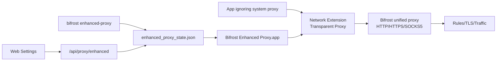

# macOS Enhanced Proxy

## 背景

macOS 上有一类应用不读取系统代理、CLI 环境变量或浏览器代理配置。Bifrost 需要提供一个增强模式，让这些应用的本机 TCP 流量也能进入 Bifrost 主代理，同时不破坏现有 `system-proxy`、`cli-proxy`、TLS 拦截、规则匹配和流量记录。

真正的透明本机捕获必须通过 Apple Network Extension 的 Transparent Proxy Provider 实现，并且需要签名、entitlement、用户在系统设置中批准系统扩展。Bifrost Rust 主进程不能绕过这些平台要求。本方案把能力拆成五个阶段：控制面、诊断面、UI、macOS 扩展宿主、验证闭环。

## 用户目标验证清单

### 必须实现

- 新增增强模式状态机，区分 `unsupported`、`disabled`、`helper_missing`、`extension_missing`、`approval_required`、`running`。
- 新增默认捕获策略：TCP 80/443 默认捕获；UDP 默认关闭；默认排除 Bifrost 自身、helper app、localhost/loopback，避免代理自捕获循环。
- CLI 支持 `bifrost enhanced-proxy status|enable|disable`，`start` 支持 `--enhanced-proxy` 和 `--no-enhanced-proxy` 持久化 desired state。
- Admin API 支持 `GET/PUT /api/proxy/enhanced`，返回 configured 与 active 两层状态。
- Web UI Settings Proxy 页面支持增强模式开关、状态 tag、helper/extension/socket 诊断。
- 提供 macOS helper/system extension 工程，包含 Transparent Proxy Provider TCP flow -> Bifrost SOCKS5 relay、host app 控制入口、entitlement 与 XcodeGen 配置。

### 必须不破坏

- 未显式启用增强模式时，不修改系统代理、不启动系统扩展、不改变现有代理监听行为。
- helper 未安装、extension 缺失或待授权时，只返回诊断和 remediation，不能谎称透明捕获 active。
- 非 macOS 平台必须稳定返回 unsupported，CLI/API/Web 不 panic。
- 现有 `system-proxy` 和 `cli-proxy` 开关语义保持不变。

### 必须真实验证

- 单元测试覆盖状态文件 round-trip、默认策略捕获/排除、自捕获绕过、helper 缺失诊断。
- E2E 覆盖 Admin API GET/PUT：默认 disabled、enable 后 configured=true 但未连接 controller 时 active=false、disable 后回落。
- human_tests 覆盖 CLI 状态、CLI enable/disable、Admin API、Web UI、macOS helper 授权边界。

## 架构

## 数据结构

- `EnhancedProxyDesiredState`：持久化用户请求、目标 host/port、helper bundle、extension bundle、策略。
- `EnhancedProxyStatus`：运行态诊断，包含 configured、active、helper app path、extension path、controller socket、message、remediation。
- `EnhancedProxyPolicy`：include/exclude apps/hosts，TCP/UDP 捕获开关和端口集合。

## 五阶段实现

### Phase 1：Core 状态机与策略

- 新增 `crates/bifrost-core/src/enhanced_proxy.rs`。
- 状态文件位于 `<data_dir>/enhanced_proxy_state.json`。
- controller socket 约定为 `<data_dir>/enhanced-proxy.sock`；只有 socket 存在时才认为 host/extension 已连接。

### Phase 2：CLI 与启动集成

- `bifrost enhanced-proxy status --format text|json|json-pretty`。
- `bifrost enhanced-proxy enable --host 127.0.0.1 --port 9900` 只写 desired state，并立即输出诊断。
- `bifrost start --enhanced-proxy` 在启动时写入当前 loopback target；helper 缺失时不阻塞主代理启动。

### Phase 3：Admin API 与 Web UI

- `GET /api/proxy/enhanced` 返回 `EnhancedProxyStatus`。
- `PUT /api/proxy/enhanced {enabled}` 写 desired state 并返回最新状态。
- Settings Proxy 中的增强模式开关按 `configured_enabled` 显示，状态 tag 按 `state` 显示。

### Phase 4：macOS helper/system extension

- `apps/macos-enhanced-proxy` 提供 Swift Package 与 XcodeGen 配置。
- Host app 使用 `NETransparentProxyManager` 加载/保存配置，并通过 provider configuration 下发 Bifrost loopback host/port。
- Extension 使用 `NETransparentProxyProvider` 接收 TCP flow，从 `remoteFlowEndpoint` 解析原始目标，并对本机 Bifrost 统一端口建立 SOCKS5 CONNECT 后做双向 relay。这样增强模式复用 Bifrost 现有 SOCKS/TLS/规则/traffic 记录链路。
- UDP flow 默认不接管；QUIC/UDP 需要单独验证协议语义后再启用。

### Phase 5：闭环测试与发布门禁

- 单元测试：`cargo test -p bifrost-core enhanced_proxy --lib`。
- E2E：`cargo run -p bifrost-e2e -- --test admin_api_enhanced_proxy_status_and_toggle`。
- Web：`pnpm --dir web build` 或 cargo build 触发前端打包。
- macOS helper：`swift build --package-path apps/macos-enhanced-proxy`。
- 真实增强捕获：必须在有 Network Extension entitlement、有效签名身份、helper 已安装且用户批准系统扩展的 macOS 上，用不配置系统代理/环境代理的独立进程直连 HTTP/HTTPS 目标，并在 Bifrost traffic 中看到对应记录。
- 项目校验：按 `rust-project-validate` 执行 fmt/clippy/build/workspace tests；本地 coverage 因当前项目记忆规则豁免，不运行本地 coverage 脚本。

## 残余边界

- 没有签名、entitlement 和用户授权时，macOS 无法真实激活透明捕获。Bifrost 必须把此状态暴露为 `helper_missing`、`extension_missing` 或 `approval_required`。
- 当前开发 Mac 的真实验证结果：`security find-identity -v -p codesigning` 返回 0 个有效签名身份，`systemextensionsctl list` 返回 0 个扩展；临时 Bifrost 开启 enhanced desired state 后，Python 直连 `example.com:80` 未进入 Bifrost traffic，显式代理 `curl --proxy 127.0.0.1:<port>` 可进入 traffic。结论是控制面和显式代理链路可用，但本机透明增强捕获正向验收被签名/系统扩展安装条件阻塞。
- UDP 捕获默认关闭，避免 QUIC/本机服务在未验证前被透明代理改变语义。
- 捕获策略 V1 默认只覆盖 TCP 80/443，后续可在 UI 中增加高级策略编辑。
