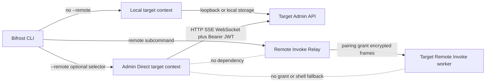

# CLI 直连远程 Admin 方案

## 1. 背景与目标

Bifrost CLI 当前默认围绕本机数据目录和本机运行时工作：一部分命令直接读取 `RulesStorage`、`ValuesStorage`、`AuthDb` 等本地存储，另一部分命令固定请求 `127.0.0.1:<port>` 的 Admin API。即使用户已经通过 `bifrost admin remote enable` 开启远程管理，CLI 也没有一个统一方式把同一条命令发送到另一台 Bifrost。

本方案新增 **CLI Admin Direct** 模式：用户保存或临时指定远端 IP、端口或域名，通过 Admin 用户名和密码登录，之后在原命令前增加全局 `--remote` 标识即可直接操作该实例。它与浏览器通过远程地址访问 WebUI 是同一管理平面，使用同一套 `/_bifrost/api/*`、Admin JWT 和权限边界。

本方案不是 Remote Invoke 的别名、扩展或新 transport。现有 `bifrost remote ...` 继续表示经 Relay、pairing/grant 和 Remote Invoke worker 发起的受限远程调用。

## 2. 用户目标验证清单

### 必须实现

- 支持用 IP、`IP:port`、域名或完整 `http(s)://` URL 直连开启了 Admin Remote Access 的 Bifrost。
- 支持保存多个命名目标，并通过 Admin 用户名/密码登录；登录成功后复用有时限的 Bearer JWT。
- 原命令和参数保持不变，只通过命令前的 `--remote` 选择执行目标。
- 只有一个已配置远端时，裸 `--remote` 自动选中；存在多个远端时，TTY 交互选择，非 TTY 要求显式选择。
- 显式选择支持别名、IP、`IP:port`、域名和完整 URL。
- HTTP、SSE 和 WebSocket 请求统一携带远端 Admin 凭据，401 时能给出准确登录提示或在交互终端重新登录。
- 所有可由 WebUI 远程完成的管理行为最终都通过 Admin API 对等支持，不通过远端文件读取或 shell 命令绕行。
- 远程模式下不支持的命令必须明确报错，绝不能静默落回本机数据目录。

### 必须不破坏

- 不改变 `bifrost remote conn/file/traffic/exec/job/...` 的 Remote Invoke 语义、协议、授权或输出。
- 不改变未传 `--remote` 时的本地 CLI 行为和数据目录解析。
- 不把密码、JWT 或 Authorization header 写入普通配置、命令历史、日志、错误输出或进程参数。
- 不把 Admin JWT 转发到跨 origin 重定向目标，也不让 Admin 直连请求意外经过当前 Bifrost 代理形成环路。
- JSON、NDJSON 和脚本消费的 stdout schema 保持不变；目标提示写 stderr，不能污染机器可读输出。

### 必须真实验证（实施阶段）

- 在临时数据目录和非 `9900` 端口启动 Bifrost，经局域网 IP 登录并执行 status、traffic/search、rules、values、scripts、config、whitelist 等代表性读写操作。
- 验证 REST、SSE、WebSocket 均携带 Bearer token，不出现某类接口单独 401。
- 验证一个目标自动选择、多个目标 TTY 选择、多个目标非 TTY 拒绝、显式别名/地址选择。
- 验证错误密码、Remote Access 未开启、JWT 过期/撤销、TLS 校验失败和服务不可达的错误分类。
- 验证 `bifrost remote ...` 的 Remote Invoke 回归不变，并验证 `bifrost --remote remote ...` 被明确拒绝。

### 必须交付（实施阶段）

- CLI 使用文档、shell completion、Admin API/OpenAPI、自动测试和 `human_tests/` 用例同步更新。
- 完成两轮 Review/Fix/Test、本地针对性验证、提交、PR 和远端 CI 看护。

## 3. 术语与硬边界

| 名称 | CLI 入口 | 网络路径 | 鉴权/授权 | 能力来源 |
| --- | --- | --- | --- | --- |
| 本地模式 | `bifrost traffic list` | 本机存储或 `127.0.0.1` Admin API | loopback 免登录 | 当前数据目录和本机进程 |
| Admin Direct | `bifrost --remote=devbox traffic list` | CLI 直连 `http(s)://devbox/_bifrost/api/*` | Admin 用户名/密码换 Bearer JWT | 与远程 WebUI 对等的 Admin API |
| Remote Invoke | `bifrost remote traffic list` | caller → Relay → target worker | Sync 身份、pairing、grant、端到端加密 | Remote Invoke allowlist/executor |



强制边界如下：

1. `--remote` 只改变 Admin 命令的执行目标，不创建 Remote Invoke call。
2. Admin Direct 不依赖 Sync 登录、Relay、client id、pair code、grant、Remote Invoke command allowlist、shell policy 或 file policy。
3. Remote Invoke 不读取 Admin Direct 的 target profile、密码或 JWT。
4. 缺少 Admin API 的命令要先补 API，不能通过 `remote exec`、SSH 或远端文件 API补洞。
5. 两套能力在代码中使用不同模块名：建议 `admin_target` / `admin_client` 与既有 `remote` / `remote_invoke` 分离，禁止把新实现放进 `commands/remote.rs`。

## 4. CLI 设计

### 4.1 推荐语法

```bash
# 唯一已配置目标：自动选择
bifrost --remote traffic list

# 多目标：按别名选择
bifrost --remote=devbox traffic list

# 临时按 IP、IP:port 或域名选择
bifrost --remote=10.0.0.8:9900 status
bifrost --remote=devbox.example.com:9900 search api.example.com
bifrost --remote=https://devbox.example.com traffic get 123
```

`--remote` 是全局可选值参数，Clap 定义应使用 `num_args = 0..=1`、`default_missing_value = "auto"` 和 `require_equals = true`。因此：

- `bifrost --remote traffic list` 中的 `traffic` 一定被解析为原子命令，而不是 `--remote` 的值。
- 指定目标时必须写 `--remote=devbox`，语法稳定且 completion 可预测。
- 规范写法把 `--remote` 放在子命令前；即使 Clap 支持 global arg 出现在后方，文档和 completion 不推广后置写法。

不采用下列方案：

- `bifrost remote <原命令>`：已经属于 Remote Invoke，复用会导致同一语法对应两套安全模型。
- `bifrost --target remote ...`：语义更通用，但没有直接表达用户需要的远程标识，且需要额外枚举 local/remote。
- `bifrost --admin-remote ...`：边界最明确，但日常命令过长。帮助文本中使用 “Admin Direct” 解释 `--remote` 即可。

### 4.2 目标管理命令

新增独立的本地客户端配置命令 `bifrost target`，不占用 `remote` 命令树：

```bash
bifrost target add devbox --url http://10.0.0.8:9900
bifrost target add prod --url https://bifrost.example.com --ca-cert ./corp-ca.pem
bifrost target list
bifrost target show devbox
bifrost target login devbox --username admin
printf '%s' "$BIFROST_ADMIN_PASSWORD" | bifrost target login devbox --username admin --password-stdin
bifrost target logout devbox
bifrost target rename devbox lab-mac
bifrost target remove lab-mac
```

行为约束：

- `target add` 只保存 endpoint 元数据，不接收明文 `--password`。若在 TTY 中执行，可在保存后立即提示是否登录。
- `target login` 默认隐藏输入密码；非交互场景使用 `--password-stdin`。不提供会进入 shell history 的 `--password VALUE`。
- `target logout` 删除本地保存的 JWT，不宣称服务端 token 已失效。当前 `/api/auth/logout` 不维护单 token denylist；需要远端失效所有 token 时使用经确认的 `admin revoke-all`。
- `target remove` 同时删除对应 credential-store 项；如果删除失败，必须报出可操作的清理提示。
- `target list` 只展示别名、规范化 URL、用户名、TLS 模式、登录态和 token 到期时间，不展示 token。
- `target` 命令管理的是调用端本地 profile，本身始终是 `LocalOnly`；`bifrost --remote target ...` 必须拒绝。
- 完整 URL/authority 若未匹配保存的 profile，则构造仅本次进程有效的临时目标。TTY 可询问用户名和密码并只在内存保存 token；非 TTY 必须提供 `BIFROST_ADMIN_TOKEN`，或先执行 `target add` 与 `target login`。

### 4.3 目标选择算法

`--remote=<selector>` 按以下顺序解析：

1. 精确匹配 profile 别名（别名大小写不敏感，但保存时保留原始展示名）。
2. 解析完整 `http://` 或 `https://` URL，并与已保存目标的 canonical URL 匹配。
3. 解析 authority：IPv4、`host:port`、域名、`[IPv6]:port`；未提供端口时使用 `9900`。
4. 裸 host/authority 默认按 `http://` 解释，因为现有 Bifrost Admin listener 通常是 HTTP；CLI 必须显示传输安全提示。

裸 `--remote` 的解析：

- 0 个目标：退出并提示先执行 `bifrost target add`，不猜测局域网设备。
- 1 个目标：自动选择。
- 多个目标且存在可用 controlling terminal：按别名排序展示交互选择，附 URL 和登录态。stdout 被重定向为 JSON/NDJSON 时，交互 UI 仍只写 controlling terminal 或 stderr，不污染 stdout。
- 多个目标且非 TTY：退出码 2，并列出可用别名；不使用“上次使用”偷偷选中。自动化应使用 `--remote=<alias>` 或 `BIFROST_REMOTE_TARGET=<alias>`。

显式 CLI 值优先于 `BIFROST_REMOTE_TARGET`；环境变量只在出现裸 `--remote` 时参与选择。地址与多个别名发生歧义时，别名优先，错误信息提示可用完整 URL 消歧。

### 4.4 命令兼容与禁止组合

远程模式只改变 execution context，原子命令的参数和输出保持不变。例如 `traffic get`、`rule add`、`config tls` 不新增一套 remote 专用参数结构。

下列组合必须在发网络请求前拒绝：

- `bifrost --remote remote ...`：不能在 Admin Direct 外再套 Remote Invoke。
- hidden worker、`start`、`self-update` handoff 等进程内部命令。
- 任何仍被标记为 `LocalOnly` 的主机侧命令。

错误必须包含命令名、所选目标和原因，并给出可行替代方案；不得删除 `--remote` 后自动重试本地命令。

## 5. 配置与凭据

### 5.1 非敏感 profile

profile 属于 CLI 客户端状态，建议存放在当前 Bifrost 数据目录的 `cli/admin-targets.toml`。这样 `BIFROST_DATA_DIR` 可隔离测试，且不会和远端实例的数据混淆。目录权限应为仅当前用户可访问，文件使用原子写入。

```toml
version = 1

[[targets]]
id = "8dc0c289-cc77-4fd2-a2d3-0a9c330d9488"
name = "devbox"
base_url = "http://10.0.0.8:9900"
username = "admin"
credential_ref = "bifrost-admin-target:8dc0c289-cc77-4fd2-a2d3-0a9c330d9488"
allow_insecure_http = true

[[targets]]
id = "39187714-b913-4b9b-96fd-79d82d198cef"
name = "prod"
base_url = "https://bifrost.example.com"
username = "admin"
credential_ref = "bifrost-admin-target:39187714-b913-4b9b-96fd-79d82d198cef"
ca_cert = "./certs/corp-ca.pem"
```

profile 不保存 password、JWT、Cookie 或 Authorization header。`id` 是 credential key 的稳定身份，rename 不导致凭据丢失。`base_url` 只保存 origin，不保存 `/_bifrost/api`，避免路径重复拼接。

### 5.2 Credential store

- macOS Keychain、Windows Credential Manager、Linux Secret Service 为首选持久化后端。实现可引入跨平台 keyring crate，但必须验证无桌面 session 的 Linux 错误行为。
- 保存的是 Admin JWT 和 `expires_at`，默认不保存管理员密码。密码只在登录请求生命周期内存在，并在可行时使用 secrecy/zeroize 类型缩短内存暴露。
- 安全存储不可用时，默认拒绝把 JWT 降级写入 TOML；允许本次命令登录后仅在内存使用，并明确提示不会持久化。
- 自动化可通过 `BIFROST_ADMIN_TOKEN` 提供短期 token，或用 `target login --password-stdin` 写入可用的安全存储。环境 token 只允许绑定到本次显式 `--remote=<selector>`，裸 `--remote` 禁止把未绑定 token 自动套到某个 profile；其优先级高于 credential store，并永不回显。
- 日志和错误必须对 `Authorization`、登录 body、token query 参数做统一脱敏。Debug/trace 也不例外。

### 5.3 URL 与 TLS

- URL 规范化去除末尾 `/` 与 `/_bifrost[/api]`，拒绝 userinfo、fragment 和非 HTTP(S) scheme。
- HTTPS 使用系统 trust store；`--ca-cert` 可绑定 profile 专用 CA。CA 路径在配置中应支持相对配置目录或 `~/`，文档不写机器绝对路径。
- loopback、RFC1918、ULA/link-local 上的 HTTP 可以显式保存，但首次添加必须提示“用户名、密码和 JWT 可能被同网段观察”；非 TTY 要求 `--allow-insecure-http`。
- 公网地址默认要求 HTTPS。调试用 `--allow-insecure-http` 必须显式记录在 profile，并在每次破坏性操作确认中展示。
- TLS 跳过校验若未来提供，只能是显式、不可默认的调试选项；不能与普通 `allow_insecure_http` 混为一谈。
- HTTP client 默认直连并忽略系统代理环境，防止请求回流至 Bifrost 自身。重定向默认关闭；如未来开放，仅允许同 scheme、host、port，且不能降级 HTTPS。

## 6. 登录与会话生命周期

### 6.1 登录流程

1. `GET /_bifrost/api/auth/status` 探测 endpoint、Remote Access 状态和用户名。
2. 若远端未开启 Remote Access，返回认证配置错误；提示需要在目标机本地执行 `bifrost admin remote enable`，不能尝试 Remote Invoke。
3. CLI 通过隐藏输入或 stdin 获取密码，`POST /_bifrost/api/auth/login`，body 为 `{ username, password }`。
4. 成功后保存响应 `{ token, expires_at, username }` 中的 token 到 credential store。
5. 后续请求统一发送 `Authorization: Bearer <token>`。CLI 不使用 Cookie，也不发送浏览器的 Origin/Referer/Sec-Fetch headers，因此非浏览器写请求不需要 CSRF token。

当前 JWT TTL 为 7 天。客户端应以服务端 `expires_at` 为准，不在客户端硬编码 7 天。

### 6.2 自动登录与 401

- 没有 token 或本地判断已过期：TTY 中提示登录，然后执行原命令；非 TTY 返回退出码 4。
- 请求返回 401：立即删除缓存 token。TTY 中允许重新输入密码并重试一次；非 TTY 若提供了 `BIFROST_ADMIN_TOKEN` 也不能无限重试。
- 401 发生在 Admin router 进入业务 handler 前，普通请求可以在重新登录后重试一次；流式请求只在尚未收到任何业务 frame 时重试。已经收到数据的 SSE/WebSocket 断线不得自动重放，以免重复输出或重复副作用。
- 403 不触发自动登录，直接报告权限、远程开关、登录节流或写保护错误。
- 登录失败遵守服务端渐进式延时和审计，不在客户端并发尝试多个 profile 密码。
- 临时目标的交互登录 token 只存内存；如用户希望后续命令免登录，必须先把目标保存为 profile。

### 6.3 注销与撤销

- `target logout` 是本地凭据清理。
- `bifrost --remote=<target> admin revoke-all` 调用服务端 `/api/auth/revoke-all`，使该实例所有旧 JWT 失效；必须二次确认并在成功后清掉本地 token。
- `admin remote enable` 只能在目标机本地执行；远端关闭状态下 `/auth/login` 会拒绝登录，CLI 不提供绕过该 bootstrap 边界的通道。
- 改密码后服务端的实际 session 语义以 API 为准；客户端不假定改密码自动撤销所有 JWT。

## 7. 统一执行架构

### 7.1 目标上下文

在 Clap 解析之后、命令 dispatch 之前构建一次 `ExecutionContext`：

```rust
enum AdminTarget {
    Local(LocalTarget),
    Remote(RemoteTarget),
}

struct ExecutionContext {
    target: AdminTarget,
    client: Option<AdminApiClient>,
    interactive: bool,
    output_mode: OutputMode,
}
```

`LocalTarget` 继续根据当前数据目录和 runtime metadata 找到有效端口；`RemoteTarget` 只包含规范化 endpoint、显示身份、TLS policy 和 credential reference，绝不持有远端数据目录路径。

每个命令声明 target capability：

```rust
enum TargetCapability {
    LocalOnly,
    AdminRead,
    AdminWrite,
    AdminStream,
    RemoteInvokeOnly,
}
```

dispatch 在执行前统一校验，避免 handler 自己猜测是否远程。长期目标是 handler 接收 `&ExecutionContext` 或更窄的 service trait，而不是 `(host, port)` 或直接调用 `data_dir()`。

### 7.2 AdminApiClient

现有 `commands/config/client.rs::ConfigApiClient` 只有 `base_url`，且 traffic/search/group 等模块仍各自拼 URL。应将其演进为通用 `AdminApiClient`，至少统一：

- canonical origin 和安全 path join；
- Bearer credential provider；
- JSON request/response、文件上传下载；
- GET/POST/PUT/PATCH/DELETE；
- SSE 与 WebSocket 握手；
- connect/request/idle timeout 与 cancel；
- 401 失效、单次重登和 retry policy；
- 同 origin redirect 约束；
- server error JSON 解析、request id 和敏感字段脱敏；
- API version/capability 探测。

同步 CLI command 与异步 stream 可以有不同 transport adapter，但必须共享 `AdminEndpoint`、auth injector、error mapping 和 redaction policy。不能继续让每个模块分别构造 `ureq::Agent` 或硬编码 `127.0.0.1`。

### 7.3 远端 API 是唯一事实源

远程模式下：

- rules、values、scripts、config、AuthDb、traffic DB 都只能通过目标 Admin API 访问。
- CLI 仍可读取调用端提供的输入文件，例如 `rule add --file ./rule.txt` 或 `import ./bundle.bifrost`；文件内容由 CLI 上传，路径本身不在远端解析。
- 导出文件写在调用端；服务端返回导出 payload/stream。
- 命令需要目标机文件路径时，必须明确标注为 remote path 并由专用 Admin API 验证；默认不把调用端路径解释成目标机路径。
- 不存在 API 时返回 `UnsupportedRemoteCommand`，直到补齐经过权限审查的 API。

### 7.4 服务能力协商

在 `system/overview` 或新增的只读 capabilities endpoint 返回：

- `admin_api_version`；
- `server_version`；
- capability id 集合，例如 `traffic.stream.v1`、`rules.write.v1`、`system.upgrade.v1`；
- 可选的 `min_cli_version`。

CLI 不用版本号猜能力。旧服务没有 capabilities 时只启用一组明确的 legacy-safe API；遇到缺失接口返回兼容性错误，不能 fallback 本地。

## 8. 命令支持矩阵

支持层级以“WebUI 远程可做什么”为准，而不是以当前 CLI 是否碰巧走 HTTP 为准。

| 命令族 | 目标状态 | 当前主要缺口/设计动作 |
| --- | --- | --- |
| `status`、`metrics`、`version-check` | AdminRead | 移除固定 loopback，复用 system/metrics API；TUI 订阅远端流 |
| `search`、`traffic`、`capture` | AdminRead/AdminWrite/AdminStream | 按具体子命令登记 read/write/stream；把所有 URL、分页、body、SSE 统一接入 client，保持 canonical query 与 formatter |
| `rule`、`group`、`port` | AdminRead/AdminWrite | rule 当前大量直读 `RulesStorage`，group/port 各自拼 URL；统一走 rules/group/ports API |
| `value`、`script` | AdminRead/AdminWrite | mutation 已部分走 API，list/show 仍读本地；补齐并强制远程 API 路径 |
| `config`、`whitelist`、`account` | AdminRead/AdminWrite | config/account 已部分参数化；whitelist 前半仍读本地 ConfigManager；全部迁移 |
| `admin passwd/revoke-all/audit` | AdminWrite/AdminRead | 当前 CLI 直读 AuthDb/audit DB；改走已有 auth/audit API，破坏性操作二次确认 |
| `admin remote status` | AdminRead | 可远程查询 |
| `admin remote enable` | LocalOnly | Remote Access 关闭时远端无法登录取得 JWT，因而不能经远端 API 自举；必须在目标机本地 bootstrap |
| `admin remote disable` | AdminWrite 高风险 | 可经已认证会话调用，但会切断后续远程登录；要求显式 `--yes`，响应成功后清理本地 token |
| `sync`、`login` | AdminRead/AdminWrite | 这里的 login 是目标实例自身 Sync 登录，不是 Admin Direct 登录；帮助文案必须消歧 |
| `import`、`export` | AdminRead/AdminWrite | 调用端读写文件，内容走 bifrost-file API |
| `im`、`agent`、可由 Web 管理的 `ai/asr` | AdminRead/AdminWrite/AdminStream | 复用 im-gateway/worker-jobs/asr/voice Admin API，补齐 SSE/WS Bearer |
| `system-proxy`、`keep-awake`、`upgrade` | AdminWrite 高风险 | 操作的是目标机；显示目标并要求确认，使用 proxy/power/system API |
| `ca` | 分命令判定 | 查询/下载证书可远程；安装到系统 keychain 是调用端或目标端语义歧义，V1 标记 LocalOnly，后续拆明确动词 |
| `target`、`voice sources/listen`、桌面 `app`、`cli-proxy`、`install-skill`、`completions` | LocalOnly | 管理调用端 profile，或依赖调用端硬件、桌面、shell、文件系统；`--remote` 明确拒绝 |
| `start` | LocalOnly | 未运行的服务无法通过自身 Admin API 启动；用目标机 service manager 或 Remote Invoke 是另一条显式路径 |
| `stop`、`restart` | LocalOnly（V1） | Admin API 当前无安全完整的服务生命周期协议；不能用 shell 偷渡。未来需 supervisor + operation receipt 单独设计 |
| `remote`、`setting shell/ssh-key/grant` | RemoteInvokeOnly/LocalOnly | 保持 Remote Invoke 管理面，不接受 `--remote` 叠加 |
| hidden worker/self-update handoff | LocalOnly | 进程内部协议，永不暴露为 Admin Direct |

“所有接口可工作”的完成标准不是一次性把所有命令标为 supported，而是：每个公开命令都有显式 capability；所有标记 Admin* 的分支都通过统一 client；所有 LocalOnly/RemoteInvokeOnly 分支在 dispatch 前稳定拒绝。

## 9. 输出、交互与错误语义

### 9.1 输出兼容

- 原命令 stdout 原样保留，尤其是 JSON、JSON Pretty、NDJSON 和流式输出。
- TTY 下可在 stderr 打印 `Target: devbox (http://10.0.0.8:9900)`；非 TTY 默认静默。
- 错误中展示 alias 和 origin，不展示 username 以外的凭据。
- 服务返回的远端路径要明确标注为 target path，避免用户误认为本地文件。

### 9.2 破坏性操作

对 traffic clear、rule/script/value delete、revoke-all、remote disable、system proxy 修改、upgrade 等操作：

- 交互确认必须同时展示 alias、origin 和动作对象。
- 非 TTY 要求命令已有的 `--yes`；没有 `--yes` 的命令在实施时补统一确认参数。
- 重试只允许在业务 handler 尚未执行的 401 场景；5xx、timeout 和连接中断后的 mutation 不自动重放。

### 9.3 稳定退出码

| 退出码 | 含义 |
| --- | --- |
| 0 | 成功 |
| 1 | 远端业务命令失败 |
| 2 | 参数、目标选择或本地 profile 配置错误 |
| 3 | DNS、连接、TLS、timeout 等 transport 错误 |
| 4 | 未登录、token 过期且无法重登、用户名密码错误 |
| 5 | 403 或服务端明确拒绝 |
| 6 | CLI/服务 API 不兼容或命令不支持远程模式 |

已有命令若有更细的稳定退出码，保留原语义；上述分类用于 Admin Direct 公共错误层。

## 10. 安全与审计

- Admin Direct 的权限等同远程 WebUI 管理员，默认是整机 Bifrost 管理权限，不借用 Remote Invoke 的细粒度 grant。帮助和首次登录必须明确这一点。
- 服务端继续以 `remote_access_enabled` 为总开关，并使用现有 bcrypt 校验、登录节流、JWT `jti`/`revoke_before` 和登录审计。
- CLI 设置稳定 User-Agent（含 CLI 版本）与随机 request id，便于服务端审计；不得伪造浏览器 Origin 绕过保护。
- 建议后续扩展 Admin audit：记录 authenticated principal、request id、command capability、资源摘要与结果，不记录请求 body 中的 secret。
- 原始密码只发送到 `/auth/login`；客户端不把它用于 Basic Auth，也不附加到 URL。
- raw URL 的 token 只匹配 canonical origin；scheme、host 或 port 任一变化都不能复用。
- 公共 Wi-Fi 或公网 HTTP 会暴露管理员密码与 JWT。产品提示应优先建议 HTTPS、VPN 或 SSH tunnel；不能用“局域网”暗示明文传输天然安全。

## 11. 实施分期

### Phase 1：目标、认证与只读核心链路

1. 在 `cli.rs` 增加全局 `--remote[=<selector>]` 和 `target` 命令。
2. 新增 `commands/admin_target/`：profile store、selector、credential store、login。
3. 抽取 `AdminEndpoint` 和统一 `AdminApiClient`，接入 Bearer、错误映射、redaction、direct transport。
4. 引入 `ExecutionContext` 和命令 capability registry。
5. 先迁移 `status`、`metrics`、`traffic list/get/search`、`capture wait`，覆盖 REST/SSE。
6. 增加 capabilities 协商；旧服务只启用明确兼容的只读接口。
7. 主要落点为 `crates/bifrost-cli/src/cli.rs`、`crates/bifrost-cli/src/main.rs`、`crates/bifrost-cli/src/commands/admin_target/` 与通用 client 模块；Remote Invoke 的 `cli/remote.rs` 和 `commands/remote.rs` 只增加冲突回归测试，不承载新逻辑。

Phase 1 完成标志：局域网地址登录后，核心查询命令与本地模式参数/输出一致；多目标选择稳定；Remote Invoke 回归不变。

### Phase 2：配置与内容读写对等

1. 迁移 rule/group/port/value/script/config/whitelist/account。
2. 删除这些 handler 中 remote path 下的 `data_dir()`、Storage、AuthDb 直读；补齐缺少的 Admin API。
3. import/export 采用调用端文件 + 远端 payload 语义。
4. 建立统一远端破坏性操作确认。

Phase 2 完成标志：WebUI 的规则、脚本、values、访问控制和配置能力都能用相同 CLI 命令远程完成。

### Phase 3：流式与扩展管理面

1. 迁移 status TUI、push、IM、Agent、ASR、worker jobs 等 SSE/WebSocket/长任务。
2. 迁移 sync、keep-awake、system-proxy、upgrade 等高风险管理行为。
3. 为长任务增加 operation id、断线恢复和幂等语义；已收到 frame 的连接不自动重放。
4. 完成 Admin audit 的命令级审计。

### Phase 4：收口与兼容清理

1. 所有公开命令进入 capability registry，测试确保没有隐式 local fallback。
2. 删除散落的 URL 拼接和固定 `127.0.0.1` Admin client 构造。
3. 更新 CLI/Skill 文档，明确 Admin Direct 与 Remote Invoke 的选择指南。
4. 评估是否为受 supervisor 管理的进程单独设计远程 restart；不在本方案中承诺裸进程可远程启动。

## 12. 验证方案（实施阶段）

### 12.1 单元与组件测试

- Clap：裸 `--remote` 不吞掉子命令；`--remote=alias/url/host:port` 正确解析；与 `remote`/LocalOnly 命令冲突。
- selector：0/1/N profile、TTY/non-TTY、环境变量优先级、别名与 URL 歧义。
- URL：IPv4/IPv6/域名、默认端口、路径规范化、userinfo/fragment/非法 scheme、HTTP 安全提示。
- credential：keychain CRUD、rename 保持引用、过期清理、安全存储不可用、输出/日志无 secret。
- client：所有 HTTP method 注入 Bearer；跨 origin redirect 不转发；401 只重登一次；403 不重登；mutation timeout 不重放。
- stream：SSE/WS 握手携带 Bearer；收到首帧后断线不自动重放；取消能关闭连接。
- dispatch：每个公开 command variant 都有 capability；Remote 模式永不触发 Storage/AuthDb 本地实现。
- formatter：同一 fixture 在 Local 与 Admin Direct 下产生相同 stdout。

### 12.2 E2E

按 `e2e-test` 流程新增 Admin Direct suite，至少覆盖：

1. 临时数据目录、动态非 `9900` 端口启动目标服务，启用 remote access 并设置管理员密码。
2. 通过局域网 IP 登录，执行 status/metrics/traffic/search/capture。
3. 执行 rule/value/script/config/whitelist 的代表性 CRUD，并从目标 Admin API 回读确认。
4. 对 REST/SSE/WebSocket 抓取响应状态，断言无遗漏 Bearer 导致的 401。
5. token 过期或 `revoke-all` 后 TTY 重登成功；非 TTY 返回退出码 4。
6. 多 profile 的自动/交互/显式选择和非 TTY 拒绝。
7. Remote Invoke 既有核心 suite 通过，证明两条链路未串线。

测试启动必须设置临时 `BIFROST_DATA_DIR`、`BIFROST_DISABLE_TRAY=1`、`BIFROST_SYNC_DISABLE_AUTO_LOGIN_PROMPT=1` 和 `--no-system-proxy`，并用动态端口；不得占用或清理 `9900`。

### 12.3 真实场景测试

实施时创建 `human_tests/remote-admin-cli.md` 并同步 `human_tests/readme.md`，至少包含：

- TC-RAC-01：单目标裸 `--remote` 登录和查询。
- TC-RAC-02：多目标交互选择及显式 alias/IP/domain 选择。
- TC-RAC-03：远程 rules/values/scripts/config CRUD 与 WebUI 同步可见。
- TC-RAC-04：traffic 实时更新、capture SSE、push/WebSocket 均通过 Bearer。
- TC-RAC-05：401 重登、403、错误密码节流、remote-disabled。
- TC-RAC-06：HTTP 风险提示、HTTPS/自定义 CA、跨 origin redirect 拒绝。
- TC-RAC-07：LocalOnly 和 `bifrost --remote remote ...` 拒绝且不触碰本地数据。
- TC-RAC-08：Remote Invoke 原命令行为不变。

### 12.4 验证路由

- 本文档阶段只有设计 Markdown 变更：执行结构、链接、术语、命令示例、绝对路径和 diff 一致性检查；Rust build、coverage、E2E、human_tests 不适用。
- 实施阶段涉及 Rust CLI/Admin 生产代码：运行受影响 crate 单测、fmt、clippy、`make coverage-changed`，按阶段选择 Admin Direct E2E 和上述 human tests。高成本全 workspace/full coverage 交给远端 CI，除非影响面或失败归因要求本地复现。

## 13. Review / Fix / Test 闭环

### 第 1 轮

- 复核用户目标：命令前 remote 标识、单目标自动、多目标选择、账号密码登录、原命令不变。
- 复核安全边界：Admin Direct 与 Remote Invoke 不共享 transport/credential/grant；remote path 不落回本地存储。
- 复核当前代码映射：`main.rs` 固定 loopback、rule/value/script/whitelist/admin 的本地存储路径、Admin router 的 API 覆盖。
- 检查 `git status --short`、`git diff --check`、`git diff`，修复命名、矩阵和示例遗漏。

### 第 2 轮

- 基于最新 diff 逐项复查 target 选择、认证生命周期、TLS、输出兼容、退出码、破坏性操作和迁移阶段。
- 专门检查是否错误承诺所有 OS 本地命令可经 Admin API 执行，是否存在 Remote Invoke shell/file fallback。
- 检查文档没有本机绝对路径、敏感凭据示例或互相冲突的命令语法。
- 再次执行 `git status --short`、`git diff --check`、`git diff`；发现问题则修复并追加下一轮。

## 14. 明确不在本方案内

- 不新增 Relay 协议、Remote Invoke command、grant scope 或 pairing 流程。
- 不用 Admin Direct 读取/编辑目标机任意文件或执行 shell。
- 不自动发现局域网设备；bare `--remote` 只在已配置 profiles 中选择。
- 不保存明文管理员密码，不承诺无安全存储时跨进程免登录。
- 不承诺通过未运行的 Bifrost Admin API 启动目标服务。
- 不在 V1 实现跨多台设备广播同一条破坏性命令。

## 15. 最终决策摘要

1. 用户入口采用 `bifrost --remote[=<selector>] <原命令>`；显式值使用等号避免吞掉子命令。
2. 目标与登录态由 `bifrost target ...` 管理；一个目标自动选，多目标 TTY 选、非 TTY 显式选。
3. 远端执行只走 Admin API + Bearer JWT，与 WebUI Remote Access 对等。
4. `bifrost remote ...` 永远保留为 Remote Invoke；两者不共享 Relay、grant、worker、shell 或 file 能力。
5. 引入统一 `ExecutionContext`、command capability registry 和 `AdminApiClient`，消除固定 loopback 与各模块自行拼 URL。
6. 远程命令要么明确走远端 API，要么明确拒绝，绝不回退到本地数据目录。
7. 先交付核心只读链路，再完成 WebUI 管理能力对等，最后迁移长连接和高风险操作。
