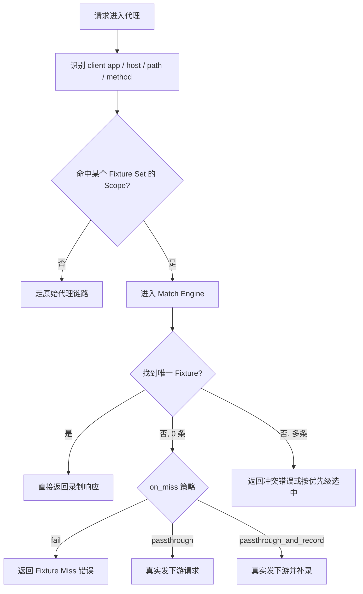
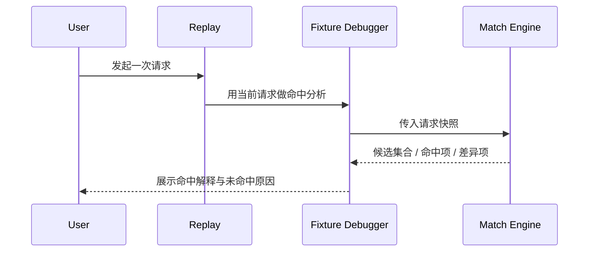
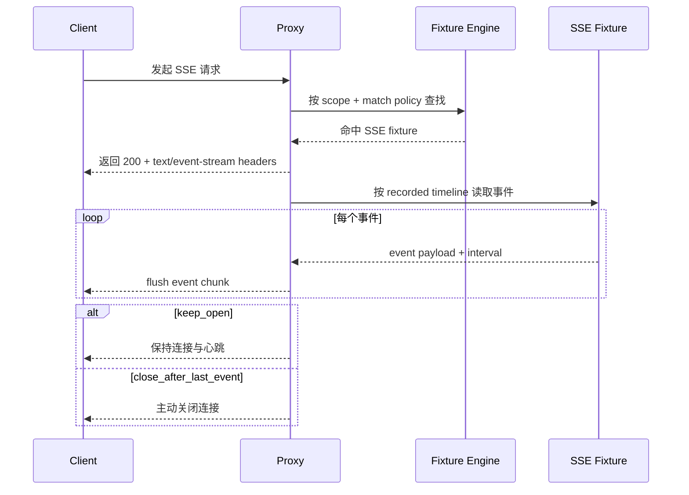

# Traffic Fixtures 产品方案

## 1. 背景

Bifrost 当前已经具备较强的流量录制与回放基础能力：

- `Traffic` 已能完整记录请求/响应信息，包括 `client_app`、`client_path`、`host`、`path`、headers、body、状态码、SSE/WS 状态等
- `Replay` 已能把流量导入为请求模板，并再次执行
- `Rules` 已能按域名、路径、方法、header、body、状态码等条件做过滤与改写

但从测试稳定性视角看，当前能力仍有明显缺口：

1. `Replay` 更像“手工再次发请求”，不是“真实请求经过代理时自动命中历史录制结果”
2. `Rules` 能做静态 mock，但配置更偏工程规则，缺少“围绕真实录制流量生成回放夹具”的产品抽象
3. 缺少一套面向测试的命中策略配置：
   - 哪些应用生效
   - 哪些域名 / 路径生效
   - query/header/body 中哪些字段参与匹配
   - 未命中时应报错、透传还是补录
4. 缺少命中解释与调试视图，测试失败时不易判断是“没录到”还是“匹配条件过严”

因此需要设计一套新的产品能力：`Traffic Fixtures`。

## 2. 产品定位

`Traffic Fixtures` 是一套“基于真实流量录制结果的自动命中回放能力”。

它的核心价值不是替代 Replay，也不是替代 Rules，而是为测试稳定性提供一个新的工作流：

1. 从真实流量中圈定一批目标请求
2. 生成可管理的 fixture 集合
3. 配置命中策略和回放策略
4. 当运行中的请求进入代理时，如果落在配置范围内，则直接返回之前录制的响应，不再访问真实下游

它的目标是让用户用尽量低成本的方式获得：

- 稳定的本地开发测试
- 稳定的自动化测试 / 回归测试
- 可解释、可迭代的接口虚拟化能力

## 3. 非目标

本期不包含：

- 完整替代现有 `Rules` 的通用 mock 能力
- 完整替代现有 `Replay` 的手工调试能力
- 一次性覆盖所有协议的复杂回放语义
- 100% 还原所有长连接时序细节

- 不处理纯 `CONNECT` 透传流量的 fixture 命中
- 不处理 multipart、binary body 的深度字段匹配
- 不做跨环境自动数据脱敏与变量泛化平台
- 不做 WebSocket 帧级编辑器

## 4. 产品原则

### 4.1 真实录制优先

fixture 的来源优先是 `Traffic` 中真实发生过的请求，而不是手工拼写响应。

### 4.2 测试稳定性优先

当用户把某个 fixture set 标记为“测试模式”时，默认应偏向 `fail closed`，避免误透传导致测试不稳定。

### 4.3 命中可解释

每次命中或未命中都必须可解释，用户需要知道：

- 命中了哪个 fixture
- 是按哪些字段匹配成功的
- 哪些字段导致未命中

### 4.4 与现有能力边界清晰

- `Traffic` 负责采集与观察
- `Replay` 负责手工执行与调试
- `Rules` 负责运行时流量匹配、改写与回放执行
- `Traffic Fixtures` 负责 fixture 资产的独立管理、独立存储与测试向配置

### 4.5 发布范围

本产品文档定义 `Traffic Fixtures` 的 V1 版本。

V1 覆盖：

- HTTP / HTTPS fixture
- SSE fixture
- Web UI 完整管理能力
- `bifrost fixtures` CLI 完整控制面

V1 不覆盖：

- WebSocket fixture
- JSON body 字段级匹配
- ordered sequence 回放
- 跨环境分享与导出导入包治理

## 5. 用户故事

### 5.1 本地开发稳定测试

作为开发者，我希望只让 `Chrome` 中访问 `api.example.com/api/user/*` 的请求命中历史录制结果，这样我改前端时不依赖真实下游。

### 5.2 自动化测试隔离下游波动

作为测试工程师，我希望在 CI 里运行某个 fixture set，未命中时直接失败，而不是随机请求真实环境。

### 5.3 渐进式补录

作为接口联调人员，我希望先打开“透传并补录”，跑一遍真实场景生成 fixture，再切换到“严格命中”。

### 5.4 精确控制匹配维度

作为使用者，我希望忽略时间戳、trace id、nonce 等易变字段，只按业务主键字段匹配。

## 6. 核心概念模型

### 6.1 Fixture Set

一个测试场景的顶层容器，例如：

- `nextoncall-login-stable`
- `agent-chat-readonly`
- `ppe-user-center-fixtures`

它包含：

- 作用范围
- 命中策略
- 回放策略
- fixture 条目列表
- 启用状态

### 6.2 Fixture

一条可被命中的录制条目，来源于某一次真实流量记录。

包含：

- 原始请求快照
- 原始响应快照
- 派生的匹配键
- 标签与说明
- 关联 traffic id

### 6.3 Scope

定义“什么流量会进入这个 fixture set 的候选集合”。

面向用户表现为：

- 哪些应用
- 哪些域名
- 哪些路径
- 哪些方法
- 哪些协议

### 6.4 Match Policy

定义“候选流量进入后，如何从 fixture 中精确选中一条”。

### 6.5 Replay Policy

定义“命中之后如何返回响应，未命中之后怎么办”。

### 6.6 Stream Fixture

用于描述流式响应的 fixture 条目，第一阶段重点支持 SSE。

包含：

- 建链响应头快照
- 事件序列快照
- 事件间隔策略
- 流结束语义
- 首事件超时信息

## 7. 信息架构

管理端新增一级导航：`Fixtures`。

同时，`Traffic Fixtures` 必须是一个独立能力域，不依附于 `Replay` 或 `Rules` 的命令空间。

对应 CLI 新增一级顶层命令：

- `bifrost fixtures ...`

而不是：

- `bifrost replay fixtures ...`
- `bifrost rule fixtures ...`
- `bifrost traffic fixtures ...`

页面结构：

1. `Fixture Sets`
   - 列表页
   - 创建/编辑页
2. `Fixture Detail`
   - Scope
   - Match Policy
   - Replay Policy
   - Fixture Records
   - Hit History
3. `Fixture Inspector`
   - 查看单条 fixture 的请求/响应详情
   - 查看字段差异
4. `Fixture Debug`
   - 解释某一次请求为什么命中 / 未命中

同时在现有页面提供入口：

- `Traffic` 页
  - 单条记录：`保存为 Fixture`
  - 多条结果：`批量生成 Fixture Set`
- `Replay` 页
  - `用当前请求调试 Fixture 命中`

CLI 固定结构：

1. `fixtures set`
   - 管理 fixture set 生命周期与配置
2. `fixtures item`
   - 管理具体 fixture 条目
3. `fixtures import`
   - 从 traffic / 文件导入 fixture
4. `fixtures export`
   - 导出 fixture set / item
5. `fixtures hit`
   - 查看命中历史与统计
6. `fixtures debug`
   - 用一条请求做命中解释
7. `fixtures run`
   - 在 CLI 下启用、停用、切换 fixture set

## 8. 核心配置模型

### 8.1 Scope 配置

V1 的 `Scope` 维度固定为：

| 维度 | 示例 | 说明 |
| --- | --- | --- |
| `client_apps` | `Chrome`, `Cursor`, `node` | 按应用生效 |
| `hosts` | `api.example.com`, `*.byteintl.net` | 域名范围 |
| `path_patterns` | `/api/user/*`, `/v1/chat/completions` | 路径范围 |
| `methods` | `GET`, `POST` | 请求方法 |

逻辑规则：

- 同一维度内部为 OR
- 不同维度之间为 AND

示例：

```yaml
scope:
  client_apps: ["Chrome"]
  hosts: ["api.example.com"]
  path_patterns: ["/api/user/*", "/api/order/*"]
  methods: ["GET", "POST"]
```

含义：

- 仅 `Chrome`
- 且 host 命中 `api.example.com`
- 且 path 命中上述路径之一
- 且 method 为 GET 或 POST

固定规则：

- `Scope` 只做 `app + host + path + method`
- `query` 不进入 `Scope`
- `body` 不进入 `Scope`
- `client_path`、`protocols` 不属于 V1

`Scope` 只承担“粗筛候选流量”的职责。

### 8.2 Match Policy 配置

V1 的 `Match Policy` 固定为：

| 类型 | 策略 |
| --- | --- |
| Query 参数 | `include` / `ignore` / `exists` |
| Header | `include` / `ignore` / `exists` |
| 路径参数 | 精确匹配 / 模板变量化 |

默认规则：

- query：默认全忽略，用户手工勾选参与匹配的字段
- header：默认忽略易变头，仅保留业务头
- body：不属于 V1

系统预置易变字段忽略名单：

- `timestamp`
- `ts`
- `trace_id`
- `x-request-id`
- `x-b3-traceid`
- `nonce`
- `uuid`

示例：

```yaml
match_policy:
  query:
    include: ["user_id", "scene"]
    ignore: ["timestamp", "trace_id"]
  headers:
    include: ["authorization", "x-env"]
    ignore: ["x-request-id", "user-agent"]
```

固定规则：

- `Match Policy` 只包含 `query + header + path params`
- `query` 策略固定为 `include / ignore / exists`
- `header` 策略固定为 `include / ignore / exists`
- `JSON body` 匹配不属于 V1

### 8.3 Replay Policy 配置

`Replay Policy` 固定字段如下：

| 配置项 | 取值 |
| --- | --- |
| `on_miss` | `fail`, `passthrough`, `passthrough_and_record` |
| `response_mode` | `latest`, `ordered_sequence` |
| `rule_mode` | `apply_rules`, `bypass_rules` |
| `allow_fallback` | `true/false` |
| `fallback_scope` | `dev_only` |
| `fixture_priority` | 数字或顺序 |
| `record_hit_history` | `true/false` |

默认值：

```yaml
replay_policy:
  on_miss: fail
  response_mode: latest
  rule_mode: apply_rules
  allow_fallback: false
  record_hit_history: true
```

固定规则：

- 默认 `on_miss = fail`
- 允许显式配置成 `passthrough` 或 `passthrough_and_record`
- 自动降级不是隐式行为，只能通过受控降级触发

受控降级必须同时满足：

- set 上显式配置 `allow_fallback: true`
- 当前运行模式必须是 `dev_only`
- 每次降级都记录为 `miss -> fallback`
- UI/CLI 明确可见

固定规则：

- 受控降级触发条件固定为 `allow_fallback + dev_only`
- V1 不提供 `always`
- 默认 `rule_mode = apply_rules`
- `apply_rules` 在 V1 表示“所有规则继续生效”
- `bypass_rules` 表示命中后直接返回 fixture 响应
- `apply_rules_selected` 不属于 V1

### 8.4 SSE Fixture 配置

SSE 使用独立的流式回放配置：

| 配置项 | 取值 |
| --- | --- |
| `stream_mode` | `recorded_timeline`, `compressed_timeline`, `immediate_flush` |
| `end_behavior` | `keep_open`, `close_after_last_event` |
| `first_event_timeout_ms` | 数值 |
| `heartbeat_mode` | `preserve`, `drop`, `synthesize` |

默认值：

```yaml
sse_policy:
  stream_mode: recorded_timeline
  end_behavior: keep_open
  first_event_timeout_ms: 30000
  heartbeat_mode: preserve
```

固定规则：

- `recorded_timeline`：按录制时的事件间隔回放，最接近真实服务
- `keep_open`：最后一个事件后保持连接打开，适合很多真实 SSE 场景
- `preserve`：保留心跳/注释事件，避免前端状态机行为失真

## 9. 产品交互流程

### 9.1 从 Traffic 批量生成 Fixture Set


### 9.2 运行时命中流程



### 9.3 用单条请求调试命中



### 9.4 SSE 命中与事件回放流程



## 10. 页面线框示意

### 10.1 Fixture Sets 列表页

```text
+----------------------------------------------------------------------------------+
| Fixtures                                                                         |
| [New Fixture Set]   [Import from Traffic]   [Only Active]                        |
+----------------------------------------------------------------------------------+
| Name                      | Scope Summary                  | Hits | Miss | Status |
|----------------------------------------------------------------------------------|
| nextoncall-login-stable   | Chrome · api.xxx · /api/login | 124  | 2    | Active |
| agent-chat-readonly       | Cursor · /v1/responses        | 820  | 0    | Active |
| ppe-user-center           | Any App · user.xxx            | 14   | 6    | Draft  |
+----------------------------------------------------------------------------------+
```

### 10.2 Fixture Set 详情页

```text
+----------------------------------------------------------------------------------+
| Fixture Set: nextoncall-login-stable                                [Save] [On]  |
+----------------------------------------------------------------------------------+
| Tabs: [Scope] [Match Policy] [Replay Policy] [Fixtures] [Hit History] [Debug]    |
+----------------------------------------------------------------------------------+
| Scope                                                                             |
| Apps:        [Chrome x] [Node x]                                                  |
| Hosts:       [api.example.com]                                                    |
| Paths:       [/api/login] [/api/session/refresh]                                  |
| Methods:     [POST]                                                               |
|----------------------------------------------------------------------------------|
| Match Policy                                                                      |
| Query:        user_id(Exact)  scene(Exact)  timestamp(Ignore)                     |
| Headers:      authorization(Exact) x-request-id(Ignore)                           |
| Body:         Not in V1                                                           |
|----------------------------------------------------------------------------------|
| Replay Policy                                                                     |
| On Miss:      Fail                                                                |
| Response:     Latest                                                               |
| Rule Mode:     Apply Rules                                                        |
| Fallback:      Disabled                                                           |
+----------------------------------------------------------------------------------+
```

### 10.3 Debug 视图

```text
+----------------------------------------------------------------------------------+
| Debug Request Match                                                               |
+----------------------------------------------------------------------------------+
| Incoming Request                                                                  |
| app=Chrome  method=POST  host=api.example.com  path=/api/login                    |
|----------------------------------------------------------------------------------|
| Candidate Fixtures: 2                                                             |
|----------------------------------------------------------------------------------|
| Fixture A: score 92                                                               |
|   matched: host, path, method, query.user_id                                      |
|   mismatched: header.authorization                                                |
|----------------------------------------------------------------------------------|
| Fixture B: score 100                                                              |
|   matched: host, path, method, query.user_id, header.authorization                |
|----------------------------------------------------------------------------------|
| Result: Hit Fixture B                                                             |
+----------------------------------------------------------------------------------+
```

### 10.4 SSE Fixture Inspector

```text
+----------------------------------------------------------------------------------+
| Fixture: chat-stream-001                                            [Save]       |
+----------------------------------------------------------------------------------+
| Type: SSE   Source Traffic: trf_18273   Response Mode: recorded_timeline         |
|----------------------------------------------------------------------------------|
| Response Headers                                                                  |
| content-type: text/event-stream                                                   |
| cache-control: no-cache                                                           |
|----------------------------------------------------------------------------------|
| Event Timeline                                                                    |
| #1  +000ms   event: message       data: {"delta":"Hel"}                           |
| #2  +120ms   event: message       data: {"delta":"lo"}                            |
| #3  +260ms   event: message       data: {"delta":" world"}                        |
| #4  +410ms   event: done          data: [DONE]                                    |
|----------------------------------------------------------------------------------|
| End Behavior: keep_open                                                           |
+----------------------------------------------------------------------------------+
```

## 11. 与现有模块的关系

### 11.1 与 Traffic 的关系

`Traffic` 是 fixture 的主要来源。

同时，所有 fixture 命中后的请求也必须在 `Traffic` 中展示；fixture 回放不是隐形通道。

复用能力：

- 流量详情页
- 当前已有的 headers/body/raw body 存储
- client app / host / path / protocol 等字段

新增能力：

- `保存为 Fixture`
- `批量生成 Fixture Set`
- `查看被哪个 Fixture Set 引用`
- 标记“命中 fixture set / item”
- 标记“fixture 响应是否继续执行 rules”
- 在详情页展示 fixture 命中元信息

### 11.2 与 Replay 的关系

`Replay` 不改定位，继续做手工请求执行器。

新增联动：

- 从 Replay 当前请求调试 fixture 命中
- 从 Replay 历史导入为 fixture

固定规则：

- `Traffic Fixtures` 不复用现有 Replay 的集合/请求模型

原因：

- Replay 模型是“请求模板”
- Fixture 模型是“运行时自动命中规则 + 录制响应集合”
- 两者心智模型不同

### 11.3 与 Rules 的关系

fixture 资产是独立管理对象，但运行时“命中并回放”属于规则系统能力。

固定规则：

1. `Fixtures` 独立维护 set、item、导入、存储、命中历史等资产能力。
2. 运行时请求进入代理后，fixture 命中按规则系统的一种规则类型参与执行。
3. 命中 fixture 后产生的响应，仍然属于一次规则命中的代理流量，因此必须进入 `Traffic` 展示链路。
4. `Traffic` 列表与详情必须明确标注：
   - 命中的 fixture set
   - 命中的 fixture item
   - 是否继续执行后续 rules
5. fixture 命中记录应归入 matched rules 体系，而不是做一套平行的“不可见回放通道”。

## 12. 运行时行为设计

### 12.1 命中时机

V1 的命中时机固定为：

- 在请求已经被代理识别出完整 URL / method / headers / body 之后
- 在真正发起下游请求之前
- 在规则系统完成常规匹配准备阶段后，以 fixture rule 的形式参与执行

即：

1. 接收请求
2. 完成基础解析
3. 进入规则匹配阶段
4. fixture rule 参与匹配
5. 若命中，则由 fixture rule 构造响应返回
6. 若未命中，则按 `on_miss` 执行

对于 SSE：

1. 先完成 scope + match policy 匹配
2. 命中 fixture rule 后先返回流式响应头
3. 再按 fixture 保存的事件序列持续 flush
4. 根据 `end_behavior` 决定保持连接还是主动关闭

### 12.2 与 Rules 的交互

V1 的默认规则链行为：

- `apply_rules`

固定规则：

- fixture 命中本身属于规则系统执行结果
- `apply_rules` 在 V1 等同于“所有规则继续生效”
- 这样更符合用户对代理整体行为的一致预期
- 需要绝对静态回放时，可在 set 级别切换为 `bypass_rules`
- `apply_rules_selected` 不属于 V1

执行语义固定为：

1. 请求进入规则匹配阶段
2. fixture rule 命中后生成响应
3. 若 `rule_mode = apply_rules`，则该响应继续进入完整规则链
4. 若 `rule_mode = bypass_rules`，则该响应直接返回
5. 无论哪种模式，该次请求都必须在 `Traffic` 中可见
6. `Traffic` 中必须带出 fixture 命中元信息

### 12.3 命中冲突

当同一请求匹配到多个 fixture 时，冲突处理策略固定为：

1. 优先选匹配维度更完整的条目
2. 再按 fixture priority
3. 再按更新时间倒序
4. 若仍冲突，返回明确错误并进入 Debug 视图

## 13. 协议范围与分阶段规划

### V1

支持：

- HTTP / HTTPS
- 文本响应
- Scope: `app + host + path + method`
- Match Policy: `query + header`
- SSE fixture 命中
- SSE 事件序列回放
- SSE 心跳保留
- SSE 命中调试视图

不支持：

- body 匹配
- WebSocket 帧级回放
- Binary 深度匹配

### V2

增强：

- JSON body 字段匹配
- ordered sequence 响应序列
- 更完整的字段忽略模板
- SSE 高级能力
  - 事件级选择性忽略字段
  - timeline 压缩/加速回放
  - 基于事件名和 data 字段的断言视图

### V3

增强：

- WebSocket session fixture
- fixture 数据脱敏/参数化
- fixture 分享、导出、导入

## 14. 存储设计

`Traffic Fixtures` 采用独立存储，不复用现有 `ReplayDb` 的 request/group/history 三张核心表，也不依赖 `Traffic` 的存活周期。

### 14.1 核心原则

1. 从 `Traffic` 导入 fixture 时，执行的是“完整快照复制”，不是引用原始 traffic 记录。
2. fixture 导入完成后，其请求、响应、SSE 事件、元数据都由 fixtures 存储独立维护。
3. `Traffic` 的数据库淘汰、文件清理、body retention、容量上限、时间保留策略，均不得影响已导入 fixture。
4. fixtures 的存储策略、清理策略、配额策略独立于 traffic。

### 14.2 为什么必须独立

当前 `Traffic` 是复杂的双层存储体系：

- 一层是 traffic 数据库
- 一层是 body / frame / SSE / WS 等文件存储

同时，traffic 自身存在：

- 最大记录数限制
- 最大数据库大小限制
- 文件保留天数
- body 内存/缓冲/落盘策略
- 清理任务和淘汰任务

因此，fixtures 不能仅保存 `traffic_id` 或 body 引用；否则随着时间推移，fixture 会因为 traffic 自身的淘汰与清理失去可用性。

### 14.3 固定存储对象

- `fixture_sets`
- `fixtures`
- `fixture_hit_history`
- `fixture_match_policies`
- `fixture_bodies`
- `fixture_streams`

### 14.4 导入行为

从 `Traffic` 导入时，系统执行以下固定动作：

1. 读取 traffic 元数据快照
2. 读取 request body / response body 的完整内容
3. 对于 SSE，读取事件流快照与事件时间线
4. 将上述内容复制到 fixtures 专属存储
5. 生成 fixture 自有的 body / stream 引用
6. 写入 fixture item 与 set 关系

导入完成后：

- fixture 不再依赖原始 `traffic_id` 对应的底层 body/file 是否仍存在
- `traffic_id` 仅作为“来源追踪信息”保留，不作为运行时读取主键

### 14.5 数据边界

traffic 与 fixtures 的关系固定为：

- traffic：观测与采集系统
- fixtures：测试快照资产系统

两者的数据边界如下：

- 允许从 traffic 导入到 fixtures
- 不允许 fixtures 运行时反向依赖 traffic 的原始 body/file
- traffic 可被清理；fixtures 不受影响
- fixtures 可被单独导出、清理、迁移；traffic 不受影响

### 14.6 清理与保留策略

fixtures 使用独立的保留与清理规则：

- fixture set 删除时，才删除其 fixture 数据
- fixture item 删除时，只删除对应 fixture 数据
- hit history 可独立清理
- fixture body / stream 文件只受 fixtures 自身引用计数或删除操作影响

V1 中，fixtures 不启用基于时间的自动淘汰。

这意味着：

- 不因为“导入太久”而自动丢失 fixture
- 不因为 traffic 清理而丢失 fixture
- 仅在用户显式删除 fixture set / item 时释放数据

### 14.7 存储实现约束

实现必须满足以下约束：

1. fixture body 不得复用 traffic body 文件路径作为长期引用
2. fixture SSE 事件不得复用 traffic SSE 文件路径作为长期引用
3. fixture 读取路径不得依赖 traffic cleanup notifier
4. traffic 清理任务运行后，fixture 仍然必须可正常命中与回放

### 14.8 与现有能力的复用边界

允许复用：

- traffic 导入入口
- traffic 详情解析结构
- 已有 body / stream 序列化格式

不允许复用为长期依赖：

- traffic record 生命周期
- traffic body 文件生命周期
- traffic DB retention / cleanup 机制

### 14.9 存储验收要求

以下场景必须成立：

1. 一条 traffic 被导入为 fixture 后，即使原 traffic 记录被清理，fixture 仍可正常回放。
2. traffic 数据库因容量策略淘汰旧记录后，fixture 不受影响。
3. traffic 文件清理任务删除旧 body / sse 文件后，fixture 不受影响。
4. fixture set 删除后，其独占的 fixture 数据被释放。
5. hit history 清理不影响 fixture 本体数据。

## 15. API 定义

### 15.1 管理 API

- `GET /_bifrost/api/fixtures/sets`
- `POST /_bifrost/api/fixtures/sets`
- `GET /_bifrost/api/fixtures/sets/:id`
- `PUT /_bifrost/api/fixtures/sets/:id`
- `DELETE /_bifrost/api/fixtures/sets/:id`

- `POST /_bifrost/api/fixtures/import-from-traffic`
- `POST /_bifrost/api/fixtures/debug-match`
- `GET /_bifrost/api/fixtures/sets/:id/hits`

### 15.2 运行时内部接口

- `FixtureEngine::match(request_ctx)`
- `FixtureEngine::replay(fixture_id)`
- `FixtureEngine::record_hit(...)`
- `FixtureEngine::explain_miss(...)`

## 16. CLI 设计目标

`Traffic Fixtures` 既然是独立能力，就必须提供完整 CLI 控制面，满足以下目标：

1. 不打开 Web UI 也能完成全部管理操作
2. 支持本地开发和 CI 非交互使用
3. 支持导入、编辑、启停、调试、导出完整链路
4. 支持 JSON/YAML 输出，便于脚本化
5. 支持 SSE fixture 的检查与调试

CLI 的核心定位不是“查看器”，而是完整的运维与测试控制面。

### 16.1 顶层命令树

命令树如下：

```text
bifrost fixtures
  set
    list
    get <set-id|name>
    create
    update <set-id|name>
    enable <set-id|name>
    disable <set-id|name>
    delete <set-id|name>
    clone <set-id|name>
  item
    list --set <set-id|name>
    get <item-id>
    add --set <set-id|name> ...
    update <item-id> ...
    delete <item-id>
  import
    traffic
    file
  export
    set <set-id|name>
    item <item-id>
  hit
    list
    stats
    clear
  debug
    request
    traffic <traffic-id>
  run
    status
    activate <set-id|name>
    deactivate <set-id|name>
    activate-only <set-id|name>
```

### 16.2 命令设计原则

#### 原则一：顶层对象必须稳定

CLI 一律围绕这几个稳定对象：

- `set`
- `item`
- `hit`
- `debug`

不要把命令设计成纯动作拼装，否则长期会越来越散。

#### 原则二：交互式是增强，非交互式是底线

所有核心命令都必须支持无交互参数执行，便于：

- CI
- shell script
- 远程自动化

交互式选择器可以作为增强，但不能成为唯一入口。

#### 原则三：默认输出友好，`--json` 必须稳定

每个读操作支持：

- 表格输出：给人看
- `--json`：给脚本消费
- `--yaml`：给配置审查与导入导出

### 16.3 `fixtures set` 命令组

#### `bifrost fixtures set list`

用途：

- 查看全部 fixture set

关键参数：

- `--active-only`
- `--all`
- `--host <pattern>`
- `--app <name>`
- `--format table|json|yaml`

表格示例：

```text
ID        NAME                      TYPE      ACTIVE   ITEMS   HITS   MISSES
fxs_001   nextoncall-login-stable   http+sse  yes      12      124    2
fxs_002   agent-chat-readonly       sse       yes      8       820    0
```

#### `bifrost fixtures set get <set-id|name>`

用途：

- 查看一个 fixture set 的完整配置

关键参数：

- `--json`
- `--yaml`
- `--show-items`
- `--show-hit-stats`

#### `bifrost fixtures set create`

用途：

- 创建一个空的 fixture set，或直接带配置创建

固定参数：

- `--name <name>`
- `--protocol http|https|sse`
- `--app <app>` 可重复
- `--host <host-pattern>` 可重复
- `--path <path-pattern>` 可重复
- `--method <method>` 可重复
- `--miss fail|passthrough|passthrough_and_record`
- `--rule-mode apply_rules|bypass_rules`
- `--response-mode latest|ordered_sequence`
- `--sse-mode recorded_timeline|compressed_timeline|immediate_flush`
- `--sse-end keep_open|close_after_last_event`

示例：

```bash
bifrost fixtures set create \
  --name nextoncall-login-stable \
  --protocol https \
  --app Chrome \
  --host api.example.com \
  --path /api/login \
  --method POST \
  --miss fail \
  --rule-mode apply_rules
```

#### `bifrost fixtures set update <set-id|name>`

用途：

- 更新已有 set 的 scope、policy、元数据

`set update` 同时支持两种模式：

1. patch 风格参数更新
2. `--file <yaml|json>` 全量更新

示例：

```bash
bifrost fixtures set update nextoncall-login-stable \
  --add-host api-backup.example.com \
  --add-path /api/session/refresh \
  --sse-end keep_open
```

#### `bifrost fixtures set enable|disable`

用途：

- 启用或停用一个 fixture set

示例：

```bash
bifrost fixtures set enable nextoncall-login-stable
bifrost fixtures set disable nextoncall-login-stable
```

#### `bifrost fixtures set clone`

用途：

- 从现有 set 克隆出一个新 set，用于不同环境或不同匹配策略实验

### 16.4 `fixtures item` 命令组

`item` 对应 set 内的具体 fixture 条目。

#### `bifrost fixtures item list --set <set>`

用途：

- 查看某个 set 中包含哪些 fixture

关键参数：

- `--type http|sse`
- `--method GET|POST`
- `--path <pattern>`
- `--limit <n>`
- `--json`

#### `bifrost fixtures item get <item-id>`

用途：

- 查看单条 fixture 的完整内容

对于 SSE 条目，必须支持：

- `--show-events`
- `--event-limit <n>`
- `--raw`

示例输出：

```text
ITEM: fxi_18273
TYPE: sse
SOURCE TRAFFIC: trf_18273
EVENTS: 24
END BEHAVIOR: keep_open
```

#### `bifrost fixtures item add --set <set>`

用途：

- 手工向 set 中添加一条 fixture

注意：

- 这是补充能力，不是主路径
- V1 的主路径是从 traffic 导入

#### `bifrost fixtures item update <item-id>`

用途：

- 调整条目级别配置，例如标签、优先级、SSE 结束语义

#### `bifrost fixtures item delete <item-id>`

用途：

- 删除单个 fixture 条目

### 16.5 `fixtures import` 命令组

这是 CLI 的关键能力，因为很多使用者会直接从 shell 工作流生成 fixture。

#### `bifrost fixtures import traffic`

用途：

- 从现有 traffic 记录导入 fixture
- 导入时执行完整快照复制，不保留对 traffic 底层存储的运行时依赖

支持两种模式：

1. 单条导入
2. 按筛选批量导入

关键参数：

- `--set <set-id|name>` 导入到已有 set
- `--new-set <name>` 直接创建新 set
- `--traffic-id <id>` 可重复
- `--query <keyword>`
- `--host <host>`
- `--path <path>`
- `--method <method>`
- `--protocol <http|https|sse>`
- `--limit <n>`
- `--infer-match-policy`
- `--infer-scope`

示例：

```bash
bifrost fixtures import traffic \
  --new-set agent-chat-readonly \
  --host api.openai.com \
  --path /v1/responses \
  --protocol sse \
  --limit 20 \
  --infer-scope \
  --infer-match-policy
```

#### `bifrost fixtures import file`

用途：

- 从导出的 json/yaml fixture 文件导入

关键参数：

- `--file <path>`
- `--merge`
- `--replace`

### 16.6 `fixtures export` 命令组

#### `bifrost fixtures export set <set-id|name>`

用途：

- 导出整个 fixture set，便于分享、备份、提交到仓库

关键参数：

- `--format json|yaml`
- `--output <file>`
- `--with-hit-stats`
- `--without-items`

#### `bifrost fixtures export item <item-id>`

用途：

- 导出单个 fixture 条目

### 16.7 `fixtures hit` 命令组

#### `bifrost fixtures hit list`

用途：

- 查看最近的命中/未命中历史

关键参数：

- `--set <set>`
- `--status hit|miss|conflict`
- `--limit <n>`
- `--json`

固定输出字段：

- time
- set name
- request summary
- result
- matched item id
- miss reason

#### `bifrost fixtures hit stats`

用途：

- 聚合统计命中情况

关键参数：

- `--set <set>`
- `--window 1h|24h|7d`

#### `bifrost fixtures hit clear`

用途：

- 清理命中历史

### 16.8 `fixtures debug` 命令组

#### `bifrost fixtures debug traffic <traffic-id>`

用途：

- 用现有 traffic 记录做一次命中解释

这是最重要的调试路径之一，因为能直接复用真实流量样本。

示例：

```bash
bifrost fixtures debug traffic trf_18273 --set agent-chat-readonly
```

输出示例：

```text
DEBUG RESULT: HIT
SET: agent-chat-readonly
ITEM: fxi_18273
MATCHED:
  - host=api.openai.com
  - path=/v1/responses
  - header.authorization
  - query.conversation_id
```

#### `bifrost fixtures debug request`

用途：

- 通过 CLI 显式构造一条请求做匹配调试

关键参数：

- `--method`
- `--url`
- `--header key:value` 可重复
- `--query key=value` 可重复
- `--body-json <json>`
- `--set <set>`

这是 CI 场景里验证 fixture 准备是否正确的重要能力。

### 16.9 `fixtures run` 命令组

这个命令组强调“当前运行状态”，适合临时切换测试现场。

#### `bifrost fixtures run status`

用途：

- 查看当前哪些 set 正在生效

#### `bifrost fixtures run activate <set>`

用途：

- 激活一个 set

#### `bifrost fixtures run deactivate <set>`

用途：

- 停用一个 set

#### `bifrost fixtures run activate-only <set>`

用途：

- 仅激活指定 set，并停用其他 set

这个命令对测试脚本很有价值，能保证环境收敛。

示例：

```bash
bifrost fixtures run activate-only agent-chat-readonly
```

### 16.10 CLI 与配置文件联动

CLI 支持文件驱动：

- `bifrost fixtures set create --file fixtures.yaml`
- `bifrost fixtures set update my-set --file fixtures.yaml`
- `bifrost fixtures export set my-set --format yaml --output fixtures.yaml`

配置文件格式采用 YAML 优先：

- 更适合人审阅
- 更适合提交到 repo

示例：

```yaml
name: agent-chat-readonly
active: true
scope:
  client_apps: ["Cursor"]
  hosts: ["api.openai.com"]
  path_patterns: ["/v1/responses"]
  methods: ["POST"]
match_policy:
  query:
    include: ["conversation_id"]
    ignore: ["timestamp"]
  headers:
    include: ["authorization"]
    ignore: ["x-request-id"]
replay_policy:
  on_miss: fail
  response_mode: latest
  rule_mode: apply_rules
  allow_fallback: false
sse_policy:
  stream_mode: recorded_timeline
  end_behavior: keep_open
```

### 16.11 CLI 与 UI 的分工

UI 与 CLI 分工如下：

- UI 适合：
  - 可视化配置
  - 查看事件时间线
  - 差异比对
- CLI 适合：
  - 批量导入
  - CI 启停
  - 非交互调试
  - 配置导出导入

必须保证：

- UI 和 CLI 都是完整入口
- CLI 不依赖 UI 的隐式状态
- UI 改过的能力，CLI 必须同步可控

### 16.12 CLI 的 SSE 特殊要求

因为 SSE 是第一阶段核心能力，CLI 必须补足这几个专门能力：

1. 查看事件条目数量和时间线摘要
2. 查看前 N 个事件样本
3. 调整 `keep_open` / `close_after_last_event`
4. 调整 `recorded_timeline` / `compressed_timeline`
5. 用真实 traffic 记录验证 SSE 命中是否会正常回放

SSE 专用参数如下：

- `bifrost fixtures item get <item-id> --show-events --event-limit 20`
- `bifrost fixtures item update <item-id> --sse-end keep_open`
- `bifrost fixtures set update <set> --sse-mode recorded_timeline`

### 16.13 CLI 人机工效要求

CLI 风格遵循当前 `traffic` 命令：

- `list/get/create/update/delete` 结构稳定
- 默认面向人类阅读
- `--json` 保证脚本稳定

同时新增两个能力：

- `--quiet`
- `--no-color`

方便 CI 场景。

### 16.14 典型 CLI 工作流

#### 工作流一：从真实流量生成 fixture

```bash
bifrost traffic search "" --host api.example.com --path /api/login --json
bifrost fixtures import traffic \
  --new-set login-stable \
  --host api.example.com \
  --path /api/login \
  --method POST \
  --infer-scope \
  --infer-match-policy
bifrost fixtures run activate-only login-stable
```

#### 工作流二：调试一个未命中

```bash
bifrost fixtures hit list --status miss --limit 10
bifrost fixtures debug traffic trf_18273 --set login-stable
```

#### 工作流三：SSE fixture 调优

```bash
bifrost fixtures item list --set agent-chat-readonly --type sse
bifrost fixtures item get fxi_18273 --show-events --event-limit 10
bifrost fixtures item update fxi_18273 --sse-end keep_open
bifrost fixtures set update agent-chat-readonly --sse-mode recorded_timeline
```

#### 工作流四：CI 中启用严格模式

```bash
bifrost fixtures run activate-only login-stable
bifrost fixtures set update login-stable --miss fail
pnpm test:e2e
```

## 17. 可观测性要求

命中能力一旦进入测试主链路，必须具备高可观测性。

系统提供以下观测指标：

- 命中次数
- 未命中次数
- 冲突次数
- 最近命中时间
- 最近未命中样本
- 未命中原因分布

Web UI 固定提供：

- Fixture Set 维度的 hit/miss 统计
- 单请求的命中解释
- Traffic 详情里标记“此请求由 fixture 命中返回”
- Traffic 列表里标记命中的 fixture set 名称
- Traffic 详情里展示命中的 fixture item 与 rule_mode

## 18. 风险与坑点

### 18.1 误匹配风险

如果默认匹配字段太少，容易把不同业务请求误命中到同一响应。

产品处理：

- 默认提供冲突预警
- 创建时展示“候选冲突数”

### 18.2 匹配过严风险

如果默认把动态字段也纳入匹配，会导致 fixture 看似存在却频繁 miss。

产品处理：

- 预置动态字段忽略模板
- 提供基于 miss 历史的忽略字段推荐

### 18.3 与规则交互复杂度

fixture 和 rules 如果都能改响应，优先级不清晰会让用户困惑。

产品处理：

- 第一阶段把默认策略定死为 `apply_rules`
- set 级别允许显式切换为 `bypass_rules`
- UI 上显式展示当前交互模式

### 18.4 长连接协议复杂度

SSE/WS 并不是简单的“返回一个 body”。

产品处理：

- 第一阶段先把 SSE 做成正式能力
- WebSocket 继续后置
- SSE 先聚焦“事件序列回放”，不做复杂事件编辑器

## 19. V1 交付范围

`Traffic Fixtures` V1 的交付范围固定如下：

1. 新增 `Fixtures` 导航与列表页
2. 支持从 `Traffic` 批量导入生成 fixture set
3. 支持 Scope 配置：
   - app
   - host
   - path
   - method
4. 支持 Match Policy 配置：
   - query 精确匹配 / 忽略
   - header 精确匹配 / 忽略
5. 支持 Replay Policy：
   - 默认 `on_miss = fail`
   - 支持显式受控降级
   - `response_mode = latest`
   - 默认 `rule_mode = apply_rules`
6. 支持 SSE fixture：
   - 命中后返回 `text/event-stream`
   - 按录制事件序列 flush
   - 支持 `keep_open` 与 `close_after_last_event`
7. 提供完整 CLI 命令面：
   - set 管理
   - item 管理
   - import/export
   - hit/debug/run
8. 支持命中解释与 hit/miss 基础统计

V1 不包含：

- JSON body 匹配
- ordered sequence
- passthrough_and_record
- WebSocket
- 跨环境导出导入

## 20. 产品定稿

`Traffic Fixtures` 的产品定义固定如下：

- 产品名：`Traffic Fixtures`
- 定位：测试稳定性导向的自动命中回放系统
- 入口：独立 `Fixtures` 页面 + `Traffic` 页导入入口
- CLI：独立 `bifrost fixtures` 顶层命令，完整覆盖全部能力
- MVP 协议范围：HTTP/HTTPS + SSE
- MVP Scope：`app + host + path + method`
- MVP Match：`query + header`
- body 匹配：第二阶段
- 默认未命中：`fail`，但支持显式受控降级
- 默认规则交互：`apply_rules`
- 默认响应模式：`latest`
- 默认 SSE 回放：`recorded_timeline + keep_open`

## 21. 验收标准

产品验收以以下标准为准：

1. 用户可在 `Fixtures` 页面创建、编辑、启用、停用 fixture set。
2. 用户可从 `Traffic` 批量导入 HTTP/SSE 流量为 fixture set。
3. 用户可通过 `bifrost fixtures` CLI 完成与 Web UI 等价的全部管理操作。
4. HTTP 请求命中 fixture 后，系统按 set 配置执行 `apply_rules` 或 `bypass_rules`。
5. SSE 请求命中 fixture 后，系统返回 `text/event-stream`，并按录制事件序列回放。
6. 未命中默认失败；仅在 `allow_fallback=true` 且 `dev_only` 时触发受控降级。
7. fixture 命中后的请求必须在 `Traffic` 中展示，并明确标注命中的 fixture set / item。
8. 命中、未命中、冲突、受控降级均可在 UI 与 CLI 中查询。
9. 已导入 fixture 不受 traffic 数据库清理、文件清理、保留策略影响。
10. V1 不支持 JSON body 匹配和 WebSocket fixture。
