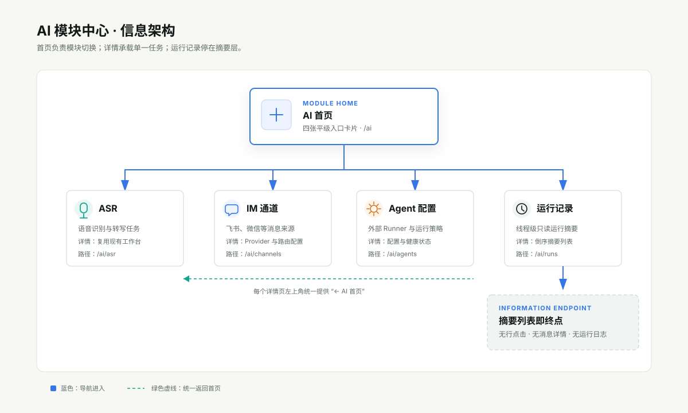
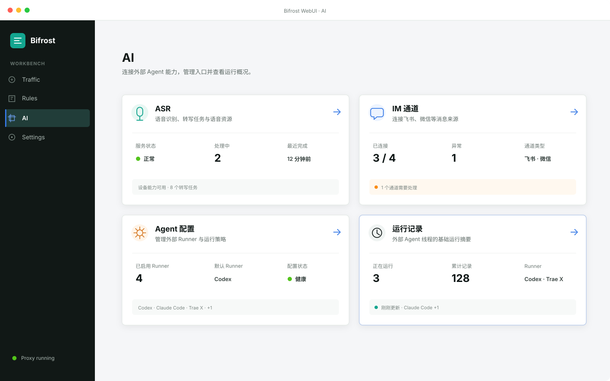
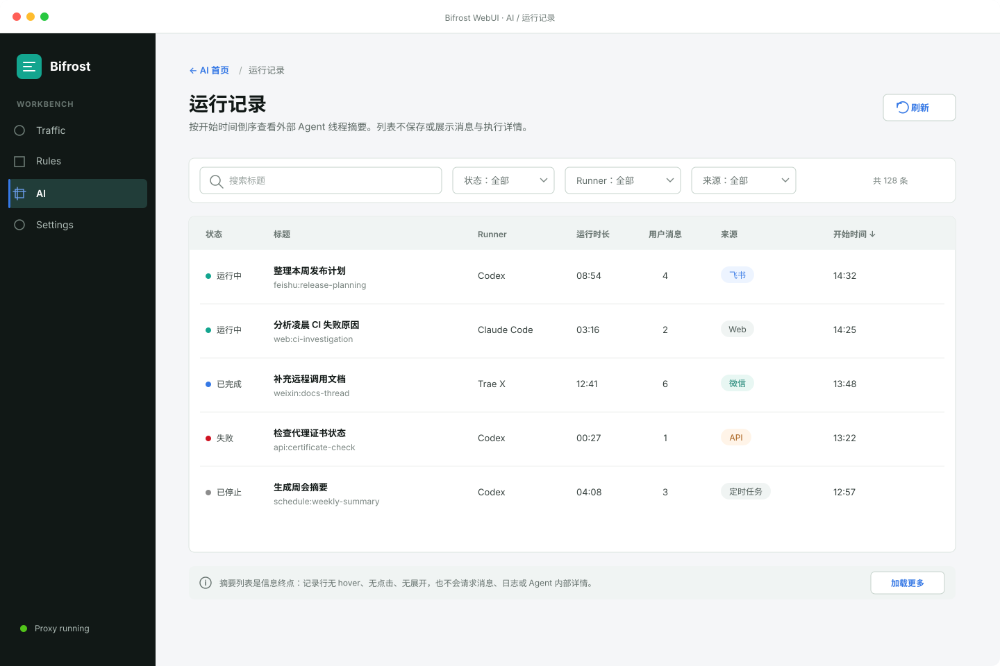

# WebUI AI 模块中心改造方案

## 决策摘要

把 `/ai` 从“内置 Chat 工作台”改成“外部 Agent 能力入口”。用户进入 AI 板块后先看到四张平级卡片：`ASR`、`IM 通道`、`Agent 配置`、`运行记录`。卡片负责展示少量状态摘要并进入对应详情；所有详情页左上角都提供统一的 `AI 首页` 返回导航。

运行记录只展示线程级摘要，不再提供消息正文、工具调用、运行过程、token、工作目录、历史文件或诊断产物等详情，也不允许从记录行继续下钻。这与 Bifrost 只编排外部 Agent、不持有其内部详情的新产品边界一致。

> 命名假设：需求中的“AM 通道”按仓库现有模块名统一为“IM 通道”。如果产品最终确认名称确实是 AM，只需整体替换界面文案，信息架构不变。

本方案取代 `design/webui-ai-layout-redesign.md` 中“`/ai` 默认进入 New Chat、左侧常驻 Threads”的入口设计；现有 ASR、IM 和外部 Runner 配置能力继续复用，不在本轮重新设计其业务表单。

## 用户目标验证清单

### 必须实现

- `/ai` 默认展示四张平级入口卡片，不默认打开 Chat、线程或配置详情。
- 四张卡片分别进入 ASR、IM 通道、Agent 配置和运行记录详情。
- 每个详情页左上角都有明确的 `AI 首页` 返回导航，并支持浏览器返回。
- 运行记录卡片展示正在运行数、累计记录数、近期使用的 Runner 等基础摘要。
- 运行记录详情按开始时间倒序展示线程摘要：标题、状态、Runner、运行时长、用户消息数、来源、开始时间。
- 运行记录行不可点击，不提供二级详情、消息查看或“更多”菜单。
- 桌面、窄屏、亮色和暗色主题具有等价的信息层级与操作能力。

### 必须不破坏

- 保留现有 ASR 深链与详情能力。
- 保留现有 IM Provider、Targets、Routes、Schedules、History 等配置能力。
- 保留外部 Runner 配置、默认 Runner 和可用状态管理。
- 旧 AI URL 不出现空白页；历史 Chat 深链归一化到运行记录列表，并可用标题或 session key 定位对应摘要。
- 首页卡片的加载、空、错误和能力不可用状态不改变卡片尺寸，避免页面抖动。

### 明确不做

- 不在 AI 首页提供新建对话输入框。
- 不展示或恢复内置 Bifrost Agent。
- 不记录、读取或展示外部 Agent 的消息正文、thinking、plan、工具调用、命令输出、附件或诊断详情。
- 不在运行记录行提供点击、展开、抽屉、详情页、右键菜单或删除入口。
- 不做 Runner 成本、token、模型质量或 Agent 效率分析。

## 信息架构



```text
全局侧栏 / AI
└── AI 首页 /ai
    ├── ASR 卡片             -> /ai/asr
    ├── IM 通道卡片          -> /ai/channels
    ├── Agent 配置卡片       -> /ai/agents
    └── 运行记录卡片         -> /ai/runs
                                └── 线程摘要列表（终点，不再下钻）
```

详情页使用同一个模块级页头，不增加第二套永久侧栏：

```text
← AI 首页 / 运行记录
             页面标题与说明
             当前详情内容
```

这样既保留 Bifrost 全局侧栏中的 AI 选中态，也让用户在任何详情内都能一眼知道如何退出到 AI 首页。

## AI 首页



### 页面结构

- 页面标题：`AI`。
- 页面说明：`连接外部 Agent 能力，管理入口并查看运行概况。`
- 卡片区：桌面端 2 × 2；中等宽度保持 2 列；窄屏单列。
- 内容最大宽度：1120px，沿用现有 WebUI 工作台密度。
- 卡片整面可点击，右上角箭头只表达“进入”，不作为独立按钮。

### 四张卡片

| 卡片 | 一句话说明 | 首页摘要 | 点击后 |
| --- | --- | --- | --- |
| ASR | 语音识别、转写任务与语音资源 | 服务状态、处理中任务数、最近完成时间 | 复用现有 ASR 工作台 |
| IM 通道 | 连接飞书、微信等消息来源 | 已连接/总通道、异常数、通道类型 | 复用现有 IM Gateway 管理页 |
| Agent 配置 | 管理外部 Runner 与运行策略 | 已启用 Runner 数、默认 Runner、配置健康状态 | 聚合外部 Runner 与 Agent 运行策略配置 |
| 运行记录 | 查看外部 Agent 线程的摘要 | 正在运行数、累计记录数、当前/近期 Runner | 打开只读线程摘要列表 |

### 摘要密度规则

- 每张卡片最多 3 组摘要，不把详情页缩小后塞进卡片。
- 主要数字使用 24px/700，标签使用 12px；不使用营销式超大数字。
- Runner 最多展示 3 个名称，超出显示 `+N`，避免卡片高度变化。
- 状态同时使用图标/文字和颜色，例如 `● 正常`、`▲ 1 个异常`，不只靠颜色表达。
- ASR 被平台能力隐藏时保留卡片位置并显示 `当前设备不可用`，而不是让 2 × 2 网格塌成三张不对称卡片。

### 卡片交互与可访问性

- 卡片使用整卡 `<Link>` 导航语义，获得焦点后按 `Enter` 进入详情；不把导航卡片实现成 button，也不在卡片内嵌套第二个可交互元素。
- hover 只增强边框和轻微阴影，不移动卡片、不改变高度；键盘焦点使用 `token.controlOutline` 或等价 focus-visible 轮廓。
- 右上角箭头标记为装饰性内容，不重复进入读屏顺序；卡片的可访问名称由标题与一句话说明组成。
- 能力不可用的卡片仍可聚焦并进入详情查看原因/配置；若产品决定完全禁止进入，则使用明确的不可用说明，不仅降低透明度。

## 运行记录卡片

运行记录卡片是首页最重要的概览卡，但仍保持“摘要而非监控大盘”的定位。

### 建议字段

- `正在运行`：当前 `status=active/running` 的线程数。
- `累计记录`：当前可查询范围内的线程总数；文案明确为累计，不使用含糊的“已运行”。
- `Runner`：优先展示当前正在运行线程使用的 Runner；没有运行中线程时展示最近 24 小时使用过的 Runner。
- `最近更新`：卡片底部用相对时间显示数据新鲜度，例如 `刚刚更新`。

### 示例

```text
运行记录                                      →
外部 Agent 线程的基础运行摘要

正在运行  3        累计记录  128
Runner     Codex · Claude Code · Trae X

刚刚更新
```

卡片点击进入 `/ai/runs`。卡片内部不放“查看全部”“停止任务”“新建运行”等二级操作，避免整卡点击与内嵌按钮冲突。

## 运行记录详情



### 列表字段

| 字段 | 展示规则 | 数据缺失 |
| --- | --- | --- |
| 状态 | `运行中`、`已完成`、`失败`、`已停止`；显式文字 + 状态点 | `未知`，中性色 |
| 标题 | 用户首条消息生成的安全摘要或外部来源提供的标题，单行省略 | `未命名线程` |
| Runner | 配置中的展示名，如 `Codex`、`Claude Code`、`Trae X` | `未知 Runner` |
| 运行时长 | 运行中用当前时间减开始时间动态更新；结束后使用冻结值 | `—` |
| 用户消息 | 只统计 user role 数量，不等同于全部 message/turn 数 | `—` |
| 来源 | `Web`、`飞书`、`微信`、`API`、`定时任务`、`ASR` 等标准枚举 | `其他` |
| 开始时间 | 当天显示 `14:32`，更早显示 `08-13 21:07`；完整时间放在 `title`/tooltip | `—` |

### 排序、筛选与分页

- 固定按 `start_time DESC, session_key DESC` 排序；运行中线程也按自身开始时间参与排序，不强制置顶。
- 顶部提供标题搜索、状态、Runner、来源四个轻量筛选器；筛选只改变当前摘要集合。
- 默认每页 30 条。继续使用服务端游标分页或 `Load more`，不一次渲染全部历史。
- 筛选条件进入 URL query，刷新和浏览器返回后保持，例如 `/ai/runs?status=running&runner=codex`。
- 行本身无 hover 浮起、无指针手型、无选中态；用视觉明确告诉用户这里不是详情入口。

### 信息终点边界

摘要列表是信息终点。禁止出现以下内容和交互：

- 点击标题、双击行、行末箭头或 `更多` 菜单。
- 消息正文、消息预览、最后一条回复、thinking、plan、工具调用或日志。
- token、模型参数、working directory、history path、CLI stdout/stderr。
- 线程详情抽屉、消息详情弹窗、下载记录、复制原始 JSON。

可保留的页面级操作只有 `刷新`、摘要筛选和分页/`加载更多`；停止运行、删除记录等写操作不属于本页面范围。

## 详情页统一导航

### 桌面端

- 页头第一行左侧使用文本导航 `← AI 首页`，点击回 `/ai`。
- 同行以弱化分隔符显示当前模块，例如 `AI 首页 / 运行记录`。
- 页面标题置于下一行，避免把返回按钮、标题和业务操作挤成一排。
- 进入详情后全局侧栏的 `AI` 仍保持选中。

### 窄屏

- 顶部只保留 `← AI 首页`，当前模块名放到下一行标题。
- 返回区域最小点击高度 40px。
- 不把四个模块做成横向 tab；首页本身就是模块切换器，减少双重导航。

### 浏览器历史

- 从首页点击卡片：普通 push navigation，浏览器返回可回到首页原滚动位置。
- 直接打开详情深链：`AI 首页` 永远回 `/ai`，不依赖 history 是否存在。
- 从旧 Chat 深链进入：replace 到 `/ai/runs`，尽量把旧 `session` 转为标题搜索或定位提示，但不再打开消息详情。

## 响应式方案

| 宽度 | 首页 | 运行记录 |
| --- | --- | --- |
| `>= 1024px` | 2 列卡片，24px gap | 紧凑表格，所有字段同排 |
| `768–1023px` | 2 列卡片，16px gap | 标题列收缩；开始时间简写 |
| `< 768px` | 1 列卡片 | 每条记录变为摘要块：标题/状态在首行，Runner/时长/消息/来源/时间分两行展示 |

移动摘要块仍然不可点击，也不使用卡片阴影；用行间分隔线维持数据列表语义。

## 主题与视觉规范

- 颜色全部来自 Ant Design token；不为 AI 板块新增独立紫色/渐变品牌。
- AI 首页选中仍使用导航蓝；Bifrost teal 只用于身份和健康状态。
- 卡片：`token.colorBgContainer`、`token.colorBorderSecondary`、8px 圆角、轻微 hover 边框/阴影。
- 运行中：success/teal 语义；失败：danger；异常通道：warning；普通结束：中性文本。
- 暗色模式通过相同 token 映射，卡片层级依赖表面色和边框，不依赖浅色阴影。
- 所有数值列使用 tabular numbers，便于纵向扫描。

## 状态与反馈

### 首页加载

- 四张卡片立即渲染固定骨架；摘要区域显示 2–3 条 skeleton。
- 某个模块请求失败只影响对应卡片，显示 `暂时无法获取 · 重试`，不阻断其它卡片。
- 整体摘要建议每 15 秒刷新；运行记录可通过现有 session push 增量更新，断线后降级轮询。

### 空状态

- ASR：`还没有转写任务`。
- IM 通道：`还没有连接通道`。
- Agent 配置：`还没有可用 Runner`，详情入口仍可进入配置。
- 运行记录：`还没有运行记录`；详情页展示同样的空状态，不引导创建内置 Chat。

### 数据更新

- 正在运行的时长每秒在前端更新显示，但聚合数只随 session 事件或刷新更新。
- 新记录插入列表顶部时不强行抢滚动；用户停留在列表顶部时可直接插入，否则显示 `有 N 条新记录` 提示，点击回到顶部刷新。

## 数据与 API 方案

推荐新增只读摘要投影，避免首页/列表为了拼摘要读取会话详情：

```http
GET /api/im-gateway/agent/session-summaries?limit=30&cursor=...&status=...&runner=...&source=...&q=...
```

```json
{
  "aggregate": {
    "running_count": 3,
    "total_count": 128,
    "active_runners": ["codex", "claude_code", "traex"],
    "updated_at": 1786675320
  },
  "items": [
    {
      "session_key": "feishu:oc_xxx:thread_xxx",
      "status": "running",
      "title": "整理本周发布计划",
      "runner_id": "codex",
      "duration_secs": 534,
      "user_message_count": 4,
      "source": "feishu",
      "start_time": 1786674786
    }
  ],
  "next_cursor": "..."
}
```

### 数据边界

- 摘要表/索引只持久化上述字段，不持久化 message body 或运行详情。
- `title` 优先由外部来源/Runner 直接提供；若只能由首条用户消息生成，只允许在消息入站时做一次内存内摘要，写入前截断并执行现有敏感信息处理，不得为了生成或刷新标题回读已落盘消息。
- `user_message_count` 在运行时累加，列表不通过读取消息记录实时计算。
- `duration_secs` 在结束时冻结；运行中可只返回 `start_time`，前端自行计算。
- 聚合与 items 使用同一筛选口径；首页请求不带筛选时展示全局摘要。
- WebUI 只能调用专用摘要接口。迁移期即使服务端仍需读取现有 session state，也必须在服务端完成白名单 projection；禁止把 `sessions/all`、`SessionDetail` 或其它完整会话对象发送到浏览器后再裁剪。

### 字段采集矩阵

| 类别 | 允许进入摘要投影 | 明确禁止 |
| --- | --- | --- |
| 标识 | `session_key`、安全标题、来源 | 外部 history path、工作目录、原始消息 ID 链 |
| 运行 | 状态、Runner、开始时间、冻结时长 | thinking、plan、工具调用、命令与日志 |
| 计数 | 用户消息累计数、记录累计数 | 消息正文、回复正文、附件内容 |
| 健康 | Runner 可用状态、摘要更新时间 | token、模型参数、费用、额度、诊断产物 |

这张矩阵同时是接口 review 门禁：摘要响应出现右列任一字段即视为实现偏离，不能只靠前端隐藏。

## 路由兼容建议

| 旧地址 | 新行为 |
| --- | --- |
| `/ai` | AI 模块首页 |
| `/ai?view=asr...` | replace 到 `/ai/asr?...` |
| `/ai?view=im...` | replace 到 `/ai/channels?...` |
| `/ai?view=settings&settings=agent...` | replace 到 `/ai/agents?...` |
| `/ai?view=chat&session=...` | replace 到 `/ai/runs?q=<session>`，只展示匹配摘要 |
| `/ai?view=chat&historyPath=...` | replace 到 `/ai/runs`，不读取 history 文件 |

新路由优先使用 path 表达一级模块，query 只保存筛选和既有模块内部深链状态。这样不会继续把 `view`、`settings`、`agentSection` 混在同一层。

## 组件拆分建议

- `web/src/pages/AI/index.tsx`：只负责 AI 子路由出口和旧 URL 归一化。
- `web/src/pages/AI/AIHubPage.tsx`：四卡首页与摘要请求。
- `web/src/pages/AI/components/ModuleCard.tsx`：统一卡片骨架、状态和键盘交互。
- `web/src/pages/AI/components/AIDetailHeader.tsx`：统一 `AI 首页` 返回导航。
- `web/src/pages/AI/RunRecordsPage.tsx`：筛选、摘要表格/窄屏列表、分页；不依赖 `AgentChatSection`。
- `web/src/pages/AI/runSummary.ts`：状态、时长、来源、Runner 名称格式化和 API projection 类型。
- 现有 `AgentChatSection*`：从新导航完全移除；若其它内部链路仍引用，可分阶段删除，不再作为 AI 页面子路由。

## 实施阶段

### Phase 1：模块首页与导航

- 建立 `/ai` 首页和四个 path 子路由。
- 实现统一详情页头和旧 URL 归一化。
- 接入现有 ASR、IM、Agent 配置页面。

### Phase 2：运行摘要数据面

- 提供摘要 API 与聚合字段。
- 实现运行记录卡片摘要和倒序列表。
- 建立严格的摘要字段白名单，不读取详情数据。

### Phase 3：移除 Chat 详情入口

- 从 AI 导航删除 New Chat、Threads、Chat composer 和 session detail 入口。
- 清理旧 Chat 深链，统一转到摘要列表。
- 按依赖确认是否删除仅供 AI Chat 使用的前端组件；不误删外部 Runner/IM 仍需要的共享 session 基础设施。

### Phase 4：状态、窄屏与双主题

- 补齐 loading/empty/error/disabled 状态。
- 验证桌面、窄屏、亮色、暗色和键盘导航。
- 校准 15 秒刷新、session push 与分页行为。

## 验证方案

### 单元/组件

- `/ai` 默认解析为 hub，旧 view query 正确归一化到四个子路由。
- 运行记录固定按开始时间倒序，时间相同时用 session key 稳定排序。
- 只允许摘要白名单字段进入 row view model。
- `user_message_count` 与全部 message/turn count 分离。
- 时长对 running/finished/missing 三种状态格式正确。
- 运行记录行没有 click handler、详情链接和 overflow action。

### UI/E2E

- 首页四张卡片在桌面 2 × 2、窄屏单列，整卡是可聚焦链接，键盘 `Enter` 可进入详情并具有可见焦点态。
- 四个详情页都能通过左上角返回 `/ai`，浏览器返回也成立。
- 运行记录卡片正确展示 running、total 和 Runner 摘要。
- 运行记录页按时间倒序，筛选和分页保持 URL 状态。
- 断言点击运行记录行不会导航、展开或发起 detail/history/messages 请求。
- 验证首页和运行记录的 loading、empty、partial error、亮/暗主题。

### 真实场景

实现阶段属于用户可感知的主导航和运行记录行为变化，需要新增 `human_tests/ai-module-hub.md`，逐条真实执行首页入口、四详情返回、真实 session 摘要、无详情请求、窄屏和双主题用例。本设计阶段只产出方案和视觉稿，不修改运行时，因此不提前创建占位 human test。

## 风险与待确认项

- `累计记录` 的保留周期需要产品确认；如果后端会清理历史，文案应改成 `当前保留 128 条`。
- 线程标题可能带有用户输入片段，需要明确脱敏、截断和访问权限策略。
- 旧 Chat 深链是否需要显示一次性的“详情已下线”提示，可以在实现阶段决定；默认建议只提示一次，不保留详情能力。
- 运行失败状态若当前摘要源无法可靠区分 `失败/停止/完成`，第一版只显示 `运行中/已结束`，不要根据缺失详情猜测结果。

## 本轮设计验证边界

本轮只新增设计文档与 SVG 视觉稿，属于文档/流程与纯视觉方案变更。适用验证为 Markdown 结构、图片引用、SVG XML、设计规范一致性和两轮 review。Rust、前端编译、E2E、coverage、`human_tests/` 与仓库级 local CI 均不适用；这些在进入实现阶段后按实际生产代码影响面启用。
