# Bifrost CLI、GUI 与 AI 能力地图

> 本文基于 2026-07-06 对仓库源码、既有文档、CLI 帮助输出和 Web UI 真实页面的梳理。截图来自一份临时隔离的本机 Bifrost 实例：`BIFROST_DATA_DIR=/private/tmp/bifrost-doc-gui-data`、`127.0.0.1:9911`、`--no-system-proxy`、`--no-tray`，用于避免把真实运行环境中的请求域名、规则名或业务数据写入文档资产。日常使用仍以默认管理端 `http://127.0.0.1:9900/_bifrost/` 为入口。

## 一句话定位

Bifrost 最初是一个 Rust 实现的高性能 HTTP/HTTPS/SOCKS5/HTTP3 代理与抓包调试工具；现在已经扩展为一个同时提供 CLI、Web GUI、桌面壳、Admin API、Agent runtime、IM Gateway、语音转写和远程协作能力的本机自动化平台。它的核心价值不只是“让流量经过代理”，而是把真实网络流量、规则系统、脚本、重放、远程命令、AI Agent、IM 通道和语音资料处理统一到同一个本机控制面。

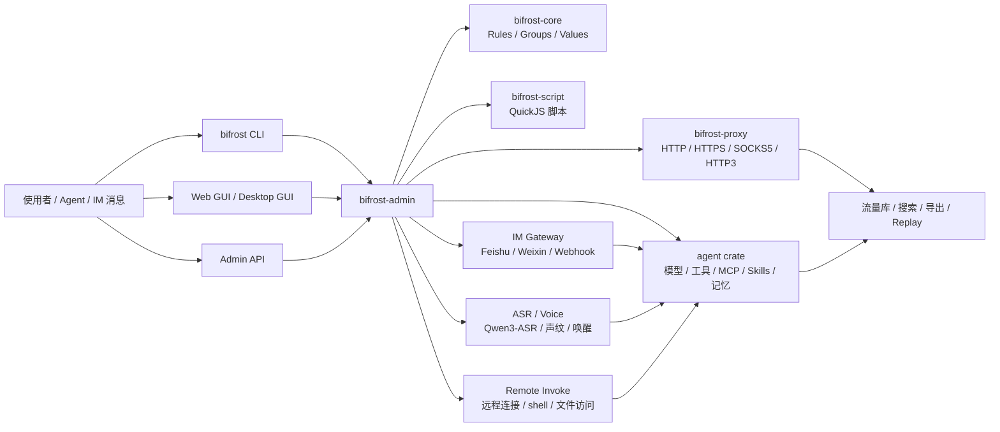

## 用户入口总览

| 入口 | 面向场景 | 代表能力 | 证据锚点 |
| --- | --- | --- | --- |
| CLI：`bifrost` | 自动化、终端排障、Agent 可调用接口 | 启停代理、规则/Group、CA、系统代理、流量搜索、Replay、临时端口、IM、AI、ASR、Remote Invoke、Skill 安装 | `crates/bifrost-cli/src/cli.rs`、`docs/cli.md`、`bifrost --help` |
| Web GUI：`/_bifrost/` | 人类管理、可视化抓包、配置与调试 | Activity、Network、Replay、Rules、Values、Scripts、AI、DevTools、Groups、Notify、Settings、OpenAPI | `web/src/App.tsx`、`web/src/components/Layout/index.tsx` |
| Desktop GUI | 桌面用户一键启动核心服务、安装 CLI | 启动 core、安装 CLI、引导 AI coding tools 使用 Bifrost | `web/src/App.tsx` 的 desktop startup gate |
| Admin API | GUI、CLI 与自动化共同调用的本机 API | `/api/rules`、`/api/traffic`、`/api/agent`、`/api/asr`、`/api/im-gateway`、`/api/remote-invoke` 等 | `crates/bifrost-admin/src/router.rs` |
| Agent Skills | 给 Codex、Claude Code、Trae、Cursor、GitHub Copilot 等注入 Bifrost 操作说明 | `bifrost install-skill -y` 安装 `bifrost` / `bifrost-remote` skill | `docs/agent-skill.md`、`crates/skills` |

## GUI 功能地图

Web GUI 使用 `/_bifrost/` 作为管理端前缀。普通浏览器运行时使用 `BrowserRouter basename={getAdminPrefix()}`，桌面壳运行时使用 `HashRouter`，两者最终渲染相同的管理页面。

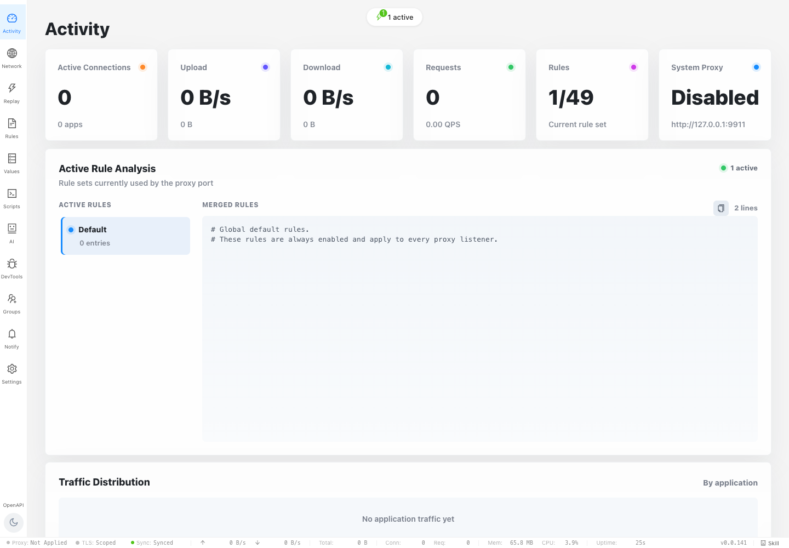

Activity 是默认入口，负责展示当前代理活动、系统代理状态、生效规则、合并规则文本和按应用的流量分布。它适合回答“Bifrost 当前有没有工作”“哪套规则正在生效”“系统代理是否被接管”这类快速诊断问题。

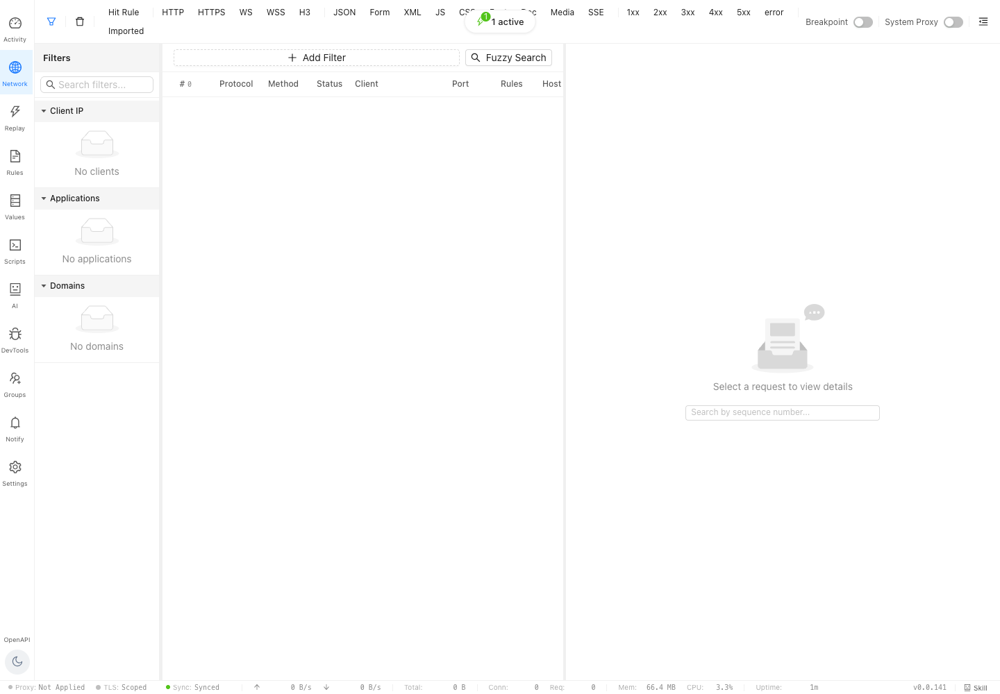

Network 是抓包和搜索中心，首屏包含协议、状态码、内容类型、命中规则、导入流量等过滤器；左侧按 Client IP、Applications、Domains 聚合；中间是请求列表；右侧是详情区和按序号定位入口。它对应 CLI 的 `traffic list/get/search`、`search`、`capture wait`、`traffic export`、`traffic replay` 等命令族。

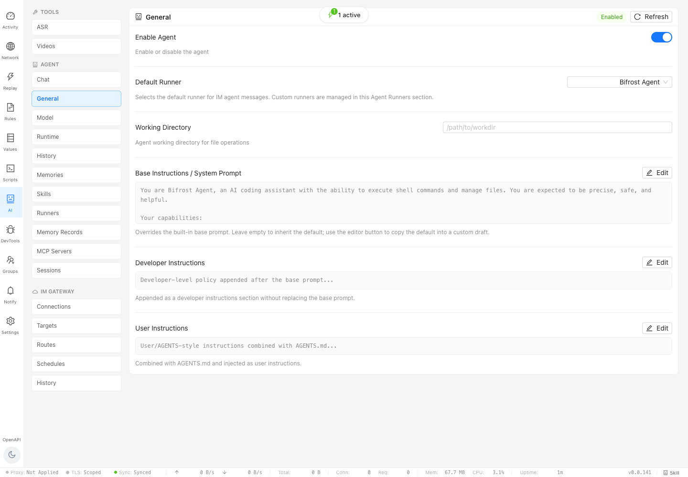

AI 是一个聚合页，而不是单个聊天页。它分成 Tools、Agent 和 IM Gateway 三组导航：

| 分组 | 子页 | 用途 |
| --- | --- | --- |
| Tools | ASR、Videos | 本地语音转写、目录任务、声纹/唤醒、视频下载工具 |
| Agent | Chat、General、Model、Runtime、History、Memories、Skills、Runners、Memory Records、MCP Servers、Sessions | 内置 Agent runtime、模型配置、运行时限制、会话/历史/记忆、技能、MCP、外部 runner 管理 |
| IM Gateway | Connections、Targets、Routes、Schedules、History | Feishu/Weixin/Webhook 通道、目标、路由、定时任务和消息历史 |

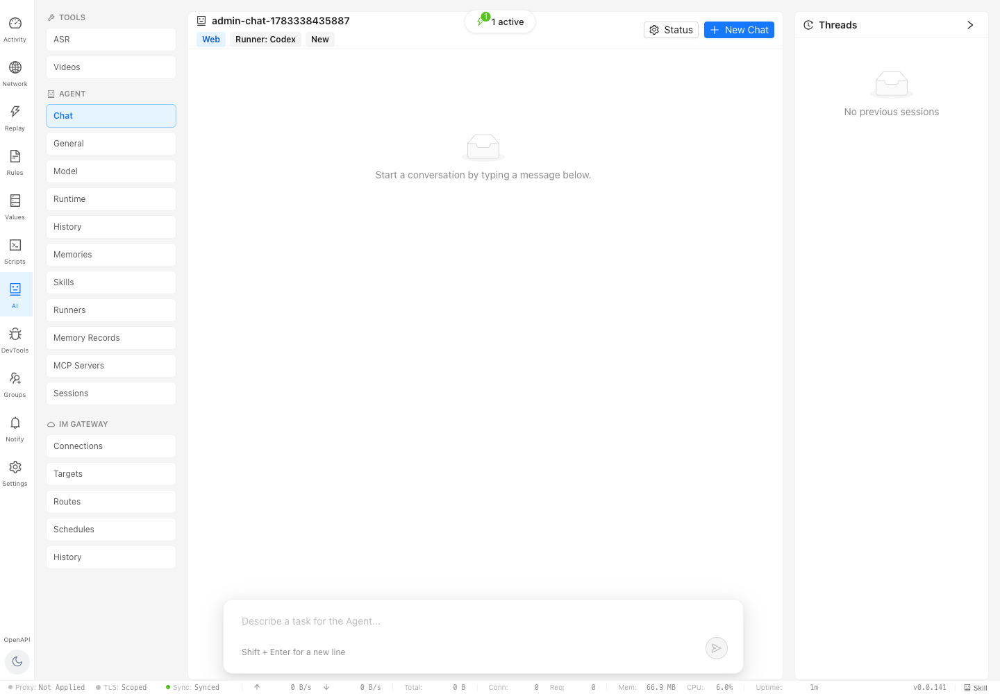

AI Chat 是 Web 侧直接使用 Agent 的入口。页面提供新建会话、状态查看、线程列表、输入框、Send、运行中队列/停止等交互；源码中还支持图片粘贴和最多 6 张图片输入、`/plan`、`/compact`、`/status`、runner 元信息、会话历史恢复和 token/context 状态展示。

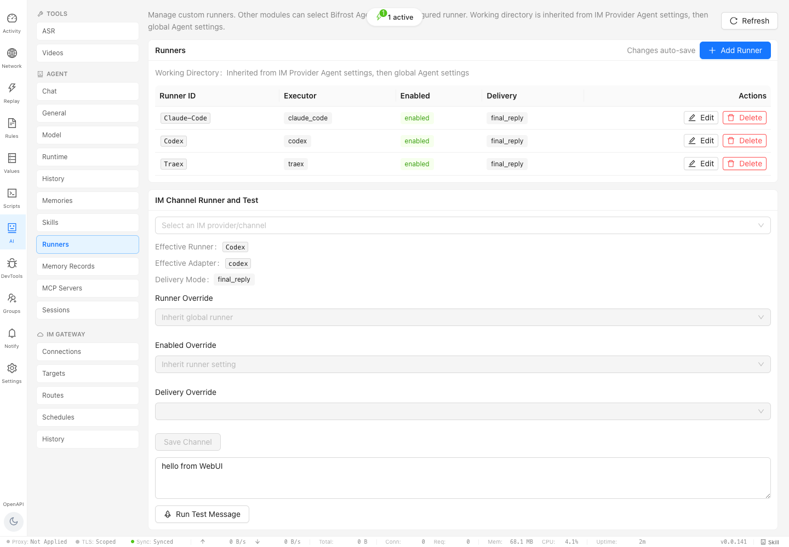

Runners 页管理外部执行器。当前默认可见的 runner 包括 `Codex`、`Traex`、`Claude-Code`，代码中还保留 `chatgpt_web` 等 adapter 支持。这里可以配置执行器类型、启用状态、投递方式，并按 IM provider/channel 覆盖 runner、enabled、delivery 等设置。

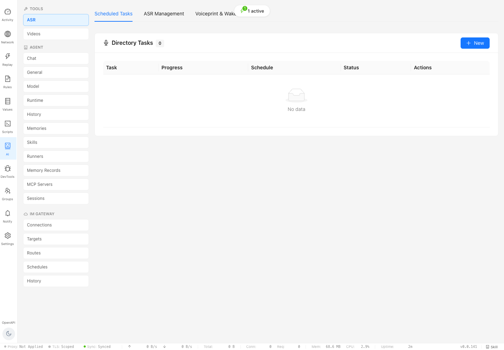

ASR 页聚合 Scheduled Tasks、ASR Management、Voiceprint & Wake。它连接本地 Qwen3-ASR 服务、离线字幕、目录任务、说话人分离、声纹识别、唤醒词与语音输入 runtime。

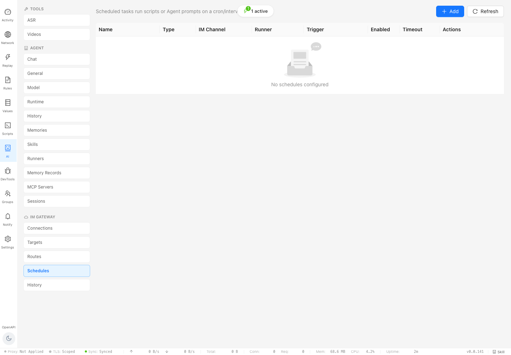

IM Gateway Schedules 让消息平台和定时任务成为 Agent 的触发器。调度项可以绑定 IM Channel、Runner、触发条件、超时和执行动作；后台支持 Script 与 Agent 两类任务。

## CLI 功能地图

CLI 是给人类、脚本和 AI coding agent 使用的主要稳定接口。`bifrost --help` 顶层命令显示当前版本覆盖以下能力：

| 命令族 | 核心用途 | 常见使用 |
| --- | --- | --- |
| `start` / `stop` / `restart` / `status` | 代理生命周期 | 启动本机代理、后台 daemon、状态诊断、JSON 输出 |
| `rule` / `group` | 规则与 Group 规则 | 新增、更新、启停、排序、查看生效规则、同步规则 |
| `port` | 临时端口 | 一个常驻 Bifrost 服务服务多个应用或调试任务，每个端口绑定不同规则 |
| `ca` / `whitelist` / `system-proxy` | 安全与接入控制 | CA 生成/安装/导出、客户端白名单、系统代理启停、LAN 访问 |
| `value` / `script` | 扩展配置 | Values 变量管理、QuickJS 脚本管理与运行 |
| `traffic` / `search` / `capture` | 流量查询与捕获 | 请求列表、按 id 获取、JSONPath/header/时间窗搜索、等待下一条请求 |
| `replay` / `import` / `export` | 请求重放与迁移 | 导出 curl/fetch/HAR，JSON Patch 后重放，导入导出配置 |
| `config` / `setting` / `metrics` | 运行时配置与诊断 | 全局配置、Remote Invoke 本机设置、指标查询 |
| `admin` | 管理端远程访问与鉴权 | 开启远程访问、密码、token/audit、revoke |
| `sync` / `login` | 远端同步与账号 | 规则/配置同步、登录状态 |
| `ai` | ASR/Voice 入口 | `ai asr` 管理转写服务、离线字幕、目录任务、说话人分离；`ai voice` 管理语音输入、词表、唤醒 |
| `agent` | 直接运行 Agent | `bifrost agent run` 通过 chat-gateway 运行内置或外部 runner，支持会话、输出目录、JSON |
| `im` | IM Gateway | Provider/Target/Route/Schedule/History 管理，消息发送和调度运行 |
| `remote` | Remote Invoke | 连接远端 Bifrost、执行 shell、查询远端流量、受策略约束的远端文件操作 |
| `install-skill` | AI 工具集成 | 安装 Bifrost skills 到 Codex、Claude Code、Trae、Cursor、GitHub Copilot 等环境 |
| `upgrade` / `version-check` / `completions` | 分发与体验 | 自升级、版本检查、shell 补全 |

CLI 的设计原则是“同一能力至少有一个可脚本化入口”。例如 Network 页能看流量，CLI 也能通过 `bifrost traffic search` 和 `bifrost search` 做结构化查询；Web Chat 能跑 Agent，CLI 也能通过 `bifrost agent run` 运行；Web IM Gateway 能配置定时任务，CLI 也能通过 `bifrost im schedule` 管理。

## AI 能力详解

### 1. 内置 Bifrost Agent runtime

内置 runtime 位于 `crates/agent`，不是简单转发到外部 CLI。`crates/agent/src/lib.rs` 的模块注释直接列出它的核心能力：

- turn loop：`prompt -> model -> tool_calls -> execute -> repeat`。
- 工具体系：终端执行、stdin 续写、文件读写、目录列表、结构化 patch、图片查看、用户输入、计划更新、目标管理、worktree 切换等。
- 上下文管理：token 统计、context window、自动压缩、压缩摘要保留。
- 模型协议：支持 Chat Completions 与 Responses 两类 wire API。
- 项目指令：加载层级 `AGENTS.md`。
- Skills：按 YAML frontmatter 暴露技能元数据，按需注入说明。
- MCP：启动 stdio 或 Streamable HTTP MCP server，列工具、调用工具、处理 OAuth、resources、elicitation 和 approval。
- 持久化：会话 JSONL、历史恢复、session runtime state、token/context 快照。
- 记忆：raw memories、rollout summaries、consolidation、禁用/启用策略。

Agent 配置集中在 `crates/agent/src/config.rs`，关键字段包括：

| 配置域 | 说明 |
| --- | --- |
| `enabled`、`runner` | 启用内置 Agent，或选择自定义 runner |
| `model`、`model_provider`、`model_providers` | 模型与 provider 配置，provider 支持 base URL、wire API、环境变量 key、自定义 header、重试和 stream timeout |
| `base_instructions`、`developer_instructions`、`user_instructions` | 系统、开发者、用户指令层 |
| `model_reasoning_effort`、`model_reasoning_summary`、`model_context_window`、`model_auto_compact_token_limit` | 推理与上下文控制 |
| `mcp_servers` | stdio/HTTP MCP server、启动/工具超时、启停工具、OAuth scopes、per-tool approval |
| `skills` | 技能是否注入、单技能启停 |
| `history`、`ephemeral` | 历史落盘与临时会话 |
| `memories` | 自动记忆、记忆注入、consolidation 模型与节流 |
| `default_message_channel` | Agent 工具向 IM 发送消息时的默认通道 |

### 2. Web Chat 与 Admin API

Web Chat 的前端入口位于 `web/src/pages/AI/AgentChatSection.tsx`，后台入口主要是：

- `/api/agent/chat/stream`：内置 Agent SSE 流式对话。
- `/api/im-gateway/agent/chat`：统一 chat-gateway，既可走内置 Agent，也可走外部 runner。
- `/api/im-gateway/agent/sessions/*`：会话列表、事件、历史、恢复。
- `/api/agent/tools`：列出内置工具定义。
- `/api/agent/providers`：列出内置 provider。
- `/api/agent/mcp-status`：检查 MCP server 可用性。
- `/api/agent/instructions`：展示实际加载的项目指令。
- `/api/agent/skills`、`/api/agent/memories`：技能与长期记忆管理。

Web Chat 不是“单轮问答框”。它还承担线程管理、运行状态、历史分页、多模态图片、Plan 模式、压缩状态、运行中队列和外部 runner timeline 展示。

### 3. 外部 Runner / Chat Gateway

外部 runner 由 `crates/bifrost-admin/src/im_gateway/external_cli` 管理。它把 Codex、TraeX、Claude Code、ChatGPT Web 等外部执行器包装成统一的 chat-gateway runner：

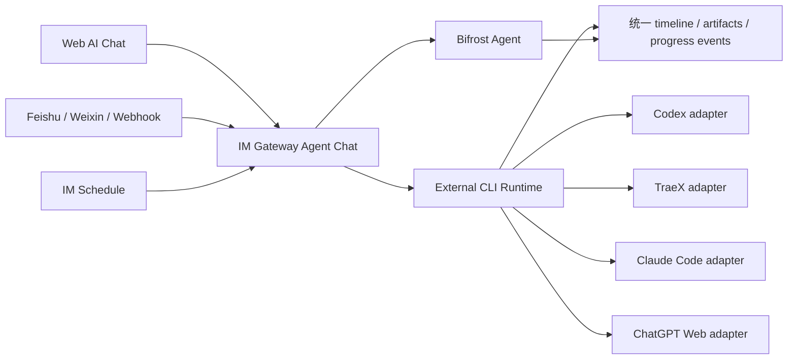

外部 runner 配置支持 executable、args、env、profile、model、sandbox、approval policy、permission mode、reasoning effort/summary、超时、Codex strict config、skip git repo check、ignore user config/rules、local provider、output schema、feature flags、搜索、ephemeral 等字段。Web UI 的 Runners 页提供人类可配置入口，IM channel 还能覆盖默认 runner 和投递方式。

### 4. IM Gateway

IM Gateway 是“让消息平台调用 Bifrost / Agent”的连接层，源码集中在 `crates/bifrost-admin/src/im_gateway` 和 `crates/bifrost-admin/src/handlers/im_gateway`。它覆盖：

- Provider：Feishu、Weixin/Wechat、Webhook。
- Target：消息发送目标。
- Route：入站消息如何路由到 script 或 agent。
- Schedule：定时运行 script 或 agent。
- History：消息、任务和运行历史。
- Progress card：Feishu 等通道的运行中状态卡片。
- Runner 继承：全局默认、provider/channel 覆盖、单次 schedule 覆盖。

这意味着 Bifrost 可以被放在“IM 机器人 + 本机 Agent + 真实代理流量”的交叉点上：IM 消息触发 Agent，Agent 可以查流量、改文件、跑命令、发送消息、创建 schedule；schedule 又可以定时触发 Agent 或脚本并把结果发回 IM。

### 5. ASR / Voice / Daily Agent

ASR 与 Voice 是 AI 能力里最“本机媒体处理”的部分。CLI 和 GUI 两侧都有入口：

- `bifrost ai asr start|stop|status|stream-file|subtitle|task|diarization`
- `bifrost ai voice sources|listen|vocabulary|wake`
- Web AI Tools 的 ASR 页、ASR Management、Voiceprint & Wake。

后台 `crates/bifrost-admin/src/handlers/asr.rs` 暴露 `/api/asr/capabilities`、`/api/asr/status`、`/api/asr/service/start`、`/api/asr/offline-jobs`、`/api/asr/tasks`、`/api/asr/diarization`、`/api/asr/speaker-profiles` 等接口。能力范围包括：

- Qwen3-ASR 本地服务初始化、启动、停止、状态检查。
- 文件转写、离线字幕、长音频切片。
- Directory Tasks：按目录、周期、任务配置持续处理音频。
- Diarization：说话人分离。
- Voiceprint：声纹注册、识别与 speaker-aware timeline。
- Voice Wake：唤醒词、音频绑定、触发动作。
- Daily Agent：ASR 完成后用 Agent 做日报、明日待办、同步报告等后处理。

### 6. Videos 工具

Videos 位于 AI Tools 下，对应 `web/src/pages/AI/VideosTool.tsx` 和 `/api/videos/*`。它是一个轻量下载工具：

- 默认下载目录为用户 Downloads 下的 YouTube 目录。
- 只接受 YouTube URL。
- 后端调用 `yt-dlp`，显示 queued/running/completed/failed、进度、速度、ETA、错误尾部。
- 完成后可播放、打开文件或打开目录。

它不属于 Agent runtime 本体，但作为 AI Tools 的一部分，适合把外部视频资料拉到本地，再进入语音/Agent 后处理链路。

### 7. Remote Invoke 与 Agent 协作

Remote Invoke 让一个 Bifrost 实例远程操作另一台已授权机器，CLI 和 Admin API 都有入口：

- `bifrost remote conn`：连接管理。
- `bifrost remote traffic`：远端流量查询。
- `bifrost remote exec` / `remote run` / `remote job`：远端命令。
- `bifrost remote file read|read-many|list|find|write|edit|patch|upload|download`：策略约束下的远端文件操作。

后台 `/api/remote-invoke/*` 管理 discovery、pairing、grants、shell-config、file-access policy、calls、SSH key。它和 Agent 的关系是：Agent 可以在被授权边界内通过 Bifrost skill 使用真实远端上下文，而不是凭空推测远端状态。

## 典型工作流

### 工作流 A：本机网络调试

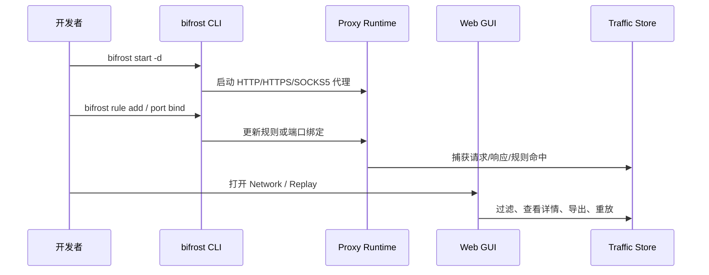

适合：接口联调、HTTPS TLS 解包、请求改写、故障复现、把某个域名转到本地服务。

### 工作流 B：AI 协作排障

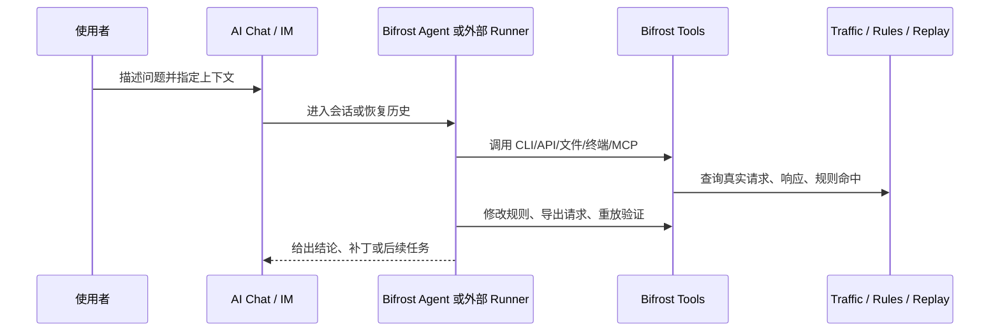

适合：让 AI 基于真实流量写业务 skill、解释登录态过期、定位规则没命中、把请求导出为 curl/fetch/HAR 给另一个系统复现。

### 工作流 C：IM 或定时任务触发 Agent

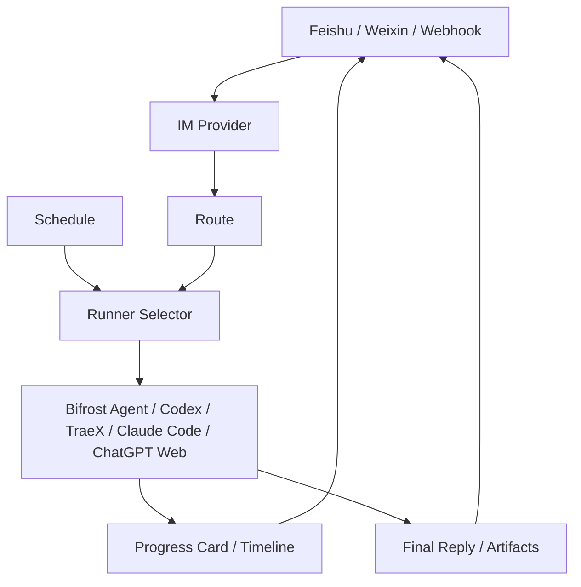

适合：群里发一句话触发本机任务、定时生成日报、把长任务进度以卡片形式回传、让不同 IM channel 使用不同 runner。

### 工作流 D：语音资料转写并进入 Agent 后处理

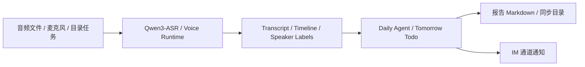

适合：会议录音转写、多人说话人区分、按天生成报告、自动抽取明日待办并发给 IM。

## 源码证据索引

| 能力 | 主要路径 |
| --- | --- |
| CLI 命令定义 | `crates/bifrost-cli/src/cli.rs` |
| CLI 文档 | `docs/cli.md`、`docs/cli-quick-start.md` |
| Web 路由 | `web/src/App.tsx` |
| Web 侧边导航 | `web/src/components/Layout/index.tsx` |
| AI 聚合页 | `web/src/pages/AI/index.tsx` |
| Agent Chat 前端 | `web/src/pages/AI/AgentChatSection.tsx` |
| Agent/IM 设置页 | `web/src/pages/Settings/tabs/AgentTab.tsx`、`web/src/pages/Settings/tabs/ImGatewayTab.tsx` |
| ASR 前端 API | `web/src/api/asr.ts` |
| IM Gateway 前端 API | `web/src/api/imGateway.ts` |
| Remote Invoke 前端 API | `web/src/api/remoteInvoke.ts` |
| Admin API 路由 | `crates/bifrost-admin/src/router.rs` |
| Agent Chat 后端 | `crates/bifrost-admin/src/handlers/agent_chat.rs`、`crates/bifrost-admin/src/handlers/im_gateway/agent_api.rs` |
| 外部 runner | `crates/bifrost-admin/src/im_gateway/external_cli` |
| IM Gateway | `crates/bifrost-admin/src/im_gateway`、`crates/bifrost-admin/src/handlers/im_gateway` |
| 内置 Agent runtime | `crates/agent/src/lib.rs`、`crates/agent/src/config.rs`、`crates/agent/src/session.rs`、`crates/agent/src/tools`、`crates/agent/src/mcp` |
| ASR/Voice | `crates/bifrost-admin/src/handlers/asr.rs`、`crates/bifrost-admin/src/handlers/asr_jobs`、`crates/bifrost-asr` |
| Videos | `web/src/pages/AI/VideosTool.tsx`、`crates/bifrost-admin/src/handlers/videos.rs` |
| Remote Invoke | `crates/bifrost-admin/src/handlers/remote_invoke.rs`、`crates/bifrost-admin/src/remote_invoke`、`crates/bifrost-command` |
| Agent Skills | `docs/agent-skill.md`、`crates/skills` |
| 真实场景验收索引 | `human_tests/readme.md` 中 `agent-*`、`im-gateway*`、`asr-*`、`mcp-*`、`videos-tool.md` 等条目 |

## 使用建议

1. 初次接触 Bifrost，先把它理解成“代理核心 + 管理端 + 自动化平台”，不要只按传统抓包代理来找功能。
2. 人类排障优先打开 Web GUI 的 Activity、Network、Rules、Replay；脚本或 Agent 排障优先走 CLI 和 Admin API。
3. 涉及 AI 时先区分三层：内置 Bifrost Agent runtime、外部 Runner、IM Gateway 调度层。
4. 涉及真实请求、响应、登录态、规则命中时，优先让 Agent 读取 Bifrost 捕获的真实流量，而不是让模型根据描述猜。
5. 涉及远程机器时，通过 Remote Invoke 授权、grant 和 file access policy 约束边界，再交给 Agent 操作。
6. 涉及语音/视频资料时，先把素材落到本地 ASR/Videos 工具，再把 transcript 或报告交给 Agent/IM 后处理。

## 当前边界

- ASR/Voice 的部分能力受平台限制，当前主要面向 macOS Apple Silicon；非支持平台会通过 `/api/asr/capabilities` 和 Web UI 隐藏或降级。
- 外部 runner 的真实效果取决于本机是否安装并登录对应工具，例如 Codex、Trae、Claude Code、ChatGPT Web。
- IM Gateway 的 Feishu/Weixin 能力依赖 provider 凭据、owner/target 配置和消息平台权限。
- Remote Invoke 必须经过 discovery、pairing、grant 和 file-access policy，不能把它当作无边界远程 shell。
- Web UI 截图为干净隔离实例，仅用于说明页面结构；真实用户环境会显示实际规则、请求、runner、IM provider 和任务数据。
